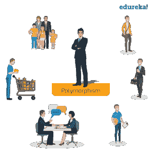

# OOPs 编程中的多态性是什么？

> 原文：<https://www.edureka.co/blog/polymorphism-in-python/>

多态性定义了采取不同形式的能力。Python 中的多态性允许我们在子类中定义与其父类同名的方法。在本文中，我们将按照以下顺序详细介绍 Python 中的多态性:

*   [什么是多态性？](#what)
*   [Python 中的多态性](#polymorphism)
*   [函数和对象的多态性](#function)
*   [多态性与类方法](#class)
*   [多态性与遗传](#inheritance)

## **什么是多态性？**

多态取自希腊语 Poly(多)和 morphism(形式)。这意味着相同的[函数](https://www.edureka.co/blog/python-functions)名称可以用于不同的类型。这使得编程更加直观和容易。

在 Python 中，我们有不同的方法来定义多态性。所以让我们继续，看看多态在 Python 中是如何工作的。

## **Python 中的多态性**

子类[继承了父类的所有方法。然而，在某些情况下，从父类继承的方法不太适合子类。在这种情况下，您必须在子类中重新实现方法。](https://www.edureka.co/blog/python-class/)



在 Python 中使用多态性有不同的方法。你可以使用不同的函数，[类方法](https://www.edureka.co/blog/python-class/)或对象来定义多态性。那么，让我们继续，详细了解一下这些方法。

## **函数和对象的多态性**

您可以创建一个可以接受任何[对象](https://www.edureka.co/blog/python-class/#Objects)的函数，允许多态性。

让我们举一个例子，创建一个名为“ **func()** 的函数，它将接受一个我们命名为“obj”的对象。现在，让我们使用传递给它的' **obj** '对象给这个函数做些事情。在这种情况下，让我们调用方法 **type()** 和 **color()** ，每个方法都在两个类‘番茄’和‘苹果’中定义。现在，如果我们还没有“Tomato”和“Apple”类的实例，您必须创建它们:

```
class Tomato(): 
     def type(self): 
       print("Vegetable") 
     def color(self):
       print("Red") 
class Apple(): 
     def type(self): 
       print("Fruit") 
     def color(self): 
       print("Red") 

def func(obj): 
       obj.type() 
       obj.color()

obj_tomato = Tomato() 
obj_apple = Apple() 
func(obj_tomato) 
func(obj_apple)
```

**输出:**

```
Vegetable
Red
Fruit
Red
```

## **多态性与类方法**

Python 以同样的方式使用两种不同的类类型。这里，您必须为循环创建一个[，该循环遍历对象的**元组**。接下来，您必须调用这些方法，而不必关心每个对象是哪种类类型。我们假设这些方法实际上存在于每个类中。](https://www.edureka.co/blog/videos/python-loops/)

这里有一个**示例**来展示类的多态性:

```
class India():
     def capital(self):
       print("New Delhi")

     def language(self):
       print("Hindi and English")

class USA():
     def capital(self):
       print("Washington, D.C.")

     def language(self):
       print("English")

obj_ind = India()
obj_usa = USA()
for country in (obj_ind, obj_usa):
country.capital()
country.language()
```

**输出:**

```
New Delhi
Hindi and English
Washington, D.C.
English
```

## **多态性与遗传**

python 中的多态性定义了子类中与父类中的方法同名的方法。在继承中，子类从父类继承方法。此外，还可以修改子类中从父类继承的方法。

这主要用于从父类继承的方法不适合子类的情况。这个在子类中重新实现方法的过程被称为[方法覆盖](https://www.edureka.co/blog/method-overloading-and-overriding-in-java/)。下面的例子展示了继承的多态性:

```
class Bird:
     def intro(self):
       print("There are different types of birds")

     def flight(self):
       print("Most of the birds can fly but some cannot")

class parrot(Bird):
     def flight(self):
       print("Parrots can fly")

class penguin(Bird):
     def flight(self):
       print("Penguins do not fly")

obj_bird = Bird()
obj_parr = parrot()
obj_peng = penguin()

obj_bird.intro()
obj_bird.flight()

obj_parr.intro()
obj_parr.flight()

obj_peng.intro()
obj_peng.flight()

```

**输出:**

```
There are different types of birds
Most of the birds can fly but some cannot
There are different types of bird
Parrots can fly
There are many types of birds
Penguins do not fly
```

这些是在 Python 中定义多态性的不同方式。说到这里，我们的文章就到此为止了。我希望你理解了什么是多态，以及如何在 Python 中使用多态。

*现在，请查看 Edureka 提供的 [**Python 认证**](https://www.edureka.co/python-programming-certification-training) 培训，edu reka 是一家值得信赖的在线学习公司，在全球拥有超过 250，000 名满意的学习者。* *Python 认证培训将帮助您获得定量分析、数据挖掘和数据呈现方面的专业知识，通过将您的职业转变为数据科学家角色来超越数字。*

*有问题吗？请在“Python 中的多态性”的评论部分提到它，我们会回复您。*