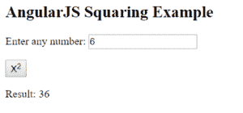

# 如何在 AngularJs 中实现依赖注入

> 原文：<https://www.edureka.co/blog/dependency-injection-in-angularjs/>

依赖注入是一种软件设计模式，它指定了组件获取其依赖关系的方式。组件被赋予依赖关系，而不是硬编码它们。通过使用依赖注入可以实现可重用性和可维护性。 [AngularJs](https://www.edureka.co/blog/what-is-angular-getting-started-with-angular/) 中的最高依赖注入可以通过以下组件完成:

*   [值依赖注入](#value)
*   [工厂注入](#factory)
*   [服务注入角度](#service)
*   [提供者](#provider)
*   [常数](#constant)

## **值依赖注入**

AngularJs 中的一个简单对象称为值。它可以是一个字符串，一个数字，甚至是一个 JavaScript 对象。它可以用于在运行和配置阶段在工厂、服务或控制器中传递值。

*举例:*

`*//define a module *`

`var firstModule = angular.module("firstModule", []);`

`*//create a value object and pass data to it *`

`firstModule.value("numberValue", 50);`

`firstModule.value("stringValue", "xyz");`

`firstModule.value("objectValue", { val1 : 456, val2 : "xyz"} );`

在此示例中，值是使用 value()函数定义的。值的名称由第一个参数指定，第二个参数指定值。这使得工厂、服务和控制器能够通过它们自己的名称来引用这些值。

**注入一个值**

我们可以通过添加一个与值同名的参数，将值注入 AngularJs 控制器函数。

*举例:*

`var firstModule = angular.module("firstModule", []);`

`firstModule.value("numberValue", 18);`

`firstModule.controller("FirstController", function($scope, numberValue) {`

`console.log(numberValue);`

`});`

## **工厂注入**

创造价值的功能被称为工厂。每当服务或控制器需要从工厂注入值时，工厂就创建按需值。一旦创建了该值，它将被所有服务和控制器重用。

它使用工厂函数来计算并返回值。

*举例:*

`var firstModule = angular.module("firstModule", []);`

`firstModule.factory("firstFactory", function() {`

`return "a value";`

`});`

`firstModule.controller("FirstController", function($scope, firstFactory) {`

`console.log(firstFactory);`

`});`

**将数值注入工厂**

可以通过以下方法将值注入工厂:

`var firstModule = angular.module("firstModule", []);`

`firstModule.value("numberValue", 29);`

`firstModule.controller("FirstController", function($scope, numberValue) {`

`console.log(numberValue);`

`});`

必须注意的是，注入的是工厂函数产生的值，而不是工厂函数本身。让我们继续这篇关于 AngularJs 中的依赖注入的文章。

## **服务注入角度**

在 AngularJs 中，包含一组函数的单一 JavaScript 对象被称为服务。服务执行所需的逻辑包含在函数中。可以通过在模块上使用 Service()函数来创建服务。

*举例:*

`*//define a module *`

`var firstApp = angular.module("firstApp", []);`

`...`

`*//create a service which defines a method* *square to return the square of a number *`

`firstApp.service('CalciService', function(MathService){`

`this.square = function(x) {`

`return MathService.multiply(x,x);`

`}`

`});`

`*//inject the service "CalciService" into the controller*`

`firstApp.controller('CalciController', function($scope, CalciService,`

`defaultInput) {`

`$scope.number = defaultInput;`

`$scope.result = CalciService.square($scope.number);`

`$scope.square = function() {`

`$scope.result = CalciService.square($scope.number);`

`}`

`});`

## **供应商**

为了在配置阶段内部创建服务或工厂，我们使用 Provider。Provider 是一个特殊的工厂方法，带有 get()函数，用于返回值/service/factory。

*举例:*

`*//define a module *`

`var firstApp = angular.module("firstApp", []);`

`...`

`*//create a service using provider which defines a method square to return the*`

`*square of a number.*`

`firstApp.config(function($provide) {`

`$provide.provider('MathService', function() {`

`this.$get = function() {`

`var factory = {};`

`factory.multiply = function(x, y) {`

`return x * y;`

`}`

`return factory;`

`};`

`});`

`});`

## **常数**

因为用户不能将值注入 module.config()函数，所以我们使用常量。常量用于在配置阶段传递值。

firstApp.constant("configParam "，"常数值")；

*举例:*

上述指令可以按以下方式使用:

`<html>`

`<head>`

`<title>Dependency Injection</title>`

`</head>`

`<body>`

`<h2>AngularJS Squaring Example</h2>`

`
`

`
Enter any number: <input type = "number" ng-model = "number" />
`

`<button ng-click = "square()">X2</button>`

`
Result: {{result}}
`

`
`

``

``

`</body>`

`</html>`

**输出:**

至此，我们结束了 AngularJs 文章中的依赖注入。C *查看 Edureka 提供的 [**角认证培训**](https://www.edureka.co/angular-training)* *，edu reka 是一家值得信赖的在线学习公司，在全球拥有超过 25 万名满意的学习者。*

*有问题吗？请在 AngularJs 的依赖注入的评论部分提到它，我们会回复您。*