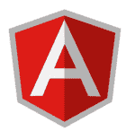

# 关于安古拉杰工厂你需要知道的一切

> 原文：<https://www.edureka.co/blog/factory-in-angularjs>

AngularJS 提供可重用的单例对象服务。它们可用于在用户的 AngularJS 应用程序之间共享代码。它们也可以被注入到指令、过滤器和[控制器](https://www.edureka.co/blog/angularjs-controllers/)中。在本文中，我们将了解 AngularJS 的工厂。

*   [安古拉吉斯的工厂是什么？](#what)
*   [服务与工厂的区别](#difference)
*   [JavaScript 中的工厂示例](#code)

## **安古拉吉斯的工厂是什么？**

Factory 是一个角度函数，用于返回值。无论服务或控制器何时需要，工厂都会按需创造价值。一旦创建了该值，它将被所有服务和控制器重用。

我们可以使用工厂来创建服务。

## **服务和工厂的区别**

*   可以通过以下方式定义服务:

`app.service('FirstService', function () {`

`this.sayHola = function () {`

`console.log('Hola');`

`};`

`});`

`The .service() method takes the name and the function that defines the service. We can inject it in the following way:`

`app.controller('AppController', function (FirstService) {`

`FirstService.sayHola(); // logs 'Hola'`

`});`

*   另一方面，工厂可以用以下方式定义:

`app.factory('FirstService', function () {`

`return {`

`sayHola: function () {`

`console.log('Hola');`

`}`

`}`

`});`

factory()也是一个接受定义工厂的名称和函数的方法。我们可以像注入服务一样注入它。服务和工厂的主要区别在于，在工厂的情况下，我们 ***返回一个对象文字*** (而不是使用这个)。**原因是服务是一个构造函数，而工厂不是。**

*   为了更好地理解，我们来看一下工厂函数():

f `unction factory(name, factFn, enforce) {`

`return provider(name, {`

`$get: enforce !== false ? enforceReturnValue(name, factFn) : factFn`

`});`

`}`

在上面给出的代码中，它接受名称和传递的工厂函数。它返回一个同名的提供者，以及一个`$get`方法(这是工厂函数)。这是因为每当请求注入器提供特定的依赖关系时，注入器都会通过调用`$get()`方法向提供者请求该服务的实例。查看此[全栈开发课程](https://www.edureka.co/masters-program/full-stack-developer-training)，了解更多关于 Angular 的信息。

*   在注入 FirstService 时，会调用工厂函数:

`FirstServiceProvider.$get(); // return the instance of the service`

*   对于服务代码:

`function service(name, constructor) {`

`return factory(name, ['$injector', function($injector) {`

`return $injector.instantiate(constructor);`

`}]);`

`}`

当我们调用`service(), factory()`的时候就是实际被调用的时候。这是通过传递一个函数来完成的，该函数要求注入器通过构造函数实例化一个对象。简单来说，服务调用预定义的工厂。

`$injector.instantiate()`用构造函数调用`Object.create()`。这就是为什么 ***这个*** 被用在服务中的原因。

## **JavaScript 中的工厂示例**

`var firstModule = angular.module("firstModule", []);`

`firstModule.factory("firstFactory", function() {`

`return "a value";`

`});`

`firstModule.controller("FirstController", function($scope, firstFactory) {`

`console.log(firstFactory);`

`});`

**将数值注入工厂**

可以通过以下方法将值注入工厂:

`var firstModule = angular.module("firstModule", []);`

`firstModule.value("numberValue", 29);`

`firstModule.controller("FirstController", function($scope, numberValue) {`

`console.log(numberValue);`

`});`

**注:**必须注意的是，注入的是工厂函数产生的值，而不是工厂函数本身。

就这样，我们结束了这篇关于工厂的文章。我希望你理解了工厂到底是什么，以及它与服务有什么不同。

Edureka 是一家值得信赖的在线学习公司，拥有遍布全球的 250，000 多名满意的学习者。Angular 是一个 JavaScript 框架，用于创建可伸缩的、企业级的、高性能的客户端 web 应用程序。随着 Angular 框架的广泛采用，应用程序的性能管理是由社区驱动的，间接推动了更好的工作机会。Angular 认证培训旨在涵盖所有这些围绕企业应用程序开发的新概念。