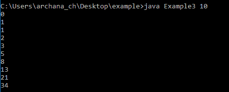

# 通过示例了解如何使用 Java 命令行参数

> 原文：<https://www.edureka.co/blog/java-command-line-argument/>

Java 编程语言在各个方面都是通用的，独立于平台，这使得 Java 成为任何开发者的明显赢家。任何 Java 程序的执行都是流畅而精确的。我们甚至可以在程序的[执行](https://www.edureka.co/blog/how-to-compile-run-java-program/)期间使用命令行参数传递参数。在本文中，您将学习如何在 Java 中使用命令行参数。以下是本博客讨论的主题:

*   [什么是命令行参数？](#commandline)
*   [Java 命令行参数示例](#example)
    *   [一个数的阶乘](#fact)
    *   [两个数之和](#sum)
    *   [斐波那契数列](#fibonacci)
*   [需要记住的要点](#important)

## **什么是命令行参数？**

命令行参数在运行时传递给程序。在 Java 程序中传递命令行参数非常容易。它们作为字符串存储在传递给 Java 中 main()方法的 args 参数的[字符串数组](https://www.edureka.co/blog/string-array-in-java/)中。

```
class Example0{
public static void main(String[] args){
System.out.println("edureka" + args[0]);
}
}

```

**输出:**

要在命令提示符下编译并运行 java 程序,请遵循以下步骤。

*   将您的程序保存在扩展名为. java 的文件中

*   打开命令提示符并转到保存文件的目录。

*   运行命令–javac filename.java

*   编译后，运行命令–Java filename

*   确保 Java 路径设置正确。

## **Java 命令行参数示例**

这里有几个例子来展示我们如何在一个 [Java 程序中使用命令行参数。](https://www.edureka.co/blog/java-programs/)

美依赖于 Integer 类中的 parseInt 方法。每一个数字类，比如 Integer、Float、Double 等等，都有 parseXXX 方法将 String 转换成它们各自类型的对象。

众所周知，数组的索引从零开始。因此，args[0]是这个 String[]数组中的第一个索引，它取自控制台。同样，args[1]是第二个，args[2]是第三个元素，依此类推。

当一个应用程序启动时，运行时系统通过一个[字符串数组](https://www.edureka.co/blog/string-array-in-java/)将命令行参数传递给应用程序的主方法。

### **使用命令行参数的数字阶乘**

```
class Example1{
public static void main(String[] args){
int a , b = 1;
int n = Integer.parseInt(args[0]);
for(a = 1; a<= n ; a++)
{ 
b = b*a;
}
System.out.println("factorial is" +b);
}
}

```

**输出:**

### **使用命令行参数对两个数求和**

```
class Example2{
public static void main(String[] args){
int a = Integer.parseInt(args[0]);
int b = Integer.parseInt(args[1]);
int sum = a + b;
System.out.println("The sum is" +sum);
}
}

```

**输出:**

### **斐波那契数列程序使用命令行参数**

```
class Example3{
public static void main(String[] args){
int n = Integer.parseInt(args[0]);
int t1 = 0;
int t2 = 1;

for(int i = 1; i <=n; i++){
System.out.println(t1);
int sum = t1+t2;
t1 = t2;
t2 = sum;
}
}
}

```

**输出:**

## **要记住的要点**

*   启动应用程序时，可以使用命令行参数来指定配置信息。

*   当您使用命令行参数时，参数的数量没有限制。你可以根据你的需要使用许多。

*   命令行参数中的信息作为[字符串](https://www.edureka.co/blog/java-string/)传递。

*   命令行参数存储在程序的 main()方法的字符串 args 中。

这就把我们带到了本文的结尾，我们已经通过例子了解了 Java 命令行参数。我希望你清楚本教程中与你分享的所有内容。如果您刚刚开始，那么请阅读这篇 Java 教程，了解基本的 Java 概念。

[https://www.youtube.com/embed/iGGgxnJCNRM](https://www.youtube.com/embed/iGGgxnJCNRM)

*如果您发现这篇文章与“Java 命令行参数”相关，请查看一下  Edureka 的 [Java 认证](https://www.edureka.co/java-j2ee-training-course)培训，这是一家值得信赖的在线学习公司，在全球拥有超过 250，000 名满意的学习者。*

我们在这里帮助你踏上旅程的每一步，并为想成为 Java 开发人员的学生和专业人士设计课程。该课程旨在让您在 Java 编程方面有一个良好的开端，并训练您掌握核心和高级 Java 概念以及各种  [Java 框架](https://www.edureka.co/blog/java-frameworks/) ，如[Hibernate](https://www.edureka.co/blog/what-is-hibernate-in-java/)&[Spring](https://www.edureka.co/blog/spring-tutorial/)。

*如果您遇到任何问题，请在“Java 命令行参数”的评论区提出您的所有问题，我们的团队将很乐意回答，或者您也可以参加我们在瓦拉纳西举办的 [Java 培训。](https://www.edureka.co/java-j2ee-training-course-varanasi)*