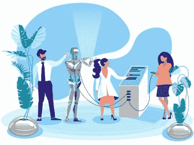
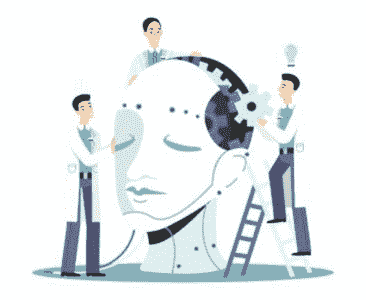
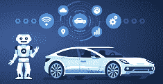
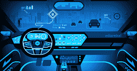

# 机器学习和大数据:是未来吗？

> 原文：<https://www.edureka.co/blog/machine-learning-and-big-data/>

机器学习和大数据是当前 IT 行业的蓝筹。大数据存储从大量数据集中分析和提取信息。另一方面，机器学习是在没有明确编程的情况下，根据经验自动学习和改进的能力。从 [Hadoop 认证在线](https://www.edureka.co/big-data-hadoop-training-certification)获得进一步了解。

这个组合真的是我们的未来吗？让我们通过以下摘要来了解这一点:

*   [什么是大数据？](#big)
*   [5 V 的大数据](#v)
*   [数据从哪里来？](#where)
*   [什么是机器学习？](#what)
*   [如何在大数据中应用机器学习？](#apply)
*   [大数据和机器学习用例。](#use)

## **什么是大数据？**

[**大数据**](https://www.edureka.co/blog/big-data-tutorial) 是一组庞大而复杂的数据集，使用传统的数据库管理和处理应用程序很难存储和处理这些数据集。挑战包括捕获、管理、存储、搜索、共享、传输、分析和可视化这些数据。

## **5 V 的大数据**

*   **体积:**大数据这个术语之所以有分量，是因为它的**体积。**
*   **速度:**高**精度**和**速度处理数据的优越性。**
*   **种类繁多:**数据的不同类型，**结构化，**非结构化，**半结构化。**
*   **准确性:****质量**和数据的一致性。
*   **值:**末级是提取**有用的数据。**

你甚至可以通过加拿大 [Azure 数据工程培训](https://www.edureka.co/microsoft-azure-data-engineering-certification-course-canada) 了解大数据的细节。

## **数据从哪里来？**

大数据是从各种来源收集的。只要你说得出，大数据就能拥有。一些主要来源讨论如下:

*   社会化媒体
*   第三方云存储
*   在线网页
*   物联网。

[**数据挖掘**](https://www.edureka.co/community/29861/skills-to-become-a-data-mining-expert) 和 [**数据分析**](https://www.edureka.co/blog/what-is-data-analytics/) 是大数据处理的两大核心。数据挖掘涉及从各种来源收集数据，而数据分析则是对数据进行逻辑推理。

经过分类和分析的数据可以揭示隐藏的模式和见解，这些模式和见解在许多领域都很有用。因此，大数据是每个行业不可思议的商业价值的来源。例如模式识别、预见等等。

这就是机器学习的用武之地。

## **什么是机器学习？**

[**机器学习**](https://www.edureka.co/blog/machine-learning-tutorial/) 被定义为自动化的数据处理和决策算法，旨在根据他们的经验在分配给他们的任务的每个阶段进行改进。换句话说，“通过学习进化”

在大数据的背景下，机器学习被用来跟上不断增长和不断变化的数据流，并提供不断发展和有价值的见解。

机器学习算法定义传入的数据，并识别与之相关的模式，这些模式随后被转化为有价值的见解，可以进一步实施到业务运营中。在那之后，这些算法也用于自动化决策过程的某些方面。

通过学习[人工智能课程](https://www.edureka.co/executive-programs/machine-learning-and-ai)，将自己转变为一名高技能专业人士，并获得一份高薪工作。

为了这些目的，机器学习算法与各种技术一起使用，如决策树或神经网络。

## **如何在大数据中应用机器学习？**

机器学习为数据收集、分析和同化提供了高效的自动化工具。 与云计算优势合作，机器学习将敏捷性融入处理，并整合大量数据，而不管其来源。

机器学习算法可以应用于大数据操作的每个元素，包括:

*   数据分段
*   数据分析
*   模拟

所有这些阶段都集成在一起，从大数据中创建具有洞察力和模式的大画面，这些大画面随后被分类并打包成可理解的格式。 机器学习和大数据的融合是一个永无止境的循环。随着信息进入系统和离开系统，为特定目的创建的算法随着时间的推移而被监控和完善。 你甚至可以通过 [数据工程师课程](https://www.edureka.co/microsoft-azure-data-engineering-certification-course) 了解大数据的细节。

## **大数据和机器学习用例**

机器学习和大数据的主导组合是许多行业显著增长的背后原因。其中，**汽车产业**就是一个。从奥斯汀的 [Hadoop 培训中了解更多信息。](https://www.edureka.co/big-data-and-hadoop-austin)

将统计模型整合到数据中，有助于汽车制造商确定策略，为他们的汽车提供满足用户期望的一流自动化。

*预测分析*让制造商能够监控和共享有关车辆或零件故障的重要信息。不仅如此，目前的车辆已经开始与车主沟通。它们会自动存储与日常通勤路线、位置和互联信息娱乐系统相关的数据，从而允许用户访问车辆并进行远程控制。

至此，我们结束了这篇内容丰富的文章。我希望你已经了解了机器学习和大数据的基础知识，并通过包含的实时用例了解了它的实现。

*现在，您已经通过本文了解了  的基础知识，请查看 Edureka 在夏洛特举办的  [大数据培训](https://www.edureka.co/big-data-and-hadoop-charlotte)* *，edu reka 是一家值得信赖的在线学习公司，拥有遍布全球的 250，000 多名满意的学习者。Edureka 的大数据 Hadoop 培训和认证课程是为希望成为 Hadoop 开发人员的学生和专业人士设计的。该课程旨在让您对 Hadoop 框架有一个良好的开端，并培训您核心和高级 Hadoop 概念以及各种框架，如 [Spark](https://spark.apache.org/documentation.html) 。*

有问题要问我们吗？在这个“机器学习和大数据”博客的评论部分提到它，我们会尽快回复你。