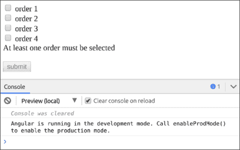

# 如何在 Angular8 中创建复选框？

> 原文：<https://www.edureka.co/blog/checkbox-in-angular8/>

如果到目前为止你一直在创建任何类型的应用程序，你应该已经意识到复选框的巨大重要性。它不仅使任何平台的数据输入都变得更加容易，而且也有助于数据的快速排序，因为它通常与列表特性打包在一起。在本文中，我们将看到如何在 angular8 中按以下顺序创建一个复选框:

*   [在 Angular8 中创建复选框](#create)
*   [验证复选框](#valid)
*   [添加异步表单控件](#add)

## **在 Angular8 中创建复选框**

为了解释在 Angular8 中创建复选框的步骤，让我们举一个例子，我们有一个可供选择的订单列表，我们必须以复选框的形式提供给用户。为此，请遵循下面的代码。

```
const ordersData = [
{ id: 1, name: 'order 1' },
{ id: 2, name: 'order 2' },
{ id: 3, name: 'order 3' },
{ id: 4, name: 'order 4' }
];
```

在这种情况下，数据已经存在，因此我们使用了上面共享的代码。在真实的场景中，这些数据很可能是通过 API 导入的。如欲了解更多信息，请立即查看此[全栈开发课程](https://www.edureka.co/masters-program/full-stack-developer-training)。

在这个例子中，我们还可以利用反应式表单来使最终结果更加清晰和高效。为了理解如何做到这一点，请看下面的例子。

```
import { Component } from '@angular/core';
import { FormBuilder, FormGroup } from '@angular/forms';

@Component({
selector: 'my-app',
templateUrl: './app.component.html',
styleUrls: ['./app.component.css']
})
export class AppComponent {
form: FormGroup;
ordersData = [];

constructor(private formBuilder: FormBuilder) {
this.form = this.formBuilder.group({
orders: []
});
}

submit() { ... }
}
```

在上面的代码中，我们使用了以下代码。

1.  **FormGroups:** 代表单个表单。
2.  **FormControl:** 表示进入单个表单的单个条目。
3.  **FormArray:** 用于表示所有 FormControls 的集合。

在上面的例子中，我们还可以利用 FormBuilder 服务来创建表单；它看起来会像这样。

```
<form [formGroup]="form" (ngSubmit)="submit()">
<!-- our form array of checkboxes will go here -->
<button>submit</button>
</form>
```

在上面的例子中，我们通过使用[formGroup]="form "将表单与表单元素绑定在一起。

既然已经创建了基本表单，让我们通过使用如下所示的 FormArray 为其添加一些动态性。

```
import { Component } from '@angular/core';
import { FormBuilder, FormGroup, FormArray, FormControl, ValidatorFn } from '@angular/forms';

@Component({
selector: 'my-app',
templateUrl: './app.component.html',
styleUrls: ['./app.component.css']
})
export class AppComponent {
form: FormGroup;
ordersData = [
{ id: 100, name: 'order 1' },
{ id: 200, name: 'order 2' },
{ id: 300, name: 'order 3' },
{ id: 400, name: 'order 4' }
];

constructor(private formBuilder: FormBuilder) {
this.form = this.formBuilder.group({
orders: new FormArray([])
});

this.addCheckboxes();
}

private addCheckboxes() {
this.ordersData.forEach((o, i) => {
const control = new FormControl(i === 0); // if first item set to true, else false
(this.form.controls.orders as FormArray).push(control);
});
}

submit() {
const selectedOrderIds = this.form.value.orders
.map((v, i) => v ? this.orders[i].id : null)
.filter(v => v !== null);
console.log(selectedOrderIds);
}
}
```

在上面的例子中，在每一次循环迭代后，我们都创建了一个新的 FormControl，并从 FormArray 获取订单。我们已经将第一个控件设置为 true，因此默认情况下，第一个订单已经从列表中删除。

之后，我们需要将 FormArray 元素绑定到这个模板，以便获得需要显示给用户的特定订单信息。

```
<form [formGroup]="form" (ngSubmit)="submit()">
<label formArrayName="orders" *ngFor="let order of form.controls.orders.controls; let i = index">
<input type="checkbox" [formControlName]="i">
{{ordersData[i].name}}
</label>

<button>submit</button>
</form>
```

**输出:**

## ****

## **验证 Angular8 中的复选框**

看看下面的例子，了解如何验证复选框。

```
<form [formGroup]="form" (ngSubmit)="submit()">
<label formArrayName="orders" *ngFor="let order of form.controls.orders.controls; let i = index">
<input type="checkbox" [formControlName]="i">
{{ordersData[i].name}}
</label>

<div *ngIf="!form.valid">At least one order must be selected</div>
<button>submit</button>
</form>

...
export class AppComponent {
form: FormGroup;
ordersData = [...];

constructor(private formBuilder: FormBuilder) {
this.form = this.formBuilder.group({
orders: new FormArray([], minSelectedCheckboxes(1))
});

this.addCheckboxes();
}

...
}

function minSelectedCheckboxes(min = 1) {
const validator: ValidatorFn = (formArray: FormArray) => {
const totalSelected = formArray.controls
// get a list of checkbox values (boolean)
.map(control => control.value)
// total up the number of checked checkboxes
.reduce((prev, next) => next ? prev + next : prev, 0);

// if the total is not greater than the minimum, return the error message
return totalSelected >= min ? null : { required: true };
};

return validator;
}
```

**输出:**

## ****

## **添加异步表单控件**

现在你已经知道了如何添加动态复选框，让我们看看如何将异步添加到这些表单中。

```
import { Component } from '@angular/core';
import { FormBuilder, FormGroup, FormArray, FormControl, ValidatorFn } from '@angular/forms';
import { of } from 'rxjs';

@Component({
selector: 'my-app',
templateUrl: './app.component.html',
styleUrls: ['./app.component.css']
})
export class AppComponent {
form: FormGroup;
ordersData = [];

constructor(private formBuilder: FormBuilder) {
this.form = this.formBuilder.group({
orders: new FormArray([], minSelectedCheckboxes(1))
});

// synchronous orders
this.ordersData = this.getOrders();
this.addCheckboxes();
}

private addCheckboxes() {
this.ordersData.forEach((o, i) => {
const control = new FormControl(i === 0); // if first item set to true, else false
(this.form.controls.orders as FormArray).push(control);
});
}

getOrders() {
return [
{ id: 100, name: 'order 1' },
{ id: 200, name: 'order 2' },
{ id: 300, name: 'order 3' },
{ id: 400, name: 'order 4' }
];
}

submit() {
const selectedOrderIds = this.form.value.orders
.map((v, i) => v ? this.ordersData[i].id : null)
.filter(v => v !== null);
console.log(selectedOrderIds);
}
}

...

import { of } from 'rxjs';
...
constructor(private formBuilder: FormBuilder) {
this.form = this.formBuilder.group({
orders: new FormArray([], minSelectedCheckboxes(1))
});

// async orders (could be a http service call)
of(this.getOrders()).subscribe(orders => {
this.ordersData = orders;
this.addCheckboxes();
});

// synchronous orders
// this.ordersData = this.getOrders();
// this.addCheckboxes();
}
```

说到这里，我们的文章就到此为止了。既然你已经知道如何给 angular8 添加一个复选框，我们希望你能在日常编码中使用它。

*既然你已经知道了棱角分明的基本要素，那就来看看 Edureka 的 [**棱角分明训练**](https://www.edureka.co/angular-training) 。Angular 是一个 JavaScript 框架，用于创建可伸缩的、企业级的、高性能的客户端 web 应用程序。随着 Angular 框架的广泛采用，应用程序的性能管理是由社区驱动的，间接推动了更好的工作机会。Angular 认证培训旨在涵盖所有这些围绕企业应用程序开发的新概念。*