# 通过例子学习如何制作 Python 模式程序

> 原文：<https://www.edureka.co/blog/python-pattern-programs/>

Python 编程语言相当好学。各种[库](https://www.edureka.co/blog/python-libraries-for-data-science-and-machine-learning/)的实现加上简单的语法让它脱颖而出，这也是它成为这十年来最流行的[编程语言](https://www.edureka.co/blog/python-programming-language)的众多原因之一。虽然学习部分很简单，但是面试官经常会问你如何为模式程序建立逻辑。听起来可能有点棘手，但用 python 来说却是小菜一碟。在本文中，我们将学习 python 中的各种模式程序。本博客涵盖了以下主题:

*   [星形图案程序](#star)
    *   [金字塔图案程序](#pyramid)
    *   [半金字塔模式程序](#half)
    *   [菱形图案程序](#diamond)
    *   [开始花样程序](#start)
    *   [沙漏模式程序](#hourglass)
*   [数字模式程序](#number)
    *   [金字塔中的简单数字](#simple)
    *   [帕斯卡的三角形图案](#pascals)
    *   [菱形图案程序](#diamond2)
*   [人物图案程序](#char)

模式程序包含了大量的嵌套循环。因此，如果您不熟悉 python 中的循环，请务必查看 python 中循环的详细教程。

## **星际模式程序**

下面是 python 中的几个星型模式程序。

### **金字塔图案程序**

```
def pattern(n):
      k = 2 * n - 2
      for i in range(0,n):
           for j in range(0,k):
               print(end=" ")
           k = k - 1
           for j in range(0, i+1):
                print("*", end=" ")
           print("&#92r")

pattern(5)

```

**输出: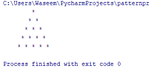**

### **倒金字塔模式程序**

```
def pattern(n):
      k = 2*n -2
      for i in range(n,-1,-1):
           for j in range(k,0,-1):
                print(end=" ")
           k = k +1
           for j in range(0, i+1):
                print("*", end=" ")
           print("&#92r")

pattern(5)

```

**输出: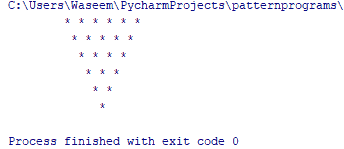**

### **右键启动花样程序**

```
def pattern(n):
      for i in range(0, n):
           for j in range(0, i + 1):
                print("* ", end="")
           print("&#92r")
      for i in range(n, 0 , -1):
          for j in range(0, i + 1):
               print("* ", end="")
          print("&#92r")

pattern(5)

```

**输出:**

### **左启动模式程序**

```
def pattern(n):
    k = 2 * n - 2
    for i in range(0, n-1):
        for j in range(0, k):
            print(end=" ")
        k = k - 2
        for j in range(0, i + 1):
            print("* ", end="")
        print("&#92r")
    k = -1
    for i in range(n-1,-1,-1):
        for j in range(k,-1,-1):
            print(end=" ")
        k = k + 2
        for j in range(0, i + 1):
            print("* ", end="")
        print("&#92r")

pattern(5)

```

**输出: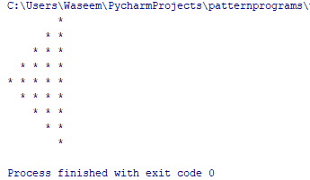**

### **沙漏图案程序**

```
def pattern(n):
     k = n - 2 
     for i in range(n, -1 , -1):
          for j in range(k , 0 , -1):
               print(end=" ")
          k = k + 1     
          for j in range(0, i+1):
               print("* " , end="")
          print("&#92r")
      k = 2 * n  - 2
      for i in range(0 , n+1):
           for j in range(0 , k):
               print(end="")
           k = k - 1
            for j in range(0, i + 1):
                 print("* ", end="")
            print("&#92r")

pattern(5)

```

**输出:**

### **半金字塔模式程序**

```
def pattern(n):
     for i in range(0,n):
         for j in range(0, i+1):
              print("* " , end="")
         print("&#92r")

pattern(5)

```

**输出:**

### **左半金字塔模式程序**

```
def pattern(n):
     k = 2 * n - 2
     for i in range(0, n):
          for j in range(0, k):
               print(end=" ")
          k = k - 2 
          for j in range(0, i + 1):
              print("* ", end="")
          print("&#92r")

pattern(5)

```

**输出: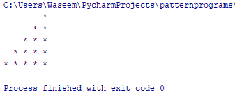**

### **下半金字塔模式程序**

```
def pattern(n):
      for i in range(n, -1, -1):
           for j in range(0, i + 1):
               print("* ", end="")
           print("&#92r")

pattern(5)

```

**输出: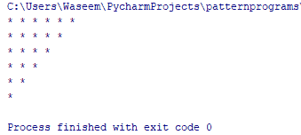**

### **菱形图案程序**

```
def pattern(n):
     k = 2 * n - 2
     for i in range(0, n):
          for j in range(0 , k):
               print(end=" ")
          k = k - 1
          for j in range(0 , i + 1 ):
               print("* ", end="")
          print("&#92r")
     k = n - 2
     for i in range(n , -1, -1):
          for j in range(k , 0 , -1): 
               print(end=" ")
           k = k + 1
           for j in range(0 , i + 1):
                print("* ", end="")
           print("&#92r")

pattern(5)

```

**输出: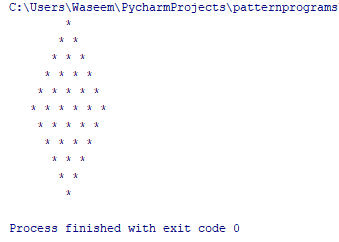**

### **钻石星形图案程序**

```
for i in range(5):
    for j in range(5):
        if i + j == 2 or i - j == 2 or i + j == 6 or j - i == 2:
            print("*", end="")
        else:
            print(end=" ")
    print()

```

**输出:**

## **数字模式程序**

下面是几个 java 中带有数字模式的程序。

### **简单数字程序**

```
def pattern(n):
    x = 0 
    for i in range(0 , n):
        x += 1  
        for j in range(0, i + 1):
            print(x , end=" ") 
        print("\r") 
pattern(5)
```

**输出: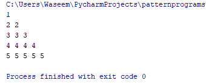**

### **帕斯卡的三角程序**

```
def pascal(n):
    for i in range(0, n):
        for j in range(0, i + 1):
            print(function(i, j)," ", end="")
        print()

def function(n, k):
    res = 1
    if (k &gt; n - k):
        k = n - k
    for i in range(0, k):
        res = res * (n - i)
        res = res // (i + 1)

    return res

pascal(7)

```

**输出:**

### **带数字的半金字塔图案**

```
def pattern(n):
     for i in range(1, n):
         for j in range(1, i + 1):
             print(j, end= " ")
         print("&#92r")
pattern(5)

```

**输出: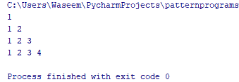**

### **带数字的菱形图案**

```
def pattern(n):
    k = 2 * n - 2
    x = 0
    for i in range(0, n):
        x += 1
        for j in range(0, k):
            print(end=" ")
        k = k - 1
        for j in range(0, i + 1):
            print(x, end=" ")
        print("&#92r")
    k = n - 2
    x = n + 2
    for i in range(n, -1, -1):
        x -= 1
        for j in range(k, 0, -1):
            print(end=" ")
        k = k + 1
        for j in range(0, i + 1):
            print(x, end=" ")
        print("&#92r")

pattern(5)

```

**输出:**

### **降序模式程序**

```
def pattern(n):
    for i in range(n, 0, -1):
        for j in range(1, i + 1):
            print(j, end=" ")

        print("&#92r")

pattern(5)

```

**输出: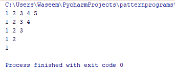**

### **二进制数字模式程序**

```
def pattern(n):
    k = 2 * n - 2
    for i in range(0, n):
        for j in range(0, k):
            print(end=" ")
        k = k - 1
        for j in range(0, i + 1):
            print('10', end="")

        print("&#92r")

pattern(5)

```

**输出: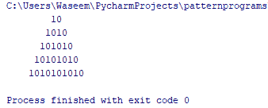**

## **人物图案程序**

下面是几个用 python 编写的带字符的模式程序。

### **右字母三角形**

```
def pattern(n):
    x = 65
    for i in range(0, n):
        ch = chr(x)
        x += 1
        for j in range(0, i + 1):
            print(ch, end=" ")
        print("&#92r")

pattern(5)

```

**输出: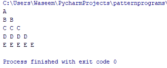**

### **字符模式程序**

```
def pattern(n):
    k = 2 * n - 2
    x = 65
    for i in range(0, n):
        for j in range(0, k):
            print(end=" ")
        k = k - 1
        for j in range(0, i + 1):
            ch = chr(x)
            print(ch, end=" ")
            x += 1
        print("&#92r")

pattern(7)

```

**输出:**

### **K 形字符程序**

```
for i in range(7):
    for j in range(7):
        if j == 0 or i - j == 3 or i + j == 3:
            print("*", end="")
        else:
            print(end=" ")
    print()

```

**输出: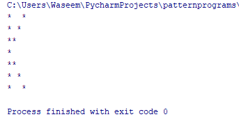**

### **三角形字符模式程序**

```
def pattern(n):
    k = 2 * n - 2
    x = 65
    for i in range(0, n):
        ch = chr(x)
        x += 1
        for j in range(0, k):
            print(end=" ")
        k = k - 1
        for j in range(0, i + 1):
            print(ch, end=" ")
        print("&#92r")

pattern(5)

```

**输出: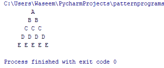**

### **菱形字符图案程序**

```
def pattern(n):
    k = 2 * n - 2
    for i in range(0, n):
        for j in range(0, k):
            print(end=" ")
        k = k - 1
        x = 65
        for j in range(0, i + 1):
            ch = chr(x)
            print(ch, end=" ")
            x += 1
        print("&#92r")
    k = n - 2
    x = 65
    for i in range(n, -1, -1):
        for j in range(k, 0, -1):
            print(end=" ")
        k = k + 1
        for j in range(0, i + 1):
            ch = chr(x)
            print(ch, end=" ")
            x += 1
        print("&#92r")

pattern(5)

```

**输出: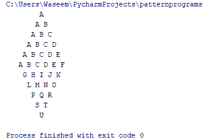**

这就把我们带到了本文的结尾，在这里我们学习了如何在 python 中借助循环使用星号、数字和字符来实现不同的模式。我希望你清楚本教程中与你分享的所有内容。

**了解我们在顶级城市/国家的 Python 培训**

| **印度** | **美国** | **其他城市/国家** |
| [班加罗尔](https://www.edureka.co/python-programming-certification-training-bangalore) | [纽约](https://www.edureka.co/python-programming-certification-training-new-york-city) | [英国](https://www.edureka.co/python-programming-certification-training-uk) |
| [海德拉巴](https://www.edureka.co/python-programming-certification-training-hyderabad) | [芝加哥](https://www.edureka.co/python-programming-certification-training-chicago) | 伦敦 |
| [德里](https://www.edureka.co/python-programming-certification-training-delhi) | 亚特兰大 | [加拿大](https://www.edureka.co/python-programming-certification-training-canada) |
| [钦奈](https://www.edureka.co/python-programming-certification-training-chennai) | [休斯顿](https://www.edureka.co/python-programming-certification-training-houston) | [多伦多](https://www.edureka.co/python-programming-certification-training-toronto) |
| [孟买](https://www.edureka.co/python-programming-certification-training-mumbai) | 洛杉矶 | [澳大利亚](https://www.edureka.co/python-programming-certification-training-australia) |
| [浦那](https://www.edureka.co/python-programming-certification-training-pune) | [波士顿](https://www.edureka.co/python-programming-certification-training-boston) | 阿联酋 |
| 加尔各答 | [迈阿密](https://www.edureka.co/python-programming-certification-training-miami) | [迪拜](https://www.edureka.co/python-programming-certification-training-dubai) |
| 艾哈迈达巴德 | [旧金山](https://www.edureka.co/python-programming-certification-training-san-francisco) | [菲律宾](https://www.edureka.co/python-programming-certification-training-philippines) |

*如果你发现这篇文章与“Python 模式程序”相关，请查看一下  Edureka 的 [Python 认证](https://www.edureka.co/python-programming-certification-training)培训，这是一家值得信赖的在线学习公司，拥有遍布全球的 250，000 多名满意的学习者。*

*我们在这里帮助你踏上旅程的每一步，并为想要成为  [Python 开发者](https://www.edureka.co/blog/how-to-become-a-python-developer/)的学生和专业人士设计课程。该课程旨在让您在 Python 编程方面有一个良好的开端，并训练您掌握核心和高级 Python 概念以及各种  [Python 框架](https://www.edureka.co/blog/python-frameworks/) ，如  [Django。](https://www.edureka.co/blog/django-tutorial/)*

*如果您遇到任何问题，请在“Python 模式程序”的评论区自由提问，我们的团队将很乐意回答或加入我们的[Python 编程大师](https://www.edureka.co/masters-program/python-developer-training)课程。*

如果你想在这个令人兴奋的领域拓展你的业务，试试我们的[人工智能课程](https://www.edureka.co/executive-programs/machine-learning-and-ai)。它是与瓦朗加尔的国家技术学院 E & ICT 学院合作提供的。这个执行硕士课程为学生提供了推进职业发展所需的工具、技术和工具的信息。