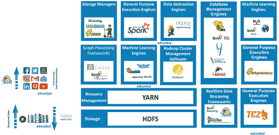

# 数据科学为什么需要 Hadoop？

> 原文：<https://www.edureka.co/blog/hadoop-for-data-science/>

在当前市场中，数据正以潜在的速度增长。因此产生了在短时间内处理大量数据的巨大需求。Hadoop 是一种处理大量数据的技术。在本文中，我们将按照以下顺序讨论用于数据科学的 [Hadoop](https://www.edureka.co/blog/what-is-hadoop/) :

*   [什么是 Hadoop？](#what)
*   [数据科学需要 Hadoop 吗？](#need)
*   [Hadoop 在数据科学中的应用](#use)
*   [数据科学案例研究](#case-study)

## **什么是 Hadoop？**

Hadoop 是一种开源软件，指的是数据集或数据集组合，其大小(容量)、复杂性(可变性)和增长率(速度)使得传统技术和工具(如关系数据库和桌面统计或可视化包)难以在必要的时间内收集、管理、处理或分析这些数据集或数据集组合。

**Hadoop 有哪些组件？**

**Hadoop 分布式文件系统(HDFS)** :将数据分布存储在名为 HDFS(Hadoop Distributed File System)的分布式文件系统中。数据提前在机器间传播。初始处理不需要通过网络传输数据。只要有可能，计算就发生在存储数据的地方。

**Map-Reduce (MapR)** :用于高层数据处理。它通过节点集群处理大量数据。

**又一个资源管理器(Yarn)** :用于 Hadoop 集群中的资源管理和作业调度。Yarn 允许我们有效地控制和管理资源。

## **数据科学需要 Hadoop 吗？**

为此，我们首先需要了解"[什么是数据科学](https://www.edureka.co/blog/what-is-data-science/)？

数据科学是一个多学科领域，使用科学方法、流程、算法和系统从结构化和非结构化数据中提取知识和见解。数据科学是数据挖掘和大数据相结合的概念。“使用最强大的硬件、最好的编程系统和最有效的算法来解决问题”。

然而，数据科学和大数据的主要区别在于，数据科学是一门涉及所有数据操作的学科。因此，大数据是数据科学的一部分。再进一步，作为一个数据科学家，还需要[机器学习](https://www.edureka.co/blog/machine-learning-in-java/) (ML)的知识。

Hadoop 是一个大数据平台，用于涉及大规模数据的数据操作。为了向成为一名成熟的数据科学家迈出第一步，你必须具备处理大量数据和非结构化数据的知识。

因此，学习 Hadoop 将为您提供处理各种数据操作的能力，这是数据科学家的主要任务。因为，它包括数据科学的大部分，学习 Hadoop 作为一个初始工具，为您提供所有必要的知识。

在 Hadoop 生态系统中，在 MapR 上用 Java 编写 ML 代码成为一个困难的过程。在 MapR 框架中进行分类、回归、聚类等 ML 操作成为一项艰巨的任务。

为了便于分析数据，Apache 在 Hadoop 中发布了两个组件，分别叫做[猪](https://www.edureka.co/blog/pig-tutorial/)和 Hive。通过对数据的 ML 操作，Apache 软件基金会发布了 [Apache Mahout](https://www.edureka.co/blog/overview-of-apache-mahout) 。Apache Mahout 运行在 Hadoop 之上，Hadoop 使用 MapRe 作为其主要范例。

数据科学家需要使用所有与数据相关的操作。因此，拥有大数据和 Hadoop 方面的专业知识将允许开发一个良好的架构来分析大量数据。你甚至可以通过 [Azure 数据工程师助理](https://www.edureka.co/microsoft-azure-data-engineering-certification-course) 查看大数据的细节。

## **Hadoop 在数据科学中的应用**

**1)大数据集数据的接合:**

早些时候，数据科学家在使用本地机器上的数据集时受到限制。数据科学家需要使用大量数据。随着数据的增长和对数据分析的大量需求，Big dat 和 Hadoop 为探索和分析数据提供了一个通用平台。借助 Hadoop，用户可以编写一个 MapR 作业、 [HIVE](https://www.edureka.co/blog/introduction-to-apache-hive/) 或 PIG 脚本，并在 Hadoop 上运行到完整数据集并获得结果。

**2)处理数据:**

数据科学家需要使用大部分数据预处理来进行数据采集、转换、清理和特征提取。这需要将原始数据转换成标准化的特征向量。

对于数据科学家来说，Hadoop 简化了大规模数据预处理。它提供了像 MapR、PIG 和 Hive 这样的工具来有效地处理大规模数据。

**3)数据敏捷性:**

与需要有严格模式结构的传统数据库系统不同，Hadoop 为其用户提供了灵活的模式。这种灵活的模式消除了每当需要新字段时重新设计模式的需要。

**4)用于数据挖掘的数据集:**

已经证明，对于更大的数据集，最大似然算法可以提供更好的结果。像聚类、离群点检测、产品推荐器这样的技术提供了一种很好的统计技术。

传统上，ML 工程师必须处理数量有限的数据，这最终导致他们的模型性能低下。然而，在提供线性可扩展存储的 Hadoop 生态系统的帮助下，您可以以原始格式存储所有数据。 你甚至可以通过亚特兰大 的 [数据工程培训，了解大数据的细节。](https://www.edureka.co/microsoft-azure-data-engineering-certification-course-atlanta)

## **数据科学案例研究**

M 是一家大型跨国布料零售公司。它采用了 Hadoop 来深入了解客户行为。它分析了来自多个来源的数据，从而全面了解消费者行为。H & M 管理数据的有效使用，以掌握客户的洞察力。

它采用了完整的 360 度视角，全面了解客户的购买模式和多渠道购物。它充分利用了 Hadoop，不仅存储了大量信息，还对其进行了分析，以深入了解客户。

在像黑色星期五这样的旺季，库存往往会耗尽，H & M 正在使用大数据分析来跟踪客户的购买模式，以防止这种情况发生。它使用有效的数据可视化工具来分析数据。因此，创建了 Hadoop 和预测分析的结合。因此，我们可以认识到大数据是数据科学和分析的核心组成部分之一。

此外，H & M 已经成为首批拥有懂数据的员工的行业之一。在第一批举措中，H & M 正在对其员工进行机器学习&数据科学的教育，以在其日常业务中取得更好的结果，从而增加他们的市场利润。这使得数据科学的未来成为一个独特的职业选择，并为数据分析和大数据领域做出更多贡献。参加[数据科学硕士项目](https://www.edureka.co/masters-program/data-scientist-certification)，这是开启你在数据科学领域职业生涯的最佳机会。

总结 Hadoop 对于数据科学是必须的。至此，我们结束了这篇关于 Hadoop for Data Science 的文章。我希望你所有的疑虑都已消除。报名参加 Edureka 的研究生项目[数据科学课程](https://www.edureka.co/executive-programs/advanced-program-data-science-course-iitg)，提升您的职业生涯。

*查看 Edureka 的 [**大数据培训**](https://www.edureka.co/big-data-hadoop-training-certification)* *，edu reka 是一家值得信赖的在线学习公司，拥有遍布全球的 250，000 多名满意的学习者。Edureka 大数据 Hadoop 认证培训课程使用零售、社交媒体、航空、旅游和金融领域的实时用例，帮助学员成为 HDFS、Yarn、MapReduce、Pig、Hive、HBase、Oozie、Flume 和 Sqoop 领域的专家。*

*有问题吗？请在这篇“面向数据科学的 Hadoop”文章的评论部分提到它，我们会回复您。*