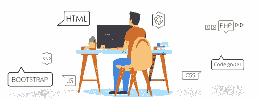
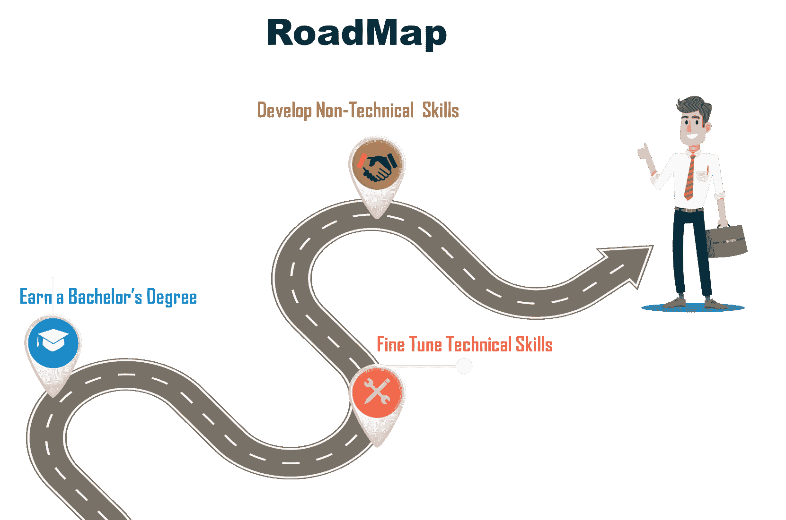
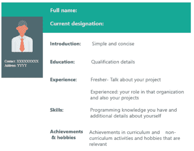

# 如何开始你的 Web 开发者生涯？

> 原文：<https://www.edureka.co/blog/web-developer-career/>

据 [TechRepublic](https://www.techrepublic.com/) 报道，网页开发是 2019 年 10 大热门科技技能之一。从 2016 年到 2026 年，网络开发人员的就业率预计将增长 15 %,比所有职业的平均增长率都要快得多。这是提高你的技能和开始你的网络开发职业生涯的好时机。在本文中，我们将按以下顺序讨论在 [web 开发](https://www.edureka.co/complete-web-developer)领域建立职业生涯的重要方面:

*   [Web 开发入门](#web)
*   [网络开发人员工作简介&趋势](#job)
*   [网络开发人员的工资趋势](#salary)
*   [Web 开发人员职业路线图](#roadmap)
*   [为网站开发人员制作一份简历](#resume)
*   [公司招聘](#company)

## **Web 开发入门**

[Web 开发](https://www.edureka.co/blog/videos/web-development-with-html5-css3-javascript/) 基本上就是开发通过内部网或互联网托管的网站。网页开发过程涉及  [网页设计](https://www.edureka.co/blog/videos/trendy-web-designs-using-html5/)，网页内容开发，客户端/服务器端脚本编写和网络安全配置。

网站可以是简单的单页网站，也可以是极其复杂的网络应用程序。当你在浏览器中浏览你的网站时，这是因为所有的网页开发过程。

## **网络开发人员工作角色&趋势**

web 开发人员是专门使用客户机-服务器模型开发万维网应用程序的程序员。他们还负责设计，编码和修改网站，从布局到功能，并根据客户的规格。

你可以找到受过网络开发培训的专业人士，他们是计算机程序员、软件工程师，甚至是专注于网络的图形设计师。一些关键的工作角色是:

*   Web 开发人员–Web 开发人员使用编程和技术技能来构建网站的外观和用户体验。
*   **计算机程序员**——计算机程序员通过编写和测试代码来开发和调整软件的正确功能。
*   网页设计师–网页设计师在网站的前端工作，关心外观和用户体验。
*   **图形网页设计师**–图形设计师致力于通过创建图形和其他视觉媒体来增强用户体验或应用程序。

### **工作趋势**

下表按照列出了美国不同地区的工作岗位数量。

| **地点** | **工作数量** |
| New York, NY | One thousand four hundred and twenty-six |
| 加利福尼亚州旧金山 | One thousand and thirty-six |
| 华盛顿州西雅图 | Nine hundred and eighty-eight |
| DC 华盛顿州 | Seven hundred and forty-two |
| 伊利诺伊州芝加哥 | Seven hundred and twenty-eight |

根据美国劳工统计局的数据，从 2016 年到 2026 年，网络开发人员的就业率预计将增长 15 %,远远高于所有职业的平均水平。此外，越来越多的人使用移动设备来搜索网络，这将导致对网络开发人员的需求增加。

现在，让我们按照【Indeed.com】[来看看印度不同地点的工作岗位数量。](https://www.indeed.com/q-Data-Analyst-jobs.html)

| **地点** | **工作数量** |
| 卡纳塔克邦本加卢鲁 | Six thousand three hundred and eighteen |
| 马哈拉施特拉邦浦那 | Two thousand seven hundred and eight |
| 泰伦加纳海得拉巴 | Two thousand five hundred and sixty-five |
| 泰米尔纳德邦钦奈 | Two thousand three hundred and eighteen |
| 马哈拉施特拉邦浦那 | One thousand nine hundred and ninety-six |

这些是美国和印度的网站开发人员的工作数量。现在，让我们向前看，看看一个网页开发人员的不同工资趋势。

## **网络开发人员的工资趋势**

**印度** 的网页开发人员平均工资为**Rs 308656**。

*Source- [Payscale](https://www.payscale.com/research/IN/Job=Web_Developer/Salary)*

在  **美国** 一个网页开发者的平均工资是**$ 59108**。

[Glassdoor](https://www.glassdoor.co.in/) 网站开发人员的平均基本工资为每年 93，000 美元。这远远高于 PayScale 和 Salary.com，他们声称中位数为**【6 万美元**。

## **Web 开发人员职业路线图**

大多数时候，人们会弄不清从哪里开始，以及他们需要掌握哪些技能才能胜任自己喜欢的工作角色。因此，这里有一个路线图，将为您提供启动开发人员所需遵循的路径:

### ****

### **1。** **学士学位**

第一步是拿到计算机专业的学士学位。一旦你完成了毕业，你就可以掌握成为一名前端开发人员所需的重要技能。

### **2。技术技能**

### **前端技能**

*   **HTML**–[超文本标记语言](https://www.edureka.co/blog/what-is-html/) ( **HTML** )是所有网站的基础。当你浏览一个网站时，它是你的  **浏览器** 中加载的主要文件类型。
*   **CSS**–[层叠样式表](https://www.edureka.co/blog/what-is-css/) ( **CSS** )用于 HTML 元素的样式化。它提供了 1000 多个样式函数，用于  **样式****HTML 元素。**
*   JavaScript——这种编程语言允许你与网站上的元素进行交互并操纵它们。而 CSS 给 HTML 增加了样式，[JavaScript](https://www.edureka.co/blog/javascript-tutorial/)增加了交互性，让一个  **网站** 更加  **动态**。
*   **响应式设计**—[前端开发人员](https://www.edureka.co/blog/become-a-front-end-developer/) 的一个主要作用就是理解响应式设计原则，以及如何在编码端实现它们。它是  **CSS 框架** 的固有部分，类似于  **Bootstrap** 。
*   **构建工具**——现代网络浏览器配备了用于  [测试](https://www.edureka.co/blog/what-is-software-testing/) 和调试的开发工具。这些工具允许你在浏览器中测试网页，并找出网页是如何解释代码的。  **浏览器开发者工具** 通常由一个检查器和一个  **JavaScript 控制台**组成。
*   **版本控制/Git**–[版本控制](https://www.edureka.co/blog/what-is-git/) 是跟踪和控制对您的源代码的更改的过程，这样如果出现任何问题，您就不必从头开始。
*   **CSS** 和 **JavaScript 框架** 是通过提供通用功能来执行不同任务的 CSS 或 JS 文件的集合。一些流行的框架有  **[jQuery、](https://www.edureka.co/blog/jquery-tutorial/)**[**Angular、**](https://www.edureka.co/blog/what-is-angular-getting-started-with-angular/)**[React](https://www.edureka.co/blog/reactjs-tutorial)、** **Vue。**

### **后端技能**

*   [**Python**](https://www.edureka.co/blog/python-tutorial/) 是一种开源的、 [**面向对象的** 编程语言](https://www.edureka.co/blog/object-oriented-programming-python/) 于 1991 年发布，自此成为大多数软件和  **web 开发者最喜爱的语言之一**。
*   [**Java**](https://www.edureka.co/blog/java-tutorial/) 是 Sun Microsystems 于 1996 年发布的一种开源的高级编程语言。它遵循  **写一次随处运行** (WORA)的方法，这使得它兼容运行在任何平台上。
*   **[PHP](https://www.edureka.co/blog/php-tutorial-for-beginners/)** 是一种开源的，  **服务器端脚本语言** 用于开发一个应用的后端逻辑。它是制作动态互动网站的强大工具。
*   [**NodeJS**](https://www.edureka.co/blog/nodejs-tutorial/) 是一个开源的， **JavaScript 框架**专门用于创建应用的后端或服务器端。通过 NodeJS，JavaScript 现在终于可以在 web 的服务器端运行了。

可以查看 [Web 开发教程](https://www.edureka.co/blog/web-development-tutorial/) 上的文章，深入了解重要的技能，增长自己在这些领域的知识。通过本[网页开发人员培训](https://www.edureka.co/complete-web-developer)课程学习和探索网页设计和开发。

### **3。非技术技能**

我们有一个误解，认为开发者只需要有效地创建用户界面。但是要做出高效的产品，和客户沟通，把握思路也很重要。你应该精通  **言语和声音沟通技巧**。同样，要与团队合作，你也需要具备  **团队工作** 的基本经验。

所有开发人员都必须具备的一件事，无论职位描述还是官衔，那就是优秀的 **解题** 技能。从弄清楚如何最好地实现一个设计，到修复突然出现的错误，到弄清楚如何使你的代码与正在实现的后端代码一起工作，开发都是关于创造性地解决问题。

这些是建立你的网络开发职业所需的重要技能。下一件重要的事情是建立一份出色的简历。

## **为网络开发人员写一份简历**

起草简历时，有些事情你应该注意。下面列出了一些简单的建议，可以帮助你把简历做得更好。

*   **简介** 应该是很简单的而且应该很中肯。
*   你的  **教育细节** 应该有直到你最新学位的细节。
*   接下来你需要指定的是你的  **经历**。可以是项目工作、实习或之前的工作经验。
*   如果你是一名大一新生，你可以提到你参与过的  **项目** 并证明你在其中的作用。
*   如果你有经验，提及你的  **最近的工作角色** 以及你在之前的组织中做过的项目&你的成就。
*   提及你的  **技术技能** 指定你擅长的不同技术。
*   最后，但同样重要的是，提及你的  **成就和爱好**。尽量不要夸大其词，因为这可能会分散面试官的注意力。保持简单。

## **公司招聘**

一些顶级跨国公司招聘网站开发人员的职位是:

*   **ICS 咨询服务**
*   **凯捷**
*   埃森哲
*   **甲骨文**
*   IBM

到此，我们就结束了这个 Web 开发人员职业博客。我希望你们喜欢这篇文章，并且理解建立自己的 web 开发职业所需的技能。

*查看我们的  [全栈 Web 开发人员硕士课程](https://www.edureka.co/masters-program/full-stack-developer-training) ，该课程包含讲师指导的现场培训和真实项目体验。本培训使您精通使用后端和前端 web 技术的技能。它包括关于 Web 开发、jQuery、Angular、NodeJS、ExpressJS 和 MongoDB 的培训。*

有问题要问我们吗？请在这个博客的评论部分提到它，我们会给你回复。