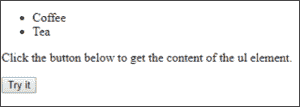
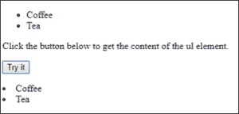

# 关于 JavaScript 中的内部 HTML，您需要知道的是

> 原文：<https://www.edureka.co/blog/inner-html-in-javascript>

JavaScript 是使用最广泛的编程语言之一。它还因其跨平台的通用性而广受欢迎。在 [JavaScript](https://www.edureka.co/blog/javascript-tutorial/) 中有不同的属性使你构建动态网站的工作变得更加容易。在本文中，我们将按以下顺序讨论 JavaScript 中的内部 HTML:

*   [JavaScript 简介](#javascript)
*   [JavaScript 中的内部 HTML](#html)
    *   [有序或无序列表](#order)
    *   [更改网址](#url)

## **JavaScript 简介**

JavaScript 既可用作客户端编程语言，也可用作服务器端编程语言。[节点](https://www.edureka.co/blog/learn-node-js/)用于在任何应用的客户端和服务器端执行 [JavaScript](https://www.edureka.co/blog/what-is-javascript/) 。一个节点也可以在几个地方被称为 Node.js。


JavaScript 提供了大量的方法来轻松实现一些功能。这是 JavaScript 成为最流行的编程语言之一的原因，也是它被广泛用于多种产品开发的原因。

## **JavaScript 中的内部 HTML**

JavaScript 中的内部 [HTML](https://www.edureka.co/blog/what-is-html/) 属性是非常方便的特性之一，被广泛用于为正在创建的网页提供更加动态和灵活的方面。

如果我们试图简单地解释 innerHTML，那么 innerHTML 所做的工作只是加载页面内容，而不是刷新整个页面。这节省了数据使用和页面加载的时间，并且非常容易获得。这给了用户非常快速和响应的感觉，从而使用户体验更好。

这听起来可能有点困难，但让我们借助一个例子来理解这一点。

**举例:**

```
<!DOCTYPE html>
<html>
<body>
<p id="paragraph1" onclick="myFunction()">Click here to change the innerHTML text.</p>
<script>
function myFunction() {
document.getElementById("paragraph1").innerHTML = "Paragraph changed!";
}
</script>
</body>
</html>
```

在上面的代码中，段落标签中的 id 是 paragraph1。

有一个名为 myfunction()的[函数](https://www.edureka.co/blog/javascript-functions/)，当点击文本“点击此处更改 innerHTML 文本”时，该函数将被撤销。 当点击撤销该功能时，执行该功能，该功能表示 getElementById("paragraph1 ")，该功能表示将选择具有该 Id 的元素作为演示。

此外，我们还有 innerHTML 函数，它简单地表示 onclick 之后要做的事情。在上面的例子中，这里仅仅是“段落改变”。

下面是上面代码的初始输出。


下面是点击后改变的输出。


## **带有有序或无序列表的内部 HTML】**

下面的例子展示了有序列表和无序列表的使用。

**举例:**

```
<!DOCTYPE html>
<html>
<body>
<ul id="myList">
<li>Hello</li>
<li>Hello again</li>
</ul>
<p>Click the button below to get the content of the ul element.</p>
<button onclick="helloFunction()">Try it</button>
<p id="paragraph1"></p>
<script>
function helloFunction() {
var x = document.getElementById("myList").innerHTML;
document.getElementById("paragraph1").innerHTML = x;
}
</script>
</body>
</html>
```

这里，innerHTML 由名为“Try it”的按钮触发。

上述文本的初始输出为:



点击按钮后输出。点击按钮不会导致页面的重新加载，而是由于使用了 innerHTML。

****

## **用于更改 URL 的 InnerHTML】**

下面是另一个例子，展示了如何使用 innerHTML 来改变点击按钮时的 URL。

**举例:**

```
<!DOCTYPE html>
<html>
<body>
<a id="myAnchor" href="http://www.wikipedia.com">Wikipedia</a>
<button onclick="myFunction()">Change link</button>
<script>
function myFunction() {
document.getElementById("myAnchor").innerHTML = "Google";
document.getElementById("myAnchor").href = "https://www.google.com";
document.getElementById("myAnchor").target = "_blank";
}
</script>
</body>
</html>

```

上面的例子最初给出了维基百科网站的链接，但是当点击按钮时，链接变成了谷歌。

有几个这样的操作，当页面不需要重新加载，只需要更新一部分时，innerHTML 就派上了用场。 这种方法既节省时间，又省力。innerHTML 最大的优势是用户体验，这个特性增强了用户体验。

*查看 Edureka 的 **[Web 开发认证培训](https://www.edureka.co/complete-web-developer)** 。* *Web 开发认证培训将帮助您学习如何使用 HTML5、CSS3、Twitter Bootstrap 3、jQuery 和 Google APIs 创建令人印象深刻的网站，并将其部署到亚马逊简单存储服务(S3)。*

*有问题吗？请在“JavaScript 中的字符串连接”的评论部分提到它，我们会回复您。*