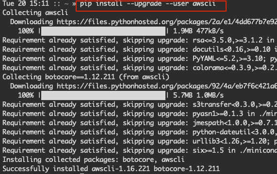
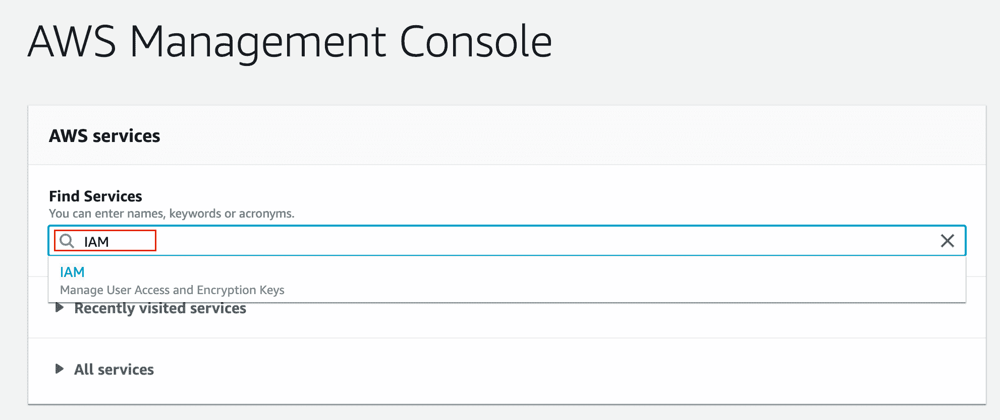
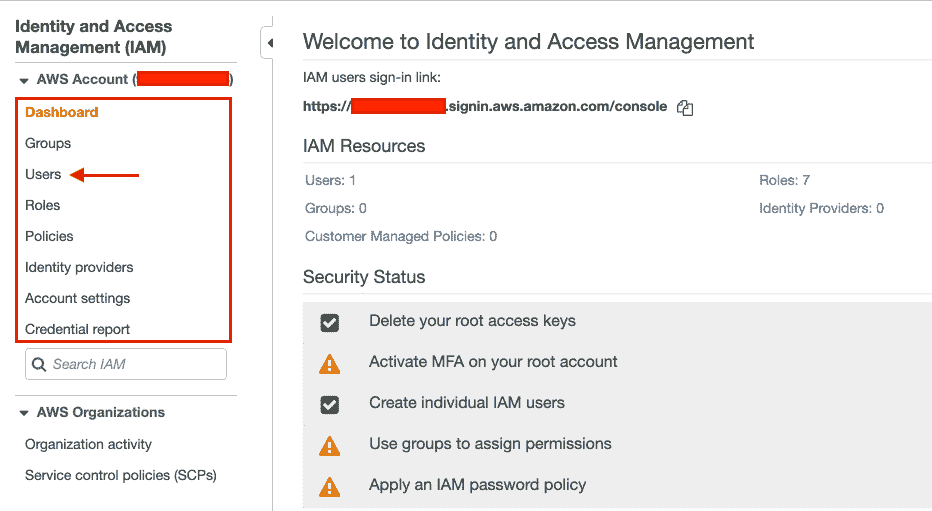
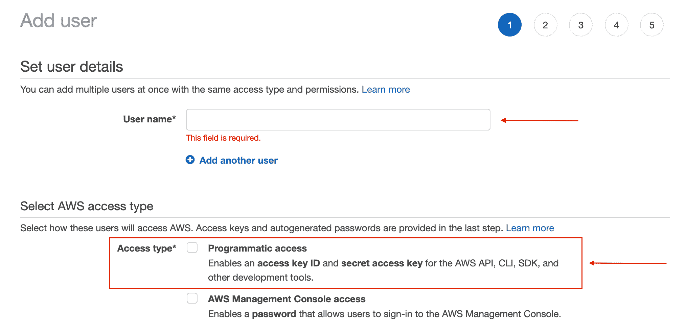
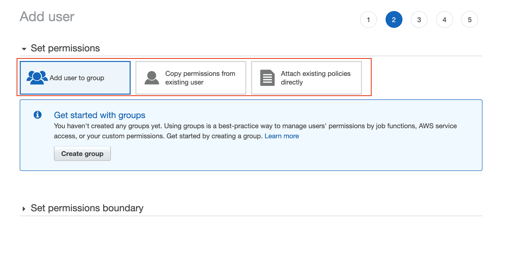
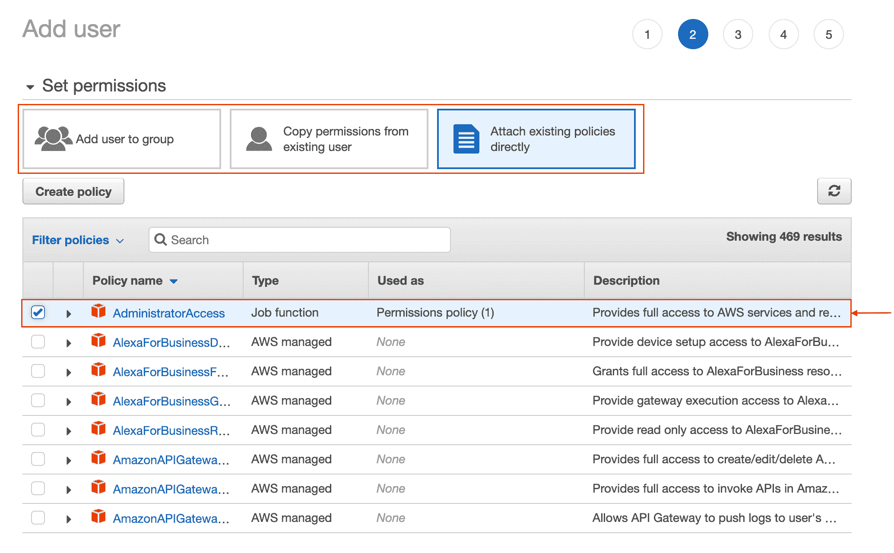
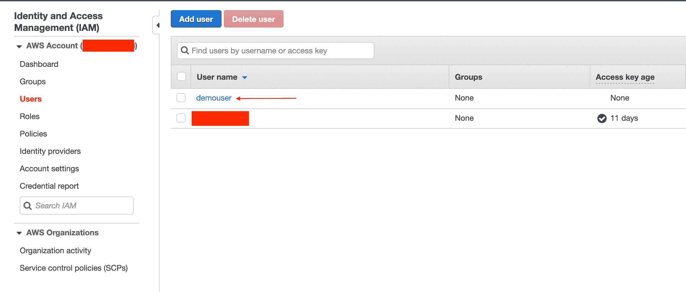
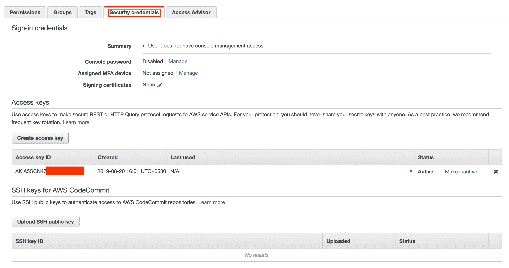

# 什么是 AWS CLI，如何使用？

> 原文：<https://www.edureka.co/blog/how-to-use-aws-cli/>

根据 Gartner 的分析，AWS 是领先的云提供商之一，占 2018 年 IaaS 公共[云服务](https://www.edureka.co/blog/cloud-computing-services-types/)市场份额的 47.8%。 [AWS 命令行界面(CLI)](https://www.edureka.co/blog/aws-cli/) 是管理 AWS 服务的统一工具。多个 AWS 服务的管理可以通过 CLI 完成，并提供了通过脚本实现自动化的机会。在本文中，让我们看看如何使用 AWS CLI。

本文涉及的主题有:

*   [使用 AWS CLI 的先决条件](#prerequisites)
    *   [新用户创建](#user-creation)
    *   [用户权限](#user-permission)
    *   [用户创建响应](#output)
*   [如何使用 AWS CLI？](#aws-cli)
    *   [AWS CLI–配置](#configuration)
    *   [AWS CLI 测试运行](#output-cli)
*   [结论](#conclusion)

## **使用 AWS CLI 的先决条件**

本博客中的实践活动要求在系统上安装以下先决条件。

1.  **创建 AWS 帐户:**为了配置 AWS CLI，如果您没有 AWS 帐户，则需要创建一个。请在此注册 [AWS 账户](https://portal.aws.amazon.com/billing/signup#/start)。新的 AWS 帐户包括 12 个月的免费层访问。
2.  **安装 AWS CLI:** AWS CLI 适用于 Windows、MAC 和 Linus 发行的 OS。
    *   Windows 安装程序: [64 位](https://s3.amazonaws.com/aws-cli/AWSCLI64PY3.msi)和 [32 位](https://s3.amazonaws.com/aws-cli/AWSCLI32PY3.msi)。
    *   MAC 和 Linux:请遵循以下步骤
        1.  安装 [Python](https://www.edureka.co/blog/python-tutorial/) 2.6.5 或更高版本
        2.  应该安装 pip*(Python 的包安装程序)。* [安装步骤如下。](https://pip.pypa.io/en/latest/installing/)
        3.  从终端/命令提示符`'pip install awscli'` 运行以下命令

### **新用户创建**

**第一步:**登录 [AWS 管理控制台](https://www.edureka.co/blog/aws-console/)进入。在这种情况下，使用现有的 AWS 帐户或新创建的帐户作为先决条件步骤的一部分。

**第二步:**登录后，我们将登陆 *AWS 管理控制台仪表盘。*

**步骤 3:** 在“查找服务”下，我们将在文本框中输入“ [IAM](https://www.edureka.co/blog/introduction-to-identity-and-access-managementiam/) ”。

**步骤 4:** 现在我们进入了 AWS 的 IAM *(身份和访问管理控制台)*。IAM 控制台是提供以下功能的中枢**。**

组创建和管理。 **第五步:**随后，我们要点击左侧菜单栏中的【T4 用户】选择。

### **用户权限**

**步骤 1:** 首先，我们将在 AWS IAM 仪表板中点击*添加用户*。

**步骤 2:** 在这种情况下，用户只需要访问 API，AWS CLI。用户不需要访问 [AWS 管理控制台](https://www.edureka.co/blog/aws-console/#WhatIsAWSConsole?)。因此，我们将选择*编程访问*选项。

**第三步:**接下来，我们将提供用户名并选择访问类型为*程序化访问*。

**步骤 4:** 选择访问类型后，点击下一步。

接下来，需要为新用户分配权限。以下选项可用

*   将用户添加到现有组
*   来自现有用户的复制权限
*   将现有策略直接附加到用户

**步骤 6:** 对于现有任务，我们将直接附加现有策略，在此我们将选择“管理员访问”策略。 IAM 政策本身就是一个完整的话题。因此，我们不打算在这里讨论这个，但将是另一个博客的主题。简言之，什么是 IAM 政策

*   IAM 策略定义权限。
*   因此，当策略与 AWS 资源相关联时，AWS 资源将继承策略中定义的权限。
*   简而言之，策略是提供权限的模板。

**Step7:** 添加现有策略后，标签可以与资源关联。

*   简而言之， ***标签*** 是分配给资源的标签。
*   每个标签由一个键和一个可选值组成。
*   使用标记，可以对 AWS 资源进行分类。

**第八步:**点击“下一步”，我们将进入审核屏幕。这是我们所做选择的摘要屏幕。

**步骤 9:** 完成所有步骤后，我们将单击“create”。因此，将创建一个用户名为“demouser”的新用户。

### **用户创建响应**

1.  在用户创建成功屏幕上，提供了两条重要信息。
    *   访问密钥 ID
    *   秘密访问密钥
2.  我们将安全地存储这些信息，不会共享这些信息。
3.  或者， *CSV 文件*下载文件选项可用，CSV 文件包含详细信息。
4.  安全地存储密钥或下载的“CSV”文件，因为我们将无法再次检索秘密访问密钥。
5.  单击“关闭”,您将到达用户控制面板。新创建的用户现在可用。

你可以通过 [AWS 课程](https://www.edureka.co/aws-certification-training)了解更多。

## **如何使用 AWS CLI？**

### **AWS CLI–配置**

**步骤 1:** 点击演示用户，将显示与使用对应的相关详细信息。

*   许可
*   组
*   标签
*   安全凭证
*   访问顾问

**Step2:** 对于这个博客，我们要使用一个安全凭证对象，点击*安全凭证*选项卡。 

**步骤 3:** 这里我们看到访问密钥 ID，它是最近创建的，状态标记为*“活动”*

**步骤 4:** 在这种情况下，访问密钥状态为管理员提供了一个重要的安全特性。

步骤 5: 现在我们有了用户，因此允许我们以编程方式访问 AWS 资源。

### 配置终端/命令提示符

### **AWS CLI 测试运行**

**步骤 1:** 在这种情况下，我们将以 [AWS S3(简单存储服务)](https://www.edureka.co/blog/s3-aws-amazon-simple-storage-service/)为例。

简言之，AWS S3 是一个对象存储服务。

**第三步:**接下来，我们要运行`“aws s3 ls --profile mydemouser”` 

**步骤 4:** 在列出现有 bucket 的内容后，让我们尝试使用 AWS CLI `“aws s3 mb s3://mydemouserbucket --profile mydemouser”` 创建一个新的 s3 bucket

**Step5:** 作为命令执行的结果，应该创建 bucket。

**步骤 6:** 此外，让我们尝试在 CLI 配置文件的默认区域之外的区域创建一个存储桶，在我们的示例中，默认区域是*‘美国东部-1’*

**Step7:** 执行完命令后，让我们检查是否已经创建了 bucket，以及 bucket 的区域是什么。

## **结论**

不仅从 AWS 资源管理的角度来看，AWS CLI 是一个优秀的工具，而且 CLI 还提供了如何以编程方式访问 AWS 的关键见解。已经介绍了关键概念，在 IAM 中完成了用户设置，配置了 CLI 以访问 AWS 资源。 ***但是 AWS CLI 能做的远不止这些。*** 在这篇博客中，我们只是通过控制台访问它们。在下一篇博客中，焦点将是 AWS S3。敬请关注更多内容。

*如果这激起了你的兴趣，你想了解更多关于应用安全的信息，那么就来看看我们在班加罗尔的  [**AWS 培训**](https://www.edureka.co/aws-certification-training-bangalore) 吧，它附带了讲师指导的现场培训和真实的项目经验。本培训将帮助您深入了解网络安全，并帮助您掌握该主题。*

有问题要问我们吗？请在“如何使用 AWS CLI？”我们会回复你的。