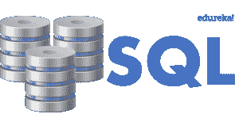

# 什么是 SQL 操作符，它们是如何工作的？

> 原文：<https://www.edureka.co/blog/sql-operators/>

在处理数据库中的数据时，我们经常倾向于执行不同种类的操作来操纵和检索数据。SQL 作为数据库管理系统的基础，提供了各种操作符来执行这些操作。在这篇关于 SQL 操作符的文章中，我将按以下顺序讨论 SQL 中使用的各种操作符:



*   [什么是运算符？](#operators)
*   [操作员类型:](#typesofoperators)

## **什么是 SQL 运算符？**

SQL 操作符是在 [SQL 语句](https://www.edureka.co/blog/sql-commands)的 WHERE 子句中使用的保留关键字，用于执行算术、逻辑和比较操作。运算符在 SQL 语句中充当合取词，以满足语句中的多个条件。

既然 SQL 中有不同类型的操作符，那么让我们在本文的下一节 SQL 操作符中理解相同的操作符。

## **SQL 运算符的类型**

### **算术运算符**

这些运算符用于执行加、乘、减等运算。

| **操作员** | **操作** | **描述** |
| + | 加法 | 加运算符两边的值 |
| – | 减法 | 用于从左侧值中减去右侧值 |
| * | 乘法运算 | 运算符每侧出现的值的倍数 |
| / | 分部 | 将左侧值除以右侧值 |
| % | 模数 | 将左侧值除以右侧值；并返回余数 |

#### **举例:**

```
SELECT 40 + 20;

SELECT 40 - 20;

SELECT 40 * 20;

SELECT 40 / 20;

SELECT 40 % 20;

```

#### **输出:**

```
60

20

800

2

0

```

嗯，这是关于 SQL 中可用的算术运算符。接下来，在这篇关于 SQL 操作符的文章中，让我们了解一下可用的比较操作符。

### **比较运算符**

这些运算符用于执行诸如等于、大于、小于等运算。

| **操作员** | **操作** | **描述** |
| = | 等于 | 用于检查两个操作数的值是否相等。如果它们相等，那么它返回 TRUE。 |
| > | 大于 | 如果左操作数的值大于右操作数，则返回 TRUE。 |
| < | 小于 | 检查左操作数的值是否小于右操作数，如果是则返回真。 |
| > = | 大于或等于 | 用于检查左操作数是否大于等于右操作数，如果条件为真，则返回真。 |
| < = | 小于或等于 | 如果左操作数小于或等于右操作数，则返回 TRUE。 |
| < >或者！= | 不等于 | 用于检查操作数的值是否相等。如果它们不相等，则返回 TRUE。 |
| ！> | 不大于 | 检查左操作数是否不大于右操作数，如果是则返回真。 |
| ！< | 不小于 | 如果左操作数不小于右操作数，则返回 TRUE。 |

#### **举例:**

为了让您更好地理解，我将考虑使用下表来执行各种操作。

| **StudentID** | **名字** | **姓氏** | **年龄** |
| 1 | Atul | 米什拉 | 23 |
| 2 | Priya | 卡普尔 | 21 |
| 3 | 罗汉 | 新加坡语 | 21 |
| 4 | 阿干沙 | Jain | 20 |
| 5 | 瓦伊巴夫 | 古普塔 | 25 |

#### **示例【使用等于】:**

```
SELECT * FROM Students
WHERE Age = 20;

```

#### **输出:**

| **StudentID** | **名字** | **姓氏** | **年龄** |
| 4 | 阿干沙 | Jain | 20 |

#### **示例【使用大于】:**

```
SELECT * FROM students
WHERE Age > 23;

```

#### **输出:**

| **StudentID** | **名字** | **姓氏** | **年龄** |
| 5 | 瓦伊巴夫 | 古普塔 | 25 |

#### **示例【使用小于或等于】:**

```
SELECT * FROM students
WHERE Age <= 21;

```

#### **输出:**

| **StudentID** | **名字** | **姓氏** | **年龄** |
| 2 | Priya | 卡普尔 | 21 |
| 3 | 罗汉 | 新加坡语 | 21 |
| 4 | 阿干沙 | Jain | 20 |

#### **示例【不等于】:**

```
SELECT * FROM students
WHERE Age > 25;

```

#### **输出:**

| **StudentID** | **名字** | **姓氏** | **年龄** |
| 1 | Atul | 米什拉 | 23 |
| 2 | Priya | 卡普尔 | 21 |
| 3 | 罗汉 | 新加坡语 | 21 |
| 4 | 阿干沙 | Jain | 20 |

嗯，这是比较运算符的几个例子。在这篇关于 SQL 操作符的文章中，让我们理解各种可用的逻辑操作符。

### **逻辑运算符**

逻辑运算符用于执行所有、任何、非、间等运算。

| **操作员** | **描述** |
| 全部 | 用于将特定值与集合中的所有其他值进行比较 |
| 任何 | 将特定值与集合中的任何值进行比较。 |
| 中的 | 用于将特定值与所提到的文字值进行比较。 |
| 之间 | 搜索上述范围内的值。 |
| 和 | 允许用户在 WHERE 子句中提及多个条件。 |
| 或 | 在 WHERE 子句中组合多个条件。 |
| 不是 | 一个求反运算符，用于反转逻辑运算符的输出。 |
| 存在 | 用于搜索表格中的行。 |
| [如同](https://www.edureka.co/blog/like-in-sql/) | 使用通配符运算符比较模式。 |
| 有的 | 类似于 ANY 运算符，用于将特定值与集合中的某些值进行比较。 |

#### **举例:**

我将考虑上面考虑的学生表，以执行一些操作。

#### **示例【任何】**

```
SELECT * FROM Students
WHERE Age > ANY (SELECT Age FROM Students WHERE Age > 21);

```

#### **输出:**

| **StudentID** | **名字** | **姓氏** | **年龄** |
| 1 | Atul | 米什拉 | 23 |
| 5 | 瓦伊巴夫 | 古普塔 | 25 |

#### **示例【在&和**之间】

```
SELECT * FROM Students
WHERE Age BETWEEN 22 AND 25;

```

#### **输出:**

| **StudentID** | **名字** | **姓氏** | **年龄** |
| 1 | Atul | 米什拉 | 23 |

#### **例【在】**

```
SELECT * FROM Students
WHERE Age IN('23', '20');

```

#### **输出:**

| **StudentID** | **名字** | **姓氏** | **年龄** |
| 1 | Atul | 米什拉 | 23 |
| 4 | 阿干沙 | Jain | 20 |

在这篇文章中，我只解释了几个例子。我会说，继续下去，在不同类型的操作符上多练习几个例子，以获得编写 SQL 查询的良好实践。

*如果您希望了解有关*[*MySQL*](https://www.edureka.co/blog/what-is-mysql/)*的更多信息，并了解这款开源关系数据库，请查看我们的*[*MySQL DBA 认证培训*](https://www.edureka.co/mysql-dba) *，它附带有讲师指导的现场培训和真实项目体验。本培训将帮助您深入了解 MySQL，并帮助您掌握这门学科。*

*有问题吗？请在本文“SQL 操作符”的评论部分提到它，我会尽快回复您。*