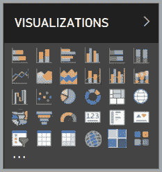
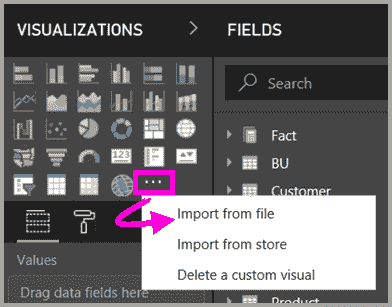
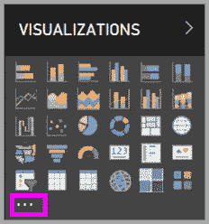
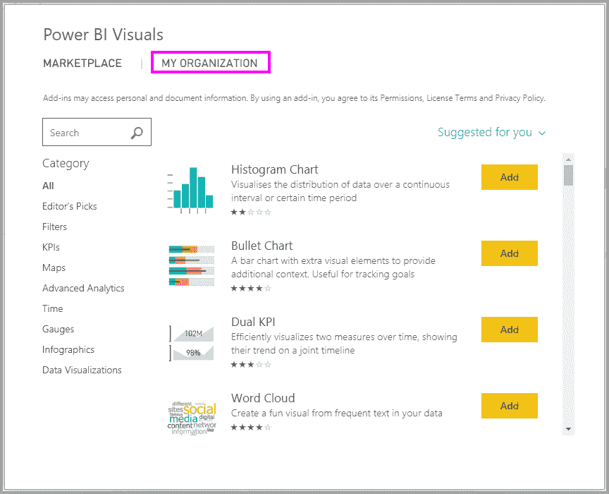
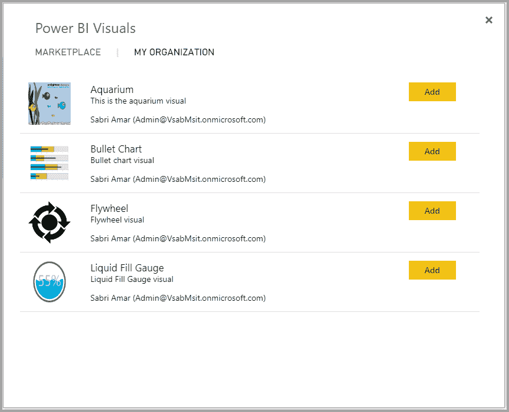

# 关于 Power BI 视觉系统，您需要了解的所有信息

> 原文：<https://www.edureka.co/blog/power-bi-visuals/>

创建或编辑报告时，您可以使用许多不同类型的 Power BI 视觉效果。前一篇文章关注这些视觉效果，帮助您在 [Power BI](https://www.edureka.co/blog/power-bi-tutorial/) 上创建实时、交互式的报告和仪表盘。本文涵盖的主题:

*   [简介](#intro)
*   [自定义 BI 可视化文件](#custom)
*   [组织视觉效果](#org)
*   [市场视觉效果](#marketplace)
*   [陷阱和限制](#limitations)

## **Power BI 视觉系统简介**

当您下载 Power BI 软件时，这些视觉效果作为一个包预安装，这些视觉效果的图标出现在如下所示的**可视化**窗格中。

但是这些视觉效果并不局限于你。选择窗格底部的*省略号(…)* 选项，可启用另一个视觉来源—*Power BI 视觉*。

Power BI 开发人员使用 Power BI SDK 创建这些视觉效果。这些可视化使业务用户能够从他们的业务感知中看到他们的数据。然后可以导入带有自定义可视文件的报告，然后可以对其进行过滤、突出显示、编辑、共享等操作。

Power BI 中的视觉效果通过以下方式部署:

1.  自定义可视文件
2.  组织视觉效果
3.  市场视觉

## **自定义 BI 可视化文件**

基本上，Power BI visuals 是包含用于呈现提供给它们的数据的代码的包。任何人都可以构建一个 Power BI 定制可视化，并将其打包为 *`.pbiviza` 文件*。然后，可以将其导入到电源 BI 报告中。

**如何从文件导入自定义视觉效果**

1.  从  *可视化* *窗格*底部选择由省略号(…)表示的图标。
2.  将出现一个下拉菜单。前进并选择  *从文件导入*选项。
3.  从  *打开* *文件*菜单，选择要导入的  *`.pbiviz`文件*。选择  *打开*选项。自定义可视化图标将添加到您的*可视化* 窗格的底部，并可在您的报告中使用。

## **组织视觉效果**

Power BI 管理员和其他此类专业人员批准并在其组织中部署 Power BI 视觉效果。报告作者可以轻松地发现、更新和使用这些可视化效果，管理员也可以轻松地对其进行管理。

### 如何导入组织视觉效果

1.  从窗格底部选择*省略号(…)* 选项。您将看到一个下拉菜单。
2.  选择选项， *从市场*导入。
3.  选择选项， *我的组织* 出现在选项卡的顶部。
4.  向下滚动并浏览列表，找到要导入的视觉效果。
5.  选择  *添加* 选项。

## **市场视觉效果**

社区成员和微软都在  AppSource 市场上为公众利益贡献了他们的 Power BI 视觉效果。在这个市场中，您可以找到适用于您的 Microsoft 软件的应用程序、加载项和扩展，并将其添加到您的 Power BI 报告中。这些视觉效果已经过测试，并在效率和质量方面获得认可。

## **从 Microsoft AppSource 下载或导入 Power BI 视觉效果**

您有两种选择来下载和导入 Power BI 视觉效果:从 Power BI 内部和从  AppSource 网站。

### 如何从 Power BI 中导入 Power BI 视觉效果

1.  从  **中选择省略号** 窗格。
2.  从下拉菜单中选择  **从市场导入**。
3.  滚动列表以查找要导入的视觉效果。在详细页面，您可以查看截图、视频、详细描述。
4.  选择  *选项添加* 导入自定义视觉。现在可用于您的报告。

### 如何从 Microsoft AppSource 下载和导入 Power BI 视觉效果

1.  你从  *微软 AppSource* 开始，选择  *Apps* 的选项。
2.  转到结果页面。  在这里你可以查看各个类别的热门应用。所以，选择左边上的导航条选择你选择的动力 BI 视觉效果**。**
3.  app source 为每个自定义视觉显示一个图块。每个图块都有一个自定义的可视快照，带有简短描述和下载链接。
4.  选择选项 *立即获取* 下载定制视频并检查选项是否同意*使用条款*。
5.  继续并选择链接以下载自定义视觉效果。下载页面还包括如何将自定义视觉效果导入 Power BI Desktop 和 Power BI 服务的说明。

6.  保存  *`.pbiviz`文件*然后打开电源 BI。

7.  将  *`.pbiviz`文件*导入到您的电力 BI 报告中。

你可以参考这段由我们的专家策划的视频，以获得更深入的解释。

[https://www.youtube.com/embed/W0mG3KFR3Hw](https://www.youtube.com/embed/W0mG3KFR3Hw)

## **陷阱和限制**

导入时，自定义视觉效果会添加到特定报告中。如果您希望在另一个报告中使用 viz，您也需要将它导入其中。使用  *另存为* 选项保存具有自定义可视化的报表时。自定义视觉效果的副本将与新报表一起保存。

如果您的报表中没有看到  可视化 P ane，说明您没有报表编辑权限。您只能将 BI 视觉效果添加到您可以编辑的报告中，而不能添加到仅与您共享的报告中。

## 

就这样，我们到了这篇文章的结尾。我希望你对 Power BI 的视觉效果有所了解。

*如果您希望学习 Power BI，并在数据可视化或 BI 领域建立职业生涯，请查看我们的 [**Power BI 认证培训**](https://www.edureka.co/power-bi-certification-training) ，该培训包含讲师指导的现场培训和真实项目经验。本培训将帮助您深入了解 Power BI，并帮助您掌握该主题。*

*有问题吗？请在评论区提到它，我们会给你回复。*