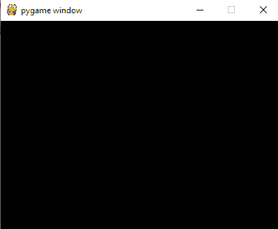
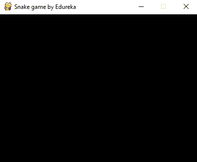
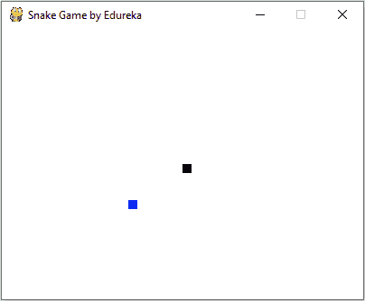
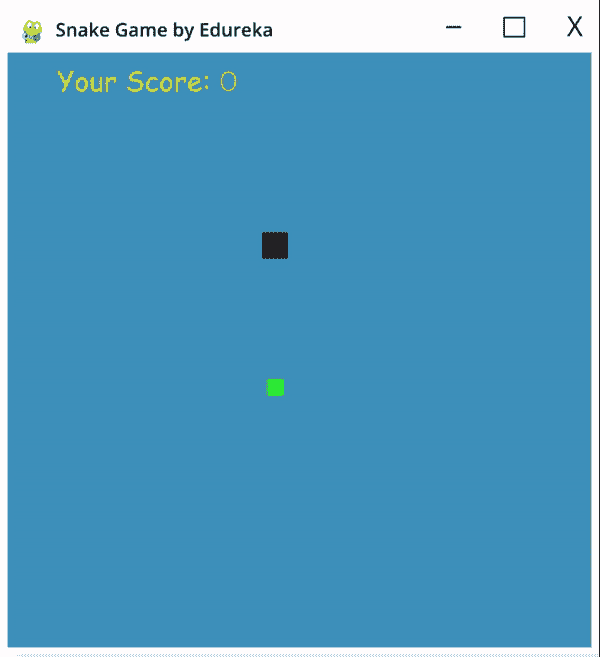
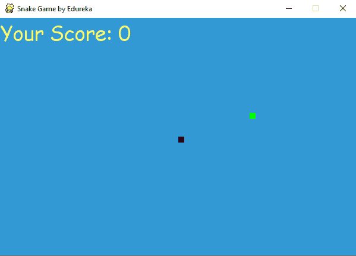

# 如何用 Python 实现贪吃蛇游戏？

> 原文：<https://www.edureka.co/blog/snake-game-with-pygame/>

是的，我知道你们都玩过贪吃蛇游戏，而且肯定，你们从来不想输。作为孩子，我们都喜欢寻找作弊手段，以便永远不会看到“游戏结束”的信息，但作为技术人员，我知道你会想让这条“蛇”随着你的节拍起舞。这就是我将在这篇关于 Python 中的贪吃蛇游戏的文章中向大家展示的内容。

想要提升自己的技能，在职业生涯中获得成功吗？查看 *或加入我们的* **[数据科学与 Python 课程](https://www.edureka.co/data-science-python-certification-course)。** 在继续之前，让我们快速浏览一下用 Python 构建贪吃蛇游戏的所有子部分:

1.  [安装 Pygame](#install)
2.  [创建屏幕](#screen)
3.  [创造蛇](#createthesnake)
4.  [移动蛇](#move)
5.  当蛇到达边界时游戏结束
6.  [添加食物](#food)
7.  [增加蛇的长度](#increaselength)
8.  [显示分数](#score)

## **安装 Pygame:**

为了使用 Pygame 创建游戏，你需要做的第一件事就是在你的系统上安装它。为此，您只需使用以下命令:

*pip 安装 pygame*

一旦完成，只需导入 Pygame 并开始游戏开发。在继续之前，看一下这个贪吃蛇游戏中使用的 Pygame 函数及其描述。

| 功能 | 描述 |
| 初始化() | 初始化所有导入的 Pygame 模块(返回一个指示初始化成功和失败的元组) |
| 显示.设置模式() | 将元组或列表作为其参数来创建表面(元组优先) |
| 更新() | 更新屏幕 |
| 退出() | 用于取消初始化所有内容 |
| set_caption() | 将字幕文本设置在显示屏的顶部 |
| event.get() | 返回所有事件的列表 |
| Surface.fill() | 将用纯色填充表面 |
| 时间。时钟() | 帮助跟踪时间时间 |
| 字体。系统字体() | 将从系统字体资源中创建一个 Pygame 字体 |

## **创建屏幕:**

要使用 Pygame 创建屏幕，您需要使用 *display.set_mode()* [函数](https://www.edureka.co/blog/python-functions)。此外，您必须使用 *init()* 和 *quit()* 方法来初始化和取消初始化代码开头和结尾的所有内容。 *update()* 方法用于更新对屏幕所做的任何更改。还有另一种方法，即 *flip()* ，其工作方式与 update()函数类似。区别在于 update()方法只更新所做的更改(但是，如果没有传递参数，则更新整个屏幕)，而 flip()方法再次重做整个屏幕。

**代码:**

```
import pygame
pygame.init()
dis=pygame.display.set_mode((400,300))
pygame.display.update()
pygame.quit()
quit()
```

**输出:**



但是当您运行这段代码时，屏幕会出现，但也会立即关闭。要解决这个问题，你应该在我退出游戏之前使用游戏循环 [while 循环](https://www.edureka.co/blog/while-loop-in-python/)，如下所示:

```
import pygame
pygame.init()
dis=pygame.display.set_mode((400,300))
pygame.display.update()
pygame.display.set_caption('Snake game by Edureka')
game_over=False
while not game_over:
    for event in pygame.event.get():
        print(event)   #prints out all the actions that take place on the screen

pygame.quit()
quit()
```

当您运行这段代码时，您会看到您之前看到的屏幕没有退出，而且它返回了在其上发生的所有操作。我已经使用 *event.get()* 函数实现了这一点。另外，我使用 *display.set_caption()* 函数将屏幕命名为“Edureka 的蛇游戏”。

**输出:**



现在，您有了一个玩贪吃蛇游戏的屏幕，但是当您尝试单击关闭按钮时，屏幕并没有关闭。这是因为您没有指定当您点击关闭按钮时，您的屏幕应该退出。为此，Pygame 提供了一个名为“QUIT”的事件，其用法如下:

```
import pygame
pygame.init()
dis=pygame.display.set_mode((400,300))
pygame.display.update()
pygame.display.set_caption('Snake game by Edureka')
game_over=False
while not game_over:
    for event in pygame.event.get():
        if event.type==pygame.QUIT:
            game_over=True

pygame.quit()
quit()
```

现在你的屏幕已经设置好了。下一步是在屏幕上绘制我们的蛇，这将在下面的主题中介绍。

## **创建蛇:**

为了创建蛇，我将首先初始化一些颜色变量，以便给蛇、食物、屏幕等着色。Pygame 中使用的配色方案是 RGB，即“红绿蓝”。如果您将所有这些都设置为 0，颜色将为黑色，所有 255 将为白色。所以我们的蛇实际上是一个长方形。要在 Pygame 中绘制矩形，您可以使用一个名为 *draw.rect()* 的函数，它将帮助您用所需的颜色和大小绘制矩形。

```
import pygame
pygame.init()
dis=pygame.display.set_mode((400,300))

pygame.display.set_caption('Snake game by Edureka')

blue=(0,0,255)
red=(255,0,0)

game_over=False
while not game_over:
    for event in pygame.event.get():
        if event.type==pygame.QUIT:
            game_over=True
    pygame.draw.rect(dis,blue,[200,150,10,10])
    pygame.display.update()
pygame.quit()
quit()
```

**输出:**


正如你所看到的，蛇头被创建为一个蓝色的矩形。下一步是让你的蛇动起来。

**移动蛇:**

要移动这条蛇，您需要使用 Pygame 的 KEYDOWN 类中的按键事件。这里使用的事件是，K_UP，K_DOWN，K_LEFT 和 K_RIGHT，分别使蛇向上、向下、向左和向右移动。此外，使用 *fill()* 方法将显示屏从默认的黑色变为白色。

我已经创建了新的变量 *x1_change* 和 *y1_change* 来保存 x 和 y 坐标的更新值。

```
import pygame

pygame.init()

white = (255, 255, 255)
black = (0, 0, 0)
red = (255, 0, 0)

dis = pygame.display.set_mode((800, 600))
pygame.display.set_caption('Snake Game by Edureka')

game_over = False

x1 = 300
y1 = 300

x1_change = 0        
y1_change = 0

clock = pygame.time.Clock()

while not game_over:
    for event in pygame.event.get():
        if event.type == pygame.QUIT:
            game_over = True
        if event.type == pygame.KEYDOWN:
            if event.key == pygame.K_LEFT:
                x1_change = -10
                y1_change = 0
            elif event.key == pygame.K_RIGHT:
                x1_change = 10
                y1_change = 0
            elif event.key == pygame.K_UP:
                y1_change = -10
                x1_change = 0
            elif event.key == pygame.K_DOWN:
                y1_change = 10
                x1_change = 0

    x1 += x1_change
    y1 += y1_change
    dis.fill(white)
    pygame.draw.rect(dis, black, [x1, y1, 10, 10])

    pygame.display.update()

    clock.tick(30)

pygame.quit()
quit()
```

**输出:**

## ****

## **当蛇到达边界时游戏结束:**

在这个贪吃蛇游戏中，如果玩家碰到了屏幕的边界，那么他就输了。为了说明这一点，我使用了一个‘if’语句来定义蛇的 x 和 y 坐标小于或等于屏幕坐标。此外，不要在这里说我已经删除了硬代码，而是使用了变量，这样如果你以后想对游戏做任何更改，就变得很容易了。

```
import pygame
import time
pygame.init()

white = (255, 255, 255)
black = (0, 0, 0)
red = (255, 0, 0)

dis_width = 800
dis_height  = 600
dis = pygame.display.set_mode((dis_width, dis_width))
pygame.display.set_caption('Snake Game by Edureka')

game_over = False

x1 = dis_width/2
y1 = dis_height/2

snake_block=10

x1_change = 0
y1_change = 0

clock = pygame.time.Clock()
snake_speed=30

font_style = pygame.font.SysFont(None, 50)

def message(msg,color):
    mesg = font_style.render(msg, True, color)
    dis.blit(mesg, [dis_width/2, dis_height/2])

while not game_over:
    for event in pygame.event.get():
        if event.type == pygame.QUIT:
            game_over = True
        if event.type == pygame.KEYDOWN:
            if event.key == pygame.K_LEFT:
                x1_change = -snake_block
                y1_change = 0
            elif event.key == pygame.K_RIGHT:
                x1_change = snake_block
                y1_change = 0
            elif event.key == pygame.K_UP:
                y1_change = -snake_block
                x1_change = 0
            elif event.key == pygame.K_DOWN:
                y1_change = snake_block
                x1_change = 0

    if x1 >= dis_width or x1 < 0 or y1 >= dis_height or y1 < 0:
        game_over = True

    x1 += x1_change
    y1 += y1_change
    dis.fill(white)
    pygame.draw.rect(dis, black, [x1, y1, snake_block, snake_block])

    pygame.display.update()

    clock.tick(snake_speed)

message("You lost",red)
pygame.display.update()
time.sleep(2)

pygame.quit()
quit()
```

**输出:**

## **添加食物:**

在这里，我将为蛇添加一些食物，当蛇越过这些食物时，我会收到一条消息说“好吃！!"。此外，我将做一个小的改变，其中我将包括退出游戏或当玩家输了再玩的选项。

```
import pygame
import time
import random

pygame.init()

white = (255, 255, 255)
black = (0, 0, 0)
red = (255, 0, 0)
blue = (0, 0, 255)

dis_width = 800
dis_height = 600

dis = pygame.display.set_mode((dis_width, dis_height))
pygame.display.set_caption('Snake Game by Edureka')

clock = pygame.time.Clock()

snake_block = 10
snake_speed = 30

font_style = pygame.font.SysFont(None, 30)

def message(msg, color):
    mesg = font_style.render(msg, True, color)
    dis.blit(mesg, [dis_width/3, dis_height/3])

def gameLoop():  # creating a function
    game_over = False
    game_close = False

    x1 = dis_width / 2
    y1 = dis_height / 2

    x1_change = 0
    y1_change = 0

    foodx = round(random.randrange(0, dis_width - snake_block) / 10.0) * 10.0
    foody = round(random.randrange(0, dis_width - snake_block) / 10.0) * 10.0

    while not game_over:

        while game_close == True:
            dis.fill(white)
            message("You Lost! Press Q-Quit or C-Play Again", red)
            pygame.display.update()

            for event in pygame.event.get():
                if event.type == pygame.KEYDOWN:
                    if event.key == pygame.K_q:
                        game_over = True
                        game_close = False
                    if event.key == pygame.K_c:
                        gameLoop()

        for event in pygame.event.get():
            if event.type == pygame.QUIT:
                game_over = True
            if event.type == pygame.KEYDOWN:
                if event.key == pygame.K_LEFT:
                    x1_change = -snake_block
                    y1_change = 0
                elif event.key == pygame.K_RIGHT:
                    x1_change = snake_block
                    y1_change = 0
                elif event.key == pygame.K_UP:
                    y1_change = -snake_block
                    x1_change = 0
                elif event.key == pygame.K_DOWN:
                    y1_change = snake_block
                    x1_change = 0

        if x1 >= dis_width or x1 < 0 or y1 >= dis_height or y1 < 0:
            game_close = True

        x1 += x1_change
        y1 += y1_change
        dis.fill(white)
        pygame.draw.rect(dis, blue, [foodx, foody, snake_block, snake_block])
        pygame.draw.rect(dis, black, [x1, y1, snake_block, snake_block])
        pygame.display.update()

        if x1 == foodx and y1 == foody:
            print("Yummy!!")
        clock.tick(snake_speed)

    pygame.quit()
    quit()

gameLoop()
```

**输出:**

## ****

**终端:**

## **增加蛇的长度:**

下面的代码将增加我们的清酒的大小，当它吃的食物。同样，如果蛇撞上了自己的身体，游戏就结束了，你会看到一条信息“你输了！再次按下 Q-Quit 或 C-Play。snake 的长度基本上包含在一个列表中，在下面的代码中指定的初始大小是一个块。

```
import pygame
import time
import random

pygame.init()

white = (255, 255, 255)
yellow = (255, 255, 102)
black = (0, 0, 0)
red = (213, 50, 80)
green = (0, 255, 0)
blue = (50, 153, 213)

dis_width = 600
dis_height = 400

dis = pygame.display.set_mode((dis_width, dis_height))
pygame.display.set_caption('Snake Game by Edureka')

clock = pygame.time.Clock()

snake_block = 10
snake_speed = 15

font_style = pygame.font.SysFont("bahnschrift", 25)
score_font = pygame.font.SysFont("comicsansms", 35)

def our_snake(snake_block, snake_list):
    for x in snake_list:
        pygame.draw.rect(dis, black, [x[0], x[1], snake_block, snake_block])

def message(msg, color):
    mesg = font_style.render(msg, True, color)
    dis.blit(mesg, [dis_width / 6, dis_height / 3])

def gameLoop():
    game_over = False
    game_close = False

    x1 = dis_width / 2
    y1 = dis_height / 2

    x1_change = 0
    y1_change = 0

    snake_List = []
    Length_of_snake = 1

    foodx = round(random.randrange(0, dis_width - snake_block) / 10.0) * 10.0
    foody = round(random.randrange(0, dis_height - snake_block) / 10.0) * 10.0

    while not game_over:

        while game_close == True:
            dis.fill(blue)
            message("You Lost! Press C-Play Again or Q-Quit", red)

            pygame.display.update()

            for event in pygame.event.get():
                if event.type == pygame.KEYDOWN:
                    if event.key == pygame.K_q:
                        game_over = True
                        game_close = False
                    if event.key == pygame.K_c:
                        gameLoop()

        for event in pygame.event.get():
            if event.type == pygame.QUIT:
                game_over = True
            if event.type == pygame.KEYDOWN:
                if event.key == pygame.K_LEFT:
                    x1_change = -snake_block
                    y1_change = 0
                elif event.key == pygame.K_RIGHT:
                    x1_change = snake_block
                    y1_change = 0
                elif event.key == pygame.K_UP:
                    y1_change = -snake_block
                    x1_change = 0
                elif event.key == pygame.K_DOWN:
                    y1_change = snake_block
                    x1_change = 0

        if x1 >= dis_width or x1 < 0 or y1 >= dis_height or y1 < 0:
            game_close = True
        x1 += x1_change
        y1 += y1_change
        dis.fill(blue)
        pygame.draw.rect(dis, green, [foodx, foody, snake_block, snake_block])
        snake_Head = []
        snake_Head.append(x1)
        snake_Head.append(y1)
        snake_List.append(snake_Head)
        if len(snake_List) > Length_of_snake:
            del snake_List[0]

        for x in snake_List[:-1]:
            if x == snake_Head:
                game_close = True

        our_snake(snake_block, snake_List)

        pygame.display.update()

        if x1 == foodx and y1 == foody:
            foodx = round(random.randrange(0, dis_width - snake_block) / 10.0) * 10.0
            foody = round(random.randrange(0, dis_height - snake_block) / 10.0) * 10.0
            Length_of_snake += 1

        clock.tick(snake_speed)

    pygame.quit()
    quit()

gameLoop()
```

**输出:**

## **显示比分:**

最后，但肯定不是最不重要的，你需要显示球员的分数。为此，我创建了一个新函数“Your_score”。这个函数将显示蛇的长度减去 1，因为这是蛇的初始大小。

```
import pygame
import time
import random

pygame.init()

white = (255, 255, 255)
yellow = (255, 255, 102)
black = (0, 0, 0)
red = (213, 50, 80)
green = (0, 255, 0)
blue = (50, 153, 213)

dis_width = 600
dis_height = 400

dis = pygame.display.set_mode((dis_width, dis_height))
pygame.display.set_caption('Snake Game by Edureka')

clock = pygame.time.Clock()

snake_block = 10
snake_speed = 15

font_style = pygame.font.SysFont("bahnschrift", 25)
score_font = pygame.font.SysFont("comicsansms", 35)

def Your_score(score):
    value = score_font.render("Your Score: " + str(score), True, yellow)
    dis.blit(value, [0, 0])

def our_snake(snake_block, snake_list):
    for x in snake_list:
        pygame.draw.rect(dis, black, [x[0], x[1], snake_block, snake_block])

def message(msg, color):
    mesg = font_style.render(msg, True, color)
    dis.blit(mesg, [dis_width / 6, dis_height / 3])

def gameLoop():
    game_over = False
    game_close = False

    x1 = dis_width / 2
    y1 = dis_height / 2

    x1_change = 0
    y1_change = 0

    snake_List = []
    Length_of_snake = 1

    foodx = round(random.randrange(0, dis_width - snake_block) / 10.0) * 10.0
    foody = round(random.randrange(0, dis_height - snake_block) / 10.0) * 10.0

    while not game_over:

        while game_close == True:
            dis.fill(blue)
            message("You Lost! Press C-Play Again or Q-Quit", red)
            Your_score(Length_of_snake - 1)
            pygame.display.update()

            for event in pygame.event.get():
                if event.type == pygame.KEYDOWN:
                    if event.key == pygame.K_q:
                        game_over = True
                        game_close = False
                    if event.key == pygame.K_c:
                        gameLoop()

        for event in pygame.event.get():
            if event.type == pygame.QUIT:
                game_over = True
            if event.type == pygame.KEYDOWN:
                if event.key == pygame.K_LEFT:
                    x1_change = -snake_block
                    y1_change = 0
                elif event.key == pygame.K_RIGHT:
                    x1_change = snake_block
                    y1_change = 0
                elif event.key == pygame.K_UP:
                    y1_change = -snake_block
                    x1_change = 0
                elif event.key == pygame.K_DOWN:
                    y1_change = snake_block
                    x1_change = 0

        if x1 >= dis_width or x1 < 0 or y1 >= dis_height or y1 < 0:
            game_close = True
        x1 += x1_change
        y1 += y1_change
        dis.fill(blue)
        pygame.draw.rect(dis, green, [foodx, foody, snake_block, snake_block])
        snake_Head = []
        snake_Head.append(x1)
        snake_Head.append(y1)
        snake_List.append(snake_Head)
        if len(snake_List) > Length_of_snake:
            del snake_List[0]

        for x in snake_List[:-1]:
            if x == snake_Head:
                game_close = True

        our_snake(snake_block, snake_List)
        Your_score(Length_of_snake - 1)

        pygame.display.update()

        if x1 == foodx and y1 == foody:
            foodx = round(random.randrange(0, dis_width - snake_block) / 10.0) * 10.0
            foody = round(random.randrange(0, dis_height - snake_block) / 10.0) * 10.0
            Length_of_snake += 1

        clock.tick(snake_speed)

    pygame.quit()
    quit()

gameLoop()

```

**输出:**

至此，我们已经到了这篇关于 Python 中的贪吃蛇游戏的文章的结尾。我希望你清楚这篇文章中与你分享的所有内容。 ***确保你尽可能多的练习，恢复你的经验。*** 

*有问题吗？请在这个“Python 中的蛇游戏”博客的评论部分提到它，我们会尽快回复你。*

*要深入了解任何趋势技术及其各种应用，您可以注册参加实时 [**Python 认证培训**](https://www.edureka.co/python-programming-certification-training) ，全天候支持，终身访问。*