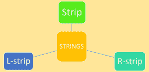
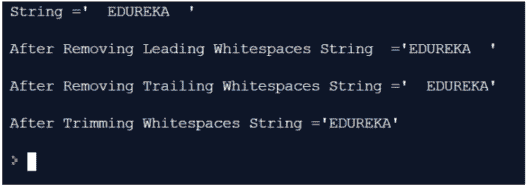
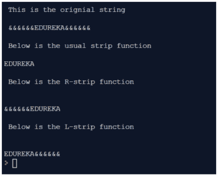
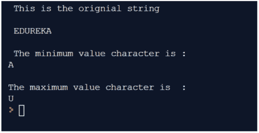
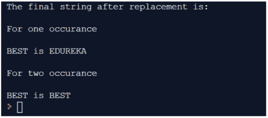

# Python 中的字符串修剪:您需要知道的全部内容

> 原文：<https://www.edureka.co/blog/string-trimming-in-python/>

修剪一根弦非常有用，它确实有多种用途。许多编码人员过度使用 trimming 函数来从原始字符串中提取对他们来说可能有价值的信息。在本文中，我们将讨论在 [Python](https://www.edureka.co/blog/python-tutorial/) 中的字符串修整:

*   [切边介绍](#intro)
*   [Python 中的字符串修剪是什么？](#what)
*   [字符串的最小值和最大值](#min-max)
*   [替换](#replace)

## **切边介绍**

python 拥有的其他功能可能与此非常相似。其中一个例子是“[字符串切片](https://www.edureka.co/blog/string-slicing-in-python/)”。在这里，我们可以将字符串分成许多部分，并对字符串应用不同的选项。我们可以删除某些部分，切掉第一部分，删除字符串的最后几个字母，并在这些位置用其他字符串替换它。



因为这是一个单独的部分，现在让我们看看通过修剪可以对字符串做些什么。

## **Python 中的字符串修剪是什么？**

如上图所示，字符串的修剪有三种方式。让我们看看它们。

*   **Strip**–删除任何尾随空格或前导空格后返回一个新字符串。

*   R-strip–输出一个新的字符串，只去掉了尾部的空格。因此命名为“rstring ”,即仅从字符串的右侧移除空格。

*   **L-Strip**–“L Strip”与 R-strip 相反。它从字符串的开头(即左侧)删除空格。

默认情况下，所有这些函数都不强制要求传递一个参数来删除任何空白。只有当某个字符需要被删除时，才会在参数中提及，并相应地从前导和尾随位置删除。

```
str = ' EDUREKA '
print(f'String ='{s1}'n')
print(f'After Removing Leading Whitespaces String ='{str.lstrip()}'n')
print(f'After Removing Trailing Whitespaces String ='{str.rstrip()}'n')
print(f'After Trimming Whitespaces String ='{str.strip()}'n')
```



现在让我们考虑从字符串中提取某个字符。

```
str = '&&&&&&EDUREKA&&&&&&'
print('n This is the orignial stringnn', str)
print('n Below is the usual strip function n')
print(str.strip('&'))
print('n Below is the R-strip functionnn')
print(str.rstrip('&'))
print('n Below is the L-strip functionnn')
print(str.lstrip('&'))
```



还有其他一些功能，围绕着 python 中类似的字符串修整主题。现在让我们看看应用于字符串的其他简单功能。

## **字符串的最小值和最大值**

这里，最小值函数或“min”是从字符串中提取字母表的最小值。即来自字母表 A-Z 的集合，A 是最低值，Z 是最高值。“max”函数的作用正好相反，它从字符串中挑选出最大值的字母。下面的例子可以更好地说明这一点。

```
str = 'EDUREKA'
print('n This is the orignial stringnn', str)
print('n The minimum value character is : n' + min(str))
print('nThe maximum value character is : n'+ max(str))
```



## **替换**

替换功能很容易理解。从单词 replace 本身，我们可以推导出字符串的某些部分可以用其他字符串元素替换的意思。例如，考虑下面的代码:

```
str = 'EDUREKA is EDUREKA'
str1= 'EDUREKA'
str2= 'BEST'
print ("The final string after replacement is:n")
print("For one occurancen")
print (str.replace( str1, str2, 1))
print("nFor two occurancen")
print (str.replace( str1, str2, 2))
```



至此，我们结束了 Python 文章中的字符串修整。我希望你有足够的想法来修剪琴弦。

*要深入了解 Python 及其各种应用，您可以 [**在此**](https://www.edureka.co/python/) 注册参加在线直播培训，全天候支持，终身访问。*

*有问题吗？在“Python 中的字符串修整”的评论部分提到它们，我们会回复您。*