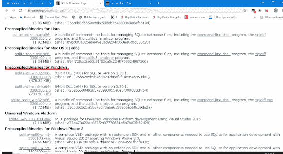
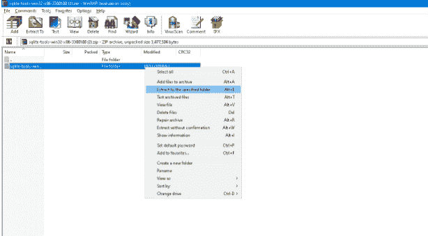
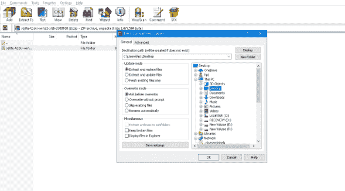
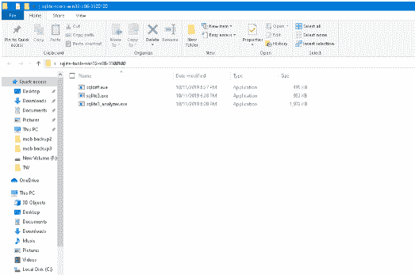

# 什么是 SQLite 浏览器，如何使用？

> 原文：<https://www.edureka.co/blog/sqlite-browser/>

DB Browser for [SQLite](https://www.edureka.co/blog/sqlite-tutorial/) 是一款高质量的开源工具，用于设计、创建和编辑与 SQLite 兼容的数据库文件。它面向希望创建数据库、搜索和编辑数据的开发人员。在这个关于“SQLite 浏览器”的博客中，我们将了解你需要知道的关于这个浏览器的一切。以下是本博客的主题:

*   [什么是 SQLite？](#whatissqlite)
*   [SQLite 的优点](#advantages)
*   [什么是 SQLite 浏览器？](#sqlitebrowser)
*   [SQLite 浏览器的用途](#uses)
*   [如何安装 SQLite 浏览器](#installsqlite)

**什么是 SQLite？**

SQLite 是一个关系数据库管理系统(RDBMS ),包含在一个 [C 库](https://www.edureka.co/blog/c-programming-tutorial/)中。与大多数其他[数据库管理系统](https://www.edureka.co/blog/what-is-a-database/#Database_Management_System_(DBMS))不同，SQLite 不是一个客户端-服务器数据库引擎，而是嵌入到终端程序中。

## **SQLite 的优势**

使用 SQLite 作为应用文件格式有很多好处:

*   更好的性能:

    *   从 [SQLite 数据库](https://www.edureka.co/blog/sqlite-tutorial/)读写比直接从磁盘读写文件要快。

    *   应用程序只加载它需要的数据，而不是读取整个文件并在内存中保存一个完整的解析。

    *   进行小规模编辑只会覆盖文件中发生变化的部分，从而减少写入时间和固态硬盘的磨损。

*   降低应用成本和复杂性:

    *   没有要编写和调试的应用程序文件 I/O 代码。

    *   可以使用简洁的 SQL 查询而不是冗长的程序性例程来访问和更新内容。

    *   在未来的版本中，可以通过添加新的表格或列来简单地扩展文件格式。

    *   使用[创建索引](https://www.edureka.co/blog/sql-constraints/#indexconstraint)有助于避免昂贵的重新设计、重写和重新测试工作，性能问题通常可以得到解决，甚至在开发周期的后期。

*   便携性

    *   应用程序文件可在所有操作系统中移植。

*   可靠性

由于这些惊人的优势，SQLite 浏览器在程序员中被广泛使用。

**什么是 SQLite 浏览器？**

DB Browser for SQLite (DB4S)是一款高质量、可视化的开源工具，用于创建、设计和编辑与 SQLite 兼容的数据库文件。 是为想要创建、搜索、设计和编辑[数据库](https://www.edureka.co/blog/what-is-a-database/)的用户和开发者准备的。 SQLite 浏览器采用通用的类似电子表格的界面，无需学习复杂的 [SQL 命令](https://www.edureka.co/blog/sql-commands)。它是开发人员和最终用户都使用的工具，因此，它必须尽可能简单。 互联网上有很多名为“DB Browser for SQLite”的 SQLite 浏览器。

## **SQLite 浏览器的使用**

这是一个让我们查看存储在 SQLite 数据库中的数据的工具。根据数据库中数据的格式和类型，它可能可读，也可能不可读。 这通常用于调试或其他开发任务，在这些任务中，开发人员需要读取已经存储的数据，但没有内置系统来通过程序访问这些数据。

**SQLite 浏览器中的一些控件和向导可供用户:**

*   创建并压缩数据库文件
*   创建、定义、修改和删除表格
*   创建、定义和删除索引
*   浏览、编辑、添加、搜索和删除记录
*   以文本形式导入和导出记录
*   从/向 CSV 文件导入和导出表格
*   发出 [SQL 查询](https://www.edureka.co/blog/insert-query-sql/)并检查结果
*   检查应用程序发出的所有 SQL 命令的日志

## **如何安装 SQLite 浏览器？**

**按照以下步骤在 windows 中安装:**

*   打开你最喜欢的浏览器，搜索 SQLite，第一个链接就会出现，是[www.sqlite.org。](http://www.sqlite.org)
*   点击下载链接。
*   在下载页面中，向下滚动一点,“预编译的 windows 二进制文件”就在那里。
*   选择最后一个选项 SQLite tools-windows32-s86，这是一个 zip 文件，下载它。

*   转到下载它的文件夹，提取 Zip 文件。

*   选择文件夹 SQLite tools to win 32(根据您的选择重命名)。

*   在该文件夹中，有 3 个可执行文件。

按照这些步骤，SQLite 浏览器将被下载并安装到您的系统上，您就可以使用它了。

*到此，我们结束了这篇关于 SQLite 浏览器的博客。我希望您已经在 SQLite 及其浏览器上消除了许多困惑。如果您希望了解更多关于 [MySQL](https://www.edureka.co/blog/what-is-mysql/) 的信息，并了解这个开源的关系数据库，那么请查看我们的 **[MySQL DBA 认证培训](https://www.edureka.co/mysql-dba)** ，该培训带有讲师指导的现场培训和真实项目体验。本培训将帮助您深入了解 MySQL，并帮助您掌握这门学科。*

有问题要问我们吗？请在本 SQLite 教程的评论部分提到它，我会回复您。