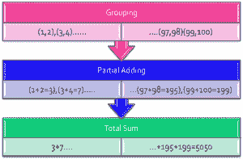
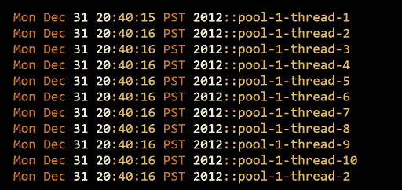

# 如何在 Java 中实现可调用接口

> 原文：<https://www.edureka.co/blog/callable-interface-in-java/>

Java 多线程程序见证了广泛使用的 [Java](https://www.edureka.co/blog/java-tutorial/) Callable 和 Future。在具备线程和多线程知识的前提下，读者将能够更好地理解本文的讨论。因为我将在本文中解释 Java 中的可调用接口。

*   [重新整理螺纹](#recap)
*   [Java 中什么是可调用接口](#what)
*   [可调用接口的返回](#return)
*   [可赎回和未来类的特征](#features)
*   [可调用类和可运行类的比较](#comparison)

## **重新整理螺纹**

但是，让我简单介绍一下线程的概念。一个线程是一个独立的执行路径，万一你需要执行一个重复性的任务，可以把工作分成多个任务，分配给线程。多线程无非就是指派多个线程并行执行不同的任务，以快速得到结果。

## **Java 中什么是可调用接口**

对于 Java 5，引入了类“java.util.concurrent”。这个可调用的接口是通过看起来与 Runnable 接口相似的并发包引入的。它还可以返回任何对象，并能够抛出异常。Java 可调用接口使用泛型，因此可以返回任何类型的对象。Executor 框架给出了一个 submit()方法来在线程池中执行可调用的实现。实际上，Java Executor 框架遵循 WorkerThread 模式。

在线程池中，用户可以使用 executors . newfixedthreadpool(10)来启动线程；方法，并相应地向其提交任务。runnable 充当线程的目标，并且强制实现公共 void run()方法来定义任务。这将由线程池中的线程执行。基于池中线程的可用性，执行器框架将工作(可运行目标)分配给线程。如果所有线程都在使用中，任务必须暂停。在线程完成一个任务之后，它作为一个可用的线程返回到池中，准备接受未来的任务。Callable 类似于 Runnable，当我们想从任务中获得结果或状态时，可以返回任何类型的对象。

## **可调用接口的返回**

Java Callable 返回 Java . util . concurrent . Java Future 提供了 cancel()方法来消除关联的可调用任务。这是 get()方法的一个重载版本，可以指定一段时间来等待结果。避免当前线程是有用的，因为当前线程可能会被阻塞较长时间。请记住 get 方法是一个同步方法，在 callable 完成它的任务并返回一个值之前，它必须等待 callable。

还有“isDone()”和“isCancelled()”方法来获取相关联的可调用任务的当前状态。考虑这样一个例子，其中需要找到从 1 到 100 的所有数字的和。我们可以依次循环 1 到 100，最后将它们相加。另一种可能是分而治之。在这种方法中，我们可以对数字进行分组，使得每组正好有两个元素。最后，我们可以将该组分配给一个线程池。因此，每个线程并行返回一个部分和，然后收集这些部分和，并将它们相加得到整个和。



## **可赎回和未来类的特征**

*   可调用类是一个 SAM 类型的接口，因此它可以在 lambda 表达式中实现。

*   这个可调用的类只有一个方法“call()”，它保存了异步执行所需的所有代码。

*   在一个可运行的接口环境中，不可能返回计算结果或抛出检查异常。而 with Callable 返回一个值并抛出一个检查过的异常是可用的。

*   一旦计算完成，Future 类的 Get()方法可用于检索结果。用户还可以使用 done()方法检查计算是否完成。

*   在某些应用中，使用 future.cancel()方法取消计算也是一个好处。

*   Get()被称为阻塞调用，它会继续阻塞，直到计算完成。

## **可调用类和可运行类的比较**

| **可调用** |  |
| 自 Java 1.5 以来，它就是“*Java . util . concurrent”*包的一部分 | 从 Java 1.0 开始，它就是 java.lang 包的一部分 |
| 一个参数化的接口，比如 Callable | 非参数化接口 |
| 能够引发检查过的异常 | 它不能抛出已检查的异常 |
| 它包含一个方法 call()，该方法返回类型 V，这与定义的接口参数“Type”相同 | 这里，它包含一个名为 run()的方法，该方法返回 void |

下面是一个 Java 可调用类的简单示例，代码返回特定线程的名称，该线程在一秒钟后执行任务。在这里，我们利用提取器框架与 Java Future 并行执行 100 个任务，直到提交任务的结果。第一个代码片段是输出，下面的代码代表代码。

```
package com.journaldev.threads;

import java.util.ArrayList;
import java.util.Date;
import java.util.List;
import java.util.concurrent.Callable;
import java.util.concurrent.ExecutionException;
import java.util.concurrent.ExecutorService;
import java.util.concurrent.Executors;
import java.util.concurrent.Future;

public class MyCallable implements Callable<String> {

    @Override
    public String call() throws Exception {
        Thread.sleep(1000);
        //return the thread name executing this callable task
        return Thread.currentThread().getName();
    }

    public static void main(String args[]){
        //Get ExecutorService from Executors utility class, thread pool size is 10
        ExecutorService executor = Executors.newFixedThreadPool(10);
        //create a list to hold the Future object associated with Callable
        List<Future<String>> list = new ArrayList<Future<String>>();
        //Create MyCallable instance
        Callable<String> callable = new MyCallable();
        for(int i=0; i< 100; i++){
            //submit Callable tasks to be executed by thread pool
            Future<String> future = executor.submit(callable);
            //add Future to the list, we can get return value using Future
            list.add(future);
        }
        for(Future<String> fut : list){
            try {
                //print the return value of Future, notice the output delay in console
                // because Future.get() waits for task to get completed
                System.out.println(new Date()+ "::"+fut.get());
            } catch (InterruptedException | ExecutionException e) {
                e.printStackTrace();
            }
        }
        //shut down the executor service now
        executor.shutdown();
    }
}

```



## **关闭执行器服务**

许多开发人员忽略的关键和重要的方面是关闭 ExecutorService。ExecutorService 是至关重要的，它是用额外的线程元素创建的。请记住，只有当所有非守护进程线程都停止时，JVM 才会停止。因此，简单地关闭 executor 服务可以防止 JVM 停止。

为了告诉 executor 服务不需要运行线程，我们应该关闭服务。

有三种方式调用关机:

*   **【void shut down()**–启动有序关机，执行之前提交的任务，但不接受新任务。
*   **List<Runnable>shut down now()**–它试图停止所有正在执行的任务，暂停未决任务的处理，并返回一个等待执行的任务列表。
*   **【void await termination()**–这将继续阻塞，直到关闭请求后所有任务都已执行完毕，或者发生超时。当当前线程被中断时，它也会阻塞。一切取决于哪个任务先来。

这样，我们就到了 Java 文章中可调用接口的结尾。我希望你对 Java 的未来和可调用接口有所了解。

*查看 Edureka 提供的  [**Java 在线培训**](https://www.edureka.co/java-j2ee-training-course)* *，edu reka 是一家值得信赖的在线学习公司，在全球拥有超过 250，000 名满意的学习者。Edureka 的 Java J2EE 和 SOA 培训和认证课程是为想成为 Java 开发人员的学生和专业人士设计的。*

有问题要问我们吗？请在“Java 中的可调用接口”博客的评论部分提到它，我们会尽快回复您。