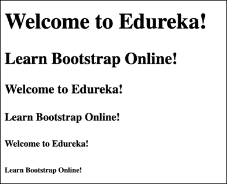

# 如何创建自举头文件？

> 原文：<https://www.edureka.co/blog/bootstrap-header/>

标题或引导标题对于让你的搜索引擎知道你的文章是关于什么的以及你的文章包含了什么信息是很重要的。bootstrap 标题中的副本或内容与搜索引擎通信，当用户使用一组特定的关键字进行搜索时，您的文章或博客会显示在搜索结果中。在这篇 [Bootstrap](https://getbootstrap.com/) 标题文章中，我们将讨论以下主题:

*   [标题介绍](#introduction)
*   [<>表头标签](#h1)
*   [<>表头标签](#h2)
*   [<>表头标签](#h3)
*   [<>表头标签](#h4)
*   [<>表头标签](#h5)
*   [<>表头标签](#h6)
*   [底线](#bottom)
*   [总结](#summary)

## **标题介绍**

一个文档可以包含多个引导头标签。这些引导标签对搜索引擎优化很重要。这些自举头标签从

# 、

## 开始，一直到

###### 。

# 和

## 标签是搜索引擎优化最重要的标签。

# 标签以最大字体显示文本，而

###### 以最小字体显示。

自举头的样式如下:

## **H1 标题标签**

# bootstrap header 标签用于指示文章或博客的主要标题。

**举例:**

```
<h1> Welcome to Edureka </h1>
```

它用于定义主标题。

**输出:**


## **H2 标题标签**

## 引导标题标签用于强调标题。

**举例:**

```
<h2> Learn Bootstrap Online! </h2>
```

它用于突出副标题。

**输出:**


## **<H3>标签**

### 标题标签用于将其他标题相互关联起来。

例如:

```
<h3> Welcome to Edureka! </h3>
```

**输出:**


## **<>自举头标签**

#### 标题标签表示 4 级标题。与

### 标签相比，它显得有点小。

**举例:**

```
<h3> Learn Bootstrap Online! </h3>
```

**输出:**


## **<H5>航向**

##### 标题通常用于描述目录部分的标题级别。

**举例:**

```
<h5> Welcome to Edureka! </h5>
```

**输出:**


## **<H6>航向**

###### header 标签是最后一种标题标签。除了在目录部分之外，通常不怎么使用它。

**举例:**

```
<h6> Learn Bootstrap Online! </h6>
```

**输出:**


## **底线**

最后，为了在相互比较时区分引导标头大小，它们看起来像这样:

```
<h1>Welcome to Edureka! </h1>
<h2>Learn Bootstrap Online! </h2>
<h3>Welcome to Edureka! </h3>
<h4>Learn Bootstrap Online!</h4>
<h5>Welcome to Edureka!</h5>
<h6>Learn Bootstrap Online!</h6>
```

**输出:**



## **总结**

*   标题标签从 **< h1 >** 开始，一直到 **< h2 >**
*   其中 **< h1 >** 最重要，而 **< h6 >** 最不重要
*   使用引导标题标记时，不要跳过标题级别
*   不要使用标题只是为了让文本看起来更粗或者改变它们的大小。
*   所有的标签都应该在 **<正文>** 标签里面

下面提到的浏览器支持上述所有标签:

*   谷歌浏览器
*   火狐(壁虎)
*   火狐手机(壁虎)
*   机器人
*   微软公司出品的 web 浏览器
*   Edge 手机
*   歌剧
*   歌剧手机
*   Safari Mobile
*   Safari(网络工具包)

就这样，我们来到了这篇文章的结尾。我希望你理解不同的标题标签。

*查看我们的  [全栈 Web 开发人员硕士课程](https://www.edureka.co/masters-program/full-stack-developer-training) ，该课程包含讲师指导的现场培训和真实项目体验。本培训使您精通使用后端和前端 web 技术的技能。它包括关于 Web 开发、jQuery、Angular、NodeJS、ExpressJS 和 MongoDB 的培训。*

有问题要问我们吗？请在这个博客的评论部分提到它，我们会给你回复。