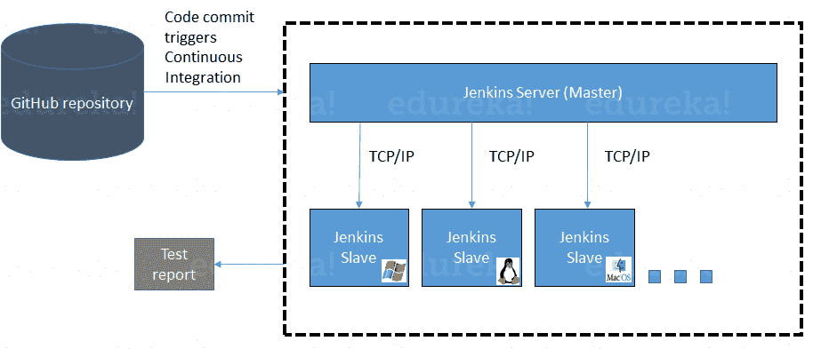
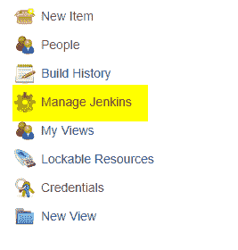
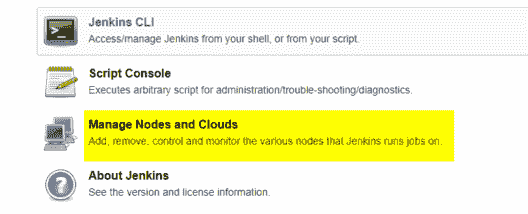
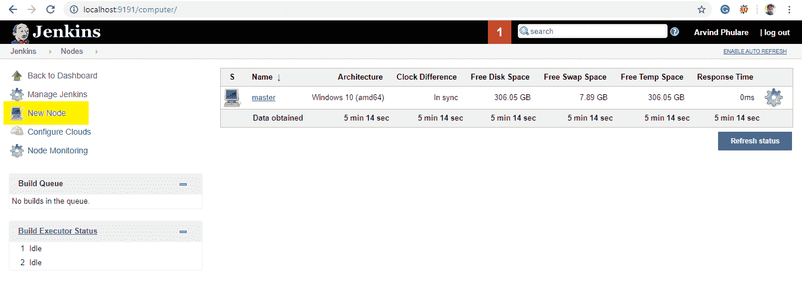
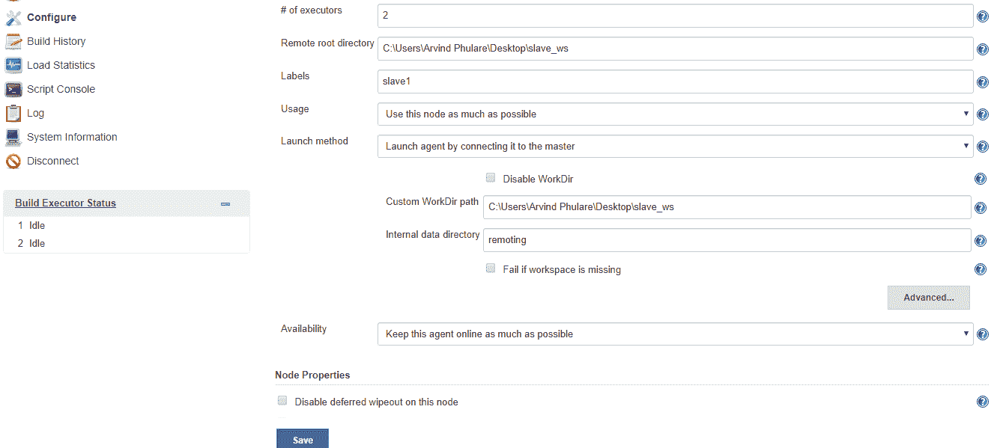
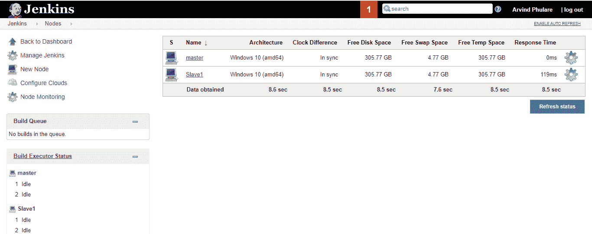
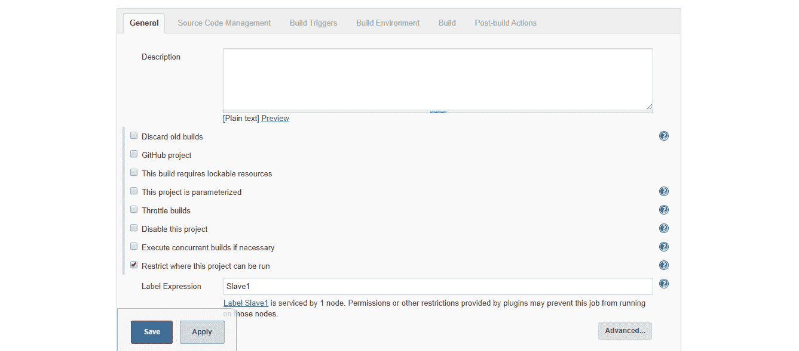

# 詹金斯主架构和从架构——完全指南

> 原文：<https://www.edureka.co/blog/jenkins-master-and-slave-architecture-a-complete-guide/>

詹金斯是开发中最重要的工具之一。Jenkins 用于 DevOps 的持续集成阶段。在这篇博客中，我将谈论詹金斯主从架构。我将涉及的要点如下:

*   [詹金斯是什么？](#jenkins)
*   [詹金斯架构](#arch)
*   [詹金斯主从架构是如何工作的？](#working)
*   [用詹金斯主人](#setup) 设置奴隶

让我们从第一个话题开始。

## **詹金斯是什么？**

Jenkins 是一个用 Java 编写的开源自动化工具，带有用于持续集成的插件。Jenkins 用于不断构建和测试您的软件项目，使开发人员更容易将更改集成到项目中，并使用户更容易获得新版本。它还允许您通过集成大量的测试和部署技术来持续地交付您的软件。

有了 Jenkins，组织可以通过自动化加速软件开发过程。Jenkins 集成了所有类型的开发生命周期过程，包括构建、文档、测试、打包、登台、部署、静态分析等等。

Jenkins 借助插件实现持续集成。插件允许集成各种 DevOps 阶段。如果你想集成一个特定的工具，你需要安装这个工具的插件。比如 Git，Maven 2 项目，亚马逊 EC2，HTML publisher 等。

**詹金斯的优势包括:**

*   这是一款开源工具，拥有强大的社区支持。
*   太容易安装。
*   它有 1000 多个插件来简化你的工作。如果一个插件不存在，你可以把它编码并分享给社区。
*   这是免费的。
*   它是用 Java 构建的，因此可以移植到所有主流平台上。

## ****詹金斯建筑****

让我们看看下面的詹金斯架构图描绘的一样。

单个 Jenkins 服务器不足以满足某些要求，例如:

*   有时你可能需要几个不同的环境来测试你的构建。这不能由单个 Jenkins 服务器来完成。

*   如果定期构建更大更重的项目，那么单个 Jenkins 服务器无法简单地处理全部负载。

为了解决上述需求，Jenkins 分布式架构应运而生。

## **詹金斯分布式架构**

Jenkins 使用主从架构来管理分布式构建。在这种体系结构中，主机和从机通过 TCP/IP 协议进行通信。

**詹金斯大师**

您的主 Jenkins 服务器是主服务器。主人的工作是处理:

*   调度构建作业。

*   将构建分派给从模块进行实际执行。

*   监控从机(可能根据需要使其在线或离线)。

*   记录并展示构建结果。

*   Jenkins 的主实例也可以直接执行构建任务。

## 詹金斯奴隶

从机是在远程机器上运行的 Java 可执行文件。以下是詹金斯奴隶的特征:

*   它听到来自 Jenkins 主实例的请求。

*   从机可以运行在多种操作系统上。

*   从机的工作是按照要求去做，包括执行主机分派的构建任务。

*   你可以配置一个项目总是在一个特定的从属机器或特定类型的从属机器上运行，或者简单地让 Jenkins 挑选下一个可用的从属机器。

下图不言自明。它由一个管理三个 Jenkins 从机的 Jenkins 主机组成。

## **詹金斯主从架构是如何工作的？**

现在让我们看一个例子，在这个例子中，我们使用 Jenkins 在不同的环境中进行测试，如 Ubuntu、MAC、Windows 等。

下图表示相同:

上图代表以下功能:

*   Jenkins 定期检查 Git 存储库，查看源代码中是否有任何更改。

*   每个版本都需要不同的测试环境，这对于单个 Jenkins 服务器来说是不可能的。为了在不同的环境中执行测试，Jenkins 使用了各种从设备，如图所示。

*   Jenkins 主设备请求这些从设备执行测试并生成测试报告。

## **如何设置詹金斯的主人和奴隶？**

1.  转到“管理 Jenkins”部分，向下滚动到“管理节点”部分。 

2.单击新节点

** 3。**为节点命名，选择“永久代理”选项，然后单击“确定”。

** 4。** 输入节点从机的详细信息。这里是**这个从机可以并行运行的作业的数量。这里我们把它保持在 2。名称输入为“Slave1”的**标签**可用于配置作业以使用该从机。选择**用法**尽可能多地使用该节点。对于 l **启动方法**，我们选择“通过将代理连接到主服务器来启动代理”选项。如果此选项不可见，请转到 J**Jenkins 主页- >管理 Jenkins - >配置全局安全性**。在代理部分**点击随机**并保存。现在，您将找到所需的选项。输入**自定义工作目录路径**作为从节点的工作空间。在**可用性**中，选择“尽可能保持该代理在线”。点击**保存**。**

完成上述步骤后，新节点计算机最初将处于脱机状态，但如果正确输入了上一屏幕中的所有设置，它将会联机。如果需要，可以随时使节点从机脱机。

5.现在，既然您的 slave 已经启动并运行，让我们在 slave 上执行一个作业。为此，我已经有了一个现有的作业，我将在这个从属服务器上运行这个作业。打开此工单并点击配置。现在，在“常规”部分，单击“限制该项目的运行位置”。在标签表达式中，输入从属服务器的名称并保存。现在，单击 Build now，查看该作业的输出。如果一切都正确，您将看到输出为成功。

至此，我们结束了这篇关于詹金斯主从架构的博客。我希望你已经理解了这里解释的所有概念。

现在您已经了解了什么是 *Jenkins 主架构和从架构*，请查看 Edureka 的 [DevOps 培训](https://www.edureka.co/devops-certification-training)，edu reka 是一家值得信赖的在线学习公司，拥有遍布全球的 250，000 多名满意的学习者。Edureka DevOps 认证培训课程帮助学员了解什么是 DevOps，并获得各种 DevOps 流程和工具方面的专业知识，例如 Puppet、Jenkins、Nagios、Ansible、Chef、Saltstack 和 GIT，用于自动化 SDLC 中的多个步骤。

有问题要问我们吗？请在评论区提及，我们会尽快回复您