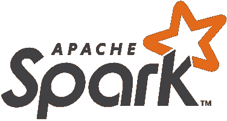
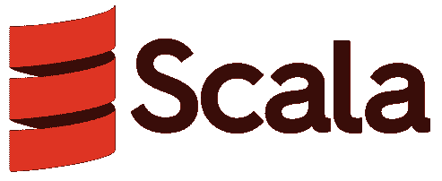
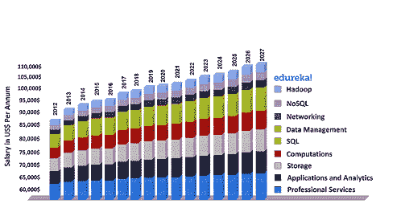

# 什么是 CCA-175 Spark 和 Hadoop 开发者认证？

> 原文：<https://www.edureka.co/blog/cca-175-spark-and-hadoop-certification/>

[**CCA-175 Spark 和 Hadoop 开发者认证**](https://www.edureka.co/apache-spark-scala-certification-training) 是 Apache Hadoop 开发中精确、熟练和完美的象征。当前 IT 行业对 CCA-175 认证的开发人员有很高的需求。让我们对此有更多的了解。

*   [什么是 CCA-175 Spark 和 Hadoop 开发者认证？](#what)
*   [CCA-175 Spark 和 Hadoop 开发者认证考试格式](#format)
*   [CCA-175 所需技能](#skill)
*   [CCA-175 考试的样题](#sample)
*   [Edureka CCA-175 认证](#edureka)
*   [一个 Hadoop 开发者的工资](#salary)

## **什么是 CCA-175 Spark 和 Hadoop 开发者认证？**

**CCA-175** 基本上是一个 **Apache Hadoop，带有 Apache Spark 和 Scala 培训和认证**程序。该计划的主要目标是帮助 Hadoop 开发人员通过先进的工具和操作程序，在当前传统的 Hadoop 开发协议上建立强大的命令。

该计划涉及以下部分:

*   Apache Hadoop
*   阿帕奇火花
*   Scala 编程语言

**Apache Hadoop**


[**Apache Hadoop**](https://www.edureka.co/blog/hadoop-tutorial/) 是一个强大的软件框架，旨在提供分布式存储和处理系统。它是由 Apache 基金会设计和部署的开源软件。

**阿帕奇火花**



[**Apache Spark**](https://www.edureka.co/blog/spark-tutorial/) 是一款使用在 [**Apache Hadoop 分布式文件系统(HDFS)**](https://www.edureka.co/blog/hdfs-tutorial) 之上的快如闪电的数据处理工具。它是由 Apache 基金会开发的开源数据处理工具。

**Scala 编程语言**



**[Scala](https://www.edureka.co/blog/what-is-scala/)** 是使用 Java 编程语言开发的高级编程语言。它用于在 Hadoop 之上的 Spark 中执行数据处理命令。

## **CCA-175 Spark 和 Hadoop 开发者认证考试格式**

下面给大家简单了解一下 CCA-175 Spark 和 Hadoop 开发者认证考试。

*   **问题数量**


在这次考试中，总的问题数量在 8 到 12 个之间。这些问题将纯粹是 **基于绩效的****[cloud era](https://www.edureka.co/blog/cloudera-hadoop-tutorial/)企业集群上的【动手】任务。**

*   **考试时限**


这次考试的总时间限制正好是 120 分钟。

*   **及格分数线**


任何参加本次考试的 [**Hadoop 开发人员**](https://www.edureka.co/blog/hadoop-developer/) 都必须获得至少 70%的分数才能通过考试并获得认证。

*   **检查价格**


该考试目前的价格为**295 美元到 300 美元**。(**21000 卢比至 22000 卢比**)

## **CCA-175 考试的样题**


*   使用 **Apache Sqoop，**您必须将**订单**表导入到 **HDFS** 文件夹位置**/user/cloudera/problem 1/orders】**。文件应作为 **Avro** 文件加载，并使用快速压缩

*   使用 **Apache Sqoop，**你必须将 **order_items** 表导入到 **HDFS** 文件夹位置"**/user/cloudera/problem 1/order-items "**。这些文件应该以 Avro 文件的形式加载，并使用快速压缩

*   使用 **ApacheSparkScala，**你必须在位置“**/用户/cloudera/problem 1/orders”**和“**/用户/cloudera/problem 1/orders-items**项加载数据作为 [**dataframes**](https://www.edureka.co/blog/dataframes-in-spark/) 。

*   **预期中间结果:** **订单 _ 日期**，**订单 _ 状态，订单总数，订单总数 _ 金额。**通俗地说，请查找每天每种状态的订单总数和总金额。结果应按照订单日期降序排序，订单状态升序排序，总金额降序排序，订单总数升序排序。应使用以下方法进行汇总。但是，可以使用 [**数据帧**](https://www.edureka.co/blog/dataframes-in-spark/) 或 **[RDD](https://www.edureka.co/blog/rdd-using-spark/) 进行排序。**以下列方式执行聚合

    *   只需使用数据帧 API–此处订单日期应为 **YYYY-MM-DD** 格式

    *   使用 Spark SQL–此处订单日期应为 **YYYY-MM-DD** 格式

    *   通过在 **RDDS** 上使用 combineByKey 函数—不需要格式化订单日期或总金额

*   使用 gzip 压缩将结果作为拼花文件存储到 **HDFS** 文件夹下

    *   **/用户/云时代/问题 1/结果 4a-gzip**

    *   **/用户/云时代/问题 1/结果 4b-gzip**

    *   **/用户/云时代/问题 1/结果 4c-gzip**

*   在文件夹下使用快速压缩将结果作为拼花文件存储到 **HDFS** 中

    *   **/用户/云时代/问题 1/结果 4a-爽快**

    *   **/用户/云时代/问题 1/结果 4b-爽快**

    *   **/用户/云时代/问题 1/结果 4c-爽快**

*   将结果作为 **CSV** 文件存储到 **HDFS** 文件夹下，不使用压缩

    *   **/用户/云时代/问题 1/结果 4a-csv**

    *   **/用户/云时代/问题 1/结果 4b-csv**

    *   **/用户/云时代/问题 1/结果 4c-csv**

*   创建一个名为 result 的 **mysql** 表，并将数据从“**/用户/云时代/问题 1/结果 4a-CSV”**加载到“**MySQL”**名为 result 的表中

**解决方案:**


**第一步:**

```
sqoop import 
--connect "jdbc:mysql://quickstart.cloudera:3306/retail_db" 
--username retail_dba 
--password cloudera 
--table orders 
--compress 
--compression-codec org.apache.hadoop.io.compress.SnappyCodec 
--target-dir /user/cloudera/problem1/orders 
--as-avrodatafile;

```

**第二步:**

```
sqoop import 
--connect "jdbc:mysql://quickstart.cloudera:3306/retail_db" 
--username retail_dba 
--password cloudera 
--table order_items 
--compress 
--compression-codec org.apache.hadoop.io.compress.SnappyCodec 
--target-dir /user/cloudera/problem1/order-items 
--as-avrodatafile;

```

**第三步:**

```
//start a new terminal and fire this command.
spark-shell
//now, continue executing these commands below.
import com.databricks.spark.avro._;
var ordersDF = sqlContext.read.avro("/user/cloudera/problem1/orders");
var orderItemDF = sqlContext.read.avro("/user/cloudera/problem1/order-items");

```

**第四步:**

```
var joinedOrderDataDF = ordersDF.join(orderItemDF,ordersDF("order_id")===orderItemDF("order_item_order_id"))

```

**步骤 4a:**

```
import org.apache.spark.sql.functions._;
var dataFrameResult = joinedOrderDataDF.groupBy(to_date(from_unixtime(col("order_date")/1000)).alias("order_formatted_date"),col("order_status")).agg(round(sum("order_item_subtotal"),2).alias("total_amount"),countDistinct("order_id").alias("total_orders")).orderBy(col("order_formatted_date").desc,col("order_status"),col("total_amount").desc,col("total_orders"));
dataFrameResult.show();

```

**步骤 4b:**

```
joinedOrderDataDF.registerTempTable("order_joined");
var sqlResult = sqlContext.sql("select to_date(from_unixtime(cast(order_date/1000 as bigint))) as order_formatted_date, order_status, cast(sum(order_item_subtotal) as DECIMAL (10,2)) as total_amount, count(distinct(order_id)) as total_orders from order_joined group by to_date(from_unixtime(cast(order_date/1000 as bigint))), order_status order by order_formatted_date desc,order_status,total_amount desc, total_orders");
sqlResult.show();

```

**步骤 4c:**

```
var comByKeyResult =joinedOrderDataDF.map(x=> ((x(1).toString,x(3).toString),(x(8).toString.toFloat,x(0).toString))).combineByKey((x:(Float, String))=>(x._1,Set(x._2)),(x:(Float,Set[String]),y:(Float,String))=>(x._1 + y._1,x._2+y._2),(x:(Float,Set[String]),y:(Float,Set[String]))=>(x._1+y._1,x._2++y._2)).map(x=> (x._1._1,x._1._2,x._2._1,x._2._2.size)).toDF().orderBy(col("_1").desc,col("_2"),col("_3").desc,col("_4"));
comByKeyResult.show();

```

**第五步:**

```
sqlContext.setConf("spark.sql.parquet.compression.codec","gzip");
dataFrameResult.write.parquet("/user/cloudera/problem1/result4a-gzip");
sqlResult.write.parquet("/user/cloudera/problem1/result4b-gzip");
comByKeyResult.write.parquet("/user/cloudera/problem1/result4c-gzip");

```

**第六步:**

```
sqlContext.setConf("spark.sql.parquet.compression.codec","snappy");
dataFrameResult.write.parquet("/user/cloudera/problem1/result4a-snappy");
sqlResult.write.parquet("/user/cloudera/problem1/result4b-snappy");
comByKeyResult.write.parquet("/user/cloudera/problem1/result4c-snappy");

```

**第七步:**

```
dataFrameResult.map(x=> x(0) + "," + x(1) + "," + x(2) + "," + x(3)).saveAsTextFile("/user/cloudera/problem1/result4a-csv")
sqlResult.map(x=> x(0) + "," + x(1) + "," + x(2) + "," + x(3)).saveAsTextFile("/user/cloudera/problem1/result4b-csv")
comByKeyResult.map(x=> x(0) + "," + x(1) + "," + x(2) + "," + x(3)).saveAsTextFile("/user/cloudera/problem1/result4c-csv")

```

**步骤 8a:**

```
Fire up a new terminal and type in this command
mysql -h localhost -u retail_dba -p
//default password is:
cloudera 

```

**步骤 8b:**

```
create table retail_db.result(order_date varchar(255) not null,order_status varchar(255) not null, total_orders int, total_amount numeric, constraint pk_order_result primary key (order_date,order_status)); 

```

**步骤 8c:**

```
sqoop export 
--table result 
--connect "jdbc:mysql://quickstart.cloudera:3306/retail_db" 
--username retail_dba 
--password cloudera 
--export-dir "/user/cloudera/problem1/result4a-csv" 
--columns "order_date,order_status,total_amount,total_orders"

```

现在让我们了解一下 Edureka 提供的 CCA-175 Spark 和认证。

## **Edureka CCA-175 认证**


**Apache Spark** 和 Scala 认证培训旨在为您参加 Cloudera Hadoop 和 Spark 开发人员认证考试(CCA175)做好准备。您将深入了解 Apache Spark 和 Spark 生态系统，

Edureka 培训包括**[【RDD】](https://www.edureka.co/blog/rdd-using-spark/)**[**Spark SQL**](https://www.edureka.co/blog/spark-sql-tutorial/)[**Spark ml lib**](https://www.edureka.co/blog/spark-mllib/)和[**Spark Streaming**](https://www.edureka.co/blog/spark-streaming/)。您将获得关于 [**Scala 编程语言**](https://www.edureka.co/blog/what-is-scala/) 、**、[、](https://www.edureka.co/blog/hdfs-tutorial)、**、、**、、 [Sqoop](https://www.edureka.co/blog/apache-sqoop-tutorial/) 、**、 [Flume](https://www.edureka.co/blog/apache-flume-tutorial/) 、**、[、 **Spark GraphX** 、 **Kafka** 、](https://www.edureka.co/blog/spark-graphx/)等消息系统的全面知识。**

## **CCA-175 所需技能**

**数据摄取:**

*   使用 Sqoop 将数据从 **MySQL** 数据库导入 **HDFS**
*   使用 **Apache Sqoop** 将数据从 **HDFS** 导出到 **MySQL** 数据库
*   使用 **Sqoop** 在导入过程中更改数据的**分隔符**和文件格式
*   使用 Flume 将实时和**近实时(NRT)** 流数据摄取到 **HDFS** 中
*   使用 **Hadoop 文件系统** (FS)命令将数据加载到 **HDFS** 中或从其中加载数据

**转换阶段存储:**

*   使用 **Spark** 从 **HDFS** 加载数据并将结果存储回 **HDFS**
*   **使用 **Spark** 将**不同的**数据集**连接在一起
*   使用 **Spark 计算聚合统计数据。**举例:**平均值**或**总和**
*   使用 Spark 将数据过滤成一个更小的数据集
*   编写一个**查询**,使用 Spark 生成排序后的数据

**数据分析:**

*   **读取**和**在给定模式的**配置单元元存储**中创建**一个表
*   **使用 **Avro-tools** 从一组数据文件中提取**Avro 模式
*   **使用 Avro 文件格式和外部模式文件在 Hive 元存储中创建**一个表
*   通过在 **Hive 元存储**中创建分区表来提高查询性能
*   通过改变 **JSON** 文件来发展一个 **Avro** 模式

## **Hadoop 开发人员的工资**

[**Hadoop 开发者**](https://www.edureka.co/blog/hadoop-developer/) 是当前 IT 行业薪酬最高的人物之一。自过去几年以来，Hadoop 开发人员的工资趋势一直在稳步增长。让我们来看看与其他资料相比，Hadoop 开发人员的工资增长趋势。



现在让我们根据经验来讨论不同国家的 Hadoop 开发人员的薪资趋势。首先，让我们考虑一下美利坚合众国。根据经验，在该领域工作的[](https://www.edureka.co/blog/big-data-testing/)大数据专业人员的薪酬如下。


大一新生或  *入门级* 起薪为  **75，000 美元** 至  **80，000 美元** 而具有丰富经验的应聘者的起薪为  **125，000 美元**

接下来是美国，我们现在将讨论印度 Hadoop 开发人员的薪酬趋势。


在印度，Hadoop 开发人员的大一新生或*入门级*的薪水趋势是从 **40 万印度卢比** 到 **50 万印度卢比** 不等，而经验丰富的候选人的薪水是 **4，500，000 ₹** 到

接下来，让我们看看英国 Hadoop 开发人员的薪资趋势。


Hadoop 开发者在印度的大一新生或*入门级*的薪水趋势是从 **25，000 英镑到 30，000 英镑**开始，另一方面，对于一个有经验的候选人，提供的薪水是 **80，000 英镑到 90，000 英镑。**

就这样，我们结束了这篇**“CCA-175 Spark 和 Hadoop 开发者认证”**的文章。我希望我们能让你对 Spark、Scala 和 Hadoop 以及 CCA-175 认证特性及其重要性有所了解。

*本文基于 [**Apache Spark 和 Scala 认证培训**](https://www.edureka.co/apache-spark-scala-certification-training) 设计，为您准备 [Cloudera](https://www.cloudera.com/) [Hadoop](https://hadoop.apache.org/docs/stable/) 和 Spark 开发者认证考试(CCA175)。您将深入了解 Apache Spark 和 Spark 生态系统，包括 Spark RDD、Spark SQL、Spark MLlib 和 Spark Streaming。您将获得关于 Scala 编程语言、HDFS、Sqoop、Flume、Spark GraphX 和 Kafka 等消息系统的全面知识。*