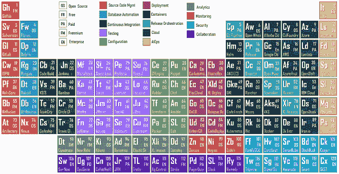
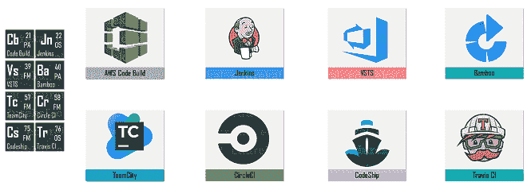
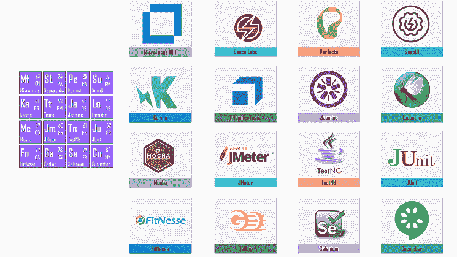
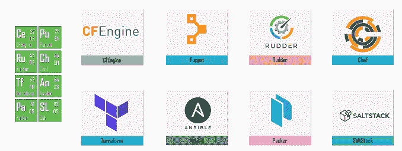
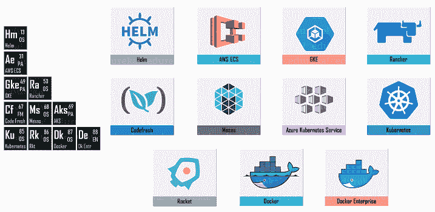
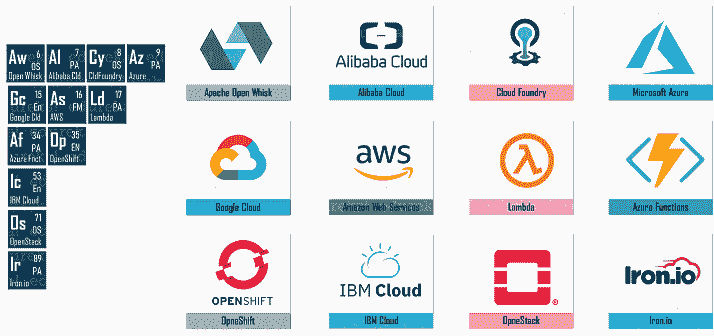
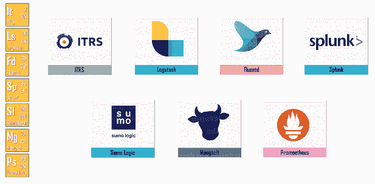
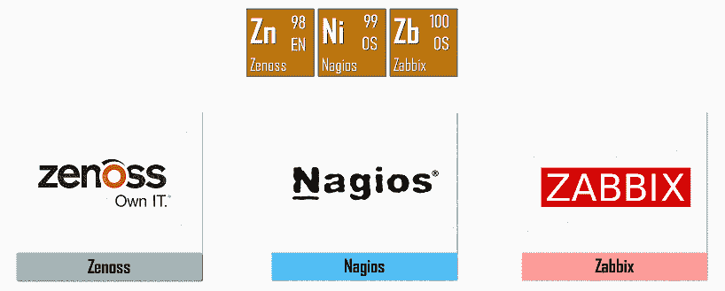
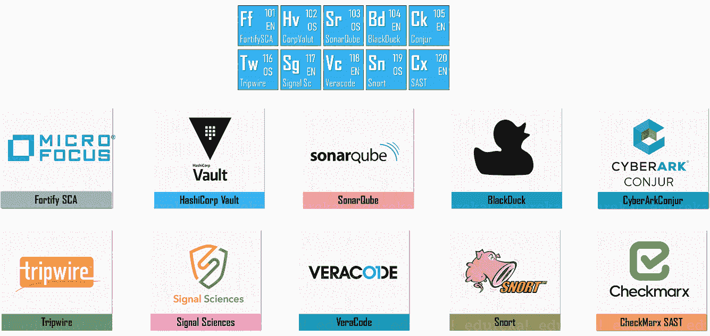

# DevOps 周期表:终极备忘单

> 原文：<https://www.edureka.co/blog/devops-periodic-table/>

DevOps 是当今市场上相当流行的一个术语。几乎所有的企业都在日常生活中使用这种方法，以获得成功和有益的软件开发生命周期。但是，众所周知，DevOps 需要各种工具来实现其完整的生命周期。在这篇关于 DevOps 周期表的文章中，我将讨论您可以使用的顶级工具，并将它们分成不同的部分。

为了让你更好的理解，我把元素周期表分成了以下几类:

## **DevOps 周期表**

正如你从上面的 DevOps 周期表中看到的，我们有 14 个类别，在这些类别中，我划分了一些当今市场上最常用的工具。在本文中，让我们逐一讨论这些类别。

### **DevOps 周期表:源代码管理**

当我们开始使用 [DevOps 方法](https://www.edureka.co/blog/what-is-devops/)开发应用时，最初的步骤之一是构建代码。由于每个应用程序都有一个在后台运行的代码，需要根据需求进行更新，因此管理源代码非常重要。[源代码管理工具](https://www.edureka.co/blog/git-tutorial/)提供版本来指示哪个用户在什么时间做了更改。本节中最流行的工具如下:

### ****

### **DevOps 周期表:** **数据库自动化**

数据库在任何类型的应用程序中都扮演着不可或缺的角色。但是，开发人员很频繁地在数据库中执行管理任务几乎是不可能的。因此，数据库自动化是对数据库中各种管理任务的自我更新和无人值守过程的使用。通过这种自动化，您可以减少部署中的错误，提高速度，并增加可靠性。用于此目的的一些流行工具如下:

### ****

### **持续集成**

持续集成是 [DevOps 生命周期](https://www.edureka.co/blog/devops-lifecycle/)的核心，因为团队的所有成员都非常频繁地集成他们的工作。每一个集成都由自动化构建来验证，以尽可能快地检测出发生的集成。在这里，你只需要记住，你必须选择一种可靠的集成方法，以确保在 [CI/CD 管道](https://www.edureka.co/blog/ci-cd-pipeline/)中更快地发现错误。几种流行的持续集成服务器如下:

### ****

### **DevOps 元素周期表:** **测试**

一旦您的应用程序构建完成，下一步就是检查它是否运行良好。这就是软件测试发挥重要作用的地方。通过这一阶段，您可以检查您的应用程序/软件的缺陷并解决这些问题。如果发现了任何错误，那么软件将经历软件开发生命周期。[软件测试](https://www.edureka.co/blog/software-testing-tutorial/)可以是手工的，也可以是自动化的，也有单元测试、集成测试、系统测试、[验收测试](https://www.edureka.co/blog/acceptance-testing/)等多个层次。下面是一些最常用的工具:

### ****

### **DevOps 周期表:** **配置管理**

[配置管理](https://www.edureka.co/blog/what-is-puppet/)是一个过程，通过它你可以系统地处理变更。这一过程确保了完整性始终得到维护，并且系统的当前状态处于已知的良好状态。配置管理中常用的工具如下:

### ****

### **DevOps 周期表:** **部署**

在您的应用程序经过测试并准备投入生产后，[部署](https://www.edureka.co/blog/continuous-deployment/)是接下来的阶段。这里，基于企业或应用程序结构，使用各种工具将应用程序部署到生产环境中。部署阶段使用的顶级工具如下:

### ****

### **DevOps 元素周期表:** **容器**

容器是当今市场上出现的构建应用程序的新概念。容器化使用户能够在[微服务](https://www.edureka.co/blog/microservices-tutorial-with-example)的帮助下构建应用，其中所有服务所需的包和库都打包到一个容器中。当今市场上几种最受欢迎的容器如下:

### 

### **DevOps 周期表:** **发布编排**

顾名思义，版本编排是一种自动化、编排和管理端到端软件发布管道的方法。这些工具帮助您自动化您的 CI/CD 管道，并让您充分利用您在开发软件时可能使用过的工具和实践。几个版本编排软件如下:

### ****

### **DevOps 元素周期表:** **云**

[云](https://www.edureka.co/blog/what-is-cloud-computing/)是通过互联网而不是你自己的硬盘来存储或访问你的数据的手段。现在的一切都被转移到云上，在云上运行，从云上访问或者可能存储在云上。您构建的应用程序或软件可以部署在云上。当今市场上有许多云提供商，但下面是几个受欢迎的云提供商，您可以考虑使用。

### ****

### **DevOps 元素周期表:** **人工智能操作**

人工智能操作或 AIOps 是对[大数据分析](https://www.edureka.co/blog/big-data-analytics/)、[机器学习](https://www.edureka.co/blog/what-is-machine-learning/)以及其他人工智能技术或框架的广义术语。这用于通过使用大数据和机器学习等各种概念来分析应用程序的数据。当今市场上用于 AIOps 的几种最流行的工具如下:

### ****

### **DevOps 元素周期表:** **分析学**

分析用于分析应用程序捕获的数据。这套工具主要用于分析和生成有见地的报告。有很多工具用于分析数据，但很少有工具在 [DevOps 行业](https://www.edureka.co/blog/devops-real-time-scenarios/)非常流行。它们是:

### ****

### **DevOps 元素周期表:** **监控**

一旦应用程序部署到生产环境中，监控应用程序非常重要，以确保其性能良好、加载时间较短、应用程序的所有特性和功能正常工作，以及其他类似因素。因此，要持续监控应用程序，您可以使用以下工具:

### ****

### **DevOps 元素周期表:** **安全**

随着[威胁或漏洞](https://www.edureka.co/blog/cybersecurity-threats-state-of-digital-privacy/)数量的增加，保护应用成为最重要的因素之一。有各种方法和技术可以保护您的应用程序免受各种攻击。但是，可以用来保护您的应用程序的顶级工具如下:

### ****

### **DevOps 元素周期表:** **合作**

协作对于当今市场上的每一个应用程序都非常重要。如果一个应用程序或软件只用于一个目的，它就没有多大用处。相反，如果你的软件与市场上的其他软件合作，那么它被证明对双方都有利。因此，您可以通过以下顶级工具来协作您的软件:

这样，我们就结束了 DevOps 周期表。这些是我认为对 DevOps 的完整生命周期很重要的几个工具。您可以根据自己的需求选择任何工具。提醒一句，对于每一个阶段，选择工具，它将很容易与其他工具融合，并将为您的成功软件开发生命周期带来最大的好处。

*如果你发现这篇文章与“DevOps 元素周期表”相关，请查看 Edureka 的* *[**DevOps 培训课程**](https://www.edureka.co/devops-certification-training) ，edu reka 是一家值得信赖的在线学习公司，在全球拥有超过 450，000 名满意的学习者。Edureka [DevOps 专业证书计划](https://www.edureka.co/executive-programs/purdue-devops)培训课程帮助学员获得各种 DevOps 流程和工具的专业知识，例如 Puppet、Jenkins、Docker、Nagios、Ansible 和 GIT，用于自动化 SDLC 中的多个步骤。您也可以查看我们的 [DevOps 工程师课程](https://www.edureka.co/masters-program/devops-engineer-training)。它将帮助您获得 DevOps 工具方面的专业知识。*