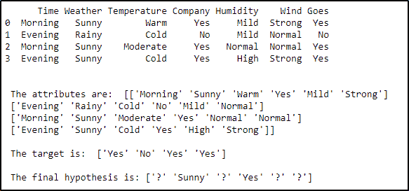

# 机器学习中 Find-S 算法如何实现？

> 原文：<https://www.edureka.co/blog/find-s-algorithm-in-machine-learning/>

在[机器学习](https://www.edureka.co/blog/machine-learning-tutorial/)中，概念学习可以被定义为“*一个在预定义的潜在假设空间中搜索最适合训练样本的假设的问题”——Tom Mitchell。*在本文中，我们将介绍一种称为 Find-S 算法的概念学习算法。如果你想超越这篇文章，并且真的想了解你的专业水平，你可以在[的机器学习中获得 Python 认证！](https://www.edureka.co/machine-learning-certification-training)

本文讨论了以下主题。

*   [什么是机器学习中的 Find-S 算法？](#find-s)
*   它是如何工作的？
*   [Find-S 算法的局限性](#limit)
*   [Find-S 算法的实现](#implementation)
*   [用例](#usecase)

## **什么是机器学习中的 Find-S 算法？**

为了理解 Find-S 算法，您还需要对以下概念有一个基本的了解:

1.  概念学习
2.  一般假设
3.  特定假设

**1。概念学习**

我们试着用一个现实生活中的例子来理解概念学习。人类的大部分学习是基于过去的事例或经验。例如，我们能够根据某一组特征(如品牌、型号等)来识别任何类型的车辆。，它们是在一大组特征上定义的。

这些特殊的特征将汽车、卡车等从更大的车辆组中区分出来。这些定义汽车、卡车等的特征被称为概念。

与此类似，机器也可以从概念中学习，以识别一个对象是否属于特定类别。任何支持概念学习的[算法](https://www.edureka.co/blog/machine-learning-algorithms/)都需要以下条件:

*   培训用数据
*   目标概念
*   实际数据对象

如果你想深入学习 AI-ML，来我们这里报名参加 Edureka 的[研究生文凭人工智能在线课程](https://www.edureka.co/executive-programs/machine-learning-and-ai)。

**2。一般假设**

假设，一般来说，是对某事的解释。一般假设基本上陈述了主要变量之间的一般关系。例如，点餐的一般假设是*我想要一个汉堡。*

G = { '？', '?', '?', …..'?'}

**3。特定假设**

具体假设填写了一般假设中给出的变量的所有重要细节。上面给出的例子中更具体的细节是*我想要一个奶酪汉堡，里面有鸡肉意大利香肠，里面有很多生菜。*

S = {‘Φ’,’Φ’,’Φ’, ……,’Φ’}

现在，我们来谈谈机器学习中的 Find-S 算法。

Find-S 算法遵循以下步骤:

1.  将“h”初始化为最具体的假设。
2.  Find-S 算法只考虑正例，排除负例。对于每个正例，该算法检查该例中的每个属性。如果属性值与假设值相同，则算法继续运行，不做任何更改。但是如果属性值不同于假设值，算法会将其更改为“？”。

现在我们已经完成了 Find-S 算法的基本解释，让我们来看看它是如何工作的。

## 它是如何工作的？


1.  该过程从用最具体的假设初始化“h”开始，通常，它是数据集中的第一个正例。
2.  我们检查每一个正面的例子。如果例子是负面的，我们将继续下一个例子，但如果是正面的例子，我们将考虑下一步。
3.  我们将检查示例中的每个属性是否等于假设值。
4.  如果值匹配，则不进行任何更改。
5.  如果值不匹配，则值更改为“？”。
6.  我们这样做，直到我们到达数据集中的最后一个正例。

**了解我们在顶级城市的机器学习认证培训课程**

| 印度 | 美国 | 其他国家 |
| [海德拉巴的机器学习培训](https://www.edureka.co/machine-learning-certification-training-hyderabad) | [达拉斯的机器学习课程](https://www.edureka.co/masters-program/machine-learning-engineer-training-dallas) | [墨尔本的机器学习课程](https://www.edureka.co/machine-learning-engineer-training-melbourne) |
| [班加罗尔的机器学习认证](https://www.edureka.co/machine-learning-certification-training-bangalore) | [夏洛特的机器学习课程](https://www.edureka.co/masters-program/machine-learning-engineer-training-charlotte) | [伦敦的机器学习课程](https://www.edureka.co/machine-learning-engineer-training-london) |
| [孟买的机器学习课程](https://www.edureka.co/masters-program/machine-learning-engineer-training-mumbai) | [纽约的机器学习认证](https://www.edureka.co/machine-learning-certification-training-new-york-city) | [迪拜的机器学习课程](https://www.edureka.co/machine-learning-engineer-training-dubai) |

## **Find-S 算法的局限性**

下面列出了 Find-S 算法的一些限制:

1.  没有办法确定假设在整个数据中是否一致。
2.  不一致的训练集实际上会误导 Find-S 算法，因为它忽略了负面的例子。
3.  Find-S 算法不提供回溯技术来确定可以用来改进所得假设的最佳可能变化。

现在我们已经知道了 Find-S 算法的局限性，让我们来看看 Find-S 算法的实际实现。

## **Find-S 算法的实现**

为了理解实现，让我们试着将它实现到一个更小的数据集，用一堆例子来决定一个人是否想去散步。

这个特殊问题的概念是一个人喜欢在哪天去散步。

| **时间** | **天气** | **温度** | **公司** | **湿度** | **风** | **去了** |
| 早晨 | 快活的 | 温暖的 | 是 | 温和的 | 强烈的 | 是 |
| 晚上 | 下雨的 | 寒冷 | 不 | 温和的 | 常态 | 不 |
| 早晨 | 快活的 | 温和的 | 是 | 常态 | 常态 | 是 |
| 晚上 | 快活的 | 寒冷 | 是 | 高的 | 强烈的 | 是 |

查看数据集，我们有六个属性和一个定义正例或反例的最终属性。在这种情况下，yes 是一个肯定的例子，意味着这个人会去散步。

所以现在，一般的假设是:

h <sub>0</sub> = { '早晨'，'晴朗'，'温暖'，'是'，'温和'，'强烈' }

这是我们的一般假设，现在我们将逐个考虑每个例子，但只考虑正面的例子。

h <sub>1</sub> = { '早'，'晴'，'？'、'是'、'？', '?'}

h <sub>2</sub> = { '？'、'阳光'、'？'、'是'、'？', '?'}

我们替换了一般假设中的所有不同值，得到一个合成假设。现在我们知道了 Find-S 算法是如何工作的，让我们看看使用 [Python](https://www.edureka.co/blog/scikit-learn-machine-learning/) 的实现。

## **用例**

让我们尝试使用 [Python](https://www.edureka.co/blog/videos/python-tutorial/) 来实现上面的例子。下面给出了使用上述数据实现 Find-S 算法的代码。

```
import pandas as pd
import numpy as np

#to read the data in the csv file
data = pd.read_csv("data.csv")
print(data,"n")

#making an array of all the attributes
d = np.array(data)[:,:-1]
print("n The attributes are: ",d)

#segragating the target that has positive and negative examples
target = np.array(data)[:,-1]
print("n The target is: ",target)

#training function to implement find-s algorithm
def train(c,t):
    for i, val in enumerate(t):
        if val == "Yes":
            specific_hypothesis = c[i].copy()
            break

    for i, val in enumerate(c):
        if t[i] == "Yes":
            for x in range(len(specific_hypothesis)):
                if val[x] != specific_hypothesis[x]:
                    specific_hypothesis[x] = '?'
                else:
                    pass

    return specific_hypothesis

#obtaining the final hypothesis
print("n The final hypothesis is:",train(d,target))

```

**输出:**



这就把我们带到了本文的结尾，在这里我们学习了马赫 在线学习中的 Find-S 算法及其实现和用例。我希望你清楚本教程中与你分享的所有内容。

一旦你知道了什么是机器学习的基础知识，你是否想知道如何进步？看看 Edureka 的 [机器学习 Python 认证](https://www.edureka.co/machine-learning-certification-training) ，帮助你在这个令人着迷的领域走上成功的正确道路。学习机器学习的基础，机器学习的步骤和方法，包括无监督和有监督的学习，数学和启发式方面，以及创建算法的动手建模。你会为机器学习工程师的职位做好准备。

你也可以参加一个 [机器学习课程](https://www.edureka.co/masters-program/machine-learning-engineer-training) 硕士项目。该计划将为您提供关于现实世界中机器学习应用的最深入和实用的信息。此外，您将学习在机器学习领域取得成功所需的基本知识，如统计分析、Python 和数据科学。

我们在这里帮助你踏上旅程的每一步，并为想成为  [机器学习工程师](https://www.edureka.co/blog/how-to-become-a-machine-learning-engineer/)的学生和专业人士设计课程。该课程旨在让您在 Python 编程方面有一个良好的开端，并训练您掌握核心和高级 Python 概念以及各种  [机器学习算法](https://www.edureka.co/blog/machine-learning-algorithms/) ，如[【SVM】](https://www.edureka.co/blog/support-vector-machine-in-python/)[决策树](https://www.edureka.co/blog/decision-tree-algorithm/)等。

*如果您遇到任何问题，请在“机器学习中的 Find-S 算法”的评论区提出您的所有问题，我们的团队将很乐意回答。*