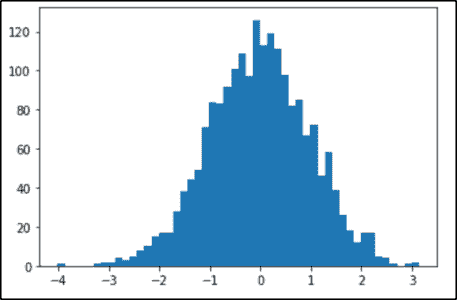
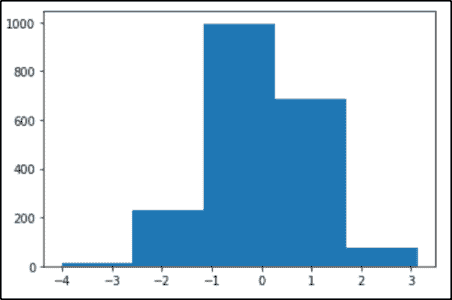
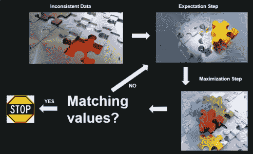
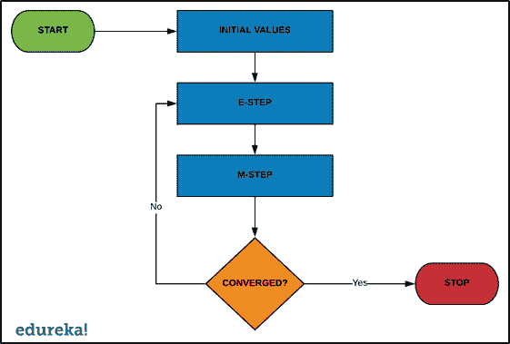
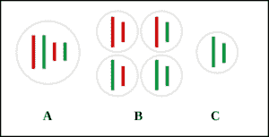

# 机器学习中的 EM 算法是什么？

> 原文：<https://www.edureka.co/blog/em-algorithm-in-machine-learning/>

在机器学习应用程序中，数据集中可能存在一些相关变量，这些变量在学习时可能不会被观察到。在本文中，我们将学习使用观察数据来理解潜在变量估计的期望最大化或 EM 算法。本文讨论了以下主题:

*   [最大似然的潜变量问题](#latent)
*   [什么是机器学习中的 EM 算法？](#em)
*   它是如何工作的？
*   [高斯混合模型](#gmm)
*   [EM 算法的应用](#usage)
*   [优缺点](#advantages)

## **最大似然的潜变量问题**

在统计建模中，一个常见的问题是我们如何尝试估计数据集的联合概率分布。

**概率密度估计**基本上是基于观察数据的估计的构建。它包括选择一个概率分布函数和该函数的参数，该函数最好地解释了观察数据的联合概率。

*   密度估计的第一步是在随机样本中创建一个观察图。

```
import matplotlib.pyplot as plt
from numpy.random import normal

sample = normal(size=2000)

plt.hist(sample, bins=50)
plt.show()

```

**输出:**

就分布中的条的数量和绘制密度的好坏而言，箱的数量的选择在这里起着重要的作用。如果我们在上面的例子中把容器改为 5，分布将被分成 5 个容器，如下图所示。



密度估计需要选择一个概率分布函数和该分布的参数，以最好地解释样本的联合概率分布。密度估计的问题可能如下:

1.  概率分布函数怎么选？

2.  如何选择概率分布函数的参数？

解决这个问题最常用的技术是最大似然估计，或简称为“最大似然”。

**最大似然估计**

在统计学中，最大似然估计是通过最大化似然函数来估计概率分布的参数的方法，以便使观察到的数据最有可能用于统计模型。

但是最大似然法有一个限制，它假设数据是完整的，完全观察到的，等等。它并没有真正要求模型能够访问所有的数据。相反，它假设与模型相关的所有变量都已经存在。但在某些情况下，一些相关变量可能仍然隐藏，并导致不一致。

而这些未被观察到的或隐藏的变量被称为**潜变量**。

在潜在变量存在的情况下，传统的最大似然估计器将不会像预期的那样工作。一种在潜在变量存在的情况下找到合适的模型参数的方法是期望最大化算法或简称 EM 算法。让我们来看看[机器学习中的 EM 算法。](https://www.edureka.co/blog/machine-learning-tutorial/)

## **什么是机器学习中的 EM 算法？**

EM 算法是由 Arthur Dempster，Nan Laird 和 Donald Rubin 在 1997 年提出的。它主要用于在潜在变量存在或数据缺失或不完整的情况下，寻找统计模型的局部最大似然参数。



EM 算法遵循以下步骤，以便在存在潜在变量的情况下找到相关的模型参数。

1.  考虑不完整数据中的一组起始参数。

2.  **期望步骤**–该步骤用于估计数据中缺失值的值。它涉及到观察到的数据来基本猜测缺失数据中的值。

3.  **最大化** **步骤**–在期望步骤更新数据中缺失的值后，该步骤生成完整的数据。

4.  执行步骤 2 和 3，直到达到收敛。

**收敛—**概率收敛的概念是基于直觉的。假设我们有两个随机变量，如果它们的差的概率很小，就说是收敛的。在这种情况下，收敛意味着值是否相互匹配。

现在我们知道了什么是[机器学习](https://www.edureka.co/blog/machine-learning-tutorial/)中的 EM 算法，让我们来看看它实际上是如何工作的。

## 它是如何工作的？

EM 算法背后的基本思想是使用观测数据来估计缺失数据，然后更新这些参数值。记住流程图，让我们理解 EM 算法是如何工作的。

## ****

1.  在开始阶段，考虑一组初始参数。一组未观察到的和不完整的数据被提供给系统，并假设观察到的数据来自特定的模型。
2.  下一步是期望步骤或电子步骤。在这一步中，我们使用观察到的数据来估计缺失或不完整的数据。它基本上用于更新变量。
3.  最大化步骤或 M 步骤用于完成 E 步骤中生成的数据。这一步基本上更新了假设。
4.  在最后一步中，检查这些值是否收敛。如果值匹配，那么我们什么也不做，否则我们将继续步骤 2 和 3，直到满足收敛。

除了密度估计之外，EM 算法还用于聚类。因此，让我们借助高斯混合模型来理解 EM 算法。

*查看这些 [AI ML 课程](https://www.edureka.co/executive-programs/machine-learning-and-ai)由 E & ICT 学院 NIT Warangal 学习并建立人工智能职业生涯。*

## **高斯混合模型**

GMM 或高斯混合模型是一种混合模型，它使用概率分布的组合，并且还需要估计均值和标准差参数。

尽管有许多技术来估计高斯混合模型的参数，但最常用的技术是最大似然估计。

让我们考虑一种情况，其中数据点由两个不同的过程产生，并且每个过程具有高斯概率分布。但是不清楚给定数据点属于哪种分布，因为数据是组合的并且分布是相似的。用于生成数据点的过程代表潜在变量并影响数据。EM 算法似乎是估计分布参数的最佳方法。

在 EM 算法中，E 步骤将估计每个潜在变量的期望值，M 步骤将使用最大似然法优化分布的参数。

**例子**

假设我们有一个数据集，其中的点是从两个高斯过程之一生成的。这些点是一维的，平均值分别为 20 和 40，标准偏差为 5。

我们将从第一个过程中抽取 4000 个点，从第二个过程中抽取 8000 个点，并将它们混合在一起。

```
from numpy import hstack
from numpy.random import normal
import matplotlib.pyplot as plt

sample1 = normal(loc=20, scale=5 , size=4000)
sample2 = normal(loc=40, scale=5 , size=8000)
sample = hstack((sample1,sample2))
plt.hist(sample, bins=50, density=True)
plt.show()

```

**输出:**

该图清楚地显示了预期分布，第一个过程的峰值为 20，第二个过程的峰值为 40。对于分布中间的许多点，不清楚它们来自哪个分布。

我们可以使用高斯混合模型对估计该数据集的密度的问题进行建模。

```
# example of fitting a gaussian mixture model with expectation maximization
from numpy import hstack
from numpy.random import normal
from sklearn.mixture import GaussianMixture
# generate a sample
sample1 = normal(loc=20, scale=5, size=4000)
sample2 = normal(loc=40, scale=5, size=8000)
sample = hstack((sample1, sample2))
# reshape into a table with one column
sample = sample.reshape((len(sample), 1))
# fit model
model = GaussianMixture(n_components=2, init_params='random')
model.fit(sample)
# predict latent values
yhat = model.predict(sample)
# check latent value for first few points
print(yhat[:80])
# check latent value for last few points
print(yhat[-80:])

```

**输出:**

上述示例使用 EM 算法在数据集上拟合高斯混合模型。在这种情况下，我们可以看到，对于数据集中的前几个和后几个示例，模型主要预测潜在变量的准确值。

现在我们已经清楚了使用高斯混合模型实现 EM 算法，让我们看看其他 EM 算法的应用。

## **EM 算法的应用**

*   EM 算法常用于机器学习中的数据[聚类](https://www.edureka.co/blog/k-means-clustering-algorithm/)和计算机视觉中的。 
*   它也用于自然语言处理 
*   EM 算法用于混合模型和数量遗传学 中的参数估计
*   它在心理测量学中用于估计项目反应理论模型 的项目参数和潜在能力
*   其他一些应用包括医学图像重建、结构工程等。 

## **优缺点**

| **优势** | **缺点** |
| 可以保证这种可能性会随着每次迭代而增加 | EM 算法收敛非常慢 |
| 在实施过程中，E-Step 和 M-step 对于许多问题来说非常容易 | 它只收敛到局部最优 |
| M 步的解通常以封闭形式存在 | EM 需要前向和后向概率 |

这就把我们带到了本文的结尾，在这里我们学习了机器学习中的期望最大化(EM)算法。我希望你清楚本教程中与你分享的所有内容。

*如果您发现这篇文章与“机器学习中的 EM 算法”相关，请查看 Edureka 的[机器学习在线课程](https://www.edureka.co/machine-learning-certification-training)、  ，这是一家值得信赖的在线学习公司，拥有遍布全球的 250，000 多名满意的学习者。*

我们在这里帮助你踏上旅程的每一步，并为想成为[机器学习工程师](https://www.edureka.co/blog/how-to-become-a-machine-learning-engineer/)的学生和专业人士设计课程。该课程旨在让您在 Python 编程方面有一个良好的开端，并训练您掌握核心和高级 Python 概念以及各种  [机器学习算法](https://www.edureka.co/blog/machine-learning-algorithms/) ，如[【SVM】](https://www.edureka.co/blog/support-vector-machine-in-python/)[决策树](https://www.edureka.co/blog/decision-tree-algorithm/)等。

*既然你已经知道了机器学习是深度学习的一个子集，那就来看看 Edureka 的* ***[深度学习培训](https://www.edureka.co/ai-deep-learning-with-tensorflow/)*** *吧，edu reka 是一家值得信赖的在线学习公司，拥有遍布全球的 25 万多名满意的学习者。通过 TensorFlow 认证的 Edureka 深度学习培训课程，使用实时项目和任务以及 SoftMax 函数、自动编码器神经网络、受限玻尔兹曼机器(RBM)等概念，帮助学习者成为培训和优化基本和卷积神经网络的专家。*

*如果您遇到任何问题，请在“机器学习中的 EM 算法”的评论区提出您的所有问题，我们的团队将很乐意回答。*