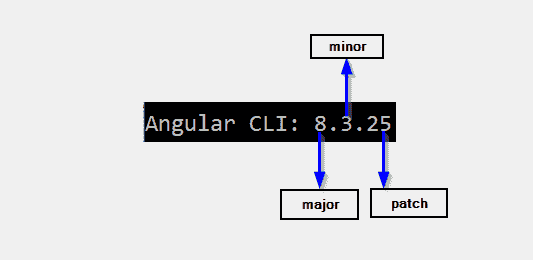
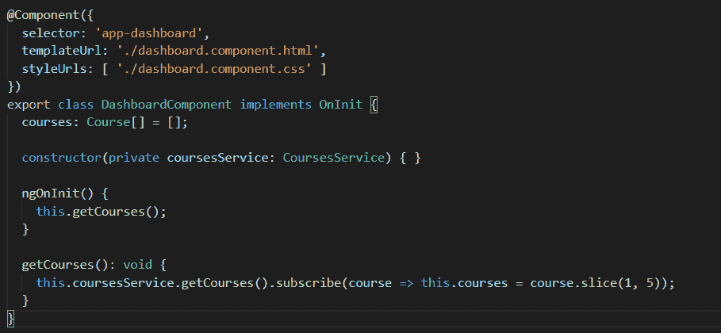
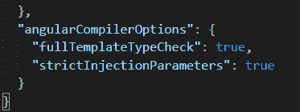

# 了解 Angular 9 新增功能的快速指南

> 原文：<https://www.edureka.co/blog/angular-9/>

我们的世界在不断前进，为了跟上它的步伐， [Angular](https://www.edureka.co/blog/angular-tutorial/) 社区一直致力于提供新功能。这可以确保您的应用程序不会被遗忘。2020 年 2 月 7 日，Angular 发布了 Angular 的全新版本，即 Angular 9。所以，如果你是一个 [Angular](https://www.edureka.co/blog/what-is-angular-getting-started-with-angular/) 爱好者，并且很想知道 Angular 9 提供了什么，那么这篇关于“Angular 9 的新功能”的文章一定会帮你解渴。

在继续之前，看看这里讨论的所有内容:

*   [了解角度版本控制](#versions)
*   [更新路径](#updatepaths)
*   [支持的版本](#supportedversions)
*   [Angular 9 有什么新功能？](#angular9)
    *   常春藤
    *   [使用 Ivy 的好处](#ivybenefits)
    *   [AOT 和艾薇](#aotandivy)
    *   [常春藤和图书馆](#ivyandlibraries)
    *   什么是 AOT？
    *   AOT 和 JIT 有什么区别？
    *   [AOT 的工作？](#workingofaot)
    *   [编译阶段](#phasesofcompilation)

## **了解角度版本控制**

角度版本指的是版本提出的变更级别，它实际上帮助用户理解当他们升级到新版本时会发生什么。你在 Angular 中看到的版本号有三个部分，即 *major.minor.patch* 。

## ****

**主要**版本通常包含大量新功能，而**次要**版本引入了较小的新功能，并且它们完全向后兼容。补丁发布通常是风险很低的错误修复。

## **更新路径**

角度更新路径取决于两个因素，即您是在同一个主版本中更新还是从一个主版本更新到另一个主版本。

*   在同一个主版本中更新时，可以省略中间版本，您可以直接升级到最新的次版本
*   从一个主要版本升级到另一个主要版本时，Angular 建议您不要跳过任何中间的主要版本

**支持的版本**

版本 **4x** 、 **5x** 和 **6x** 为**不再支持**。然而，Angular **7x** 将在 2020 年 4 月 18 日之前得到**支持，而 version **8x** 将在 2020 年 11 月 20 日**之前得到**支持。**

## **Angular 9 有什么新功能？**

Angular 9 有许多新变化，包括:

*   在 Angular 9 中，用 Ivy 编译应用程序是默认的
*   你的角度应用提前编译***(AOT)。*** 这意味着 Angular 的 AOT 编译器会在你的浏览器下载并运行它之前，将你代码中存在的所有 HTML 和类型脚本编译成 JavaScript。这种转换发生在构建过程本身，也包括类型检查
*   Angular 9 需要 TypeScript 3.7。不支持任何较低版本
*   tslib 或 TypeScript 运行时库现在已经成为对等依赖项，而不是直接依赖项。以前，这个库会自动安装，但是现在，你必须使用 *npm* 或 *yarn* 显式地添加它

### **棱角分明的九号常春藤**

Angular 9 的编译和渲染引擎被称为 Ivy。旧版本的 Angular 使用了视图引擎。视图引擎产生的包的大小非常大，但是有了 Ivy，这个包的大小大大减少了，从而帮助 Angular 克服了它的包问题。

例如，最简单的 Hello World 程序大约有 36Kb，这对于一个简单的 Hello World 程序来说是一个相当大的包。因此，Angular 团队决定保持 10Kb 的阈值。这被称为蛋糕阈值，因为该团队的负责人决定给团队所有的蛋糕，以防他们将包的大小减少到 10Kb 以下。该团队在缩小版的 Ivy 上成功地将包的大小减少到了 7.3Kb，而在压缩版的 Ivy 上，包的大小甚至更小，只有 2.7Kb。这确实是一个伟大的成就，他们应该得到所有的蛋糕！

#### **使用 Ivy 的好处**

*   较小的束尺寸
*   非常有助于调试
*   带来更快的编译

**常春藤如何产生更小的束尺寸？**

要理解 Ivy 如何减少包的大小，首先需要理解视图引擎是如何工作的。当你使用视图引擎编译任何一个[组件](https://www.edureka.co/blog/angular-tutorial/#Components)时，比如说 example.component，你基本上会得到两个 JavaScript 文件。它们是由编译的类型脚本代码组成的 example.component.js 文件和 example.component.ngfactory.js 文件，后者是[模板](https://www.edureka.co/blog/angular-tutorial/#Templates)代码的静态表示。因此，在这里，这两个文件将有一个映射，这将消耗更长的构建时间。

因此，Angular 团队决定，第二个文件，即. ngfactory.js 文件，可以通过在 JavaScript 代码本身中添加模板代码来删除。Ivy 使用函数调用，而不是像视图引擎那样遍历每个元素。

**有助于调试**

有了 Angular 9，您将不必通过框架进行调试，而是可以在组件本身上进行调试，这有助于您立即调试代码。

**更快的编译**

以前，当您使用 ng build 命令时，整个应用程序会被重新编译。这是因为角度组件知道它们自身的所有依赖性。

例如，如果你的应用程序有一个包含*ngIf 的组件，那么这个组件也会知道这个*ngIf 需要什么来编译它。因此，如果您对任何*ngIf 依赖项进行更改，所有包含该*ngIf 的组件都需要重新编译。结果，这个团队想出了一个关于**局部性原则**的想法，它带来了单个文件编译。包含*ngIf 的组件实际上不需要知道它的依赖关系。因此，在这种情况下，如果某个组件被重新编译，就不需要重新编译任何东西，从而结束了全局重新编译。常春藤调用*ngIf 的构造函数，它知道它的确切依赖关系。

**AOT 和艾薇**

AOT 和常春藤一起加速了应用程序的创建。为你的项目激活 AOT，打开 ***angular.json*** 文件，设置 ***aot*** 为 ***true*** 。

**常春藤和图书馆**

您可以使用 *ngcc* 或 Angular compatibility 编译器来构建带有视图引擎编译器库的 Ivy 应用程序。为了高效地构建您的应用程序，您必须在每次安装第三方软件包后运行 ngcc。为此，请将脚本插入 package.json 文件，如下所示:

每次安装新的[模块](https://www.edureka.co/blog/angular-tutorial/#Modules)时，将会执行*安装后*脚本。

***注意:**如果您连续安装多个库，postinstall 可能比允许 Angular CLI 在构建时运行 ngcc 要慢。*

### 什么是 AOT？

如前所述，Angular AOT 编译器会在浏览器下载并执行代码之前，将代码的 HTML 和 TypeScript 编译成 JavaScript。以下是你必须使用 AOT 编译器的几个原因:

*   使用 AOT 时，渲染速度会更快。这是因为浏览器可以下载项目的预编译版本并加载可执行代码。这有助于应用程序立即呈现，而不必先编译代码。
*   AOT 编译器会将所有外部 HTML 和 CSS 内联到应用程序 JavaScript 中，从而消除对这些源文件的离散 ajax 请求。
*   当应用已经被编译时，没有必要下载 Angular 编译器。这有助于减少正在下载的 Angular 框架的大小，因为编译器的大小是 Angular 本身的一半。
*   Angular 的 AOT 编译器将帮助您在构建过程中发现模板错误。
*   减少注入攻击，因为 HTML 模板在客户端呈现之前已预编译为 JavaScript，从而提供了更好的安全性。

### JIT 和 AOT 有什么区别？

*   AOT 加载应用程序比 JIT 编译器快得多，因为 JIT 在运行时编译应用程序。
*   与 JIT 编译器不同，AOT 根本不需要下载编译器。
*   JIT 产生的包大小会大得多，因为它也包含编译器代码。
*   在 AOT 的情况下，模板绑定错误可以在构建时检测到，这与 JIT 不同，JIT 在显示应用程序时才发现模板错误。

#### **使用 AOT**

当你使用 ng serve 或 ng build 时，JIT 编译器将开始运行。要使用 **AOT** 编译器，您可以使用带有–AOT 扩展名的相同命令，如下所示:

*   ng 发球–AOT//建造和发球
*   ng 构建–AOT//构建

#### **AOT 的工作**

AOT 通过使用在@Component、@ Input decorators 或构造函数中指定的[元数据](https://www.edureka.co/blog/angular-tutorial/#Metadata)来解释应用程序。AOT 编译器将获取所有元数据，然后为其生成一个工厂。例如，如果您有一个组件，如下所示:

Angular 的 AOT 编译器将一次性提取 DashboardComponent 的所有元数据，然后创建一个工厂。每当要创建这个类的实例时，AOT 编译器将调用产生可视元素的工厂。这将被绑定到目标组件类的一个新实例，并注入依赖项。

#### **编译阶段**

AOT 编译器分三个阶段编译应用程序:

1.  **代码分析** 在这个阶段，AOT 收集器将收集元数据，分析语法，并以尽可能好的方式表示出来。元数据语法中的任何错误都将被记录，并且不会有元数据解释
2.  **代码生成** 在这里，收集到的元数据将由编译器的 *StaticReflector* 进行解释，并且还将再次检查元数据的有效性。如果有任何违反，将抛出一个错误
3.  模板类型检查 这是一个可选阶段，Angulars 的模板编译器利用 TypeScript 编译器来检查模板中绑定表达式的有效性。如果您希望启用此功能，您可以将 **fullTemplateTypeCheck** 配置选项设置为 true，如下所示:

    

如果您正在寻找角度更新，请查看以下链接:

[角度更新路径](https://update.angular.io/#8.0:9.0)

“Angular 9 的新功能”博客到此结束。我希望这篇博客能给你带来信息和附加值。我会推荐你通过这个 ***Angular 8 教程 Edureka 视频*** 观看视频，学习如何从头开始创建一个 Angular 应用程序。

## **Angular 8 教程|从零开始创建 Angular 项目| edu reka**

[https://www.youtube.com/embed/pTec1e8oyc8?rel=0&showinfo=0](https://www.youtube.com/embed/pTec1e8oyc8?rel=0&showinfo=0)*This Edureka “Angular 8 Tutorial” will help you learn Angular 8 completely along with a step by step demonstration on how to create an Angular project from scratch.*

*查看 Edureka 提供的 [**角度训练**](https://www.edureka.co/angular-training) ，edu reka 是一家值得信赖的在线学习公司，拥有遍布全球的 250，000 多名满意的学习者。Angular 是一个 JavaScript 框架，用于创建可伸缩的、企业级的、高性能的客户端 web 应用程序。随着 Angular 框架的广泛采用，应用程序的性能管理是由社区驱动的，间接推动了更好的工作机会。Angular 认证培训旨在涵盖所有这些围绕企业应用程序开发的新概念。*