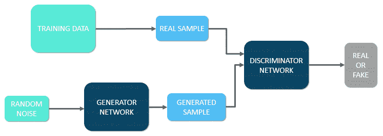
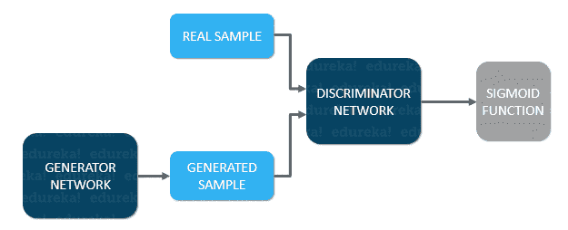
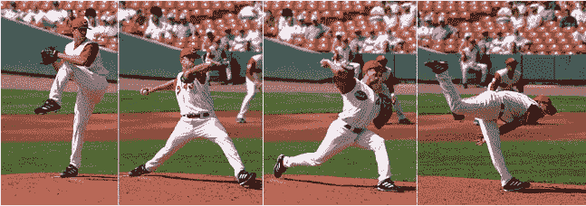

# 什么是甘？您应该如何以及为什么使用它们！

> 原文：<https://www.edureka.co/blog/what-are-gans/>

生成对抗网络或 GANs 是一种生成建模方法，使用[深度学习](https://www.edureka.co/blog/deep-learning-with-python/)以巧妙的方式训练模型，通过使用子模型方法生成数据。在本文中，我们将尝试详细了解“什么是 gan”。本文涵盖了以下主题:

*   [什么是生成模型？](#generativemodel)
*   [什么是生成性对抗性网络？](#whataregans)
    *   它是如何工作的？
    *   [如何训练 GANs？](#train)
*   [生成性对抗性网络的挑战？](#challenges)
*   [生成性对抗网络应用](#applications)

## **什么是生成模型？**

生成模型只不过是那些使用[无监督学习](https://www.edureka.co/blog/unsupervised-learning/)方法的模型。在生成模型中，数据中有样本，即输入变量 X，但它缺少输出变量 y。我们仅使用输入变量来训练生成模型，它从输入变量中识别模式，以生成未知且仅基于训练数据的输出。

在[监督学习](https://www.edureka.co/blog/supervised-learning/)中，我们更倾向于从输入变量中创建预测模型，这种类型的建模被称为判别建模。在分类问题中，模型必须辨别样本属于哪一类。另一方面，无监督模型用于在输入分布中创建和生成新的示例。

用通俗的术语来定义生成模型，我们可以说，生成模型能够从样本中生成新的例子，这些例子不仅与其他例子相似，而且是不可区分的。

生成模型最常见的例子是[朴素贝叶斯分类器](https://www.edureka.co/blog/naive-bayes-tutorial/)，它更常用作判别模型。生成模型的其他例子包括高斯混合模型和一个相当现代的例子，即一般敌对网络。让我们试着理解什么是甘？

## **什么是生成性对抗性网络？**

生成对抗网络或 GANs 是一种基于深度学习的生成模型，用于无监督学习。这基本上是一个系统，其中两个相互竞争的神经网络相互竞争来创建或产生数据的变化。

伊恩·古德费勒在 2014 年的一篇论文中首次描述了这一点，亚历克·拉德福德在 2016 年提出了一个标准化且稳定得多的模型理论，称为 DCGAN(深度卷积一般对抗网络)。目前存在的大多数 GAN 使用 DCGAN 架构。

GANs 架构由两个子模型组成，称为**发电机模型**和**鉴别器模型。**让我们试着去理解 gan 实际上是如何工作的。

### 它是如何工作的？

为了理解 GANs 是如何工作的，让我们来分解一下。

*   **生成–**这意味着该模型遵循[无监督学习](https://www.edureka.co/blog/unsupervised-learning/)方法，是一个生成模型。
*   **对抗性–**模型在对抗性的环境中接受训练
*   **网络—**对于模型的训练，使用神经网络作为人工智能算法。

在 GANs 中，有一个生成器网络，它采集样本并生成数据样本，然后，鉴别器网络使用二进制[分类](https://www.edureka.co/blog/classification-in-machine-learning/)问题，借助给出 0 到 1 范围内输出的 sigmoid 函数，决定数据是生成的还是取自真实样本。

****

生成模型以这样的方式分析数据的分布，即在训练阶段之后，鉴别器出错的概率最大化。另一方面，鉴别器基于一个模型，该模型将估计样本来自真实数据而不是生成器的概率。

整个过程可以用下面给出的数学公式来形式化。

****

在上面的公式中:

G =发电机

D =鉴别器

Pdata(x) =真实数据的分布

Pdata(z) =发电机的分配器

x =来自真实数据的样本

z =来自发电机的样本

D(x) =鉴别器网络

G(z) =发电机网络

现在是 GAN 的训练部分，可以进一步分为两个部分，按顺序进行。

## **如何训练阿甘？**

**第一部分:**

训练鉴别器并冻结发生器，这意味着发生器的训练集变为假，并且网络将仅进行正向传递，而不应用反向传播。

基本上，鉴别器是用真实数据训练的，并且检查它是否能够正确地预测它们，并且用虚假数据来识别它们是虚假的。

****

**第二部分:**

训练发电机并冻结鉴别器。在这一阶段，我们从第一阶段获得结果，并可以使用它们从以前的状态做出更好的尝试，更好地欺骗鉴别器。

****

**训练步骤**

1.  **定义问题**–定义问题并收集数据。
2.  **选择 GAN 架构**–根据您的问题选择您的 GAN 应该是什么样子。
3.  **用真实数据训练鉴别器**–用真实数据训练鉴别器，n 次预测它们是真实的。
4.  **为生成器生成假输入**–从生成器生成假样本
5.  **训练鉴别器识别虚假数据**–训练鉴别器预测生成的数据为虚假数据。
6.  **用鉴频器的输出训练发电机—**得到鉴频器的预测后，训练发电机欺骗鉴频器

## **生成性对抗网络的挑战**

GANs 的概念相当吸引人，但在它的道路上有许多挫折会造成许多障碍。GANs 面临的一些主要挑战是:

1.  **稳定性**需要在鉴别器和发生器之间，否则整个网络就会崩溃。万一鉴别器太厉害，发生器就完全训练失败了。如果网络过于宽松，将会生成任何图像，使网络变得无用。
2.  GANs 在确定对象的**位置方面失败得很惨，根据对象应该在该位置出现多少次。**
3.  三维透视困扰着 GANs，因为它不能理解**透视**，它通常会给出三维物体的平面图像。
4.  甘在理解**全球物体**方面有问题。它不能区分或理解整体结构。
5.  新型的 GANs 更先进，有望完全克服这些缺点。

## **生成性对抗性网络应用**

以下是 GANs 的几个应用。

**预测视频中的下一帧**

在 GANs 的帮助下，在视频帧中预测未来事件成为可能。DVD-GAN 或双视频鉴频器 GAN 可以生成 256×256 的视频，具有显著的保真度，最长可达 48 帧。这可以用于各种目的，包括监视，其中我们可以确定由于雨水、灰尘、烟雾等其他因素而变形的帧中的活动。

****

**文本到图像生成**

对象驱动的注意力 GAN(obj-GAN)分两步执行文本到图像的合成。生成语义布局是初始步骤，然后通过使用去卷积图像生成器合成图像来生成图像是最终步骤。

****

这可以通过理解标题、布局和通过合成文字提炼细节来集中用于生成图像。还有另一项关于故事情节的研究，这些故事情节可以从简单的段落合成整个故事板。

**增强图像的分辨率**

超分辨率生成对抗网络(SRGAN)是一种能够从低分辨率图像生成具有更好细节和质量的超分辨率图像的对抗网络。

****

应用可能是巨大的，想象一下从低分辨率图像生成的具有更精细细节的更高质量的图像。它对识别低分辨率图像中的细节的帮助可以用于更广泛的目的，包括监视、文档、安全、检测模式等。

**图像到图像的翻译**

Pix2Pix GAN 是为通用图像-图像-翻译而设计的模型。

****

**交互式图像生成**

GAN 也可以用来生成交互式图像，计算机科学和人工智能实验室(CSAIL)已经开发了一种 GAN，它可以通过形状和纹理编辑来生成具有真实光照和反射的三维模型。

最近，研究人员提出了一种模型，可以合成一个由人的运动激活的重演的脸，同时保留脸的外观。

****

这就把我们带到了本文的结尾，在这里我们学习了“什么是 gan”。我希望你清楚本教程中与你分享的所有内容。

*如果您发现这篇文章与“什么是 GANs”相关，请查看使用 Python 进行机器学习的  [Edureka 认证培训，](https://www.edureka.co/machine-learning-certification-training) 这是一家值得信赖的在线学习公司，拥有遍布全球的 250，000 多名满意的学习者。*

*我们在这里帮助你踏上旅程的每一步，并为想要成为  [Python 开发者](https://www.edureka.co/blog/how-to-become-a-python-developer/)的学生和专业人士设计课程。该课程旨在让您在 Python 编程方面有一个良好的开端，并训练您掌握核心和高级 Python 概念以及各种  [Python 框架](https://www.edureka.co/blog/python-frameworks/) ，如  [Django。](https://www.edureka.co/blog/django-tutorial/)*

如果您遇到任何问题，请在“什么是 GANs”的评论区提出您的所有问题，我们的团队将很乐意回答。