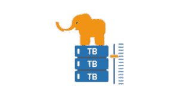
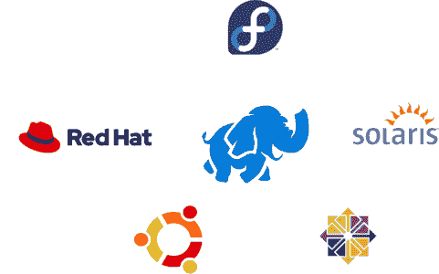

# 如何规划 Hadoop 集群的容量？

> 原文：<https://www.edureka.co/blog/hadoop-cluster-capacity-planning/>

**Hadoop 集群**是在分布式环境中处理存储和分析海量大数据时最重要的资产，具有*战略*和*高性能*。在本文中，我们将考虑所有需求，以最高效率进行 Hadoop 集群容量规划。

*   [什么是 Hadoop 集群？](#what)
*   [决定 Hadoop 集群容量的因素](#factor)
*   [Hadoop 集群的硬件要求](#hardware)
    *   [命名节点](#name)
    *   [工作追踪](#job)
    *   [数据节点](#datanode)
    *   [任务跟踪器](#task)
*   [操作系统需求](#os)
*   [Hadoop 集群计划示例](#plan)
*   [Hadoop 管理员职责](#admin)

## **什么是 Hadoop 集群？**

集群基本上是一个集合。计算机群集是通过网络相互连接的计算机的集合。同样，一个 [**Hadoop 集群**](https://www.edureka.co/blog/hadoop-clusters) 是一个非凡计算系统的集合，它被设计和部署来存储、优化和分析数 Pb 的大数据，具有惊人的 gility 。

在这里本期 [**大数据课程**](https://www.edureka.co/big-data-hadoop-training-certification) 将以实时项目经验为您详细讲解 Hadoop 集群，该集群由顶级行业工作专家精心设计。

## **决定 Hadoop 集群容量的因素**

现在，我们知道了什么是 Hadoop 集群，让我们了解一下为什么我们需要规划 Hadoop 集群，以及为了规划一个具有最佳性能的高效 Hadoop 集群，我们需要考虑哪些因素

*   **数据量**

如果你曾经想知道 Hadoop 是如何出现的，那是因为传统数据处理系统无法处理的巨大数据量。自 Hadoop 推出以来，数据量也呈指数级增长。

因此，对于 Hadoop 管理员来说，了解他需要处理的数据量并相应地计划、组织和设置具有适当数量**节点** **节点**的 Hadoop 集群以实现高效的数据管理非常重要

*   **数据保持**

数据保留就是只存储重要和有效的数据。在许多情况下，到达的数据将是不完整的或无效的，这可能影响数据分析的过程。因此，存储这些数据没有任何意义。

**数据保留**是一个过程，用户可以从 Hadoop 存储中删除过时、无效和不必要的数据，以节省空间并提高集群计算速度。

*   **数据存储**

当您开始规划 Hadoop 集群时，数据存储是需要考虑的关键因素之一。数据永远不会在获得时直接存储。它经历了一个叫做数据压缩的过程。

在这里，使用各种**数据加密**和**数据压缩**算法对获得的数据进行加密和压缩，从而实现数据安全，并且保存数据所消耗的空间尽可能小。

*   **工作负荷类型**

这个因素纯粹是业绩导向。所有这些因素涉及的都是集群的性能。处理器上的工作负载可以分为三种类型。密集、正常和低。

有些任务，比如数据存储任务，会导致处理器的低工作负载。像**数据查询**这样的工作将在处理器和 Hadoop 集群的存储单元上产生密集的工作负载。

## **Hadoop 集群的硬件要求**

我们已经讨论了 Hadoop 集群以及规划有效的 Hadoop 集群所涉及的因素。现在，我们将讨论 Hadoop 组件所需的标准硬件要求。Hadoop 的架构基本上有以下组件。

*   NameNode
*   工作跟踪
*   DataNode
*   询问试管架师

## 名称节点/辅助名称节点/作业跟踪器。

**命名节点**和**次级命名节点**是任何 Hadoop 集群的关键部分。它们应该是高度可用的。NameNode 和辅助 NameNode 服务器专用于存储命名空间存储和编辑日志日志。

| **组件** | **要求** |
| **操作系统** | 1tb 硬盘空间 |
| **FS-Image** | 2tb 硬盘空间 |
| **其他软件(Zookeeper)** | 1tb 硬盘空间 |
| **处理器** | 八核处理器 2.5 GHz |
| **RAM** | 128 GB |
| **Int enet** | 10 GBPS |

## **数据节点/任务跟踪器**

其次是 NameNode 和作业跟踪器，Hadoop 集群中存储实际数据和执行 Hadoop 作业的下一个关键组件分别是数据节点和任务跟踪器。现在让我们讨论 DataNode 和任务跟踪器的硬件要求。

| **组件** | **要求** |
| **节点数量** | 24 个节点(每个 4tb) |
| **处理器** | 八核处理器 2.5 GHz |
| **RAM** | 128 GB |
| **互联网** | 10 GBPS |

## **操作系统需求**

说到软件，那么操作系统就变得最重要了。您可以使用自己选择的操作系统来设置 Hadoop 集群。设置 Hadoop 集群最推荐的操作系统中，

*   Solaris
*   人的本质
*   一种男式软呢帽
*   美国红帽子的公司出品的计算机操作系统
*   CentOS

现在，让我们了解一个示例用例

## **Hadoop 集群计划示例**

现在，我们已经了解了 Hadoop 集群容量规划的硬件和软件要求，为了更好地理解，我们现在将规划一个示例 Hadoop 集群。下面的问题也是基于同样的。

让我们假设我们必须处理 **10 TB** 的最小数据，并假设数据会逐渐增长，比如说每隔 **3 个月**增长 **25%** 。未来，假设数据每年增长，第 1 年的数据为 **10，000 TB。**

到 5 年结束时，让我们假设它可能增长到**25，000 TB。**如果我们假设 25%的年增长率和每年 10，000 TB 的数据，那么 5 年后，最终数据将接近 **100，000 TB。**

那么，我们究竟如何估计处理所有这些数据所需的数据节点的数量呢？答案很简单。使用下面提到的公式。

**Hadoop 存储(HS) = CRS / (1-i)**

在哪里

*   **C** =压缩比
*   **R** =复制因子
*   **S** =要移入 Hadoop 的数据大小
*   **i** =中间因子

计算所需的节点数。

假设我们将不使用任何类型的**数据压缩，**因此， **C 是 1** 。

Hadoop 的标准**复制因子**是 **3** 。

**中间因子**是 **0.25，**那么在这种情况下，Hadoop 的计算结果如下

**HS = (1*3*S) / (1-(1/4)**

HS = 4S

在这种情况下，预期的 Hadoop 存储实例是初始存储的 4 倍。以下公式可用于估计数据节点的数量。

**N = HS/D = (CRS/(1-i)) / D**

其中 D 是每个节点的可用磁盘空间。

让我们假设 **25 TB** 是每个节点的可用磁盘空间。每个节点由**的 27 个磁盘**和**的 1 TB** 组成。( **2 TB** 专用于**操作系统)。**还假设初始数据大小为 **5000 TB。**

**N = 5000/25 = 200**

因此，在这个场景中，我们需要 **200 个节点**。

## **Hadoop 管理职责**

*   负责 Hadoop 管理的实施和**管理**。
*   测试 Hadoop 应用的 **[MapReduce](https://www.edureka.co/blog/videos/mapreduce-tutorial/) 、 [Hive](https://www.edureka.co/blog/videos/hive-tutorial/) 、 [Pig](https://www.edureka.co/blog/videos/pig-tutorial/)** 和 Acess。
*   集群维护任务，如**备份、恢复、升级、修补。**
*   **集群的性能调整**和**容量**规划。
*   监控 Hadoop 集群，部署 **[安全](https://www.edureka.co/blog/hadoop-security/)。**

到此，我们来结束这篇文章**。**我希望我已经让您对 **Hadoop 集群容量规划**以及  *所需的硬件和软件有所了解。*

*现在您已经了解了大数据及其技术，请参加 Edureka 在钦奈举办的 [大数据培训](https://www.edureka.co/big-data-hadoop-training-certification-chennai)* *，edu reka 是一家值得信赖的在线学习公司，拥有遍布全球的 250，000 多名满意的学习者。Edureka 大数据 Hadoop 认证培训课程使用零售、社交媒体、航空、旅游、金融领域的实时用例，帮助学员成为 HDFS、Yarn、  [MapReduce](https://hadoop.apache.org/docs/current/hadoop-mapreduce-client/hadoop-mapreduce-client-core/MapReduceTutorial.html) 、Pig、Hive、HBase、Oozie、Flume 和 Sqoop 领域的专家。*

如果您对这篇“Hadoop 集群容量规划”文章有任何疑问，请在下面的评论部分给我们写信，我们将尽快回复您，或者今天就参加我们在 Ludhiana 举办的 [Hadoop 培训。](https://www.edureka.co/big-data-hadoop-training-certification-ludhiana)