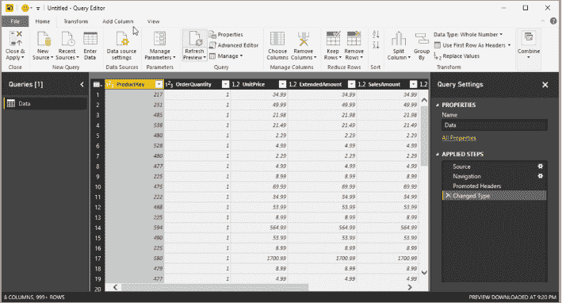
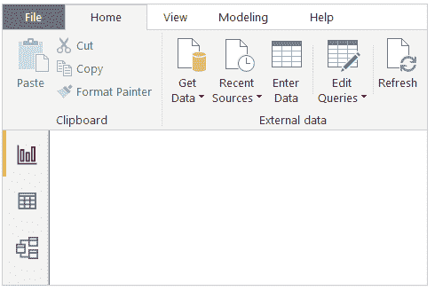
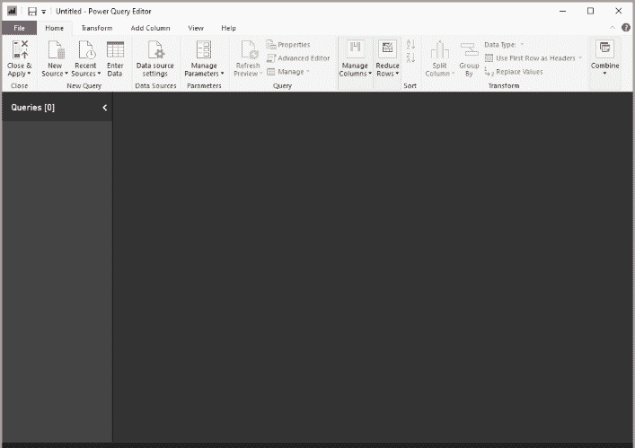
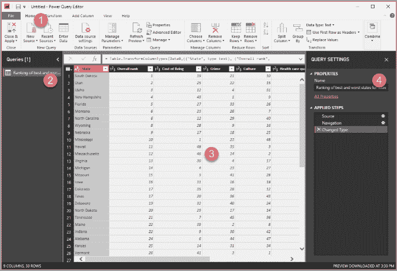
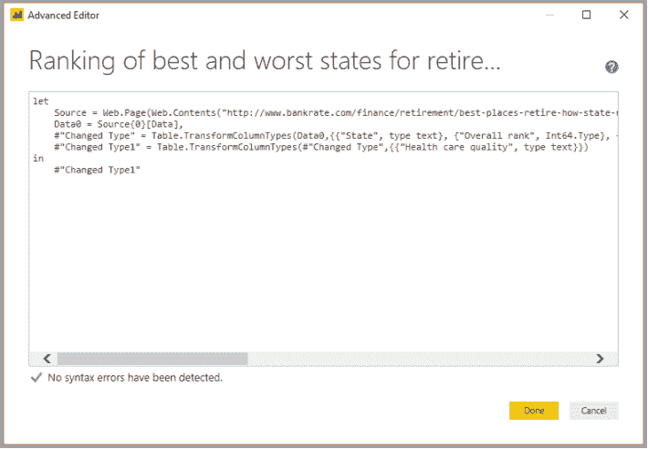

# 超级查询编辑器简介

> 原文：<https://www.edureka.co/blog/introduction-to-power-query/>

借助 ***Power BI*** 您可以连接到数据世界，创建引人注目的交互式报告，与他人分享您的成果，并拓展他们的商业智能成果。 ***Power Query*** 帮助您连接到源，形成和转换数据以满足您的需求。

本文提供了该特性的概述，但是还有更多需要学习的地方，你对数据处理得越多，对该特性理解得越多，你得到的工具就越强大。现在，这不是你需要知道的一切，但以下主题是一个很好的开始:

*   [**概述**](#powerqueryoverview)
    *   [**什么是电量查询？**](#whatispowerquery)
    *   [**数据源**](#datasources)
    *   [**电量查询编辑**](#queryeditor)
*   [**电力查询中的电力 BI**](#powerquerypowerbi)
*   [**M-幂查询公式语言**](#mpowerqueryformulalanguage)
*   **[快速入门:如何在 Power BI 中使用电量查询？](#usepowerquery)**
    *   [**电量查询高级编辑**](#powerqueryadvancededitor)
    *   [**保存工作**](#saving)
*   [**汇总**](#summary)

那么，让我们熟悉一下这项技术。

## **电量查询概述**

那么到底什么是权力查询呢？

### **什么是电量查询？**

Power Query 是微软的数据连接和数据准备技术。基本上，它使业务用户能够无缝地访问存储在数据源中的数据，同时根据他们的需求对其进行改造。它易于使用，引人入胜，甚至方便无代码用户使用。

**♠** ***注意:**你们很多人可能会搞混 m 和 DAX。让我一劳永逸地澄清一下，这两者是完全不同的。M 是一种混搭查询语言，用于查询大量数据源， [**DAX(或** **数据分析表达式)**](https://www.edureka.co/blog/power-bi-dax-basics/) 是一种公式语言，用于处理存储在表中的数据。*

### **数据来源**

支持的数据源包括各种文件类型、数据库、Microsoft Azure 服务和许多其他第三方在线服务。它还提供了一个自定义连接器 SDK，以便第三方可以创建自己的数据连接器，并无缝地将它们插入到 Power Query 中。

### **电量查询编辑**

Power Query Editor是原生集成到几款微软产品中的初级数据准备体验，包括但不限于 ***[微软 Excel](https://www.edureka.co/blog/excel-tutorial/)*** ， ***[微软 Power BI](https://www.edureka.co/blog/power-bi-visuals/)*** ， ***[微软 SQL Server 数据工具](https://www.edureka.co/blog/msbi-vs-power-bi/)*** 等。这反过来允许用户通过在用户体验中预览数据和选择转换来应用 300 多种不同的数据转换。

尽管底层数据源存在局限性，但这些数据转换功能在所有数据源中都是通用的。

## **电力 BI 中的电力查询**

[***电量匕桌面***](https://www.edureka.co/blog/power-bi-tutorial/) 自带电量查询编辑器。您可以使用超级查询编辑器连接到一个或多个数据源，形成和转换数据。您可以修改手头的数据以满足您的需求，使其更加可用，然后将该模型加载到 Power BI Desktop 中。

要进入查询编辑器，从 Power BI 桌面的 ***主页*** 选项卡中选择 ***编辑查询*** 。由于没有数据连接，查询编辑器看起来很枯燥，就像一个空白的窗格。

 但是一旦一个查询被加载，这个编辑器视图就变得更有趣了。如果我们连接到一个数据源，查询编辑器加载关于数据的信息，然后您可以在基于它建立模型之前开始塑造这些信息。

本 edu reka“Power Query Tutorial”视频将帮助您了解数据连接技术为 Power BI Desktop 带来的价值，以及它如何为转换和呈现商业智能数据提供强大的工具。

[https://www.youtube.com/embed/yw3naW_XCsI](https://www.youtube.com/embed/yw3naW_XCsI)

## **M:电力查询公式语言**

Microsoft Power Query 提供了强大的数据导入体验，包含许多功能。Power Query 适用于 Analysis Services、Excel 和 Power BI 工作簿。

Power Query 的一个核心功能是从它支持的丰富的数据源集合中过滤和组合数据。任何这样的数据混搭都使用一种功能性的、区分大小写的语言来表达，这种语言被称为 M Formula Language。

它与 F#非常相似，用于查询大量的数据源。它包含转换数据的命令，可以将查询结果返回到 Excel 表或 Power BI 数据模型。

## **快速入门:如何在 Power BI 中使用电量查询？**

让我们熟悉一下查询编辑器。

因此，一旦进入查询编辑器，就没有数据连接了。查询编辑器显示为空白窗格，准备输入数据。

如果你连接到 ***[这个 web 数据源](https://www.bankrate.com/retirement/best-and-worst-states-for-retirement/)***查询编辑器加载关于数据的信息。然后你可以开始塑造和改造它。

一旦建立了数据连接，查询编辑器  就会显示如下:

1.  ***功能区*** 有许多按钮，这些按钮现在是活动的，用于与查询中的数据进行交互。
2.  在 ***左窗格*** 中，列出了查询并可供选择、查看和整形。
3.  在 ***中心窗格*** 中，显示所选查询的数据，并可用于整形。
4.  出现  ***查询设置*** 窗口，列出查询的属性和应用步骤。

**电量查询高级编辑器**

如果你想看到查询编辑器在每一步创建的代码，或者想创建你自己的整形代码，你可以使用高级编辑器。

*   要启动高级编辑器，从功能区选择 ***视图*** ，然后选择 ***高级编辑器*** 选项。将出现一个窗口，显示现有的查询代码。

*   您可以在 ***高级编辑器*** 窗口中直接编辑代码。
*   关闭窗口，选择***完成*** 或 ***取消*** 按钮。

### **保存您的工作**

当您的查询在您想要的地方时，您可以让编辑器将更改应用到数据模型。

*   为此，从功率查询编辑器的 ***文件*** 菜单中选择 ***关闭&应用*** 。

随着进度的进行，Power BI Desktop 会提供一个对话框来显示其状态。

一旦你有了你的查询，确保你的工作被保存，Power BI Desktop 可以将你的工作保存在 ***。pbix*** 文件。

*   要保存您的工作，选择  ***文件>另存为*** 或者如果您不是第一次保存，您可以 ***文件>保存*** *。*

## **总结**

在本文中，您了解了 Power Query 特性、它的各种数据库和 M 语言。您还简要了解了如何使用 Power BI Desktop 中的查询编辑器和高级编辑器，同时了解了如何连接到数据源并保存查询。

要了解更多关于 Power BI、 *的概念，请查看我们的 [**Power BI 培训认证**](https://www.edureka.co/power-bi-certification-training) ，它附带有讲师指导的现场培训和真实项目经验。本培训将帮助您深入了解 Power BI，并帮助您掌握该主题。*

*有问题吗？请在评论区提到它，我们会给你回复。*