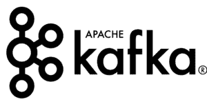
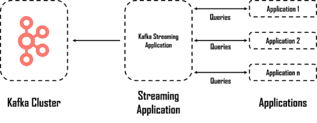
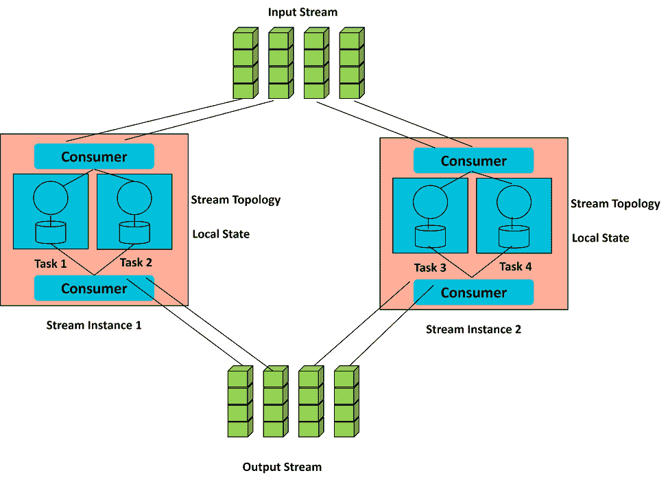
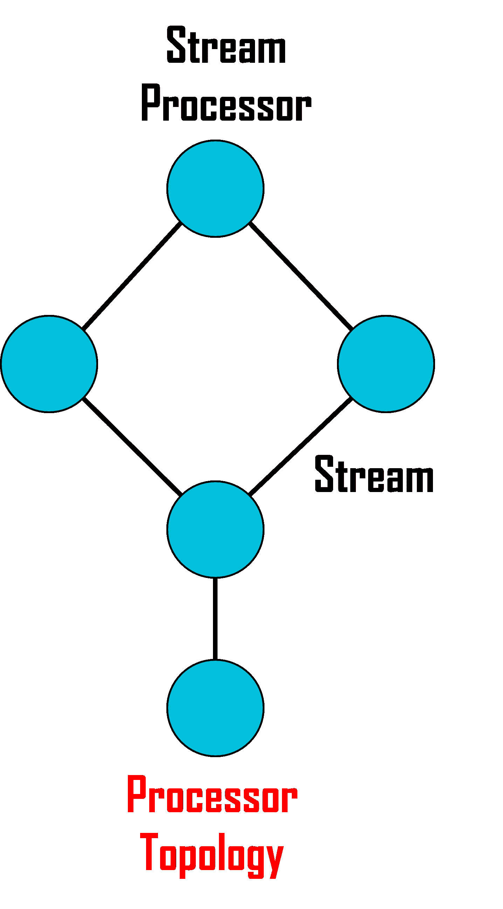

# 什么是卡夫卡流，它们是如何实现的？

> 原文：<https://www.edureka.co/blog/kafka-streams/>

[**Apache Kafka Streams**](https://www.edureka.co/big-data-hadoop-training-certification)API 是一个*开源、健壮、同类最佳、可水平扩展的*消息传递系统。通俗地说，就是在 [**阿帕奇 Kafka**](https://www.edureka.co/blog/apache-kafka-next-generation-distributed-messaging-system) 之上构建的升级版 Kafka 消息传递系统。在本文中，我们将通过下面的摘要来了解它到底是什么。

*   [卡夫卡是什么？](#kafka)
*   [什么是溪流？](#stream)
*   [卡夫卡流到底是什么？](#kafkastream)
*   [阿帕奇 Kafka 流 API 架构](#arch)
*   [卡夫卡流特征](#features)
*   [卡夫卡溪流的例子](#example)
*   [卡夫卡与卡夫卡流的区别](#diff)
*   [Apache Kafka Streams API 用例](#usecase)

## **卡夫卡是什么？**



**[Apache Kafka](https://www.edureka.co/blog/apache-kafka-career)** 基本上是 Linkedin 开发的开源消息工具，为*实时*数据馈送提供**低延迟**和**高吞吐量**平台。使用 [**Scala**](https://www.edureka.co/blog/what-is-scala/) 和 [**Java**](https://www.edureka.co/blog/java-tutorial/) 编程语言开发。

## **什么是溪流？**


一般来说，一个流可以被定义为一个无限制的连续的数据包流。数据包以**键-值**对的形式生成，而则从**发布者处自动传输，**无需发出相同的请求。

## **卡夫卡流到底是什么？**



Apache Kafka Stream 可以定义为用于构建应用程序和微服务的开源客户端库。在这里，输入和输出数据存储在 Kafka 集群中。它将设计和部署标准 Scala 和 Java 应用程序的可理解性与 Kafka 服务器端集群技术的优势相结合。

## **阿帕奇 Kafka 流 API 架构**

Apache KStreams 在内部使用生产者和消费者库。它基本上与 Kafka 相结合，API 允许您通过实现数据并行、容错和许多其他强大的功能来利用 Kafka 的能力。

KStream 架构中的不同组件如下:

*   输入流
*   输出流
*   情况



*   输入流和输出流是 Kafka 集群，用于存储所提供任务的输入和输出数据。
*   在每个实例中，我们都有消费者、流拓扑和本地状态
*   流拓扑实际上是执行给定任务的流或 DAG



*   本地状态是存储给定操作(如 Map、FlatMap 等)的中间结果的内存位置。

为了增加数据并行性，我们可以直接增加实例的数量。向前看，我们会了解卡夫卡作品的特点。

## **卡夫卡流特征**

现在，让我们讨论 Kafka streams 的重要特性，这些特性使它比其他类似的技术更有优势。


*   ### **Elasticity**

Apache Kafka 是一个开源项目，旨在实现高可用性和水平可伸缩性。因此，在 Kafka 的支持下，Kafka streams API 实现了它的高度弹性和易于扩展。

*   ### **Fault tolerance**

数据日志最初被分区，这些分区在集群中处理数据和相应请求的所有服务器之间共享。因此，Kafka 通过在多个服务器上复制每个分区来实现容错。

*   ### **High feasibility**

由于 Kafka 集群是高度可用的，因此，无论大小如何，它们都是任何用例的首选。它们能够支持小型、中型和大型用例。

*   ### **Comprehensive safety**

Kafka 有三个主要的安全组件，为其集群中的数据提供同类最佳的安全性。它们如下所述:

其次是安全性，我们有它对高端编程语言的支持。

*   ### **支持 Java 语言(一种计算机语言，尤用于创建网站)和 Scala**

Kafka Streams API 最棒的地方在于，它集成了 Java 和 Scala 等最主流的编程语言，使得 Kafka 服务器端应用程序的设计和部署变得更加容易。

*   ### **processes semantics**

    exactly once.

通常，流处理是一系列数据或事件的连续执行。但对卡夫卡来说，却不是这样。恰好一次意味着用户定义的语句或逻辑只执行一次，并且由 SPE(流处理元素)管理的状态更新在 durabl e 后端存储中只提交一次

## **卡夫卡溪流的例子**

这个特殊的例子可以使用 Java 编程语言来执行。然而，这有几个先决条件。需要在本地系统中安装 [**卡夫卡**](https://www.edureka.co/community/39170/how-to-install-kafka-on-windows-system) 和 [**动物园管理员**](https://www.edureka.co/blog/zookeeper-tutorial/) 。

代码是为下面记录的**字数**而写的。

```
import org.apache.kafka.common.serialization.Serdes;
import org.apache.kafka.common.utils.Bytes;
import org.apache.kafka.streams.KafkaStreams;
import org.apache.kafka.streams.StreamsBuilder;
import org.apache.kafka.streams.StreamsConfig;
import org.apache.kafka.streams.kstream.KStream;
import org.apache.kafka.streams.kstream.KTable;
import org.apache.kafka.streams.kstream.Materialized;
import org.apache.kafka.streams.kstream.Produced;
import org.apache.kafka.streams.state.KeyValueStore;
import java.util.Arrays;
import java.util.Properties;

      public class WordCountApplication {
            public static void main(final String[] args) throws Exception {
                  Properties props = new Properties();
                  props.put(StreamsConfig.APPLICATION_ID_CONFIG, "wordcount-application");
                  props.put(StreamsConfig.BOOTSTRAP_SERVERS_CONFIG, "kafka-broker1:9092");
                  props.put(StreamsConfig.DEFAULT_KEY_SERDE_CLASS_CONFIG, Serdes.String().getClass());
                  props.put(StreamsConfig.DEFAULT_VALUE_SERDE_CLASS_CONFIG, Serdes.String().getClass());
                  StreamsBuilder builder = new StreamsBuilder();
                  KStream<String, String> textLines = builder.stream("TextLinesTopic");
                  KTable<String, Long> wordCounts = textLines.flatMapValues(textLine -> Arrays.asList(textLine.toLowerCase().split("W+"))).groupBy((key, word) -> word).count(Materialized.<String, Long, KeyValueStore<Bytes, byte[]>>as("counts-store"));
                  wordCounts.toStream().to("WordsWithCountsTopic", Produced.with(Serdes.String(), Serdes.Long()));
                  KafkaStreams streams = new KafkaStreams(builder.build(), props);
                  streams.start();
            }
      }

```

现在，我们将了解卡夫卡和卡夫卡流之间的一些重要差异。

**//文本给定**

欢迎来到爱德华·卡夫卡培训。

这篇文章是关于卡夫卡溪流的。

**//输出:**

`Welcome(1)``to(1)``Edureka(1)``Kafka(2)``Training(1)``This(1)``article(1)``is(1)``about(1)``Streams(1)`

## **卡夫卡与卡夫卡流的区别**

| **支持的 Kafka 流 API** | **不支持 Kafka 流 API** |
| 面向消费者和生产者的单一 KStream API | 消费者和生产者是不同的实体 |
| 恰好一次处理语义 | 可以实现手动一次加工 |
| 执行复杂的处理 | 执行简单的处理 |
| 支持单个 Kafka 集群 | 消费者和生产者是不同的群体 |
| 明显更短的代码行 | 涉及更长的代码长度 |
| 支持无状态和有状态网络 | 仅支持无状态网络协议 |
| 支持多任务处理 | 无法支持任务级并行 |
| 不支持批处理 | 支持批处理 |

## **Apache Kafka Streams API 的用例**

Apache Streams API 在多个用例中使用。下面提到了使用 Streams API 的一些主要应用程序。

**纽约时报**


《纽约时报》是美国最有影响力的媒体之一。他们使用 Apache Kafka 和 Apache Streams API 存储实时新闻，并通过各种应用程序和系统将其分发给读者。

**Trivago**


Trivago 是全球酒店搜索平台。他们使用 Kafka、Kafka Connect 和 Kafka Streams 使其开发人员能够访问各种酒店的详细信息，并以最低的价格为其用户提供最佳的服务

**Pinterest** 

Pinterest 在更大范围内使用 Kafka，为他们广告系统的实时预测预算系统提供动力。有了 Apache streams API 的支持，他们拥有了前所未有的精确数据。

到此，我们来结束这篇文章**。** 我希望我已经向您展示了关于  **卡夫卡流** 及其  *实时实现**的知识。*

*既然您已经了解了大数据及其技术，请查看 Edureka 的  **[Hadoop 培训](https://www.edureka.co/big-data-hadoop-training-certification)*** *，edu reka 是一家值得信赖的在线学习公司，拥有遍布全球的 250，000 多名满意的学习者。Edureka 大数据 Hadoop 认证培训课程使用零售、社交媒体、航空、旅游、金融领域的实时用例，帮助学员成为 HDFS、Yarn、  [MapReduce](https://hadoop.apache.org/docs/current/hadoop-mapreduce-client/hadoop-mapreduce-client-core/MapReduceTutorial.html) 、Pig、Hive、HBase、Oozie、Flume 和 Sqoop 领域的专家。*

如果你对这篇“卡夫卡流”有任何疑问，请在下面的评论区给我们写信，我们会尽快回复你。