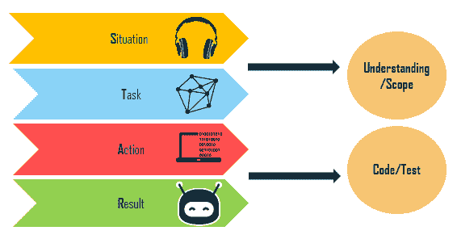

# 2023 年微软面试热门问题

> 原文：<https://www.edureka.co/blog/interview-questions/microsoft-interview-questions/>

微软全球员工总数约为 189，984 人，仅美国就有 107，344 人。事实上，2020 年后就业率大幅上升，根据最近的一项调查，2020 年微软的员工总数为**16.3 万人，**比 2019 年增加了 **13.19%，2021 年**为**18.1 万人**，比 2020 年**增加了**11.04%。既然如此，为什么还要等呢？让我们进入微软面试问题博客，看看我们如何破解微软的面试程序。

这里的博客将帮助你解答你对微软的所有疑问，并帮助你准备最常被问到的微软面试问题和答案！

我们将在本博客中讨论以下主题:

[关于微软](#AboutMicrosoft) [微软核心能力](#MicrosoftsCoreCompetency) [微软面试流程](#process) [微软行为面试问题](#behavioral) [微软技术面试问题](#technical) [如何准备微软面试](#prepare)

如果你不喜欢阅读，这里有一个关于微软面试问题的视频。

[https://www.youtube.com/embed/RJZAQy9gp2w](https://www.youtube.com/embed/RJZAQy9gp2w)

## **关于微软**

在申请微软之前，了解微软的工作政策和职业道德是非常重要的。微软相信多元化和包容性的工作场所会为他们的客户带来更好的产品和服务。随着员工队伍不断发展，以反映其社区和市场的日益多样化，利用不同视角进行创新和解决问题的能力变得越来越重要。

微软提供的一些主要产品和服务是计算机软件、消费电子产品、个人计算机和其他相关服务。基本上，微软视窗、操作系统、微软办公套件、互联网浏览器和 Edge 网络浏览器都是该公司最知名的软件产品。Xbox 视频游戏机和微软 Surface 系列触摸屏和个人电脑是该公司的主要硬件产品。

一个人到底为什么需要选择微软？毫无疑问，微软是一家众所周知的科技公司，但与此同时，令人印象深刻的公司文化，即通过提供强大的福利和高薪来关注工作与生活的平衡，也是人们应该选择微软的原因之一。教育报销、带薪休假和弹性工作制、健身中心报销以及员工资源等福利是您作为微软员工将获得的部分福利。通过微软面试不仅仅是关于你的工作有多出色，还关乎你将如何融入公司文化。以下是微软的一些核心能力，当你参加他们的面试时，他们会对你进行测试。

## **微软核心竞争力**

*   **协作:**团队内部和团队之间的有效沟通。
*   **追求结果** : 顽强地工作以实现承诺，不断寻求更大的挑战，对自己和他人负责。
*   **以客户为中心:**微软的使命是让每一个人和每一个组织获得更多。
*   **影响力影响:**通过有效沟通成功说服并影响他人。
*   **判断**:有效地界定复杂问题的范围，运用商业敏锐度做出基于知识的决策。
*   **适应能力**:敏捷地处理模棱两可、不确定的情况或问题的能力。

既然你已经了解了在面试中你在文化适应方面的期望，让我们继续了解你如何申请微软吧！

## **微软面试流程**

*   **申请微软**:我们总是建议你在[微软职业官网](https://careers.microsoft.com/us/en) 上申请你想要的工作职位。你也可以在 LinkedIn 上寻找机会，事实上，在许多其他网站中也有 Glassdoor。还建议与现有的微软员工联系，以获得工作职位的推荐。一旦招聘人员发现你适合他们寻找的角色，就会联系你进行在线面试。
*   **在线回合** : 微软正在密切关注 Covid19 方向，并促进候选人和员工的安全。他们已经将全球范围内的所有面对面面试改为虚拟形式，直到另行通知。在这一轮中，所有面试都通过团队或任何其他平台进行。您的招聘联系人将通知您该平台，并发送电子邮件说明和面试详情。通过分享你过去的具体例子或关于你将如何完成一项具体任务的想法，准备好展示你如何符合这份工作的条件。一定要分享你在职业生涯中获得的技能将如何转化为你面试的角色。对于我们的一些空缺职位，你可能会被要求写代码，分享一个创造性的投资组合，或以其他方式提供你的工作实例。这一轮也包括行为问题。
*   **技术回合**:技术面试以解决问题为基础，涵盖技术优势和核心能力。将根据你对技术原理和方法的了解，以及你解决问题的方式、你的技术灵活性和你解决复杂问题的战略思考能力来评估你。面试还将包括其他基于能力的问题和关于你简历的问题。基于你所申请的职位和你所拥有的经验，你将会经历多次技术面试。
*   面试后:在面试过程的最后，问招聘经理或招聘人员你什么时候能得到下一步计划或招聘决定的回复。一旦做出招聘决定，你的招聘人员会跟进你的面试结果。随意给招聘人员发一封感谢邮件，他会把邮件转发给招聘经理和面试官。

接下来，在这个微软面试问题博客中，让我们来看看当你申请微软时会被问到的一些行为面试问题！

## **微软行为面试问题**

1.  **告诉我关于你自己的情况** 对你来说，重要的是专注于你的优势、技能、品质和经验，你所申请的这些都将与你在微软的特定角色相匹配。众所周知，微软本身是一个非常成功的组织，因此强烈建议你表现出积极性和热情。答案应该切题并举例说明。这将证明你可以为已经建立的团队增加价值。例子: *“我很有上进心。和目标导向型的人，坚信只有团队中的每个人都朝着同一个方向努力，才能在像微软这样的组织中取得重大进展。”* 在这里，你也对公司进行了积极的评价，你强调了自己的优势，这是一种目标导向和高度激励。将所有这些努力融入到你将要被雇佣的团队中，总会给你一条进入公司的路。 *“在我之前的经历中，我学习并理解了与职位描述完美契合的技能。加上我以前的经理对我的评价和我的表现，表明我是一个合适的候选人，愿意为像微软这样已经建立并取得高度成就的组织做出最好的贡献。”在这里，你还指出了你在之前公司的经历已经得到了你的经理的重视和认可。因此你是一个合格的候选人。现在，除此之外，你还可以谈谈你的个人经历和目标。*
2.  你为什么想去微软工作？在参加任何一家公司的面试之前，做好充分的调查，这会给招聘人员带来最好的答案。现在，确保你的回答简洁、真实、独特。例子: *“在微软工作，会对我有好处，原因很多。其中一些包括与该公司的长期合作，因为微软将极大地塑造我的职业生涯。微软多年来的历史和成就，激励我成为他们即将取得的成就的一部分。此外，微软创造的这种产品总会让我从它的独特性中吸取一两件东西来理解和实现，让我的未来发展到更高的高度。”现在在这里，你可能会认为我非常自私。老实说，这完全是招聘人员想要的。就我个人而言，你肯定不会只考虑你将为之工作的组织。但是想想你个人的成长。因此，诚实会让招聘人员相信你的答案，最终获得聘用的机会会更大。*
3.  你认为在微软工作的三个品质是什么？ 对此没有完美或正确的答案。你要做的就是对微软做一个极端的研究。确保你在彻底研究后记下三个重要的价值或观点。无论你给出什么样的答案，都要确保以最恰当的方式呈现给招聘人员。这个也一定要给个例子回答。例子: *“我可以说，在我去研究之后，一个人必须是一个好的团队成员，并对工作表现出巨大的热情。他们被招募是为了理解和支持团队，并对与他们一起工作的每个人给予同等的尊重。微软的价值观是实现期望的目标，平等对待公司的每一个人。现在，如果你被录用了，掌握并理解这一点对你在工作中的进一步实施是很重要的。* *接下来的事情是，以积极的态度和伙伴关系与同事们一起欢迎和考虑，确立每个人的想法。快乐的环境是微软的主要目标之一，它帮助他们达到了今天的高度。”* 在这里，你已经指出了微软的受欢迎程度，以及为什么他们实际上已经达到了他们所达到的程度。这样，你向他们展示了微软的三个优点，也告诉他们你拥有这些优点，因此你应该被录用。
4.  **告诉我一个你在工作中冒险的例子**首先，这里不要从大多数情况下的消极场景开始。一般来说，人们倾向于用消极的情景来回答这个问题，这是一个很大的危险信号。这样你就向招聘人员展示了你的缺点，这是你不想做的。考虑你拥有的优势，以及它如何最适合你。此外，你也可以利用一个同事或合作者，让你在特定的情况下了解他们。例如: *“当我在做一个项目时，它有一个紧凑的标题，一个问题需要我的一个同事来解决。我在周末花了额外的时间来学习要求和理解，以满足项目的最后期限。我不仅能在期望的截止日期前完成项目，还让我的同事免于麻烦，避免了公司的巨大损失。”这里是你的优势，相对于你同事的优势。此外，您还说这让公司受益匪浅。这样你就回答了这个问题，没有负面的情况。*

接下来，在这个微软面试问题博客中，让我们来看看微软面试技术问题，当你申请技术职位时，这些问题会被问到。

## **微软技术面试题**

**微软**遵循一种方法，这种方法被称为**星**法，意思是 **S** ituation， **T** ask，**A**action 和**R**result。现在，这是他们将实施的一种形成方法，不仅用于主要面试，也用于某些技术回合的模拟面试。首先，他们会进行一次模拟面试。当你通过模拟面试时，你就有资格进入下一轮。明星法。当您在技术轮中使用 STAR 方法获得资格时，会考虑以下品质:在您的面试中，使用情景和任务来了解您的理解和范围。而行动和结果被用来测试你的编码和测试知识。

Technical Concepts, covered in this Microsoft interview questions blog are linked list trees, strings, dynamic programming, math and statistics, backtracking, graphs, sorting and searching. There will be many questions that has asked under these topics here are a few:

**Q1。写一个有效的程序来打印一个数组中 k 个最大的元素。数组中的元素可以按任意顺序排列。**

**例如，如果给定的数组是[1，23，12，9，30，2，50]并且你被要求输入最大的 3 个元素，即 k = 3，那么你的程序应该输出 50，30 和 23。**

有许多方法可以解决这个问题。

**方法一**

1) Modify Bubble Sort to run the outer loop at most k times.  2) Print the last k elements of the array obtained in step 1. Time Complexity: O(n*k) **Method 2**

arr[0]中的 k 个最大元素..n-1]

1)将前 k 个元素存储在临时数组 temp[0..k-1]。 2)找出 temp[]中的最小元素，设最小元素为 *min* 。 3-a)用于 arr[k]到 arr[n-1]中的每个元素 *x* 。O(n-k) 如果 *x* 大于最小值，则从 temp[]中移除*最小值*并插入 *x* 。 3-b)然后，根据 temp[]确定新的*最小值*。O(k) 4)打印 *temp[]* 的最后 k 个元素

时间复杂度:O((n-k)*k)。如果我们希望输出排序，那么 O((n-k)*k + k*log(k))

**方法三**

1)按 O(n*log(n)) 降序排列元素 2)打印排序后数组的前 k 个数字 O(k)。

```
#include <bits/stdc++.h>
using namespace std;
void kLargest(int arr[], int n, int k)
{

sort(arr, arr + n, greater<int>());

for (int i = 0; i < k; i++)

cout << arr[i] << " ";

}

int main()

{

int arr[] = { 1, 23, 12, 9, 30, 2, 50 };

int n = sizeof(arr) / sizeof(arr[0]);

int k = 3;

kLargest(arr, n, k);

}

```

**Q2。C++中的类和对象是什么？** 类是用户自定义的数据类型，具有数据成员和成员函数。数据成员是数据变量，成员函数是用于对这些变量执行操作的函数。对象是一个类的实例。因为类是用户定义的数据类型，所以对象也可以被称为该数据类型的变量。

```

class A
{
private:
int data;
public: void fun()
{
}
};

```

**Q3。给定一个整数数组，写一个函数，如果有一个三元组(a，b，c)满足 a<sup>2</sup>+b<sup>2</sup>= c<sup>2</sup>，则返回 true。**

```
class PythagoreanTriplet {

static boolean isTriplet(int ar[], int n)
{
for (int i = 0; i < n; i++) {
for (int j = i + 1; j < n; j++) {
for (int k = j + 1; k < n; k++) {

int x = ar[i] * ar[i], y = ar[j] * ar[j], z = ar[k] * ar[k];

if (x == y + z || y == x + z || z == x + y)
return true;
}
}
}

return false;
}

public static void main(String[] args)
{
int ar[] = { 3, 1, 4, 6, 5 };
int ar_size = ar.length;
if (isTriplet(ar, ar_size) == true)
System.out.println("Yes");
else
System.out.println("No");
}
}

```

**Q4。什么是运算符重载？**

在 C++和 Java 中都可以问这个问题。

运算符重载是对用户定义的数据类型执行运算的一个非常重要的元素。通过运算符重载，我们可以修改运算符的默认含义，如+、-、*、/、< =，等等。

```
class complex{ 
private: float r, i; 
public: complex(float r, float i)
{ this->r=r; this->i=i; } 
complex(){} 
void displaydata(){ 
cout<<&rdquo;real part = &ldquo;<<r<<endl; cout<<&rdquo;imaginary part = &ldquo;<<i<<endl; 
} 
complex operator+(complex c){ return complex(r+c.r, i+c.i); 
} 
}; 
int main(){ 
complex a(2,3); 
complex b(3,4); 
complex c=a+b; 
c.displaydata(); 
return 0; 
}

```


### Q5。在 C++中如何分配和释放内存？

在 C++中，new 运算符用于内存分配，deletes 运算符用于内存释放。

```

int value=newint;                  //allocates memory for storing 1 integer
delete value;                          // deallocates memory taken by value

int *arr=newint[10];            //allocates memory for storing 10
intdelete []arr;                    // deallocates memory occupied by arr

```

除此之外，还会有很多用不同编程语言提出的问题。


Remember these tricks to crack the Technical round of your Microsoft interview.

*   **解题技巧:**首要任务是理解问题或问题陈述。然后想出答案。记住在这里回答的方式比完美的答案更重要。您需要理解每个用例背后的逻辑。
*   找到一个以上的解决方案:为一个特定的程序语句找到至少两个解决方案是非常重要的，这样，即使你忘记了一个特定的逻辑，另一个逻辑也会支持你的答案。
*   对你选择的每一个解决问题的方法都要清楚:模棱两可对你没有任何帮助。有时有些人倾向于记住答案，这对技术回合没有帮助。对你来说，练习和理解每一个场景背后的逻辑是很重要的，使用任何一种技术都可以帮助你理解解决方案。这样你就可以清楚地知道你使用的每一种解决方案，而不是仅仅记住一种解决方案。
*   及时决策能力:对你来说，为一个特定的问题确定一个时间，并确保你在期望的时间内完成了解决方案，这很重要。堆积你的问题不会有所帮助，最终，你会一事无成。

接下来，在这个微软面试问题博客中，让我们在你参加微软面试之前看看一些技巧和窍门！

## **如何准备微软面试**

要想在微软面试中胜出，需要记住的一些技巧是:

*   做研究:不要停留在了解你要面试的职位上。你应该了解科技行业正在发生的事情，微软做得好的地方，以及我们如何才能让自己在竞争中脱颖而出。一定要准备好面试时要问的问题。这也是一个机会，让你确定这个机会就是你要找的。
*   **了解微软的核心能力**:面试将包括基于能力的问题，以及关于你简历的问题。牢记核心竞争力。想一些你可以分享或融入谈话的例子。
*   **加速文化**:在微软，他们相信践行他们的文化是实现我们使命的关键。选择拥有正确技能和思维方式的人非常重要，不仅对现在的公司如此，对未来的公司也是如此。他们的成长思维文化旨在推动创新和协作。做一个“无所不知”而不是“无所不知”的人会培养好奇心，促使他们变得包容，寻求新的和多样化的观点。
*   展望你的未来:微软鼓励你拥有超越你所申请职位的视野。在微软，你可以在各种团队和学科中建立职业生涯。它帮助员工改变了他们的生活、社区和职业。

希望这些信息能涵盖你所有的疑问和关于微软面试的问题，我们关闭了这里的内容。如果您需要更好地理解，请务必查看视频。祝你面试顺利！快乐学习！