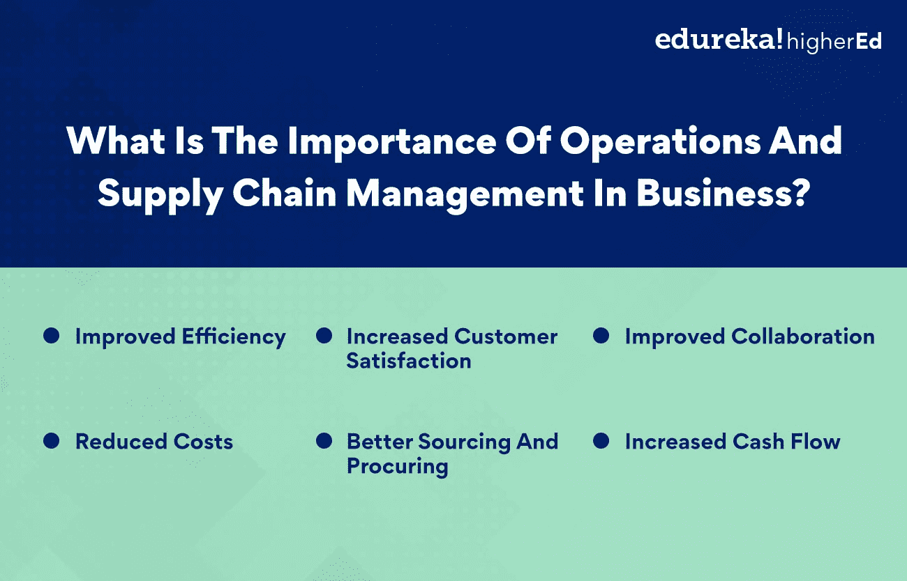
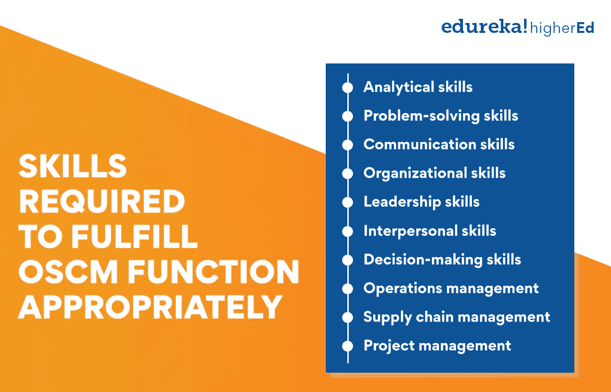

# 什么是运营和供应链管理(OSCM)？

> 原文：<https://www.edureka.co/blog/what-is-operations-and-supply-chain-management-oscm/>

运营和供应链管理(OSCM)管理一个组织的运营和供应链。它包括计划、协调和控制涉及生产和交付公司产品和服务的所有活动。OSCM 还在确保该组织的运营与其战略目标保持一致方面发挥着至关重要的作用。它忽略了制造业和服务业。

无论你是运营管理和供应链管理的新手，还是已经非常熟悉这一主题，本指南将为你全面概述 OSCM 需要什么，以及你如何开始一个成功的职业生涯。我们将涵盖 OSCM 的不同方面，它在当今商业格局中的重要性，以及在这个领域取得成功所需的正确技能。

## **运营和供应链管理:概述**

运营和供应链管理是一个相对较新的领域，它的出现是为了应对业务的全球化以及组织能够跨多个地理位置运营的需求。OSCM 涵盖各种活动，包括产品设计和开发、[生产规划](https://www.edureka.co/blog/what-is-product-planning-and-how-is-it-done/)和控制、库存管理、仓储和配送以及运输。

OSCM 的目标是帮助组织提高运营效率和有效性，同时降低成本。为了做到这一点，OSCM 从业者需要对业务和技术概念都有很强的理解。与业务和技术人员的有效沟通变得至关重要。

随着新技术和新方法的发展，OSCM 领域也在不断发展，以改善企业管理。因此，OSCM 从业者必须跟上该领域的最新趋势和发展。

如果你有兴趣在运营和供应链管理领域开始职业生涯，我们的[运营、供应链管理和项目管理高级证书](https://www.edureka.co/highered/advanced-program-in-operations-supply-chain-project-management-iitg)是了解 OSCM 及更多信息的一站式目的地。

## **运营和供应链管理在商业中的重要性是什么？**

运营和供应链管理(OSCM)对企业至关重要，因为它包含了生产商品和服务所需的所有活动的计划和执行。它包括管理从供应商到客户的整个价值链中的物流、信息流和资金流。

在当今的全球市场中，成功的公司必须有效地管理其运营和供应链，才能保持竞争力。许多组织现在转向 OSCM，将其作为提高绩效和获得竞争优势的一种方式。实施有效的 OSCM 系统可以带来许多好处。

****

**提高效率**

OSCM 的主要好处之一是提高了效率。通过简化运营和供应链，企业可以消除资源浪费并降低成本。对于一个公司来说，没有什么比一台运转顺畅、高效的机器更好的了。

**提高客户满意度**

客户满意度是 optimum OSCM 的另一个潜在优势。如果运营和供应链得到有效管理，将会缩短交付周期，提高产品和服务质量，并提高整体服务水平。所有这些因素都会让客户更开心，更有可能在未来再次与该公司做生意。

**改善协作**

有效的 OSCM 还能改善供应链中不同部门和组织之间的合作。当所有团队成员都朝着共同的目标前进时，就会产生更加精简和高效的操作。

**降低成本**

或许，采用 OSCM 的最大好处是降低成本。通过有效利用资源，并利用运营和供应链战略的增长潜力，企业可以享受额外收入的额外好处。这降低了生产成本，最终提高了利润。

**更好的采购和采购**

OSCM 的另一个好处是更好的货源和采购。当企业对其供应链有了更好的了解，他们就能更有效地采购材料和产品。它为降低成本和提高质量铺平了道路。

**现金流增加**

最后，有效的 OSCM 会增加现金流。当运营和供应链得到有效管理时，企业会经历更短的交付周期和更低的库存水平。这导致库存资金减少，更多的现金可用于再投资。

总的来说，实施有效的运营和供应链管理系统可以带来许多好处。

## 科技在 OSCM 扮演什么角色？

技术在运营和供应链管理中扮演着至关重要的角色。OSCM 的专业人员使用各种类型的软件来帮助他们有效地管理运营和供应链。OSCM 使用的一些最流行的软件包括供应链管理系统、运输管理系统和企业资源规划系统。

科技可以在许多方面帮助 OSCM 的专业人士。例如，ERP 系统可以帮助组织跟踪他们的库存水平、订单和生产计划。供应链管理系统可以帮助组织更有效地计划和执行他们的供应链活动。TMS 系统可以帮助组织更有效地跟踪和管理他们的运输[操作](https://www.edureka.co/blog/beginners-guide-to-operations-management/)。

人工智能(AI)和机器学习(ML)是两种新兴技术，开始在 OSCM 发挥作用。人工智能和人工智能可以帮助组织自动化各种操作和供应链活动。例如，人工智能和人工智能可以用来自动安排运输路线，跟踪库存水平，预测需求。

技术将永远存在于运营和供应链管理中，并将为未来的突破性创新让路。OSCM 的专业人员需要跟上最新的技术趋势，以便能够有效地管理运营和供应链。

想了解更多关于运营和供应链管理的知识并跟上潮流技术的步伐吗？今天就来看看我们的[Ops、SCM 和 PM](https://www.edureka.co/highered/advanced-program-in-operations-supply-chain-project-management-iitg) 高级证书吧！

## 运营和供应链管理领域有哪些职业机会在等着你？

OSCM 是一个相对较新的领域，专注于制造和服务业务以及支持它们的供应链的管理。OSCM 的专业人员确保一个组织的运作平稳高效，同时满足客户的需求。

对那些有兴趣在 OSCM 发展事业的人来说，这里有许多不同的就业机会。一些最受欢迎的职位包括运营、供应链和物流经理。

运营经理——他们监督一个组织运营的方方面面，从生产到客户服务。他们与管理层的其他成员密切合作，以确保实现所有的运营目标。

供应链经理——他们管理整个组织供应链中的货物和材料的流动。从采购原材料到成品运输，它包括一切。

物流经理——他们负责通过协调人员、货物和信息的流动，确保一个组织的运作平稳高效。他们与管理层的其他成员密切合作，以确保实现所有的运营目标。

如果你对在 OSCM 的职业感兴趣，你可以选择几条不同的道路。不同类型的运作和供应链管理项目在全国的学院和大学都有。或者，你可以获得商业学位，重点是运营和供应链管理。无论你选择哪条路，都要做好调查，选择一个适合你的项目。

## **适当完成 OSCM 功能所需的技能**

在任何领域取得成功，技能都是必不可少的，OSCM 也是如此。适当执行 OSCM 功能所需的技能可以分为两大类:技术和行为技能。

技术技能与在运营和供应链管理中应用各种工具、技术和概念有关。另一方面，行为技能更关注与人有效合作的能力。执行 OSCM 功能所需的一些特定技能包括:

**分析技能:** 运营和供应链经理必须能够分析数据，并根据数据做出决策。他们需要识别趋势，并了解它们将如何影响供应链。要想在这个领域取得成功，你必须对数据分析充满热情。

**解决问题的技巧:** 运营和供应链经理经常被赋予解决复杂问题的任务。当务之急是找出问题的根源，然后制定解决方案。如果你喜欢解谜并深入解决问题，你可能会喜欢这方面的工作。

**沟通技巧:** 运营和供应链经理必须与组织中各个层面的人进行有效沟通。他们需要用别人能理解的方式解释复杂的概念。从[产品开发](https://www.edureka.co/blog/what-are-the-stages-and-examples-of-a-product-lifecycle/)到供应，有时你需要清楚地表达你的想法。

**组织技能:** 运营和供应链经理有效地管理他们的时间和资源。他们必须能够在时间和预算限制内计划和执行项目。如果你天生有条理，那么这方面的工作会很适合你。

**领导技能:** 运营和供应链经理经常发现自己处于领导位置。他们负责激励和鼓舞团队成员实现共同目标。如果你喜欢和人在一起，并且有天生的领导能力，这份垂直工作可能适合你。

**人际交往能力:** 运营和供应链经理必须具备很强的人际交往能力。与组织中各个层次的人进行有效的沟通和合作应该是他们的强项之一。

**决策能力:** 运营和供应链经理必须具备很强的决策能力。他们应该能够分析数据，并根据这些数据做出合理的决策。

**运营管理:** 运营经理需要了解与运营管理相关的各种概念和工具。所有这些概念和工具都必须以适当的方式应用到现实世界中。

**供应链管理:** 供应链经理应该精通管理供应链的错综复杂的细节。从产品包装到交付，有许多帽子他们必须变戏法才能脱颖而出。

**项目管理:** 项目经理必须具备管理每一个与产品开发和供应相关的项目的全面知识。他们在产品的每一个阶段都扮演着至关重要的角色，并最终让产品为我们所用。

运营和供应链管理是一个复杂的领域，需要特定的技能才能成功。如果你有合适的技能，在 OSCM 工作可能是最合适的。

## **获得 OCSM 领域职位的资格标准**

运营和供应链管理领域有许多角色，但并不是每个人都适合每个职位。要想在 OCSM 谋得一个职位，你必须符合特定的资格标准。

最重要的标准通常是经验。许多雇主要求应聘者在相关领域至少有几年的经验，然后才会考虑让他们担任运营和供应链管理职位。

教育也是必不可少的，尽管并不总是必需的。许多雇主选择拥有商业、工程或相关领域学士学位或更高学位的候选人。拥有专业机构认证的候选人也是首选。

最后，大多数雇主会要求应聘者通过背景调查和药物测试。如果你符合所有这些标准，你应该有资格在 OCSM 的一个角色。

## **事业蒸蒸日上的 OSCM**

运营和供应链管理是计划、协调和控制组织运营的过程。它包括管理原材料、库存、员工和设备等资源。OSCM 还包括货物和服务从供应商到客户的移动。

为了确保一个组织平稳高效地运行，OSCM 必须经过精心的规划和协调。为了实现这一目标，OSCM 必须考虑一个组织可以支配的所有资源。这包括物质和人力资源。通过精心管理这些资源，OSCM 可以帮助一个组织实现其目标。

运营和供应链管理是一个越来越受欢迎的职业。这是因为 OSCM 为个人提供了在一个既有挑战又有回报的领域证明自己价值的机会。此外，OSCM 为个人提供在各种行业工作的机会，这有助于拓宽他们的技能组合。

如果你也想享受在 OSCM 工作的额外待遇，我们有一个很有见地的认证课程，它将为你提供在人才市场的优势。查看我们的[Ops、SCM 和 PM](https://www.edureka.co/highered/advanced-program-in-operations-supply-chain-project-management-iitg) 高级证书，许多专业人士已经从中受益。