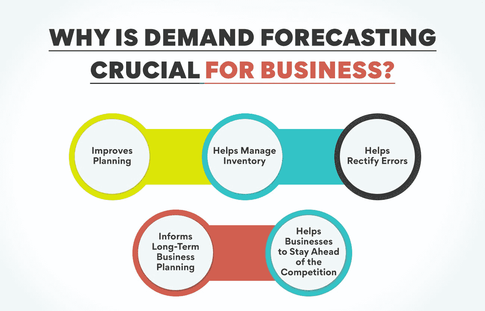
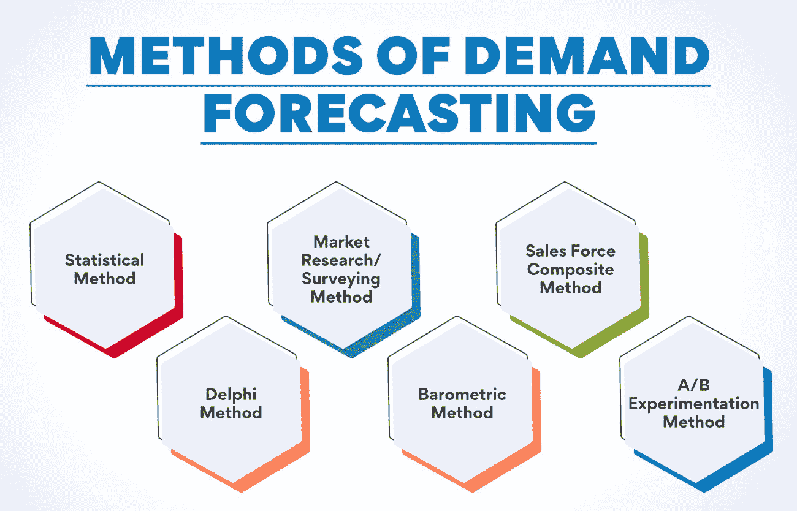

# 需求预测的类型和方法

> 原文：<https://www.edureka.co/blog/types-and-methods-of-demand-forecasting/>

需求预测对所有企业都至关重要，无论其规模和结构如何。它有助于企业所有者和管理者对生产、库存、定价和其他战略决策做出明智的决定。它是整个运营规划流程的驱动力。虽然需求预测是一个复杂的过程，但企业可以使用几种方法来预测需求。这篇博客文章将让你熟悉不同类型的需求预测，以及用来生成富有成效的预测的方法。

## **什么是需求预测？**

它是关于估计未来对产品或服务的需求。企业使用需求预测来决定生产、定价和库存水平。通过需求预测，公司可以预测客户需求并相应地调整计划。

需求预测的最好例子是企业使用历史销售数据来预测未来的需求。这种需求预测称为趋势分析。公司还可以使用其他数据源来预测需求，如天气模式、经济指标和客户调查。

## 为什么需求预测对企业至关重要？

需求预测是企业的重要工具。它告诉你客户想要什么，以及他们愿意为此支付多少钱。这些信息可以帮助公司做出更好的定价、生产和库存决策。此外，需求预测可以帮助您预测可能影响您业务的未来趋势。

以下是需求预测对于各种规模的企业都不可或缺的一些重要原因:

**改进规划**

需求预测的主要目的是帮助企业改进他们的计划。通过了解未来需求，企业可以做出更好的生产、库存和定价决策。这种改进的计划可以增加利润和降低成本。

**帮助管理库存**

需求预测对于确保公司拥有适当的库存水平来满足客户需求至关重要。如果需求很高，企业可以增加产量来满足客户需求。相反，如果需求较低，公司可以减少产量以避免库存过剩。这将节省库存成本，并让客户满意。

**帮助纠正错误**

需求预测可以帮助企业避免对需求做出不准确的假设。反过来，这可以帮助企业纠正其规划和生产过程中的错误。有了准确的需求预测，企业可以避免犯代价高昂的错误，这些错误可能会对他们的底线产生负面影响。

**通知长期业务规划**

需求预测不仅可以帮助企业避免短期错误，还可以为长期业务规划提供信息。准确的需求预测可以帮助企业就其长期增长战略做出更明智的决策。这反过来可以帮助企业实现其长期目标和目的。

**帮助企业在竞争中保持领先**

在当今竞争激烈的商业环境中，企业需要在竞争中保持领先。有了高效的需求预测，企业可以更好地了解客户的需求。公司可以很容易地预测需求的变化，并相应地调整他们的计划。

## **关键需求预测指标**

在尝试预测业务需求时，了解关键需求预测指标非常重要。

*   **产品交付周期:** 这是您的产品从生产到交付给客户所需的时间。跟踪产品交付周期至关重要，因为它可以帮助您预测产品需求。
*   **销售速度:** 销售速度是你的产品销售的速度。此指标可用于预测未来对您产品的需求。
*   **客户流失:** 客户流失是指在一段时间内停止使用你的产品/服务的客户的百分比。跟踪这一指标非常重要，因为它可以帮助您预测产品的需求。
*   **存货周转率:** 这是你的存货在特定时间内被出售和替换的次数。它有助于预测对你的产品的需求，显示你的股票移动有多快。

所有这些需求预测指标对于预测[你的产品](https://www.edureka.co/blog/how-to-formulate-an-excellent-product-strategy/)的需求都很重要。定期监控这些指标将有助于对您的产品和未来需求做出明智的决策。

## **需求预测关键绩效指标**

组织可以使用各种需求预测方法来提高需求规划的准确性。需求预测的一些重要关键绩效指标(KPI)是:

*   **预测准确度:** 这衡量需求预测与实际需求的接近程度。
*   **偏差:** 这衡量需求预测中的系统误差。正偏差意味着需求预测持续过高，而负偏差意味着需求预测持续过低。
*   **平均绝对百分比误差(MAPE):** 它衡量需求预测和实际需求之间的平均绝对百分比差异。
*   **预测误差:** 这衡量需求预测与实际需求之间的差异。正误差意味着需求高于预期，而负误差意味着需求低于预期。
*   **加权平均绝对百分比误差(WMAPE):** 这衡量需求预测和实际需求之间的平均绝对百分比差异，按需求加权。这对于拥有不同需求水平产品的组织很有用。

组织应跟踪这些关键绩效指标，以确保其需求预测尽可能准确。通过这样做，他们可以做出更好的需求规划决策，从而提高组织绩效。

## **需求预测的类型**

组织可以根据自己的需求使用各种类型的需求预测方法。最常见的方法有:

**预测分析**

它是一种利用人工智能(AI)和机器学习算法来预测需求的需求预测方法。它分析数据集，以确定可用于预测需求的模式和关系。企业使用预测分析来生成各种产品和服务的需求预测。广泛的研究是这种需求预测方法的基础。它基于公司的历史数据，并使用它来开发预测未来需求的数学模型。

**联合分析**

联合分析是一种需求预测技术，包括调查顾客并要求他们权衡不同的产品特性。例如，可能会要求客户在两种不同的产品 A 和 B 之间进行选择。产品 A 质量较高但价格较高，而产品 B 质量较低但价格较低。通过了解客户如何权衡不同的功能，需求预测者可以更好地了解客户的偏好，并做出更准确的需求预测。联合分析可用于预测新产品和正在修改的现有产品的需求(例如，正在添加新功能)。

**时间序列分析**

时间序列分析包括使用历史数据来预测未来需求。这是最常用的需求预测技术。这种方法最适合有长期销售数据历史的企业。它确保需求模式得到考虑，并有助于预测季节性产品的需求。企业需要至少一年的数据才能有效地使用这种方法。

**宏观&微观需求预测**

微需求预测通常被企业用来制定定价、库存和生产决策。微观需求预测估计特定市场对特定产品或服务的需求。它通常考虑季节性、客户忠诚度和促销等因素。

宏观需求预测估计给定市场对一般类别产品或服务的需求。它通常考虑经济指标、人口趋势和社会因素等因素。它通常被企业用来制定有关营销、扩张和投资的决策。

## **需求预测方法**

需求预测的方法可以分为两大类:定性的和定量的。定性方法包括使用判断和经验进行预测，而定量方法使用历史数据和统计技术。

我们来讨论一些常见的需求预测方法，包括:

**统计方法**

这种方法使用历史数据来识别模式和趋势，这些模式和趋势可用于预测未来需求。这种方法最适合有长期销售数据历史的企业。对于新业务来说，或者随着时间的推移，需求发生重大变化的情况下，它的效果会更差。

统计方法可以分为两个子类:

*   **趋势预测:** 在这种方法中，通过将过去的需求数据外推至未来来预测需求。当需求以恒定的速度增长或者当数据中有明确的趋势时，可以使用这种方法。
*   **回归分析:** 这种方法使用历史数据来确定不同因素和需求之间的关系。来源信息可以用来预测未来的需求。这种方法最适合拥有大量可分析数据的企业。

**市场研究/调查方法**

在考虑需求预测之前，你需要了解你的目标市场。这意味着进行广泛的市场调查，了解你的目标客户、他们的需求和愿望，以及影响他们购买决定的因素。最好的方法之一是通过测量。调查可以由公司自己进行，也可以聘请市场调查公司进行。无论哪种方式，调查都是获得可靠数据的好方法，您可以使用这些数据做出有关需求预测的明智决策。

**销售力量合成法**

销售人员组合方法是一种依赖于销售团队集体知识的技巧。本质上，你要求你的销售人员估计他们认为未来对你的产品或服务有多少需求。所有的信息都被编辑并用于生成需求预测。

这种方法通常与其他需求预测技术结合使用，因为它可以提供其他方法无法捕捉到的有价值的洞察力。销售力量复合法的优点是相对快速和简单，并且不需要任何特殊技能或培训。唯一的缺点是它是主观的，如果你的销售团队没有足够的动力给出准确的估计，它可能会有偏差。

**德尔菲法**

这是一种依赖专家意见的需求预测技术。德尔菲法通过询问专家小组对产品未来需求的意见来进行预测。然后整理专家的回答，并生成平均需求预测。

当几乎没有历史数据作为需求预测的基础时，德尔菲法是最理想的。德尔菲法可用于生成短期和长期需求预测。

**气压法**

这种需求预测方法使用历史销售数据来预测未来需求。它基于这样一种理论，即对一种产品的需求会受到先前对该产品需求的影响。要使用这种方法预测需求，您需要过去几年类似产品的销售数据。然后，您可以使用这些数据来确定模式和趋势，以帮助预测未来的需求。气压法最适合需求稳定的产品。如果对你的产品的需求每年波动很大，这种方法可能不太准确。

**A/B 实验方法**

这种方法完全是实验。您创建了两个需求预测，一个使用您当前的方法和假设，另一个使用不同的方法和假设。然后，比较两个需求预测的结果，看哪一个更准确。当您要处理的历史数据数量有限时，这是一种有效的方法。

## **底线**

对于各种规模的企业来说，这是必不可少的。通过了解需求预测、不同类型的可用方法以及每种方法的优缺点，公司可以做出更明智的决策，确定哪种需求预测方法最适合他们的需求。此外，需求预测可以帮助企业避免缺货，规划未来增长，并做出更明智的定价决策。

需求预测不是科学，总会涉及某种程度的不确定性。然而，通过使用最适合您业务的方法，并不断审查和完善您的预测，您可以最大限度地减少不确定性，并确保您的业务为未来可能发生的事情做好准备。

现在，您可以通过 Edureka 的证书课程，了解更多关于需求预测的知识，以及如何恰当地利用需求预测来获得更好的业务成果。查看我们的[运营、供应链和项目管理](https://www.edureka.co/highered/advanced-program-in-operations-supply-chain-project-management-iitg)高级证书，向[供应链管理](https://www.edureka.co/blog/components-of-supply-chain-management/)的职业生涯迈进一步。