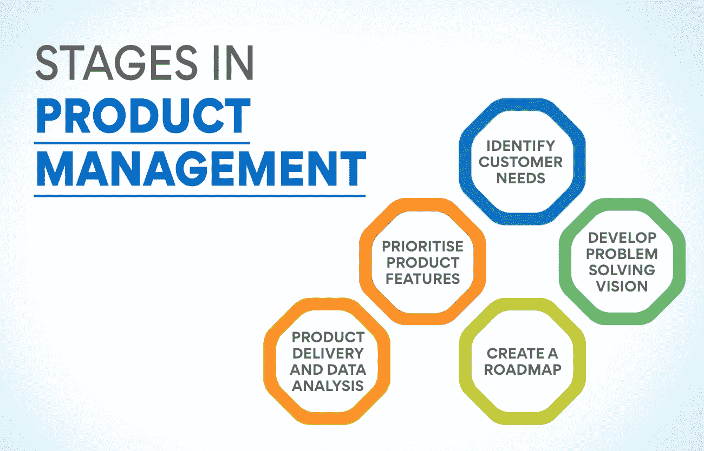
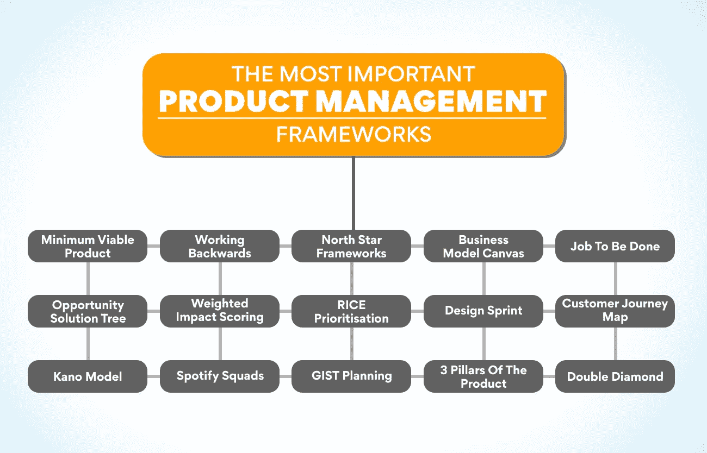

# 每个项目经理都必须知道的产品管理框架

> 原文：<https://www.edureka.co/blog/product-management-frameworks>

任何致力于生产满足客户需求的新产品的组织都必须使用产品管理。它是一种帮助公司开发最好的有形或无形产品的功能。这是一个帮助公司完全专注于产品和客户的过程。产品管理始于确定客户的需求和产品在市场中的定位。它会一直持续到产品寿命结束。产品管理框架是这一过程的重要组成部分。

**了解产品管理框架**

大多数公司都遵循自己独特的方式来开发、推出和管理产品。所有的过程都必须有条不紊地进行才能实现他们的目标。同样，产品经理也必须系统地工作，这样公司才能开发出符合其目标的产品。这种方法被称为产品管理框架。它们有助于优化开发时间。大多数这些框架遵循相似的步骤，即使它们可能不遵循相同的顺序。

在[产品管理高级执行官证书课程](https://www.edureka.co/highered/advanced-executive-program-in-product-management-iitg)中，人们可以更好地理解产品管理框架。那些有志成为产品经理的人可以访问我们的网站，了解更多关于课程及其内容。

**产品管理阶段**

**确定客户需求**

这是任何产品开发过程的第一步。在开发产品之前，必须知道顾客想要什么。通过监测他们在各种渠道上的在线行为，有可能理解这一点。公司还可以接触客户，进行调查，了解他们的痛点以及他们期望产品有哪些改进。进行竞争分析以了解他们提供什么以及您可以在产品中包含哪些其他功能也很重要。

**培养解决问题的眼光**

一旦理解了问题，就该制定解决方案了。一个人必须创造一个愿景，并与团队中的其他人分享。它是描述公司将如何制造产品的叙述。在创建产品之前，这一点很重要。这是所有产品管理框架中的重要一步，帮助你和你的团队制定产品战略。这一阶段最重要的方面是创造一个能给顾客留下第一眼印象的设计。

**创建路线图**

一旦愿景最终确定，下一步应该是制定路线图。此时，有一个基于主题的无特色路线图是很重要的。当团队创建一个包含特性的路线图时，就有可能是一个基于特性的路线图，而不是基于愿景的路线图。基于主题的无特色路线图将支持公司的愿景和战略。有了这一点，建立具体的、可衡量的目标来帮助团队走上正轨也是很好的。

**优先考虑产品特性**

现在是时候根据那些将对公司战略目标产生最大影响的特性来划分优先级了。这可能非常具有挑战性，因为正是在这里，产品团队将被迫拒绝利益相关者或客户的请求。一个产品不可能包含所有的功能，你必须减少它们。在产品管理框架**、**、中的这一步，人们可以使用一个树模型来包含或丢弃树叶所代表的特征。

**产品交付和数据分析**

这是整个过程的最后阶段。在这个阶段，项目经理将任务移交给团队来设计和创建产品。一旦他们完成了，产品就会被审查并向公众发布。你必须找到一种方法从顾客那里获得反馈。在社交媒体平台上与他们互动是立即收集反馈的绝佳方式。人们必须使用最现代的分析工具来识别和衡量 KPI。

在我们的[产品管理](https://www.edureka.co/highered/advanced-executive-program-in-product-management-iitg)高级管理人员证书课程中，你可以了解更多关于不同阶段的信息。请访问网站，了解我们课程的更多信息，以及它如何惠及有抱负的产品经理。

**也读:[产品管理:初学者指南](https://www.edureka.co/blog/product-management/)**

**最重要的产品管理框架**

1.  **最小存活产品**

这种产品开发方法强调在开发新产品的同时学习。它也被称为精益软件开发框架。目标是创造一个解决主要问题的产品，但不会提供太多的特性或功能。这是测试市场和观察顾客对新想法反应的好方法。这有助于收集反馈，并根据反馈改进项目。

2.  **向后工作**

顾名思义，这是最后开始的产品管理框架 **s** 之一。产品团队想象一个可以帮助解决客户问题的产品。他们发布了一份新闻稿，描述该产品及其即将上市。它还告诉客户，除了竞争对手提供的功能之外，它还能提供哪些额外的功能。这是一种评估对客户的影响并确保产品值得创造的方法。

3.  **北极星框架**

振幅引入了这个框架。它是只关注北极星度量的产品管理框架之一。这个指标被描述为一个捕捉你的产品交付给客户的核心价值的指标。有助于推动这一指标的重要输入补充了这一指标。团队的目标是在他们创造产品的每一个行动中强调这些关键投入。

4.  **商业模式画布**

在这种方法中，产品团队要如何创造价值是非常清晰的。这也有助于缩短产品开发周期。这个框架为利益相关者提供了将产品推向市场的所有重要战略点的清晰视图。它还帮助企业更有效地理解和解释他们的商业模式。它通常与价值主张画布等其他模型一起使用。

5.  **要做的工作**

这是 [产品管理](https://www.edureka.co/blog/what-is-product-management/)框架中的一个，这里关注的是场景而不是客户角色。你可以看到焦点从产品转移到了客户身上。产品必须能够满足客户在不同场景下的需求。例如，客户可能想在去办公室的路上吃点东西。目的是开发一个可以提供快餐的地方，即使在开车去工作的时候也可以食用。

6.  **机会解决方案树**

Teresa Torres 开发了这个框架，它直观地描述了一家公司如何通过产品实现预期目标。在这个框架中，发现过程非常简单。它使得为不同的问题找到正确的解决方案变得容易。在这种方法中，可用的机会也清晰可见。这种方法有助于确定机会的优先顺序。产品团队可以看到全局，并适当地考虑所有的决策。

7.  **加权影响评分**

这是一个在产品经理中非常流行的产品管理框架 。在这种方法中，官员根据特征的重要性对其进行分级。该团队确定关键标准，并根据它们的重要性，以百分比的形式分配每个标准的权重。在此基础上，对每项倡议进行评分，并据此进行排名。

8.  **大米优先顺序**

这个名字是 Reach Impact 信心和努力的缩写。Intercom 的团队在无法使用任何现有方法来评估产品时开发了这个模型。

接触——表示在特定时期内，产品知识会接触到的人数。

影响——这是在同一时期内可能购买该产品的人数。

信心——以上数字是通过研究和分析现有数据得出的。你必须考虑到你对上述数字的信心。这是用百分比表示的。

努力——这代表了团队为达到上述范围和影响所付出的努力。这包括产品的成本。

9.  **设计冲刺**

这是产品管理框架中的一个，公司的目标是尽可能降低与推出产品相关的风险。这是一个五步的过程。团队一起了解客户的需求并设计产品。然后，他们创建一个原型，并验证其功能。只有经过各方面的慎重考虑，才是投放市场的产品。这将把风险降到最低。

10.  **客户旅程图**

这种方法基于对顾客体验的研究。该团队了解顾客从寻找需求到购买需求的过程。这让他们在购买商品时能够洞察顾客的想法。这些见解有助于产品团队设计出适合客户行为的产品。这是有更多机会满足客户需求的产品管理框架之一。

11.  **卡诺模型**

这种方法源于日本教授 Noriaki Kano 的想法。该模型有助于确定客户会觉得最令人兴奋的功能。团队可以发现产品满足客户需求的程度以及客户的满意程度。当试图对产品的特性进行优先排序时，这很有帮助。这也有助于了解功能与成本的对比情况。

12.  **Spotify 小队**

这是帮助 Spotify 成功的产品管理框架之一。在这个模型中，不同的团队被分配和指派去完成他们认为对客户最有价值的成果。他们没有被要求做任何特定的任务。团队必须选择他们想要使用的功能。他们必须确保自己的工作符合公司的目标。

13.  **要点策划**

GIST 代表目标、想法、步骤项目和任务。这种方法侧重于实现目标，而不仅仅是提供解决方案。目标表示产品必须达到的目标。创意是团队头脑风暴中产生的想法。所有的想法都被记录下来，而且想法的数量没有限制。步骤项目是那些已经被优先化并被分解成可以被测试的步骤的想法。任务是帮助实现目标的步骤。

14.  **产品的三大支柱**

这是由三部分组成的产品管理框架之一。它始于基于客户需求和竞争对手环境的产品发现。第二部分是[产品策划](https://www.edureka.co/blog/what-is-product-planning-and-how-is-it-done/)。这个阶段包括创建愿景和设计产品。这一阶段还包括为产品开发绘制路线图。框架由最后一步完成，这一步就是产品开发。这也包括与客户一起测试产品。

15.  **双菱形**

两部分有四个阶段。第一个菱形或部分是关于理解问题或客户需求。第二部分是寻找解决问题的方法。第一部分的两个阶段是问题理解和定义。另外两个阶段是探索和创建解决方案。这种方法的倡导者声称，这可以用于几乎所有的新产品和解决方案。

由该领域专家开发和提议的各种其他产品管理框架。你可以在[产品管理](https://www.edureka.co/highered/advanced-executive-program-in-product-management-iitg)高级管理人员证书课程中了解更多。课程在网上提供，你可以通过访问我们的[网站](https://www.edureka.co/)了解详情。

**同时阅读:[如何成为更好的产品经理:10 大技巧](https://www.edureka.co/blog/how-to-become-a-better-product-manager-top-10-tips/)**

**总结**

公司必须使用的框架取决于他们寻找的解决方案。几乎所有的上述产品管理框架都可以用于构建一个或多个产品。关于使用哪一种，由公司高管和产品经理决定。更重要的是正确地实施它们，并确保它们与组织的目标相一致。

更多信息:

产品生命周期的阶段和例子是什么？

[制定优秀产品战略的指南](https://www.edureka.co/blog/how-to-formulate-an-excellent-product-strategy/)

[创建成功上市战略的步骤](https://www.edureka.co/blog/steps-to-create-a-successful-go-to-market-strategy-for-product-managers/)

[新时代产品开发过程的 7 个动态阶段](https://www.edureka.co/blog/dynamic-stages-of-the-new-age-product-development-process/)

[产品变化的原因是什么？原因&原因](https://www.edureka.co/blog/what-are-the-reasons-of-variations-in-product-causes-reasons/)