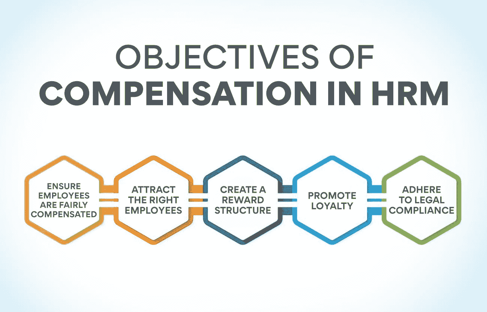
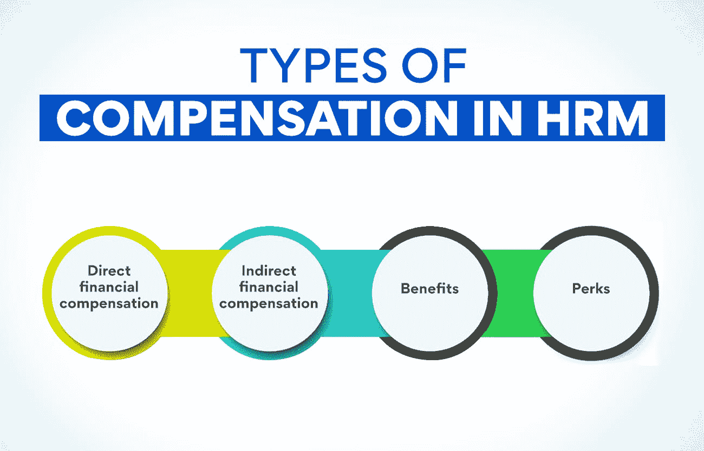

# HRM 中的薪酬是什么？你需要知道的一切

> 原文：<https://www.edureka.co/blog/compensation-in-hrm>

谈到人力资源管理，这份工作最重要的一个方面就是管理薪酬。人力资源管理的薪酬管理包括工资率和福利，奖金和佣金。这可能是一个复杂的过程，但它对于确保员工快乐和高效至关重要。在这篇博文中，我们将讨论人力资源管理中的薪酬以及你需要了解的一切！

**了解 HRM 中的薪酬**

人力资源管理中的薪酬是指一个组织提供给其员工的所有货币和非货币奖励，以换取他们的工作。这包括基本工资、奖金、佣金、福利和其他津贴。

薪酬管理是设计、管理和评估薪酬计划，以确保其公平有效。这确实会成为一项棘手的任务，因为必须考虑许多不同的因素。

其中包括:

*   组织的整体业务战略
*   工作类型和所需技能
*   内部公平(组织内薪酬的公平程度)
*   外部竞争力(其他组织为类似职位支付的薪酬)
*   预算限制

一旦设计了薪酬计划，就需要对其进行持续的管理和监控。它包括设置薪资流程、跟踪员工数据和正确支付工资。

评估薪酬计划的有效性对于确保其达到预期目标至关重要。这可以通过调查、焦点小组和数据分析来实现。

人力资源管理中的薪酬目标是什么？

HRM[HRM](https://www.edureka.co/blog/human-resource-management-system/)HRM 的目标是确保员工的工作得到合法和公平的报酬，并吸引和留住最优秀的人才。一个设计良好的薪酬体系也将激励员工发挥出最佳水平，为组织的成功做出贡献。

为了实现这些目标，人力资源管理中的薪酬必须考虑以下因素:

*   工作的市场价值
*   工作所需的技能和经验
*   员工的绩效
*   公司的财务健康和盈利能力

人力资源管理中的薪酬是一个复杂的话题，但理解这些主要目标是有效管理薪酬的第一步。但是，在人力资源管理中，薪酬的重要目标是什么？我们来详细讨论一下:

1.  确保员工得到公平的报酬: 这是人力资源管理中薪酬的一个基本目标。员工的薪酬应该基于他们工作的市场价值，以及他们的技能、经验和培训。他们也应该根据自己的表现获得报酬。
2.  吸引合适的员工: 人力资源管理中薪酬的另一个重要目标是吸引最优秀的人才。为此，公司需要提供有竞争力的薪资和福利待遇。人力资源专业人员还必须能够向潜在员工推销公司的文化和价值观。
3.  **建立奖励结构:** 人力资源管理中薪酬的第三个目标是建立奖励结构，激励员工发挥出最佳水平。这可以通过各种方法来实现，如奖金计划、佣金结构和股票期权。
4.  提升忠诚度: 人力资源管理中薪酬的第四个目标是提升员工的忠诚度。员工不仅仅是为了高薪。他们还希望感觉自己是有价值的团队成员，他们的工作对公司至关重要。
5.  **遵守法律法规:**HRM 中报酬的最终目标是遵守所有法律法规要求。这包括最低工资法、同酬法和反歧视法。

正如你所看到的，人力资源管理中的几个薪酬目标必须实现，根据组织结构和业务模式的不同，这些目标会有所不同。但是通过理解这些目标，你可以制定一个满足你组织需求的薪酬策略。

## 什么是薪酬管理，为什么它很重要？

薪酬管理是创建和管理薪酬计划，使组织能够吸引、激励、留住和雇佣员工。它包括员工因对组织做出贡献而获得的财务和非财务奖励。

一个设计良好的薪酬计划可以帮助组织实现几个战略目标，例如吸引和[留住顶尖人才，](https://www.edureka.co/blog/talent-management-and-its-importance/)激励员工实现高绩效水平，使员工行为与组织目标一致，以及管理劳动力成本。薪酬通过为员工的技能、经验和责任水平提供适当的报酬，在确保工作场所的公平方面发挥着关键作用。

虽然薪酬通常被认为主要是工资或薪水，但它也包括其他福利和津贴，如奖金、佣金、股票期权和健康保险。在设计薪酬计划时，组织必须仔细考虑员工的需求和偏好，以创造一个既有吸引力又能激励员工的薪酬方案。

应定期审查薪酬计划，以确保其符合组织的目标。随着劳动力需求的不断变化，组织需要在薪酬管理方面采取积极主动的方法。

**也读作:[人力资源管理的关键目标](https://www.edureka.co/blog/objectives-of-human-resource-management/)**

**对员工效率的积极控制**

一个好的薪酬计划总是会对员工的效率产生积极的影响。如果他们觉得自己的工作得到了认可，并且得到了丰厚的报酬，他们自然会付出更多的努力。这将为公司带来更高的生产率和更好的收益。

**营业额减少**

薪酬管理的另一个好处是它有助于减少人员流动。感觉薪酬丰厚的员工不太可能去寻找其他工作机会。从长远来看，这可以降低招聘和培训新员工的相关成本，从而为组织节省资金。

**士气提高**

最后，良好的薪酬实践也能提高组织内部的士气。当员工觉得他们受到了良好的待遇时，他们更有可能对自己的工作感到满意，并对公司持积极的态度。这可以提高客户服务和对组织的整体满意度。

薪酬管理是人力资源管理不可或缺的一部分，能够对组织的成功产生重大影响。通过精心设计和管理薪酬计划，组织可以实现几个战略目标。

## **HRM 中的薪酬类型**

HRM 中有四种类型的报酬:

*   直接经济补偿
*   间接经济补偿
*   好处
*   津贴

**直接经济补偿:**

这是员工用他们的时间和劳动挣来的钱。它是以小时工资或薪水的形式直接支付给他们的。它包括雇主和雇员之间的工资谈判。不同组织的工资标准不同，通常基于公司的规模、位置、行业以及员工的经验和技能。

**直接经济补偿类型:**

*   小时工资
*   工资
*   利润分成

**间接经济补偿**

这是员工在正常工资或薪水之外赚的钱。一般来说，奖金是根据员工的表现或实现特定目标来发放的。例如，销售人员可能会因为达到或超过销售目标而获得报酬。佣金通常支付给销售或客户服务岗位的员工。它们是员工销售额或收入的百分比。

**间接经济补偿的类型:**

*   奖金
*   佣金
*   股票期权

**好处**

这些都是补偿员工的非货币方式。福利通常给全职工作的员工。它们旨在帮助支付医疗保健费用、退休和休假时间。公司根据员工的需求和愿望决定提供哪些礼物。

**福利类型:**

*   健康保险
*   退休计划
*   带薪休假
*   员工援助计划
*   互联网报销
*   差旅费报销
*   搬迁援助

**津贴**

这些也是补偿员工的非货币方式。这样的福利给员工是为了让他们的工作更愉快。额外津贴通常给全职工作的员工。它们包括免费食物、健身房会员资格和交通报销。公司根据员工的需求和愿望决定提供哪些额外津贴。

**津贴类型:**

*   公司汽车
*   健身房会员资格
*   免费餐
*   交通报销
*   儿童保育援助
*   学生贷款还款援助
*   宠物保险报销
*   员工折扣

将这些类型的薪酬结合起来，将有助于你吸引并留住你公司最优秀的员工。在设计你的薪酬方案时，一定要考虑员工的需求。

## **薪酬有哪些组成部分？**

**工作分析**

这是设计薪酬计划的第一步。工作分析是收集和研究工作数据以确定其基本任务、职责和责任的过程。这些信息用于制定工作说明和规格，然后用于确定该职位的适当薪酬水平。

**准备岗位说明书**

下一步是准备一份工作描述，这是一份概述一个职位基本职责和责任的文件。该文件向潜在候选人传达工作期望，并帮助指导选择过程。它将包括概述职责、责任、教育和经验要求，以及所需的任何特殊技能或资格。

**工作评估**

设计好职位描述后，就该对职位进行评估，以确定合适的薪酬水平。这是通过考虑工作描述中概述的职责和责任以及教育和经验要求来实现的。目标是创建一个对所有员工都公平公正的薪酬计划。

**薪酬策略**

完成分析和评估后，是时候制定薪酬策略了。薪酬战略将概述组织计划如何吸引和留住人才，以及他们计划如何奖励员工的表现。该战略将基于[组织](https://www.edureka.co/blog/optimising-people-management-to-achieve-company-goals/)的目标和目的以及预算。

**设计薪酬结构**

下一步是设计薪酬结构。这将包括创建一个工资等级表，列出每个职位的工资范围。薪酬结构还包括任何奖金、佣金或其他形式的补偿。一旦薪酬结构设计完成，就需要得到董事会或股东的批准。

**实施计划**

最后一步是实施薪酬计划。这将包括向所有员工传达该计划，并确保其得到遵守。有必要定期监控计划，以确保计划按预期运行，并且在实施过程中不存在任何问题。

人力资源管理中的薪酬构成可能非常复杂。然而，通过把它分解成这些简单的步骤，你可以确保你有一个精心设计的公平的薪酬计划。

**也可理解为:[人力资源管理在组织中的作用](https://www.edureka.co/blog/role-of-human-resource-management-in-an-organization/)**

## 人力资源管理中的薪酬管理面临哪些挑战？

在人力资源管理的薪酬管理方面，组织面临着一些挑战。一个挑战是确保所有员工得到公平的补偿。这可能很难做到，因为你必须考虑许多因素，如经验、教育和工作表现。

另一个挑战是确保员工有动力留在公司。这可能很困难，因为你需要提供对员工有吸引力的有竞争力的薪酬方案。最后，确保不超过薪酬预算。

## **人力资源管理职业范围**

人力资源管理领域广阔，为职业发展提供了很大的空间。在人力资源部门，你可以担任很多职位，从初级到高级管理。

人力资源管理的一个重要方面是薪酬。薪酬是指员工因工作而获得的所有财务和非财务利益。这包括工资、奖金、佣金以及健康保险和带薪休假等福利。

薪酬是一个具有挑战性的垂直行业，因为有许多方法可以实现它。作为一名人力资源专业人士，理解不同的薪酬模式以及如何在你的组织中应用它们是你的工作。你还需要熟悉政府关于薪酬的规定。

如果你对人力资源管理感兴趣，薪酬是一个非常值得关注的领域。它有许多不同的方面，而且一直在变化。对薪酬有深刻的理解，你可以成为任何组织的无价之宝。让我们迈出你职业生涯的第一步。看看我们的[人力资源管理研究生证书](https://www.edureka.co/highered/human-resourse-management-course-iim-shillong)，了解更多人力资源管理知识。

## **更多信息:**

[人力资源管理的演变:过去和未来](https://www.edureka.co/blog/evolution-of-human-resource-management)

[分解人力资源管理的范围](https://www.edureka.co/blog/scope-of-human-resource-management/)

[改善员工关系——11 条建议](https://www.edureka.co/blog/employee-relations)

[什么是利益相关者参与？重要性、规划和实施](https://www.edureka.co/blog/stakeholder-engagement)