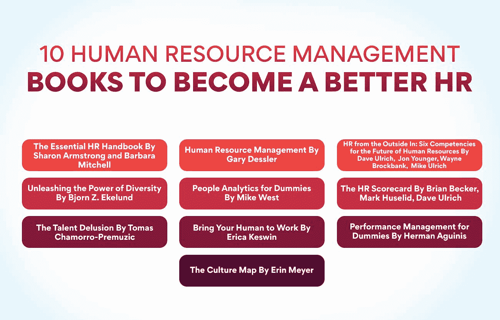

# 成为更好的 HR 的 10 本人力资源管理书籍

> 原文：<https://www.edureka.co/blog/10-human-resource-management-books/>

强大的领导技能和人力资源管理专业知识是任何成功企业的关键。虽然拥有一个优秀的团队很重要，但以一种有助于你的企业蓬勃发展的方式管理他们更为重要。在公司的所有职能部门中，人力资源管理也是投资回报率最高的部门之一——前提是它做得好。人力资源管理需要技术技能和领导能力来管理人员，并建立一个高绩效的团队，推动您的业务向前发展。为了在[人力资源管理](https://www.edureka.co/blog/role-of-human-resource-management-in-an-organization/)中脱颖而出并建立一个有凝聚力的团队，你需要清楚地理解有效的人力资源管理所涉及的原则、实践和技术。实现这一点的理想方法是阅读人力资源管理书籍。这篇博文将讨论最热门的人力资源管理书籍，以及从这些宝石中可以获得的主要知识，这些知识可以提升你的技能，让你的人力资源之旅硕果累累。

## **10 本人力资源管理书籍:**

## 莎伦·阿姆斯特朗和芭芭拉·米切尔的《基本人力资源手册》

首先，我们有莎伦·阿姆斯特朗和芭芭拉·米切尔的《基本人力资源手册》。这本书是对人力资源世界的一个很好的入门指南。作者采取了一种非常实用的方法，以非常用户友好的风格涵盖了许多主题。如果你刚开始涉足这个领域，并希望快速成长，这是一本完美的书。

《基本人力资源管理手册》是一本适合人力资源初学者的好书。涵盖的主题包括招聘、团队建设、变革管理、绩效、员工等等。这本书的伟大之处在于，它不仅仅是“什么”和“如何”的集合，还深入探讨了“为什么”。它将帮助你确定构成一个欣欣向荣的人力资源部门的关键领域，并为你建立一个成功的人力资源职业生涯奠定基础

## **加里·德斯勒的人力资源管理**

接下来是加里·德斯勒的《人力资源管理》。这是关于这个主题的最好的书之一，也是人力资源的经典。它涵盖了人力资源管理的所有重要方面，并以引人入胜和易于理解的风格编写，使其成为一种阅读乐趣。本书分为 7 个部分，19 个章节。

如果你正在寻找一本全面的、全方位的人力资源管理指南，这本书正适合你。每章都涵盖了一个与人力资源管理相关的特定话题或主题。主题包括组织理论、招聘、选拔、培训和发展、薪酬和福利、员工关系、员工管理、工会和集体谈判。

## **戴维·尤里奇、乔恩·杨格、韦恩·布洛克班克、迈克·乌尔里希的《未来人力资源的六种能力:来自外部的人力资源》**

《未来人力资源的六种能力》是所有人力资源专业人士的必读之作。这是关于现代人力资源实践和原则的最全面、最权威的书籍之一。作者们确实做了出色的工作，强调了建立一个成功的人力资源职能需要关注的六个关键能力领域。

这六个领域是人员识别、人员发现、人员发展、人员关系、人员暗示和人员提升。如果你需要一本能让你的人力资源技能和专业知识更上一层楼的有见地的书，这本书正适合你。它将帮助您看到更广阔的前景，并做出正确的战略决策，以帮助您的组织发展壮大。

**也读作:[分解人力资源管理的范围](https://www.edureka.co/blog/scope-of-human-resource-management/)**

## Bjorn Z. Ekelund 著

接下来，我们来看看 Bjorn Z. Ekelund 的《释放多样性的力量》。这本书是所有人力资源专业人士的必读之作。它谈到了工作场所多元化的重要性。多样性被定义为不同的人和他们带来的不同观点。这是商业成功的关键，应该培养和重视。

本书分为四部分八章。每一章都从不同的角度探讨了多样性这个话题。主题包括了解多样性的好处，什么是多样性，如何创造多样性，管理风格的差异，以及包容和排斥的问题。这本书将显著提高你在多样性和包容性方面的技能。

## 迈克·韦斯特的《傻瓜人物分析》

接下来，我们有请迈克·韦斯特的《傻瓜人物分析》。这是一本帮助你理解人物分析这个不断发展的领域的好书。作者已经漂亮地和策略地详细报道了这个话题。这本书有三部分九章。每章涵盖了与人员分析相关的特定主题。

主题包括人员分析的兴起、什么是人员分析、如何使用人员分析、如何使用人员分析以及人员分析的实际应用。这本书将帮助你获得技能和知识，你需要雇用人员分析，以作出更好的商业决策。

## **Brian Becker、Mark Huselid 和戴维·尤里奇的人力资源记分卡**

Brian Becker、Mark Huselid 和戴维·尤里奇的《人力资源记分卡》是所有人力资源专业人士的必读书。它讲述了如何使用人力资源记分卡来衡量你的人力资源职能的健康状况。人力资源记分卡是一个强大的工具，可以帮助您确定需要改进的领域并做出更好的决策。

这本书分为三部分九章。每章涵盖了与人力资源记分卡相关的特定主题。主题包括衡量人力资源的重要性、人力资源记分卡的五个组成部分、创建人力资源记分卡的五个步骤、如何使用人力资源记分卡以及如何进行改进。这本书将显著提高你在人力资源记分卡上的技能。

## 托马斯·查莫罗-普雷穆齐奇的《天才错觉》

接下来，我们有请托马斯·查莫罗-普雷姆兹奇的《天才错觉》。这本书是所有人力资源管理专业人士的必读之作。它讲述了人力资源如何通过更好的人力资源实践来利用和发展人才，从而帮助组织变得更加成功。作者就人力资源如何被用作战略职能以及它如何改变商业提供了一个非常有洞察力和启发性的视角。

这本书将帮助你了解人力资源的作用，以及如何让你的人力资源部门更有效、更有影响力。这本书有三部分九章。每一章都涵盖了一个与人力资源相关的特定主题。这些主题包括为什么人力资源职能至关重要，什么是伟大的人力资源职能，如何创建一流的人力资源职能，如何建立一支成功的团队，以及如何[管理人才](https://www.edureka.co/blog/talent-management-and-its-importance/)。

## 艾丽卡·凯斯文

接下来，我们必须带你的人类去工作。这本书是所有人力资源专业人士的圣杯。它讨论了创建一个以人为中心的工作场所，吸引和愉悦员工。通过让员工参与工作，您可以为团队成员创造一个更积极、更有成效的环境。这本书将有三部分七章。

每章都涵盖了一个与带员工去工作相关的特定主题。主题包括为什么你应该让你的人工作，如何让你的人工作，如何发展你的人的优势，如何用你的人的优势领导，以及如何用你的人的优势激励他人。这本书将大大提高你在管理人力资源方面的技能。

**也读作:[人力资源管理的关键目标](https://www.edureka.co/blog/objectives-of-human-resource-management/)**

## Herman Aguinis 的《傻瓜绩效管理》

Herman Aguinis 的《傻瓜绩效管理》讲述了如何使用绩效管理系统来帮助你的员工成长和发展。作者提供了一个非常有见地和启发性的观点。你可以把这本书分成三部分八章来读。

这本书将让你更好地理解绩效管理的基础，以及如何在你的组织中有效地使用它。每章涵盖与绩效管理相关的特定主题。主题包括绩效管理的基础知识，如何开发绩效管理系统，如何使用绩效管理系统，如何评估员工绩效，以及如何提高员工绩效。

## **艾琳·迈耶的文化地图**

最后但同样重要的是，我们有艾琳·迈耶的文化地图。这本书是所有人力资源专业人士的必读之作。它讲述了如何使用文化地图来帮助你理解和浏览世界上不同的文化。文化地图是一个强大的工具，可以帮助你确定需要改进的地方，做出更好的决定。这本书有三部分七章。

每一章都涵盖了与文化地图相关的特定主题。主题包括文化地图的基础知识，如何使用文化地图，如何解释文化地图的结果，以及如何进行改进。这本书将大大提高你在文化地图方面的技能。如果你想探索世界的文化，那么这本书绝对适合你。

## 人力资源书籍对人力资源管理有什么帮助？

在任何组织中，人力资源管理的角色都至关重要。它负责管理公司最重要的资源——人。一个高效的人力资源团队可以显著提升公司的整体绩效。

如果你渴望成为一名人力资源人员，成为人力资源部门不可或缺的一部分，或者已经在人力资源部门工作，书籍一定会帮助你磨练技能，改善工作。

阅读人力资源管理书籍的好处:

1.  **提高你对人力资源概念和术语的理解**

如果你是人力资源领域的新手，有许多概念和术语你可能不熟悉。阅读人力资源管理书籍可以帮助你更好地理解这些概念和术语。

2.  **了解人力资源的最新趋势**

人力资源领域在不断发展，跟上最新趋势至关重要。书籍可以帮助你跟上人力资源的最新发展

3.  **从专家那里获得真知灼见**

有经验的专业人士写的大多数人力资源管理书籍都有值得分享的真知灼见。阅读他们的书可以帮助你深入了解人力资源部门的工作，了解最佳实践。

4.  **培养新技能**

除了提高你对人力资源概念的理解，阅读人力资源管理书籍还可以帮助你发展新的技能。许多书提供了关于如何提高你的沟通、谈判和解决问题的技巧和建议。

5.  **促进你的职业发展**

阅读人力资源管理书籍可以帮助你提升事业。通过获得新的见解和技能，你将能够为你的组织增加价值，并成为人力资源领域的领导者。

6.  **做出更好的决策**

在任何组织中，人力资源部门都要做出许多决定，其中一些可能很难。书籍可以帮助你制定一个合理的决策过程，为你的组织做出更好的决策。

7.  **获得专业指导**

如果你正在处理工作中的问题，阅读人力资源管理书籍可以为你提供有价值的专业指导。许多书都提供了处理工作中困难情况的技巧和建议。

因此，阅读人力资源管理书籍对任何从事或渴望从事人力资源工作的人都大有裨益。无论如何，书籍是获取任何主题知识的最佳资源，这同样适用于人力资源。你身边有本书永远不会出错。

## **底线**

挑选合适的人力资源管理书籍会让人不知所措。有许多不同的标题和主题可供选择。上面列出的顶级人力资源管理书籍是开始提高你的人力资源技能的好地方。

如果你想更有吸引力、更灵活地学习一些额外的知识，你可以考虑我们为人力资源专业人士和学生设计的[人力资源管理研究生证书](https://www.edureka.co/highered/human-resourse-management-course-iim-shillong)。该课程将发展你的理论知识和在应用背景下对人力资源管理的理解，你可以用它来改善你的人力资源实践。

## **更多信息:**

[目标&人力资源管理的本质](https://www.edureka.co/blog/nature-of-human-resource-management/)

[重点领域:人力资源管理](https://www.edureka.co/blog/human-resource-management-emphasis)

[人事管理与人力资源管理的区别](https://www.edureka.co/blog/difference-between-personnel-management-and-human-resource-management/)

[什么是人力资源业务伙伴:终极指南](https://www.edureka.co/blog/hr-business-partner)