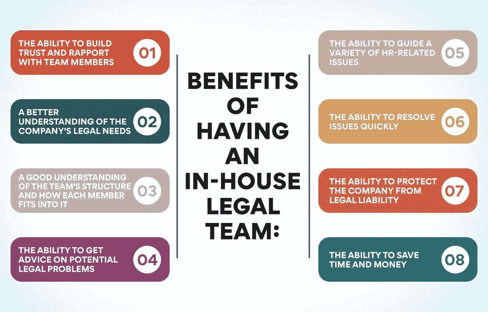

# 如何克服 HR 职业中的挑战？

> 原文：<https://www.edureka.co/blog/challenges-in-hr/>

人力资源行业在不断发展。随着劳动力的变化和增长，人力资源部门面临的挑战也在变化。人力资源部门面临的最大挑战之一是如何跟上不断变化的形势。随着新技术和新法规的引入，保持领先是一项挑战。

随着经济的改善，越来越多的员工离开他们的工作去寻找更好的机会。这对人力资源部门来说是一件非常头疼的事情，因为他们必须不断招聘和培训新员工。面对如此多不同的个性和观点，让每个人都开心可能很难。幸运的是，在人力资源领域，有办法克服这些挑战。通过紧跟行业变化，积极招聘和培训新员工，并制定处理冲突的计划，[人力资源专家](https://www.edureka.co/blog/role-of-human-resource-management-in-an-organization/)可以克服任何突发的挑战。

让我们来看看一些有效躲避挑战的最佳方法。

## **简化入职流程**

简化入职流程的第一步，也是最重要的一步，是制定一个涵盖入职培训、培训和发展所有基本要素的计划。该计划应该欢迎新员工，并帮助他们适应新的角色。它还应该提供他们在工作中取得成功所需的信息和资源。

一旦你有了计划，你就可以通过制定明确的政策和程序来开始实施。您还应该创建一份入职清单，以确保在此过程中采取了所有必要的步骤。此外，您应该为新员工提供一份联系人列表，以便他们可以联系以获得支持。

最后，你应该定期评估你的入职流程，以确保它满足你的组织和员工的需求。通过采取这些步骤，您可以简化您的入职流程，使其更加高效和有效。

**也读:[什么是战略人力资源管理？](https://www.edureka.co/blog/strategic-human-resource-management)定义和例子**

## **吸引技能型人才**

技能型人才是任何组织的命脉。没有它们，就不可能保持竞争优势，甚至无法与邻居攀比。这就是为什么吸引技能人才是人力资源专业人员的基本职能之一。

有几种方法可以吸引有技能的人才。最明显的是通过广告和招聘启事。然而，这只是冰山一角。人力资源专业人员也应该积极参与社交媒体，在行业活动中建立关系网，并与学院和大学合作。

关键是要确保你的组织是有才华的人心目中的首选。寻找和留住最合格人才的理想方式是与专门寻找顶尖人才的人事代理机构合作。通过共同努力吸引技术人才，您将使您的组织在现在和未来取得成功。

缺乏合适的人才是人力资源领域最大的挑战之一，这会影响公司的成功。因此，你必须尽一切努力确保你拥有最有[才华的劳动力](https://www.edureka.co/blog/strategic-workforce-planning)。

## **创造积极的工作场所文化**

积极的工作场所文化对任何企业的成功都很重要。这是吸引和留住顶尖人才、促进协作和推动创新的关键。但是创造一个积极的工作场所文化并不总是容易的，这里有一些克服挑战的建议

**定义你的公司价值观**

你的公司价值观应该是你工作场所文化的基础。它们应该指导一切事情，从你如何对待你的员工到你如何做生意。如果你没有明确定义的价值观，是时候坐下来创造它们了。

**传达你的价值观**

一旦你定义了自己的价值观，自上而下地将它们传达给组织中的每个人是很重要的。员工应该知道公司代表什么，以及如何为公司的成功做出贡献。

**雇用合适的候选人**

招聘新员工时，确保他们很适合你的公司文化。在面试过程中，询问他们的价值观以及他们将如何促进你的工作场所文化。

**营造积极的环境**

通过营造积极的环境，鼓励员工按照公司的价值观行事。它包括对优秀工作表现出赞赏，为个人和职业发展提供机会，以及促进开放的交流。

## **获得内部法律团队**

内部法律团队是人力资源职业的重要组成部分。他们帮助确保人力资源专业人员了解最新的法律法规，并就各种人力资源相关问题提供建议和指导。

然而，人力资源专业人员在与外部法律团队合作时可能会面临一些挑战。首先，与团队成员建立信任和融洽关系具有挑战性。这是因为人力资源专业人员经常需要处理敏感信息，他们的经验和知识水平可能不如内部法律团队。

其次，第三方法律团队可能很复杂，管理起来很有挑战性。这是因为它们通常由具有不同专业领域的多个成员组成。因此，对于人力资源专业人员来说，很好地理解团队的结构以及每个成员如何融入其中是至关重要的。

第三，第三方法律团队可能不愿意就具体问题提供建议。这是因为他们可能不想卷入潜在的诉讼或其他法律问题。然而，人力资源专业人士需要记住，法律团队的首要目标是保护公司免受法律责任。因此，如果某个问题可能导致诉讼，则应咨询法律团队。

**拥有内部法律团队的好处:**

拥有一个内部法律团队有很多好处，包括:

**与团队成员建立信任和融洽关系的能力:** 只有内部法律团队成员才能接触到公司的机密信息。这将使人力资源专业人员与团队成员建立信任和融洽的关系。

**更好地了解公司的法律需求:** 公司内部的法律团队熟悉公司的业务及其法律需求。这将使人力资源专业人员更好地了解可能出现的问题类型以及如何最好地解决它们。

**充分了解团队的结构以及每个成员如何融入其中:** 内部法律团队通常规模较小，结构清晰。这将让人力资源专业人员了解团队的每个成员如何融入公司的整体法律[战略](https://www.edureka.co/blog/ultimate-guide-to-developing-an-effective-hr-strategy/)。

**就潜在的法律问题获得建议的能力:** 内部法律团队通常愿意就潜在的法律问题提供建议。这是因为他们的主要目标是保护公司免受法律责任。因此，如果某个问题可能导致诉讼，则应咨询法律团队。

**能够指导各种人力资源相关问题:** 内部法律团队熟悉最新的法律法规。它们可以展示各种人力资源相关的问题，如招聘、绩效管理和员工关系。

**快速解决问题的能力:** 内部法律团队通常规模较小，结构清晰。这使他们能够快速解决问题。

**保护公司免受法律责任的能力:** 内部法律团队熟悉公司的业务和法律需求。这使他们能够识别潜在的法律问题，并采取措施保护公司免于承担责任。

**节省时间和金钱的能力:** 内部法律团队可以通过内部处理人力资源相关问题来节省公司的时间和金钱。它消除了雇用外部律师或诉讼法庭问题的需要。

总的来说，拥有一个内部法律团队对人力资源专业人士来说是一笔极好的财富。然而，重要的是要记住，这样的团队会面临一些挑战。牢记这些挑战，人力资源专业人员可以更好地准备与他们的内部法律团队合作，并利用其诸多优势。

**也读作:[分解人力资源管理的范围](https://www.edureka.co/blog/scope-of-human-resource-management/)**

## **带来领导力发展**

领导力发展是人力资源职业不可或缺的一部分。这有助于确保员工拥有在工作中取得成功所需的技能和知识，也有助于提高士气和积极性。

然而，人力资源专业人员在试图培养组织内的领导者时，可能会面临一些挑战。首先，确定潜在的领导者可能是一项挑战。这是因为不是所有的员工都有同样的领导潜力。因此，人力资源专业人员需要能够评估每个员工的优势和劣势，以确定那些最有潜力的人。

第二，领导力发展既耗时又昂贵。这是因为人力资源专业人员必须提供员工培训和发展机会。此外，领导力发展可能还需要使用外部顾问或专家。

第三，领导力发展可能不是一些组织的优先事项。其他人力资源计划可能被认为更重要，如招聘或留住员工。然而，人力资源专业人士必须记住，领导力发展对组织的长期成功至关重要。

领导力是一个组织的本质。这是一种设定愿景并将人们团结在愿景周围的能力。这也是做出艰难决定的能力，即使是不受欢迎的决定。作为人力资源专业人员，您可以通过各种计划支持领导力发展，如培训计划、导师机会和继任计划。

## **建立工作场所安全**

工作场所安全是人力资源领域备受关注的挑战之一，近年来一直呈上升趋势。随着工作场所事故和伤害数量的不断增加，显然需要采取一些措施来改善工作场所的安全。

人力资源专业人员可以通过多种方式建立工作场所安全。首先，他们可以制定和实施有助于防止事故和伤害发生的政策和程序。

第二，人力资源专业人员可以向员工提供如何安全工作的培训。这种培训可以包括适当的提升技术、机器安全和危险预防等主题。

第三，人力资源专业人员可以定期对工作场所进行安全审计。这些审核有助于识别潜在的危险，并采取措施减轻这些危险。

第四，人力资源专业人士可以创建一个安全委员会。该委员会可以负责制定和实施安全政策，进行安全审计，并为员工提供培训。

最后，人力资源专业人员可以鼓励员工报告他们的安全问题。通过采取这些步骤，人力资源专业人员可以帮助为所有员工创造一个安全健康的工作场所。

## **促进多样性和包容性**

多元化和包容性是人力资源领域最重要的两大挑战。这是因为员工队伍正变得越来越多元化，组织需要在员工队伍中体现这一点。克服这些挑战的最佳方法之一是促进工作场所的多样性和包容性。要做到这一点，可以通过确保组织各级员工的多样性，以及确保每个人都得到公平和平等的对待。最佳方法因组织而异，但重要的是确保这些挑战得到解决。

随着多元化和包容性，人力资源面临新的挑战，例如无意识偏见。这是指人们根据自己的偏见而不是情况的好坏来做决定。这可能是一个难以克服的挑战，但了解自己的偏见并确保它们不会影响你的决定是至关重要的。

## **底线**

面对人力资源领域的巨大挑战，你不能停滞不前。试着把注意力集中在你最感兴趣的挑战上，你觉得你可以对这些挑战产生最大的影响，记住，挑战是需要克服的，所以不要害怕接受挑战！

如果你需要帮助来启动或调整你的人力资源技能，我们为你准备了一个精彩的课程。[人力资源管理研究生证书](https://www.edureka.co/highered/human-resourse-management-course-iim-shillong)是最好的方法。这是一门在线课程，它用必要的技能武装你，并挑战你跳出思维定势。

人力资源领域的挑战可能很多，但你会用适当的技能克服它们。今天就来看看我们的课程。

## **更多信息:**

[人力资源管理的关键目标](https://www.edureka.co/blog/objectives-of-human-resource-management/)

[人力资源管理在组织中的作用](https://www.edureka.co/blog/human-resource-management/)

[目标&人力资源管理的本质](https://www.edureka.co/blog/nature-of-human-resource-management/)

[人力资源管理的演变:过去和未来](https://www.edureka.co/blog/evolution-of-human-resource-management)