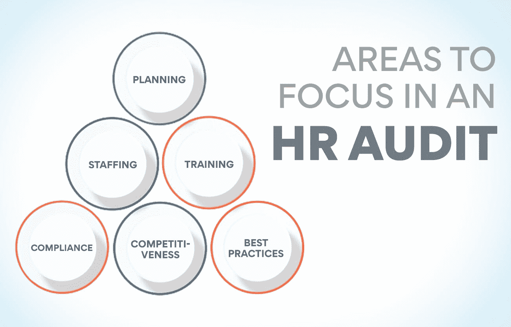
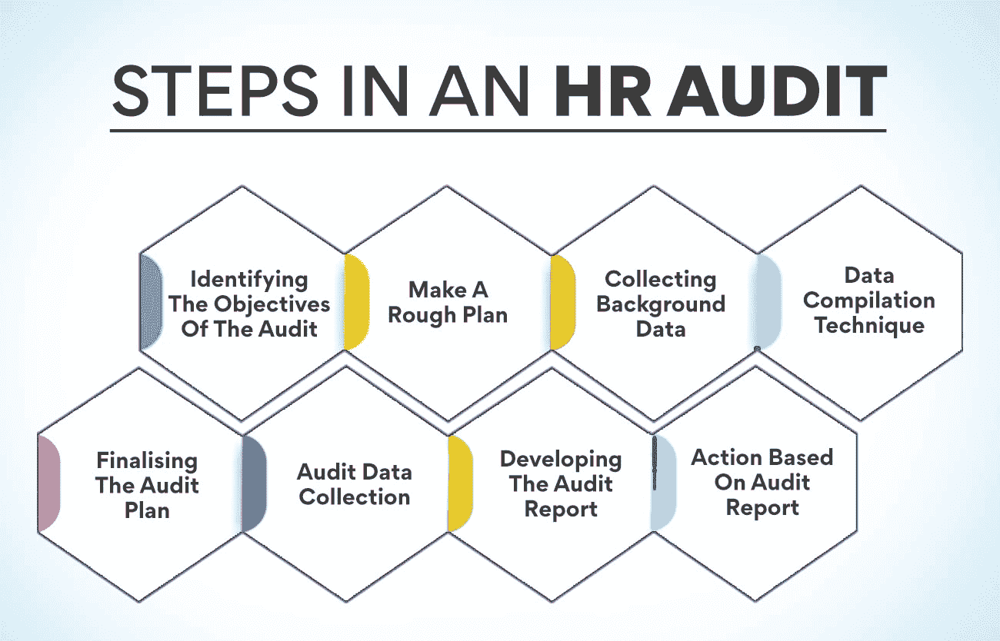
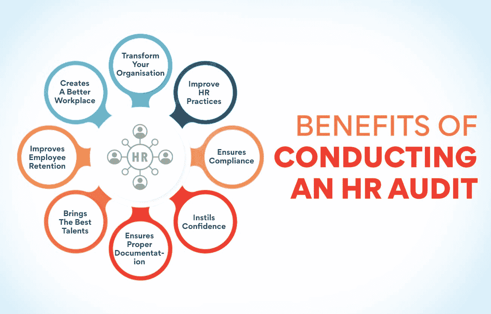

# 人力资源审计:了解其目标、重要性和局限性

> 原文：<https://www.edureka.co/blog/hr-audit/>

一家公司必须知道自己的优势和劣势，这对于人力资源来说尤其重要。一个公司的人是它最大的资产，管理层必须知道他们的人力资源政策是否正确。公司必须确保所有的人力资源活动都被恰当地执行，并让员工满意。满意的[员工队伍](https://www.edureka.co/blog/strategic-workforce-planning)对一个组织的成功至关重要，而人力资源审计是确保这一点的最佳方式。

那些计划成为人力资源专业人士的人将从参加由知名机构举办的[人力资源管理](https://www.edureka.co/blog/role-of-human-resource-management-in-an-organization/)研究生证书课程中受益匪浅。你可以通过访问我们的网站来了解更多的课程。

什么是人力资源审计？

在我们了解人力资源审计之前，有必要了解一下人力资源部门的活动。人力资源部处理任何与公司员工有关的事情。审计评估所有这些职能及其流程和政策。它不像财务审计那样是一个强制性的过程，但大多数公司都这样做，因为它们的成功取决于良好的人力资源管理。

一个人力资源审计有很多目的:

*   它有助于公司遵守管理人力资源的法律。
*   帮助人力资源部门提高绩效
*   公司可以审核和分配人力资源的必要资源
*   机构这样做是对未来投资者和[利益相关者](https://www.edureka.co/blog/stakeholder-engagement) 的尽职调查
*   审核使未来的改进成为可能。

**又读:[你应该知道的高级 HR 工具](https://www.edureka.co/blog/hr-tools/)**

如何进行人力资源审计？

通过改善员工的工作条件并留住他们，这一过程有望给公司带来许多好处。这就是为什么公司必须正确地做这件事。首先，必须有一个明确的人力资源审计目标。通过开展这项工作实现的一些目标如下:

*   此流程有助于纠正人力资源人员在履行职责时犯下的错误，并快速采取纠正措施。
*   本练习旨在了解官员是否按照公司的政策和程序履行人力资源职能。
*   它评估人力资源部在招聘、培训、晋升、工作环境、申诉补救等方面的职能。并检查这些工作是否按照公司的政策进行。
*   一项人力资源审计找出可能削减成本的领域。
*   它使员工保持纪律，并在他们的岗位上按要求工作。

我们需要将目标扩展到上述之外。各个公司的[目标](https://www.edureka.co/blog/objectives-of-human-resource-management/)会有所不同。人力资源部门应该与高层管理人员坐在一起，决定他们通过做这个练习应该达到的目标。

**人力资源审计的重点领域**

1.  **策划**

就人事管理而言，计划是非常重要的。人力资源部门必须及时预测人员需求。这将确保工作不会因为没有工作人员而停止。人力资源审计将帮助确定人力资源官员是否按时评估了员工需求，以及他们是否采取了必要的行动来填补即将到来的空缺。如果发现任何延误，这将有助于该部采取必要行动，确保人力资源规划按时完成。审计可以分析是否所有部门都有所需的人员。

2.  **人员配备**

人员配备是通过选拔和招聘进行的。人力资源审计将决定候选人的选择是否适合该职位。这项工作有助于了解此类候选人的来源，以及公司是否遵循了正确的流程来寻找最合适的人选。招聘是人力资源部门的另一个重要职能。审计可以确定招聘人员时是否遵循了公司政策规定的正确招聘程序。审核员可以通过评估人员的表现来评估人员选择的正确性。

3.  **训练**

培训对于员工和组织的发展至关重要。每个工作人员都必须有机会参加培训方案，以帮助他们在职业生涯中取得进步。进行人力资源审计的人员必须确定组织是否为员工提供了适当的培训，使他们能够承担现在和未来的责任。审计人员还必须看看花在培训上的钱是否产生了预期的回报。他们还必须检查是否有关于培训的政策，以及是否相应地遵循了程序。

4.  **符合性**

所有公司都需要遵守有关雇佣和员工的法律。中央和邦政府不时宣布法律和修正案，所有组织都必须遵守这些规则。任何偏离都会招致巨额罚款。人力资源审计必须查看公司是否遵守所有法律，人力资源人员是否熟悉最新法律。这有助于降低罚款和诉讼的风险。审计员还必须确保遵守公司的员工政策。

5.  **竞争力**

一家公司必须在产品上具有竞争力，在吸引优秀人才方面也是如此。优秀的员工是一个组织成功的关键。应该能吸引到最适合职位的人。各种因素使得一个公司对未来的雇员有吸引力。诱人的薪水、丰厚的福利、良好的工作条件、发展前景等。，是人们加入公司时考虑的因素。人力资源审计必须了解这些政策是否有助于招聘到市场上最优秀的人才。

6.  **最佳实践**

人们必须评估人力资源部门是否遵循了其他行业公司采用的最佳实践。评估公司的政策是否符合公认的行业标准至关重要。这有助于确保公司在工作描述、员工手册、员工评估方法等方面都走上正轨。这对成长中的公司至关重要，因为这些政策有助于留住员工并吸引该领域的最佳人才。

你可以从人力资源管理研究生证书课程中了解更多关于 人力资源审计的[范围。关于这门课程的更多信息可以在我们的网站上找到。](https://www.edureka.co/blog/scope-of-human-resource-management/)

**人力资源审计的步骤**

人力资源审计如果要产生预期的结果，就必须系统地进行。因为这是一个需要时间和人力的过程，所以最好确保它是成功的。以下是本练习为实现其目标而必须遵循的步骤。

1.  **确定审计目标**

虽然大多数公司的人力资源审计的目标是相似的，但是有许多方面是特定行业或组织所独有的。审核小组必须确定目标，并确保计划和时间表旨在实现这些目标。它们还必须符合企业的总体目标。

2.  **制定一个粗略的计划**

在开始实际的审核过程之前，团队领导必须有一个粗略的计划。审核员需要确定成功完成审核所需的人力、资金和设备。这也将有助于向最高管理层通报该过程所涉及的努力，并获得他们的许可。

3.  **收集背景数据**

实施审核的人员必须收集成功实施人力资源审核所需的所有必要信息。这将包括关于组织内部能力水平的数据。审计师还必须了解公司经营所处的法律环境。

4.  **数据编译技术**

从员工那里收集数据对于成功的人力资源审计非常重要。审核小组必须决定收集这些数据的方法。他们可以发出一份问卷让工人回答。另一种方法是采访一些关键成员，以收集有关人力资源职能的信息。

5.  **最终确定审计计划**

在这个阶段，如果需要，可以修改粗略的计划。现在还必须对计划进行任何补充。收集的背景资料将有助于修改计划。团队必须坐在一起敲定计划，然后再继续前进。

6.  **审计数据收集**

在这一步骤中，从各种来源实际收集数据。审核员必须汇编所有的信息，并以有益的方式进行安排。团队领导必须确保按照人力资源审计计划，所有的数据都已经收集和汇编。

7.  **编写审计报告**

一旦收集了所有的信息，就要对人力资源部门的各种职能进行评估。审计师在此基础上生成报告。同时，该团队还观察员工的工作表现和工作氛围，并对其进行评估。该报告被提交给主管人员。

8.  **基于审计报告的行动**

这是管理层研究报告并采取行动的最后阶段。主管人员可能会寻求审计小组的建议，以便根据报告进行更改。这有助于组织在人力资源管理方面做出正确的决策。

**进行人力资源审计的好处**

**转变您的组织**

审核有助于确定组织中需要改进的领域。它可以帮助优化人力资源，提高投资回报。就有可能知道生产力低下的原因并加以纠正。利用这种审计可以改善通信和数据收集系统。

**改善人力资源实践**

人力资源审计将一家公司当前的人力资源实践与行业标准进行比较。这有助于改善该部门的运作，并与其他部门看齐。人力资源团队可以学习准备更好的员工手册，准备更有吸引力的离职计划，做出令人兴奋的职位描述，以吸引最优秀的人才到公司。

**确保合规**

遵守劳动法可以为公司节省大量资金和精力。任何不遵守规则的行为都可能导致处罚和诉讼。审计将帮助公司及时了解法规的最新变化，并确保合规。

**灌输信心**

人力资源部门必须能够自信地运作。一个人力资源审计将帮助他们提高绩效，并达到行业最佳水平。它给人力资源人员注入信心，帮助他们更有效地工作。

**确保正确记录**

当涉及到在各个方面监控你的员工时，适当的文件是至关重要的。确保所有与工人有关的档案都得到妥善保存并不容易。审计发现文件中的任何缺陷，并帮助公司纠正错误。

**又读:[如何克服 HR 职业中的挑战？](https://www.edureka.co/blog/challenges-in-hr/)**

**带来最优秀的人才**

在员工福利和工作条件方面，人力资源审计让公司保持竞争力。这有助于公司了解与业内其他公司相比，他们的不足之处。纠正缺点有助于吸引[最优秀的人才](https://www.edureka.co/blog/talent-management-and-its-importance/)加入组织。

**提高员工忠诚度**

留住员工对于公司实现目标至关重要。对人力资源运作的评估有助于找到员工离开公司的原因。该组织可以做出改变，以确保员工留在那里，并为其成功做出贡献。

**创造更好的工作场所**

如果员工必须高效和忠诚，每个公司都有必要提供一个良好的工作氛围。人力资源审计有助于找出需要改进的地方。人力资源部门可以了解任何由于设备故障或工人歧视造成的安全问题。这些都是可以纠正的，工作环境可以大大改善。

参加[人力资源管理](https://www.edureka.co/highered/human-resourse-management-course-iim-shillong)研究生证书课程，可以更容易地了解实施审计的优势。请访问我们的网站，了解更多关于本课程及其主题的信息。

**结论**

尽管进行人力资源审计并不是强制性的，但越来越多的公司正在进行这项工作，因为它提供了巨大的好处。公司可以为员工提供更好的环境，确保他们的忠诚度。有抱负的人力资源专业人士必须学习这个过程，并主动在他们的公司进行审计。

## **更多信息:**

[重点领域:人力资源管理](https://www.edureka.co/blog/human-resource-management-emphasis)

[人事管理与人力资源管理的区别](https://www.edureka.co/blog/difference-between-personnel-management-and-human-resource-management/)

[什么是人力资源业务伙伴:终极指南](https://www.edureka.co/blog/hr-business-partner)

[什么是人力资源管理系统？](https://www.edureka.co/blog/human-resource-management-system/)