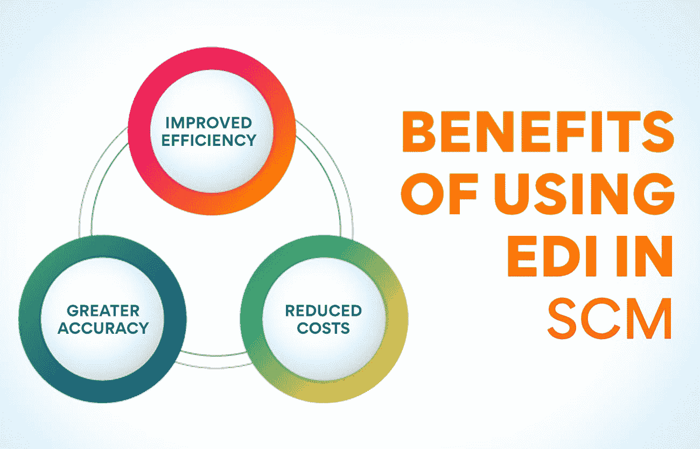

# 什么是供应链管理中的电子数据交换？需要知道的 11 件事

> 原文：<https://www.edureka.co/blog/electronic-data-interchange/>

如果你在供应链管理领域，你会知道事情总是在变化。即将到来的最重要的变化之一是我们如何以电子方式交换数据。这一过程被称为 EDI，它将彻底改变我们做生意的方式，你必须为此做好准备。在这篇博文中，你将了解到 2022 年 SCM 中关于电子数据交换的一切。从 EDI 的基础知识到它将如何影响您的业务，请继续阅读以了解更多。

供应链管理是一个充满希望的职业，它会把你带到不同的高度，查看我们的运营、供应链和项目管理高级证书。

## 电子数据交换:概述

电子数据交换(EDI)就是在系统之间以标准格式交换/共享文档。EDI 使公司能够以电子方式与贸易伙伴(如供应商和客户)交换信息。

在供应链管理中，EDI 在不同的供应链管理软件系统之间交换信息。它允许不同供应链部分之间的自动化数据交换，从而提高效率和准确性。

EDI 已经存在了几十年，但直到最近才在供应链管理中得到广泛应用。这是因为 SCM 软件的使用越来越多，使得 EDI 在不同软件系统之间交换信息变得更加重要。

在供应链管理中使用 EDI 有很多好处，包括:

*   **提高效率:** 自动化的数据交换可以节省时间，减少错误。
*   **更高的准确性:** 以电子方式交换的数据比人工方式交换的数据更不容易出现错误。
*   **降低成本:** 自动化的数据交换可以减少人工处理的需要，节省资金。

## **电子数据交换简史**

电子数据交换(EDI)的第一次出现是在 20 世纪 60 年代的两家公司之间。20 世纪 70 年代，公司间 EDI 紧随其后，允许不同的公司进行电子通信。20 世纪 80 年代见证了 EDI 标准的发展，使得公司无论规模大小或行业如何都可以使用 EDI。

在 20 世纪 90 年代，随着互联网使用的增加和软件变得越来越复杂，EDI 得到了更广泛的应用。如今，EDI 对供应链管理(SCM)至关重要，因为它允许企业快速有效地交换信息。

## 电子数据交换是如何工作的？

如果你从事供应链管理，你可能听说过电子数据交换(EDI)。但是 EDI 是什么？它是如何工作的？它对企业有什么好处？

EDI 是两家公司之间不同格式的电子数据交换。EDI 用可以电子传输的数字信息代替了纸质文件。这意味着订单、发票和其他文档可以在企业之间快速、安全地交换，而无需来回邮寄。

EDI 要求每个公司都有一个唯一的标识符，称为 EDI 编号或 ID。当企业希望交换文档时，他们首先需要就要交换的文档类型(例如，采购订单或发票)以及使用的格式达成一致。一旦达成协议，每家公司都可以设置自己的系统来自动发送和接收达成一致的文档。

电子数据交换的好处是显而易见的:它消除了对纸质文件和手工数据输入的需要，减少了因沟通不畅而造成的错误和延误，节省了时间和金钱。此外，EDI 使以电子方式跟踪货物成为可能，并提供了对供应链的可见性，这是基于纸张的系统所无法做到的。

## **不同类型的电子数据交换**

EDI 已经存在很长时间了，并且有许多不同类型的 EDI。最常见的 EDI 类型是面向交易的 EDI。这种类型的电子数据交换涉及公司之间的电子商务文件的交换。使用面向事务的 EDI 交换的最常见的业务文档是采购订单、发票和装运通知。

另一种类型的 EDI 被称为面向消息的 EDI。这种电子数据交换涉及两家公司之间的信息交换。面向消息的 EDI 可用于各种目的，如客户服务、订单跟踪和产品信息交换。

还有面向文件的电子数据交换，类似于面向交易的电子数据交换，但它涉及文件的交换而不是交易。使用面向文档的 EDI 交换的常见文档类型包括报价、合同和目录。

最后，还有一种基于增值网络(VAN)的 EDI。这种类型的 EDI 使用第三方服务提供商来促进公司之间的信息交换。基于 VAN 的 EDI 经常被需要与许多不同的贸易伙伴交换信息的大型组织使用。

## EDI 有什么好处？

在你的[供应链管理战略](https://www.edureka.co/blog/how-to-formulate-advanced-supply-chain-strategy/)中实施 EDI 有很多好处。

**降低运营成本**

最明显的好处是潜在的成本节约。通过使贸易伙伴之间的信息流自动化，EDI 有助于消除数据输入过程中的错误和冗余，从而降低处理成本。

任何公司面临的最大挑战都是如何在不影响质量或服务的情况下降低运营成本。许多人转向外包作为降低这些成本的一种方式。然而，找到合适的供应商需要时间和精力。

降低运营成本的一种方法是在供应链管理(SCM)中实施 EDI 系统。在供应链管理中使用 EDI 带来的降低成本的好处包括:

*   降低销售成本(COGS)
*   提高效率和准确性
*   减少纸张用量
*   更快的处理时间
*   提高客户满意度

如果你正考虑在你的[供应链管理](https://www.edureka.co/blog/major-decision-areas-in-supply-chain-management/)中实施一个 EDI 系统，以享受它的所有好处，有很多事情你应该熟悉并去做。例如，您必须选择满足您的特定需求的 EDI 解决方案，这将有助于增强协作潜力。

**提高数据准确性**

EDI 通过自动化过程降低了数据输入中的错误概率。这是因为它消除了手动数据输入的需要，而手动数据输入往往容易出现人为错误。此外，它还可以通过实时查看库存水平、订单状态和其他关键信息来提供数据准确性。通过实时了解这些信息，企业可以对其供应链做出更明智的决策，并避免潜在的中断。

EDI 还可以帮助企业更加符合监管要求。通过使贸易伙伴之间的数据交换自动化，EDI 可以帮助公司确保遵守所有相关的法律法规。它可以保护企业免受因不合规而导致的潜在处罚或法律诉讼。

**也可阅读:[什么是运营和供应链管理(OSCM)？](https://www.edureka.co/blog/what-is-operations-and-supply-chain-management-oscm/)**

**缩短业务周期时间**

EDI 可以在几个方面帮助缩短商业周期。例如，EDI 可以帮助减少处理订单和发票的时间。EDI 可以使这些过程中涉及的许多任务自动化，例如数据输入和验证。此外，电子数据交换有助于改善企业之间的沟通，从而有助于加快整个过程。最后，EDI 可以让企业了解他们的供应链，这有助于识别瓶颈和其他可能导致延迟的问题。

**环保选项**

随着公司努力实现更可持续和更环保的发展，供应链管理(SCM)中的电子数据交换(EDI)正成为越来越受欢迎的选择。EDI 允许公司以电子方式交换信息，这有助于减少纸张的使用和保护树木。此外，通过使公司能够以电子方式发送和接收信息，而不是使用物理邮件或快递服务，它可以帮助降低运输成本和排放。

EDI 可用于供应链管理中的各种目的，如订单处理、发货通知、发票开具和支付。它还有助于简化供应链中不同方(如供应商、制造商、分销商和零售商)之间的沟通。

在供应链管理中使用 EDI 有很多好处。通过减少纸张和实物运输的使用，EDI 有助于减少供应链对环境的影响。此外，它还可以提高供应链中不同方之间的效率和沟通，从而节省成本。

**提升业务效率**

在当今的商界，效率是成功的关键。公司总是在寻找方法来简化他们的运营和降低成本。电子数据交换(EDI)是单向业务，可以提高效率和节省资金。

如前所述，EDI 是一种直接的数据交换方式；对于拥有大量数据和文档的公司来说，这可能是一个救命的选择。它允许企业以电子方式相互交流，消除了对纸质文件和手工数据输入的需要。EDI 是一种快速有效的信息交换方式，为您的公司节省时间和金钱。

实施 EDI 可能很复杂，但不一定如此。市场上的许多 EDI 软件解决方案可以帮助您入门。一旦你开始运行，你会想没有它你怎么做生意！

**提高交易安全性**

EDI 系统提供了一个安全的信息交换平台，有助于提高交易的安全性。数据泄露和欺诈的风险微乎其微。电子数据交换系统还将确保所有被交换的数据是准确和一致的，这有助于减少错误和改进决策。

**简化沟通**

在任何供应链管理(SCM)系统中，沟通一直是让每个人都专注于相同目标并确保任务高效完成的关键。在过去，这种交流主要是通过电话、电子邮件和传真进行的，所有这些在某种程度上今天仍在使用。然而，随着电子数据交换(EDI)的出现，现在有了一种更有效的方式在 SCM 系统之间进行通信。EDI 有助于促进贸易伙伴之间更快、更有效的沟通。

通过提供一种标准化的数据交换格式，EDI 有助于简化信息交换，使企业更容易共享数据。它可以改善整个供应链的协调和合作，最终带来更好的客户服务和满意度。

EDI 是一套标准，定义了两台计算机之间的信息结构。这种交换可以实时或接近实时地进行，从而使数据能够快速轻松地来回处理。这是相对于传统通信方法的一个主要优势，传统通信方法通常很慢而且很麻烦。

EDI 已经存在很多年了，但是直到最近它才开始在供应链管理系统中广泛使用。这是因为 EDI 有几个好处，使它非常适合用于 SCM 应用:

1.  EDI 消除了手工数据输入的需要，节省了大量的时间和金钱，这些时间和金钱可以用于其他重要的任务。
2.  EDI 确保信息在不同系统间准确一致地传输。
3.  EDI 能够实时跟踪运输和库存水平，这让公司对其供应链有了更多的了解。

总的来说，EDI 简化了供应链管理系统内的沟通，并提供了许多好处，使其成为任何现代供应链运作的重要组成部分。

## 如何实施 EDI 以获得最佳效果？

实施 EDI 的方法有很多，但最有效的方法是与专业的 EDI 公司合作。这些公司拥有确保您的 EDI 实施成功的经验和专业知识。

与 EDI 公司合作的第一步是评估你的需求。您需要交换什么类型的数据？你需要什么格式的？您需要多久交换一次数据？回答完这些问题后，你就可以开始寻找一家满足你需求的 EDI 公司了。

如果你的公司正在考虑在其供应链管理运作中实施 EDI，你应该记住一些事情。首先，您必须选择一个满足您公司需求的 EDI 软件解决方案。有几种不同的软件解决方案可供选择，但是在做出决定之前，您必须进行彻底的研究。

有许多不同的软件提供商，每个提供商都提供不同的功能。您必须确定如何与您的贸易伙伴交换数据。这可以通过增值网络(VAN)或直接在使用互联网协议(IP)的系统之间完成。最后，您需要决定在 EDI 事务中包含哪些数据元素。

当你找到几个潜在的供应商时，花时间比较他们的服务。确保他们提供你所需要的支持，并且他们有良好的声誉。你还应该比较价格，因为一些公司可能会为较大的项目提供折扣。

通过与专业的 EDI 公司合作，您可以确信您的电子数据交换实施将会成功。一旦你选择了一个 EDI 公司，他们将与你一起建立系统，并培训你的员工如何使用它。他们还将提供持续支持，以确保您的系统平稳运行。

一旦您选择了 EDI 解决方案并决定了如何交换数据，您需要设置您的系统并与您的贸易伙伴一起测试。这一过程可能既耗时又昂贵，但却是确保成功实施所必需的。

1.  谁来执行？

当谈到谁将在你的供应链管理系统中实施 EDI 解决方案时，有许多方法和选择可以采用。第一是由一方负责整个过程。可以是内部团队，也可以是外部咨询公司。这种方法的主要亮点是，如果出现任何问题，它提供了明确的责任和问责线。但是，如果初始实施存在问题，它可能会很昂贵，并且可能需要更长时间才能启动和运行。

另一种选择是让供应链中的每个公司负责其 EDI 的实施。它可能更快、更划算，但也有一些风险。没有哪一方要对项目的成功负全部责任，所以如果有任何问题，很难确定它们是从哪里产生的。这种方法还需要所有相关方之间的良好沟通和协调。

谁将在您的供应链管理系统中实施 EDI 解决方案的最终决定将取决于几个因素，包括预算、时间表和您愿意承担的风险水平。最终，无论你选择哪个选项，都应该基于什么最适合你的业务。

**也读:[物流和供应链管理有什么区别？](https://www.edureka.co/blog/difference-between-logistics-and-supply-chain-management/)**

2.  **获得第三方顾问**

为了开始在你的 SCM 中使用 EDI，你需要找一个第三方顾问，他可以在建立和维护 EDI 系统的技术方面帮助你。找咨询师的时候要记住这些要点:

*   确保顾问拥有供应链管理中 EDI 的经验。向其他使用过他们服务的公司寻求参考。
*   了解顾问熟悉哪些软件平台。你需要确保你的 ERP 系统与他们使用的软件兼容。
*   询问他们的项目管理方法。这对于确保项目不超出预算非常重要。
*   从顾问那里获得一份详细的建议书，列出他们的费用和服务。在签署任何合同之前，确保你了解所有的费用。

3.  **与软件供应商合作**

谈到供应链管理中的 EDI，与软件供应商合作是绝对必要的。这样做时，请记住以下要点:

*   确保供应商的软件与您当前的系统兼容。
*   对供应商进行调查——阅读评论、获得推荐等。
*   在与供应商会面之前，要清楚地了解自己的需求。从长远来看，这将有助于淘汰那些不适合的人，并节省时间。
*   在做出决定之前，从多家供应商处获得报价。
*   手边放一份合同，概述双方的责任。

## **电子数据交换的未来**

电子数据交换的未来看起来很有希望。随着技术的进步，电子交换数据的方式越来越多。这意味着公司可以通过电子方式交换数据而不是使用纸质文档来节省时间和金钱。

EDI 在供应链管理中的前景看好。随着电子商务的持续发展和商业的全球化，越来越需要有效和可靠的方式在组织之间交换信息。EDI 为贸易伙伴之间的数据交换提供了一个经济高效的解决方案。此外，EDI 可以帮助组织实现供应链流程的自动化，减少错误并提高效率。

电子交换数据有很多好处。一个好处是比使用纸质文档快得多。另一个好处是更准确。当数据以电子方式交换时，错误就不太可能发生。

电子数据交换的另一个优点是它有助于降低成本。例如，如果一家公司使用纸质文档来交换数据，他们将需要打印出文档，然后通过邮件发送。这可能很贵。然而，如果公司使用电子数据交换，它可以用电子方式发送数据，而不必打印任何东西。

总的来说，电子数据交换的未来看起来很有希望。它可以帮助公司节省时间、金钱和资源，从而提高准确性和降低成本。

## **结论**

随着我们步入 2022 年，了解电子数据交换(EDI)在供应链管理(SCM)中的趋势至关重要。EDI 作为一种简化 SCM 流程和改善企业间沟通的方式正变得越来越流行。如果你仍然需要在你的 SCM 操作中开始使用 EDI，现在是时候研究它的好处了。

的确，全世界都在享受供应链管理中 EDI 的好处。如果你想在供应链管理的职业生涯中蒸蒸日上，你必须精通 EDI。我们的课程[运营、供应链和项目管理](https://www.edureka.co/highered/advanced-program-in-operations-supply-chain-project-management-iitg)高级证书，有你需要学习的一切，可以启动你的职业生涯。

现在就去看看这门课程，探索它的众多好处。

## **更多信息:**

[了解供应链管理的基本要素](https://www.edureka.co/blog/components-of-supply-chain-management/)

[供应链管理目标讲解](https://www.edureka.co/blog/objectives-of-supply-chain-management-explained/)

[什么是绿色供应链？概述](https://www.edureka.co/blog/green-supply-chain)

绿色供应链管理:它是什么，为什么重要？