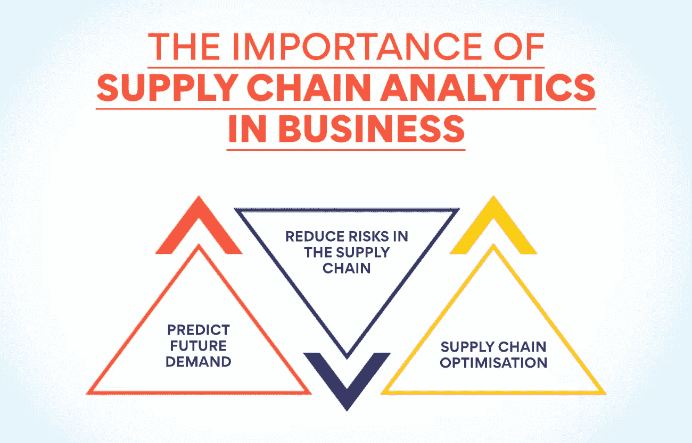
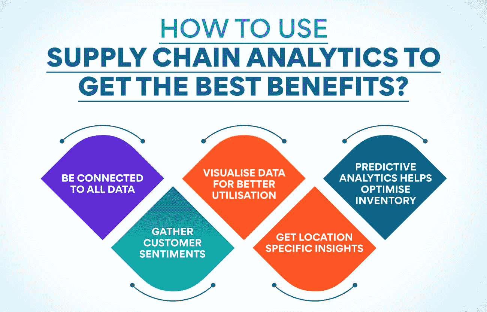
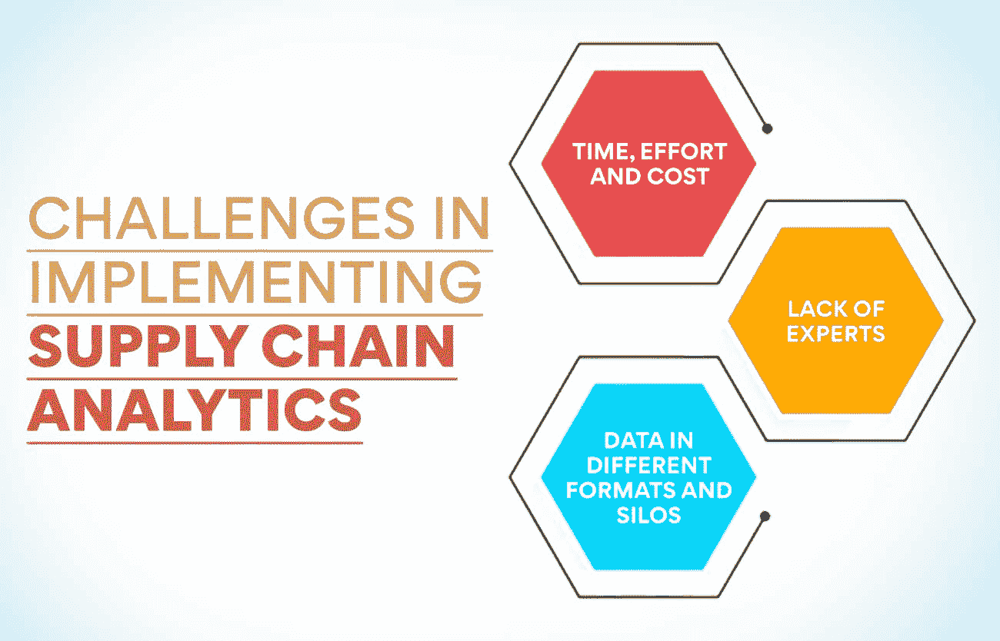

# 什么是供应链分析？重要性、用法和示例

> 原文：<https://www.edureka.co/blog/supply-chain-analytics/>

供应链是任何企业中最突出和最重要的元素。它包括从供应商到客户的一切。它包括所有的功能，从原材料采购到交付给客户。高效的供应链既省钱又让客户满意。让这个过程变得高效并不容易，因为它分散在各个部门，涉及到很多人。人们需要使用最现代的技术来使供应链有效，这就是供应链分析发挥关键作用的地方。

在知名机构举办的运营、供应链和项目管理高级证书课程中，你可以学到很多关于这一过程的知识。您可以访问我们的网站，了解有关本课程的更多信息，以及它将如何惠及一名有抱负的供应链专业人士。

## **什么是供应链分析？**

简单来说，就是公司从供应链的各个[环节获得的信息分析。然而，吸收所有数据并不容易，因为供应链本身分散在各个部门。不同的软件包控制每一个过程。采购和供应商管理由一个部门完成，而另一个部门管理库存和商店。同样，不同的程序控制订单和交货。](https://www.edureka.co/blog/components-of-supply-chain-management/)供应链分析是对来自所有这些软件程序的数据进行分析。

每个程序都有不同的报告功能。他们可能会提供各种报告，如预测的供应商交付时间、最佳库存和各种客户的平均交付时间。但是供应链分析如果所有这些都整合在一起，将会非常强大。ERP 是将所有这些任务整合在一起的一种方式。将更容易获得分析所需的信息。它将为分析师提供仪表板上所有报告的综合视图。它帮助他们实时查看数据，并做出决策以防止问题变得更加严重。

## **供应链分析在商业中的重要性**

供应链分析可以通过多种方式帮助企业提高绩效、降低成本和增加利润。使用实时和历史数据有助于他们做出更好更快的决策。以下是这一过程有利于公司的一些方式。

**预测未来需求**

对任何组织来说，手中的股票越来越少或越来越多都是危险的。当你没有足够的材料时，你就有失去客户的风险。如果库存过剩，就会导致过度支出。如果能够准确预测未来需求，企业可以避免这两种情况。供应链分析利用历史销售和库存数据帮助预测未来销售。这将有助于了解公司理想状态下应该持有多少库存，以满足客户需求，同时避免库存过多。这也有助于保持足够数量的原材料。

**降低供应链中的风险**

拥有如此多不同组成部分的供应链总是容易出现风险。任何事情都可能在任何时候出错，无论是在你的组织内部，还是在构成你供应链一部分的企业中。完美的计划对于减轻这种风险和确保一切顺利进行是必要的。供应链分析帮助你洞察供应链各个领域可能出现的问题。这将帮助你为这样的危险做好准备，并准备好解决方案。这将确保您的供应不会受到任何影响。

**供应链优化**

利用供应链分析帮助企业优化供应链。在这个过程中，有许多系统和人员在工作，总是有效率低下的可能性。这意味着公司将在运营上花费更多的钱。找出有机会改进的地方可以使流程更有效率。高效的供应链可以降低成本，确保客户满意。分析有助于找到需要提高工作效率的员工，并为他们提供必要的支持，使他们的能力与其他人相匹配。

**也读作:[供应链管理的目标解释](https://www.edureka.co/blog/objectives-of-supply-chain-management-explained/)**

## **供应链分析的类型**

现代技术和实时数据的获取使得分析的可能性几乎是无限的。公司使用五种常见的分析方法来提高供应链的效率。

1.  **描述性分析**

这种类型的供应链分析利用历史数据做出更好的决策。例如，一家公司可以查看在特定时期哪些产品销售得少或多。这有助于他们相应地计划生产并保持最佳库存。在几乎所有的历史数据中找到有助于供应链经理合理计划各种活动的模式是可能的。公司也可以找到那些滞销的产品来赚取利润。然后，他们可以决定是停止销售该商品，还是做出改变以提高销量。

2.  **预测分析**

顾名思义，这就是供应链分析的类型，专家使用历史数据、机器学习技术和统计算法来预测各种事件。它允许公司准确预测可能扰乱供应链活动的事件。预测分析的一个例子是使用历史库存数据来重新订购商品。他们可以分析这些信息，并准确地决定何时应该再订购一件商品，以确保仓库中的最佳库存。这将防止库存过少或过多，确保客户满意和节约成本。

3.  **规定性分析**

在这种类型的供应链分析中，数据专家使用大量数据来做出决策，帮助制定[最佳战略举措](https://www.edureka.co/blog/how-to-formulate-advanced-supply-chain-strategy/)。一直自己执行订单的公司可能希望将工作外包给第三方物流公司，以节省成本和提高效率。但是他们必须在正确的时间做，这样业务就不会受到影响，客户也不会受到影响。规范分析有助于找到公司转向外包订单履行的恰当时机。

4.  **认知分析**

大多数公司都希望有一个能像人类一样思考和决策的程序。认知分析有助于做到这一点。但是这种类型的供应链分析需要大量的数据来从中获得洞察力。这项技术使用机器学习和人工智能，通过适当的推理来做出决策。使用人工智能，电子商务公司可以更好地了解他们的供应链。那些已经使用人工智能的公司报告说，收入大幅提高，成本降低。

5.  **诊断分析**

这是一种供应链分析，它查看历史数据并告诉公司事件发生的原因。它对找出供应链中错误、失误和延误的原因有很大帮助。诊断分析有助于公司找出为什么会出现发货延迟和采购中断。这有助于采取纠正措施，确保此类事件不再发生。供应链运作的每一次改进都会导致成本降低和利润增加。

在运营、供应链和项目管理高级证书课程中，可以深入了解各种类型的分析以及如何使用它们来优化供应链。访问我们的网站可以让你对这门课程有更多的了解。

## **如何利用供应链分析获得最佳收益？**

**连接到所有数据**

供应链分析的成功取决于用于分析的数据量和准确性。如果练习必须有助于做出明智的决策，那么信息也必须是实时可用的。这意味着所有分析专家必须能够无障碍地访问所有供应链数据。在某些情况下，需要从不同的地方收集数据，并将其移动到数据表中进行分析。这可能导致浪费时间。因此，首先要确保的是所有数据都是相互连接且易于访问的。

**收集客户意见**

执行供应链分析的主要目的是确保公司为其客户提供最佳体验。为了确保这一点，你需要知道客户对公司的[供应链管理](https://www.edureka.co/blog/major-decision-areas-in-supply-chain-management/)和交付的看法。公司可以很容易地从社交媒体平台收集这些信息，客户可以在社交媒体平台上交流对产品和服务的看法。这些信息将有助于优化供应链，提高客户满意度。这也将有助于预测销售，因为人们会在他们的社交媒体账户上表达他们的购买意图。

**可视化数据以便更好地利用**

供应链会产生大量的数据，消化所有的信息可能会变得很困难。最好能够使用可视化工具来可视化数据。当你对数据有一个大概的了解时，解释数据就变得容易了。建立联系和假设也变得容易。与团队分享更简单的数据进行分析，便于您进行改进。一些工具提供了表格和图表视图，告诉你供应链是如何运作的，需要做哪些优化。

**获得特定位置的信息**

供应链管理的挑战之一是运营分散在不同的地点。从你的供应链分析中获得特定位置的洞察力将是有益的。这将有助于了解每个地点的表现以及他们面临的挑战。更容易为一个地方找到可能不适用于其他地方的具体解决方案。基于公司客户所在地的库存分布将有助于减少交付时间并提高客户满意度。

**预测分析有助于优化库存**

除非你能准确预测需求，否则以节约成本的方式管理库存是一项艰巨的工作。预测永远不会完全正确，但它确实提供了维持最佳库存所需的信息。预测分析可以帮助预测需求，并帮助您只维持必要的库存。这将有助于节省成本和仓库空间。关于每日销售、生产提前期和收货周转时间的信息有助于更好地预测需求。这些见解将有助于自动设置电子订单数量，并简化库存补货流程。

现在我们已经看到了如何使用供应链分析来提高供应链的效率，是时候看看企业从这一过程中获得的好处了。

**也读:[运营管理的范围是什么？](https://www.edureka.co/blog/what-is-the-scope-of-operations-management/)**

## **供应链分析的优势**

**降低库存成本**

原材料和成品的库存都会给公司带来成本。使用供应链分析**、** 可以准确预测需求并优化库存。公司通常使用历史数据来预测未来的销售，并在此基础上储存货物。但这没有考虑到市场未来的变化。使用预测分析对产品的未来需求做出准确的预测是可能的。这将有助于公司减少或增加库存水平，并确保所有订单得到执行，同时不会出现库存过剩。

**生产计划的优化**

受市场需求波动影响的不仅仅是库存。生产计划也受到市场中断的影响。使用传统的方法，不可能为这样的事件做计划。这会导致生产过多的材料或过少的产品。这两种情况都对企业有害。虽然预测分析告诉你未来的需求是什么，但规范分析也可以提供应对市场中断的解决方案。这样的供应链分析可以为真实或假设的市场条件变化提供理想的生产计划。

**改善物流运作**

物流是供应链的重要组成部分。还会涉及外部机构，很多问题会耽误发货。供应链分析可以通过提高响应速度来改善物流运营。说明性分析可以分析当前的运输网络，并找到需要改进的地方。这将有助于减少交货时间和成本。使用预测分析提供的销售预测，您可以计划您的运输安排，以确保货物的及时交付。该公司还可以使用分析方法改变中断的运输路线。

**改善跨职能协作**

供应链由各种组件组成，这意味着许多人参与到这个过程中。我们看到了供应链分析如何提高供应链不同环节的效率。除此之外，这个过程还有助于不同团队之间更好的协作。如果生产团队预计会有更多的需求，而运输团队没有这些信息，这将导致没有车辆来运输货物。通过分析，所有团队都有了更好的可见性，可以在同一页面上解决问题。

了解这些好处可以促使供应链官员在他们的组织中实施这一流程。要了解更多信息，可以参加[运营、供应链和项目管理](https://www.edureka.co/highered/advanced-program-in-operations-supply-chain-project-management-iitg)高级证书课程。我们的网站将提供你想知道的关于这门课程的所有细节。

## **实施供应链分析的挑战**

1.  **时间、精力和成本**

安装必要的分析软件包所涉及的成本可能是许多公司实施这一流程的最大障碍。供应链分析技术的维护成本很高。由于效果不是立竿见影的，许多官员可能会发现很难说服管理层花费如此巨额的资金。用于分析的独立软件包很难编程。在许多情况下，这些可能无法与组织中的现有技术适当集成。那些提供 ERP 的只能在他们的生态系统中使用。

2.  **缺乏专家**

供应链分析需要专家来执行任务。无论您使用的是独立软件还是更大软件包的一部分，都是如此。这样的专家可不便宜。你可以对你的员工进行这方面的培训，也可以雇佣分析专家。在这两种情况下，公司都要投资，结果不会马上出来。这是大多数公司的两难选择。但是，不执行分析可能会让你的供应链落后，而其他部门却在奋力实现组织的目标。

3.  **不同格式和筒仓的数据**

供应链中有不同类型的数据。有支持业务流程的主数据。然后是交易数据，如采购和销售数据。除了这两个，还有来自物联网传感器的非结构化数据。这些数据不是一个地方可以得到的。它们位于各种软件程序中，如 CRM 或 WMS 以及各种其他存储库中。通常情况下，它们不会相互通信。在开始供应链分析**、** 之前，将所有这些整合在一起并实现端到端可见性至关重要。对于大多数组织来说，这是一个真正的挑战。

## **结论**

实施供应链分析极具挑战性。但是它给公司带来的好处远远大于障碍。它所需要的只是一个能够接受挑战的供应链经理和一个愿意为此花钱的管理层。完成了该学科现代课程的物流经理知道这一过程的重要性，并将努力完成这一练习。一旦好处开始显现，每个人都会明白进行分析是多么必要。

## **更多信息:**

[什么是绿色供应链？概述](https://www.edureka.co/blog/green-supply-chain)

绿色供应链管理:它是什么，为什么重要？

[什么是供应链控制塔？类型&用途](https://www.edureka.co/blog/supply-chain-control-tower/)

[什么是库存管理？15 种有效技巧](https://www.edureka.co/blog/inventory-management/)