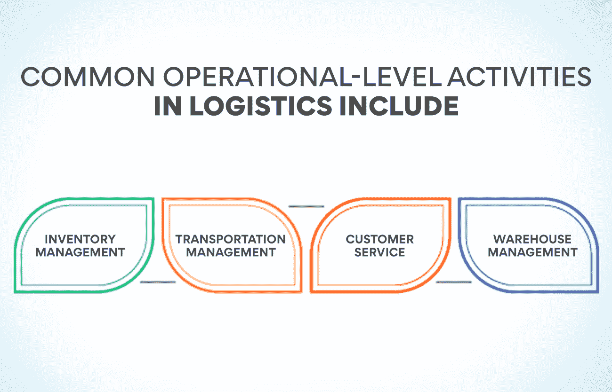

# 16 大供应链管理面试问题和答案

> 原文：<https://www.edureka.co/blog/supply-chain-management-interview-questions/>

参加供应链管理职位的面试？供应链管理(SCM)在任何公司都起着至关重要的作用，面试过程应该反映这一点。预计会被问到一些关于你的经验的一般性问题和关于你的供应链管理知识的具体问题。为了帮助你做好准备，我们编制了一份超过供应链管理面试问题的清单，以及如何回答这些问题的建议。

在开始回答面试问题之前，先看一下我们的运营、供应链和项目管理高级证书，这是通向成功的供应链管理职业生涯的大门。

## **16 大供应链管理面试问题&答案**

## **你所理解的供应链管理是什么？**

1.  供应链管理是计划、实施和控制供应链运作的过程，以提供最大的客户价值并获得可持续的竞争优势。
2.  供应链管理的主要目标是确保所有供应链成员高效合作，以满足客户需求。
3.  供应链管理包括管理供应链不同阶段之间的物流、信息流和资金流。
4.  供应链管理需要所有供应链成员之间的密切合作，从供应商到制造商到零售商再到顾客。
5.  有效的供应链管理可以帮助企业降低成本，提高效率，增加客户满意度。

## 供应链管理的目标是什么？

供应链管理旨在确保货物和服务能够及时、高效和有效地交付给客户。为了实现这一点，供应链经理必须计划和协调所有供应链成员的活动，从供应商到制造商到零售商再到客户。

良好的供应链管理可以使企业受益，包括降低成本、改善客户服务和提高竞争力。

## **参与供应链管理的利益相关者有哪些？**

供应链管理涉及许多不同的利益相关者，每个利益相关者都有自己独特的目的和目标。然而，所有利益相关者都有一个共同的目标，那就是确保供应链平稳高效地运行。

供应链中最关键的利益相关者是制造商，他们生产需要供应的产品。他们必须确保他们的产品质量高，满足客户需求。

供应商提供制造商生产其产品所需的原材料或[组件](https://www.edureka.co/blog/components-of-supply-chain-management/)。他们必须确保能够按时以有竞争力的价格提供这些材料。

物流供应商管理供应链中的货物运输。他们必须检查货物是否按时交付，价格是否合理。

零售商把产品卖给顾客。他们需要确保有足够的产品库存来满足客户需求，并以有竞争力的价格销售产品。

**也可理解为:[供应链管理中的主要决策领域](https://www.edureka.co/blog/major-decision-areas-in-supply-chain-management/)**

## **SAP SCM 有哪些组件？**

SAP SCM 的组件有:

*   仓库管理
*   运输管理
*   事件管理
*   库存管理
*   需求计划
*   供应链控制塔

## 组织为什么要考虑供应链流程？

公司的供应链指的是获取和生产其产品或服务。供应链包括将产品或服务从构思到交付给客户的所有必要步骤。

供应链是任何组织的关键部分，公司需要考虑如何改进他们的供应链流程。通过提高供应链的效率可以获得许多好处，包括降低成本、提高客户满意度和提高组织绩效。

每个公司在考虑如何改进其供应链流程时，都应该考虑许多因素。这些因素包括简化操作、使用技术加强沟通和协调，以及与供应商合作。

提高供应链的效率可以积极影响任何组织的底线。能够降低与供应链相关的成本的公司可以将这些节省下来的成本投资于其他业务领域，或者以更低价格的形式将这些节省下来的成本传递给客户。

此外，能够提高客户满意度的公司可以提高销售额和市场份额。最后，能够提高绩效的组织可以在各自的行业中变得更加成功和有竞争力。

## 供应链管理中有哪些不同的计划策略？

供应链管理中可以采用各种计划策略。最常见和最广泛使用的计划[策略](https://www.edureka.co/blog/how-to-formulate-advanced-supply-chain-strategy/)是按库存生产(MTS)策略。在这种策略下，产品是根据预测的需求生产或采购的。这样做的目的是让库存能够满足客户需求。

另一种流行的计划策略是按订单生产(MTO)。在 MTO 模式下，产品的制造或采购只有在收到客户订单后才会发生。这种类型的计划通常用于定制产品或需求较低的情况。

另一种常见的计划策略是按订单装配(ATO)。ATO 结合了 MTS 和 MTO 的元素。产品是根据预测的需求制造或采购的，但只有在客户下订单后才进行最终组装。这种类型的计划可以在对产品有高需求时使用，但是在如何配置产品方面有灵活性。

最后，还有订单工程师(ETO)。ETO 不同于其他策略，因为它涉及到每个订单的高度定制。直到收到订单，并且所有工程规格都已最终确定后，才开始制造或采购。这种类型的计划通常用于复杂的产品或客户需求不断变化的情况。

## **供应链管理面试问题:什么是包运？**

租船运输是通过租船运输货物的过程。租船合同也可以指船舶所有人和承租人之间的合同。这种合同最好叫做定期租船合同。

## 什么是 MRP 运行？

MRP 运行是供应链管理的重要组成部分，有助于确保在需要时可以获得物料。它们有助于优化库存水平，最大限度地减少浪费，同时确保满足生产计划。

## **在物流的操作层面应该进行哪些活动？**

根据公司的具体需求，运营层面的物流活动可能涉及各种任务。然而，物流中一些常见的操作级活动包括:

库存管理: 这包括监控库存水平，根据需要重新订购库存，以及跟踪库存动向。

**运输管理:** 它涉及到规划运输路线、安排交货和跟踪装运。

客户服务: 这可能涉及诸如处理客户询问、处理订单以及与其他部门协调解决问题等任务。

仓库管理: 这可能包括监督仓库运作，管理员工，并确保库存得到妥善储存和组织。

## **什么是总括订单方式？**

运单被视为由承运人签发的提供货物装运相关细节的文件。运单通常只用于铁路、航空或海运。对于卡车运输，则使用提单。

术语“一揽子运单”是指涵盖多个装运的运单。当货物被运送到不同的目的地，或者一次运送涉及多个发货人时，可以使用一揽子运单。

一揽子运单可以由承运人或托运人签发。如果承运人签发总括运单，它通常会包括根据总括运单进行的所有货运的信息。如果发货人签发了总括运单，它通常只包括顺序中第一批货件的信息。

一揽子运单是供应链管理的有用工具，因为它有助于简化运输流程并跟踪多次运输。这也有助于节省时间和金钱。

## 供应链管理面临哪些挑战？

实施和管理供应链时会面临许多挑战。这些挑战包括:

*   确保物资的及时交付
*   管理库存水平
*   降低整个供应链的成本
*   应对供应链中断
*   管理供应商关系

## 作为供应链经理，你将扮演什么角色？

作为供应链经理，您的角色将包括以下内容:

*   监督材料和物资的采购。
*   管理库存水平。
*   协调货物的运输。

此外，你还将负责确保供应链顺畅、高效地运行，并确保所有期限都得到满足。

**也读:[物流和供应链管理有什么区别？](https://www.edureka.co/blog/difference-between-logistics-and-supply-chain-management/)**

## 为什么你的技能与我们的工作相匹配？

你的技能符合我们的工作要求，因为:

*   你有供应链管理方面的经验
*   你的教育与供应链管理相关
*   您熟悉供应链管理领域的最新趋势和更新

## 你对反倾销税了解多少？

反倾销税是一种保护性关税，是一国政府对其认为价格低于公平市场价值的进口商品征收的关税。它会损害外国公司的竞争力，并可能引起出口国政府的经济报复。

反倾销税的目的是通过提高进口商品的价格来为国内公司创造公平的竞争环境。它赋予国内公司竞争优势，并保护进口国的就业机会。批评者认为，反倾销关税是一种保护主义，可能导致贸易战和更高的消费者价格。

反倾销税通常是在进口国政府或贸易机构调查后征收的。有几种方法可以计算是否发生了倾销，但最普遍的方法是将出口价格与国内市场上类似商品的价格进行比较。如果出口价格较低，就可以说发生了倾销。

## **如何准备 SCM 面试？**

任何面试的准备都是成功的关键，但花时间准备供应链管理(SCM)面试是有益的。查看如何最好地准备的提示:

1.  了解供应链管理的基础知识。你应该在参加面试之前就了解供应链流程及其运作方式。一定要复习供应链管理各个方面的知识，比如库存管理、仓储、运输等等。
2.  对公司的 SCM 系统了如指掌。如果你在面试一个特定公司的职位，你必须熟悉该公司特定的供应链管理系统。了解它是如何运作的，以及如果被聘用，你将在系统中扮演什么角色。
3.  准备好讨论你的经验和技能。当面试供应链管理职位时，准备好讨论你以前在供应链或相关领域的工作经验。面试官可能会问一些关于你的技能和能力的问题，所以要准备好强调为什么你是这份工作的理想人选。

## 成为供应链管理经理需要哪些技能？

没有放之四海而皆准的答案，因为成为供应链管理经理所需的技能会因具体的组织和职位而异。然而，要成功地扮演这个角色，需要一些基本的技能。

成为供应链管理经理所需要的一些最关键的技能包括如下:

1.  **较强的沟通能力:** 作为一名供应链管理经理，您需要与各种不同的利益相关者进行有效的沟通，包括供应商、内部团队和客户。您必须能够清晰地表达您的愿景和[目标](https://www.edureka.co/blog/objectives-of-supply-chain-management-explained/)，并确保每个人在应该做什么和需要做什么方面都走在同一条轨道上。
2.  出色的组织能力: 一个供应链管理经理必须有高度的组织能力，才能有效地管理供应链的各个方面。这包括创建和维护准确的记录、开发高效的流程和程序，以及同时协调多项任务。
3.  强大的谈判技巧: 在许多情况下，供应链管理经理需要代表他们的组织与供应商谈判合同。因此，你必须有很强的谈判技巧来为你的公司争取最好的交易。

## **结论**

供应链管理是一个复杂且不断发展的领域，这使得为下一次面试做好准备变得更加重要。无论你是经验丰富的专业人士还是业余爱好者，这些供应链管理面试问题将有助于测试你的知识，并帮助你确定在下次会议中会遇到什么。祝你下次面试好运！

不要忘记查看我们的[运营、供应链和项目管理高级证书](https://www.edureka.co/highered/advanced-program-in-operations-supply-chain-project-management-iitg)，以确定供应链管理的本质。

## **更多信息:**

[什么是数字化供应链/供应链 4.0？](https://www.edureka.co/blog/what-is-digital-supply-chain/)

[什么是绿色供应链？概述](https://www.edureka.co/blog/green-supply-chain)

绿色供应链管理:它是什么，为什么重要？

[什么是供应链管理？它为什么重要？](https://www.edureka.co/blog/what-is-supply-chain-management-and-why-is-it-important/)