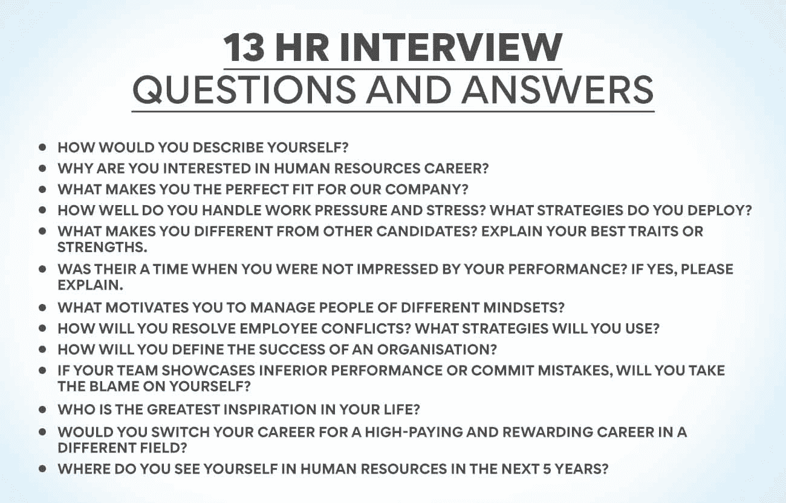

# 面向新生的 13 个 HR 面试问题和答案

> 原文：<https://www.edureka.co/blog/hr-interview-questions-and-answers-for-freshers/>

应届生 HR 面试问答:祝贺你获得梦想工作的面试机会！即使你是一个经验丰富的专业人士，面试也可能令人紧张。但别担心，我们是来帮忙的。这篇博文将回顾一些最常见的人力资源面试问题以及如何回答这些问题。我们将涵盖从您的体验问题到行为问题的所有内容。到最后，你会对面试有更多的准备和自信。所以让我们开始吧！

如果你想通过学习人力资源的基本知识在人力资源面试中占据优势，那么在开始之前，别忘了查看我们在[人力资源管理](https://www.edureka.co/blog/role-of-human-resource-management-in-an-organization/)的研究生证书。

## **13 小时大一新生面试问答**

## **大一新生 HR 面试问答:你会如何描述自己？**

在求职面试中，“你会如何描述自己？”很可能会提前出现。如果你没有准备好，这是一个很难回答的经典面试问题。

这个问题的答案会让面试官很好地了解你是谁，你是否适合这个职位。以下是如何回答这个会给面试官留下深刻印象的问题。

当被问到“你会如何描述自己？”保持你的回答简短和集中。避免漫无边际或偏离主题。现在不是讲述你的人生故事或列举你所有积极品质的时候。相反，关注一两个与工作相关的品质，这会让你在候选人中脱颖而出。

一些品质的例子包括努力工作、注重细节、有组织、有效率、积极主动、解决问题等。一定要用你经历中的具体例子来支持每一种品质。例如，如果你说你是一个注重细节的人，解释这在过去如何帮助你完成高质量的工作。

如果可能的话，试着将你的答案与公司的价值观或文化联系起来。例如，如果公司的价值观之一是创新，那么就提到你的创造性思维在以前的工作中是如何帮助解决问题的。通过根据公司的需求量身定制你的回应，你将能够把自己塑造成一个拥有专注和战略心态的专业人士。

## 你为什么对人力资源职业感兴趣？

有人对从事人力资源职业感兴趣有很多原因。有些人被与人一起工作并帮助他们发挥潜力的挑战所吸引。其他人喜欢有机会与不同的人一起工作，并帮助解决工作场所的问题。不管是什么原因，人力资源的职业生涯都是丰富多彩的。

在人力资源职业生涯中取得成功的一些关键技能包括强大的沟通和人际交往能力、良好的组织能力以及在压力下工作的能力。如果你有这些技能，并且对帮助人们发挥他们的潜力感兴趣，那么人力资源领域的职业可能适合你。

## **应届生 HR 面试问答:** 什么样的**让你非常适合我们公司？**

一些关键的品质使某人成为我们公司的完美人选:

1.  我们重视对公司及其目标的忠诚和奉献。
2.  我们优先考虑那些有强烈职业道德的人，并不断提高他们的技能。
3.  良好的沟通和人际交往能力对于创造积极的工作环境至关重要。

如果你拥有这些品质，你可能是一家公司的最佳人选！他们会鼓励你申请，看看你是否具备加入他们团队的所有条件。

**也读作:[分解人力资源管理的范围](https://www.edureka.co/blog/scope-of-human-resource-management/)**

## 你能很好地处理工作压力和紧张吗？你部署了什么策略？

工作压力和紧张在任何工作中都是不可避免的。你如何处理它们将决定你在这个职位上的成功。

回答这个问题时，需要记住以下几个要点:

1.  首先，尽量避免淡化你感受到的工作压力。面试官在寻找诚实和自我意识。
2.  其次，一定要谈论你用来管理工作压力和紧张的具体策略。泛泛的回答不会给面试官留下深刻印象。
3.  最后，避免听起来像是在吹嘘你如何处理工作压力和紧张。这会给人以傲慢和毫无准备的印象。

值得一提的一些好策略包括:定期休息、保持有条理、设定现实的目标、委派任务、与你的团队有效沟通，以及在工作之外给自己留点时间。

## 是什么让你与其他候选人不同？解释你最好的品质或优点。

当面试官问你是什么让你与众不同时，他们通常会看看你是否有任何独特的技能或资格让你特别适合这个职位。然而，这个问题也可以成为一个机会，突出你的优点和品质，让你成为公司的完美人选。

你可以提及的优势包括:

*   勤奋上进
*   出色的沟通技巧
*   能够在压力下很好地工作
*   良好的解决问题能力
*   快速学习者

记得用具体的例子来支持你对自己优势的主张。例如，如果你说你学东西很快，那就说说你不得不快速掌握一项新技能的时候。如果你说你在压力下工作得很好，描述一个你在困难的情况下保持冷静并取得成功的情况。

## 你对自己的表现不满意的时候有没有？如果是，请解释。

在职业生涯的某个阶段，对自己的表现感到失望并不罕见。然而，对你自己和你的面试官诚实地说出这是什么时候，为什么你会有那种感觉是很重要的。

如果有一个具体的例子让你对自己的表现印象不佳，一定要给出该情况的所有细节。这将有助于你的面试官了解发生了什么，以及你从中学到了什么。同样重要的是，要表现出你善于思考，能够接受建设性的反馈。

## 是什么激励你管理不同心态的人？

假设你问我管理不同心态的人的动机是什么:

我在不断学习的环境中茁壮成长，管理不同心态的人让我能够做到这一点。理解人们的想法、感受和行为方式的挑战激励着我——尤其是当它与我的观点不同时。这就像一个我一直试图解决的难题，我觉得这既有趣又有收获。

此外，我喜欢帮助我的同事和下属成长和发展的机会。看到某人进步并发挥其潜力是我最欣慰的经历之一。管理不同心态的人给了我每天这样做的机会。

## 你将如何解决员工冲突？你会用什么策略？

解决员工冲突的方法多种多样，最佳策略视情况而定。在某些情况下，你必须鼓励员工直接对话来解决冲突。在其他情况下，经理或人力资源代表可能有必要调解谈话。

解决员工冲突的一些常用策略包括:

*   鼓励员工直接沟通
*   调解员工之间的对话
*   调查冲突的根本原因
*   制定防止未来冲突的政策和程序
*   提供有效沟通和解决冲突的培训

## 应届生人力资源面试问答:你如何定义一个组织的成功？

一个组织的成功可以用多种方式来定义。一些组织可能关注财务指标，如盈利能力或收入增长。其他人可能关注客户满意度或员工参与度。然而，其他人可能会关注社会责任或环境可持续性。最终，成功的定义会因组织而异。

作为求职者，了解你面试的公司如何定义成功是很重要的。这将有助于你对有关公司目标和[目标](https://www.edureka.co/blog/objectives-of-human-resource-management/)的问题做出合适的回答。

例如，如果公司关注财务指标，你可以讨论你将如何为增加利润或降低成本做出贡献。如果组织关注客户满意度，你可以讨论如何确保客户对他们得到的产品或服务感到满意。

通过将你的答案与公司对成功的定义联系起来，你将证明你理解公司想要实现的目标，并且你致力于帮助他们实现这一目标。

## 如果你的团队表现不佳或犯了错误，你会责怪自己吗？

当涉及到团队绩效或错误时，作为领导者承担责任总是很重要的。这表明当事情出错时，你愿意接受指责，并愿意努力解决问题。这也表明了你对你的团队及其成功的承诺。如果你的团队表现不佳或犯了错误，坦白承认，并与他们一起寻找解决方案。

## **大一新生 HR 面试问答:谁是你人生中最大的灵感来源？**

你可以这样回答:在我的一生中，许多人都激励过我，但影响最大的人是我的母亲。即使在艰难的时候，她也一直陪在我身边。她是一个坚强的女人，在自己的生活中克服了许多挑战，并教会我，如果你全心全意地投入，没有什么是不可能的。她是我的支柱，我无法想象没有她的生活。

**也读作:[目标&人力资源管理的性质](https://www.edureka.co/blog/nature-and-objectives-of-human-resource-management/)**

## 你会为了不同领域的高薪和回报而放弃你的职业吗？

许多人都希望有机会将自己的职业生涯转向收入更高、回报更丰厚的领域。然而，做出这种转变可能具有挑战性。如果你正在考虑转行，你必须考虑这些事情:

1.  你的技能和资格是什么？你具备新职业所必需的技能和资格吗？如果没有，你能得到它们吗？
2.  对于新职业来说，就业市场的现状如何？是饱和还是有需求？
3.  新职业的工资范围是多少？它是否高到足以抵消转行带来的任何潜在减薪？
4.  你在新领域有多少经验？你有什么相关的经验能对你的新工作有所帮助吗？
5.  你准备好从基层开始，一步步往上爬了吗？在许多情况下，转行的人不得不从比他们以前工作的更低的水平开始。你准备好了吗？
6.  你愿意在新的职业中投入多长时间？转行可能是一个很大的承诺，所以在转行之前一定要做好准备。

如果你能提出这些观点，你会给人一种务实、有目标的印象，而不是一个讨人喜欢的人。

## 你认为自己在未来 5 年的人力资源中处于什么位置？

在接下来的 5 年里，我认为自己在管理岗位上会表现出色。我想帮助我的团队成长并发挥其潜力。我还想继续学习和拓展我的知识，成为公司的财富。

## **应届生 HR 面试问答:**应届生参加 HR 面试前需要考虑的事情****

在参加人力资源面试之前，有几件事需要考虑。首先，研究你申请的公司和职位。这将让你更好地了解公司在寻找什么样的员工，并帮助你根据你申请的具体职位量身定制你的答案。

其次，与朋友或家人练习你的面试技巧。这会让你在面试那天更加自信，并确保你给人留下好印象。

最后，确保你穿着职业，并在面试当天早早到达。这会让面试官看到你对这个角色是认真的，并且渴望给人留下深刻印象。

## **结论**

如果你是一名大一新生，正在寻找如何在下一次人力资源面试中胜出的技巧，这篇文章就是为你准备的。我们整理了一些常见的人力资源面试问题，并指导如何回答这些问题来给面试官留下深刻印象。请记住，关键是要做好准备，并对自己的回答充满信心。祝你好运！

在开始面试之前，查看一下我们的[人力资源管理研究生证书](https://www.edureka.co/highered/human-resourse-management-course-iim-shillong)，它将为你提供一个先进的方法，让你熟悉人力资源的来龙去脉，从而在面试中胜出。

## **更多信息:**

[人力资源管理的演变:过去和未来](https://www.edureka.co/blog/evolution-of-human-resource-management)

[人力资源管理的关键基础](https://www.edureka.co/blog/fundamentals-of-human-resource-management/)

[什么是人力资源管理系统？](https://www.edureka.co/blog/human-resource-management-system/)

[什么是人力资源业务伙伴:终极指南](https://www.edureka.co/blog/hr-business-partner)