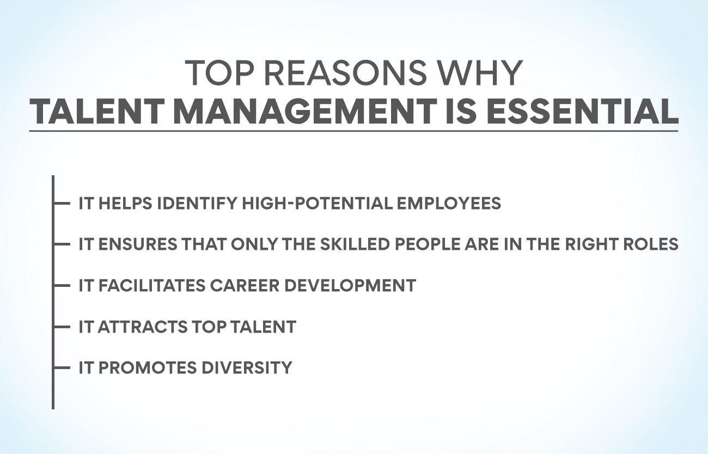

# 人才管理为什么重要？了解主要原因

> 原文：<https://www.edureka.co/blog/why-is-talent-management-important/>

人是任何组织最有价值的资产。在过去的几年里，随着组织努力吸引、评估、发展和留住最优秀的人才，人才管理变得越来越受欢迎。人才管理有许多不同的定义，但其核心是吸引、培养和发展有潜力为组织的成功做出真正贡献的员工。这篇博文将探讨人才管理(TM)对企业至关重要的一些主要原因。从吸引顶尖人才到建立强大的内部渠道，请继续阅读，了解为什么人才管理应该成为您组织的优先事项。

## **帮助招聘最优秀的人才**

在这个人才争夺战空前激烈的世界里，公司需要找到吸引和留住最优秀员工的方法。做到这一点的方法之一是通过人才管理。

[人才管理](https://www.edureka.co/blog/talent-management/)是识别、发展和留住具有高潜力的员工。它包括继任计划、绩效管理和员工发展。

人才管理有很多好处。最重要的是，它有助于公司招聘和留住最优秀的员工。有了一个好的人才管理系统，公司可以发现明星员工并留住他们。这可以带来市场竞争优势。

TM 的其他好处包括提高员工生产力、更好的继任计划和更高的参与度。当员工感到他们被有效地管理时，他们会变得更有效率和投入工作。它可以为公司带来更好的业务成果。

**也可阅读:[战略性劳动力规划:步骤和流程](https://www.edureka.co/blog/workforce-planning/)**

## **提高生产力以实现目标**

出于多种原因，人才管理至关重要，但提高生产力以实现目标是最重要的原因之一。

人才管理有几个重要的方法可以帮助提高生产力，帮助组织实现目标。首先，通过识别优秀员工，然后专门为他们制定发展计划，组织可以确保他们最优秀的员工获得发展和提高技能的机会。这不仅有利于员工自身，也有助于推动组织向前发展。

其次，人才管理有助于从整体上确定组织的潜在改进领域。通过进行定期绩效评估和查看员工参与度、保留率和继任计划的数据，组织可以确定需要做出改变的领域，以提高工作效率。

第三，人才管理总体上可以创造一个更加积极的工作环境。当员工感觉受到重视并有机会在组织中成长时，他们更有可能参与工作并提高工作效率。这种积极的工作环境可以在整个组织中产生连锁反应，带来更好的结果。

最终，人才管理是必不可少的，因为它能提高生产力，帮助组织实现目标。通过识别优秀员工、寻找需要改进的领域以及创造积极的工作环境，人才管理可以帮助任何组织取得成功。

## **降低频繁招聘的成本**

众所周知，雇佣新员工会很贵。广告、面试和新员工入职的过程会对公司的预算造成影响。然而，有了 TM，组织可以减少频繁雇用的成本。

人才管理包括识别、培养和留住顶尖人才。通过投资人才管理，公司可以创建一个合格的候选人库，当出现空缺时，他们可以从中挑选。这节省了时间、资源和金钱，否则将花费在招聘新员工。

除了降低招聘成本，人才管理还可以提高员工保留率。感觉自己有清晰的职业道路和发展机会的员工更有可能在一家公司呆更长时间。从长远来看，它可以降低周转成本，帮助组织节省资金。

## **为工作文化带来创新**

创新是任何行业成功的关键。人才管理对于促进组织内部的创新至关重要。以下是人才管理至关重要的主要原因:

1.  **有助于识别高潜力员工:** 人才管理有助于识别有潜力成为组织未来领导者的员工。这是通过各种评估工具和技术完成的，如心理测试、360 度反馈等。
2.  **它确保只有有技能的人才担任正确的角色:** 通过将员工角色与他们的技能和能力相匹配，人才管理有助于确保每个人都发挥自己的优势。这将提高组织的生产率和整体绩效。
3.  **促进职业发展:** 人才管理计划通过为员工提供培训和发展机会，帮助他们在职业生涯中取得进步。这有助于员工保持积极性和参与度，从而提高保留率。
4.  **它吸引顶尖人才:** 一个健全的人才管理计划可以帮助一个组织从外部吸引顶尖人才。这是因为潜在的候选人看到，该组织是认真发展其人民和提升内部。
5.  **促进多元化:** 通过促进多元化和包容性，人才管理计划有助于为所有员工创造更积极的工作环境。这导致创造力和创新力的增加，因为不同的观点被用来解决问题。

## **鼓舞员工士气**

人才管理不仅对吸引和留住顶尖人才至关重要，对鼓舞员工士气也至关重要。一个积极参与和投资于员工并帮助他们充分发挥潜力的公司是一个员工为之自豪的公司。当员工感到受到重视和支持时，他们更有可能参与进来并富有成效。此外，快乐的员工更有可能传播关于他们公司的正面口碑，这有助于吸引更多的顶尖人才。

## **留住最优秀的人才**

TM 的主要好处之一是它能帮助组织留住最好的员工。良好的人才管理计划能够识别高潜力员工，并为他们提供在公司内成长和发展的机会。这有助于防止顶尖人才跳槽到其他组织。此外，人才管理有助于提高员工参与度和满意度，从而提高员工保留率。

## **提高业务绩效**

人才管理对任何组织的成功都至关重要。通过对合适的人才进行投资，并为他们提供成功所需的充足资源，组织可以获得可观的投资回报。查看人才管理如此重要的几大理由: 

1.  **更好的业务绩效—**投资人才管理的组织会看到更好的业务绩效。这是因为他们可以吸引和留住顶尖人才，从而提高生产率和改善业绩。
2.  **提高员工参与度—**人才管理也能提高员工参与度。当员工受到赏识和重视时，他们更有可能致力于工作。
3.  **更高的组织敏捷性–**人才管理让组织能够快速适应市场的变化，从而提高组织的敏捷性。组织可以通过拥有一批有才华的员工来快速应对新的机遇或挑战。
4.  **增加创新—**当组织投资于人才管理时，他们倾向于看到创新的增加。这是因为他们可以吸引有创造力的员工，他们可以冒险尝试新事物。
5.  **提高客户满意度—**人才管理也能提高客户满意度。专注于人才管理的企业可以更好地满足客户需求，超越预期。

## **提高客户满意度**

客户满意是任何企业的终极目标之一。毕竟，如果你的销售对象或服务对象不开心，他们可能不会呆太久。这就是 TM 的用武之地。通过确保你有技术人员在适当的位置做正确的事情，你可以确保你的客户总是对你给他们的东西感到满意。查看人才管理可以帮助提高客户满意度的一些方法:

1.  **合适的职位上合适的人:** 客户最大的抱怨之一是，他们觉得自己在和一个不知道自己在做什么的人交谈。当你雇佣了合适的人，你可以确定你的客户总是在和一个确切知道他们需要什么以及如何满足他们的人交谈。
2.  **做正确的事情:** 另一个大客户抱怨他们的时间被浪费了。如果你有优秀的员工为你工作，他们会确保每件事第一次就做对，这样你的客户就不会觉得他们的时间被浪费了。
3.  **积极主动:** 没有人喜欢事情出错，但它在某个时刻会发生在每个人身上。优秀企业与伟大企业的区别在于，当问题出现时，他们如何处理。通过在问题变得更严重之前主动解决问题，你可以向你的客户展示你的关心。

## 人才管理的最佳实践是什么？

几种人才管理的最佳实践可以帮助组织确保吸引、培养和留住最优秀的员工。这些最佳实践包括:

1.  明确定义组织需要什么样的人才，并使[人才战略](https://www.edureka.co/blog/strategies-of-talent-management/)与业务目标相一致。
2.  创造一个吸引顶尖人才的积极的雇主品牌。
3.  关注员工发展和敬业度，留住优秀员工。
4.  建立全面的继任规划流程，以确保领导力和专业知识的连续性。
5.  实施稳健的绩效管理系统，以发现和培养高潜力员工。

## 在人才培养方面，我们可以见证哪些未来的发展？

为了确保组织能够持续供应高质量的人才，人才发展必须是一个重点。在未来的几年里，我们可以期待在这个领域看到一些未来的发展。

其中一项发展是利用大数据和分析来发现潜在人才。通过分析大型数据集，组织可以识别模式和趋势，从而帮助他们识别有潜力成为高绩效员工的个人。

另一个关键发展将是利用技术创造更加个性化和沉浸式的学习体验。随着虚拟现实和其他技术的进步，创建提供真实和引人入胜的学习体验的培训计划将变得越来越可能。

最后，我们可以期待继续关注全球人才发展。我们希望看到更多发现和发展全球人才库的举措。随着组织的国际化程度越来越高，他们需要确保能够接触到来自世界各地的顶尖人才。

**另请阅读:[什么是利益相关者参与？](https://www.edureka.co/blog/stakeholder-engagement)的重要性、规划和实施**

## **人才管理的 5 个关键要素**

为了确保一个组织拥有高质量的人才，建立一个强大的人才管理系统至关重要。有效的人才管理系统的关键组成部分包括以下内容:

1.  对组织的业务战略以及支持该战略所需的特定技能和能力的清晰理解。
2.  确定并评估组织当前和未来的人才需求。
3.  吸引、培养和留住满足已确定需求的人才的计划。
4.  支持 TM 计划执行的实施流程和工具。
5.  根据组织目标定期监控和评估人才管理系统的有效性。

## **如何成为人才经理？**

成为人才经理没有明确的道路，但成功的经理有一些共性。许多人才经理都有在娱乐行业以其他身份工作的经验，如代理人、公关人员或艺术家发展主管。

除了行业经验，成功的人才经理通常都是人脉广泛的人，他们多年来建立了广泛的人脉网络。他们利用这些关系帮助客户获得演出机会，并获得高知名度的项目。这为他们提供了必要的业务联系和知识，以成功完成人才经理的角色。

人才经理还必须擅长多任务处理，同时处理多个客户。他们需要有条理、有效率地跟踪客户的时间表，满足最后期限，并确保一切顺利进行。

最后但同样重要的是，成功的人才经理必须具备出色的人际交往能力。他们必须与他人合作愉快，并与客户和行业专业人士建立牢固的关系。

## **结论**

战略性地管理人才的公司比那些不这样做的公司表现更好。这是因为他们能够发现并投资培养高潜力员工，创造积极的工作环境，吸引并留住最优秀的人才。在当前竞争激烈的商业环境中，公司需要积极主动地进行人才管理，以保持领先地位。

查看我们的 [人力资源管理研究生证书](https://www.edureka.co/highered/human-resourse-management-course-iim-shillong) ，这对新生和专业人士都是理想的选择。

## **更多信息:**

[更好的员工关系可以带来快速的业务扩张:知道 11 个技巧](https://www.edureka.co/blog/better-employee-relation-can-lead-to/)

[什么是人力资源管理中的薪酬？你需要知道的一切](https://www.edureka.co/blog/compensation-in-hrm)

[优化人员管理以实现公司目标](https://www.edureka.co/blog/optimising-people-management-to-achieve-company-goals/)

[人事管理人员必备的 11 项技能](https://www.edureka.co/blog/people-management-skills/)