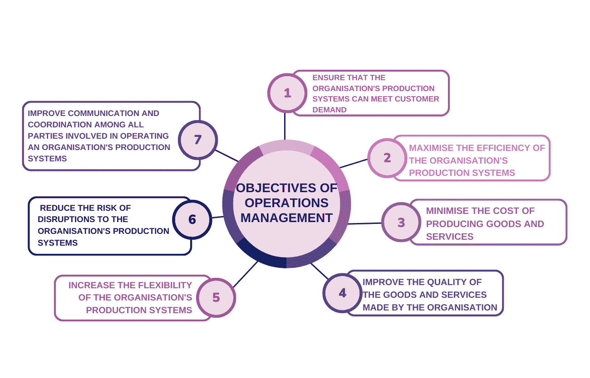
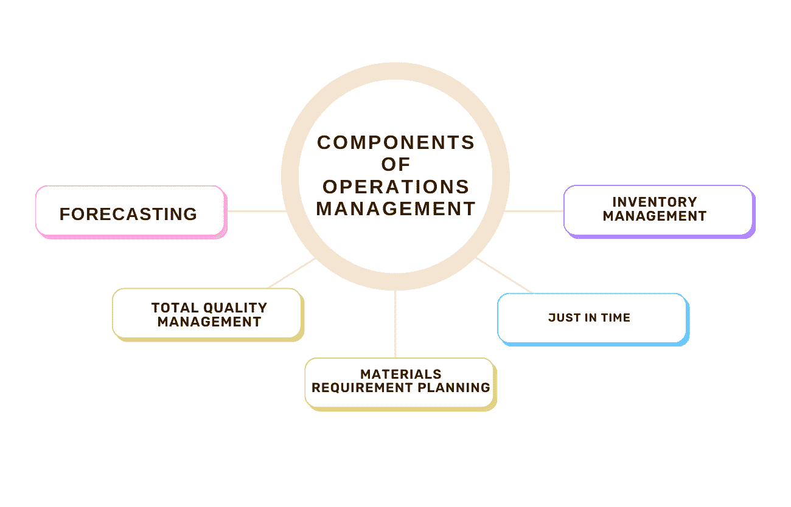

# 运营管理:性质、范围和基础

> 原文：<https://www.edureka.co/blog/nature-of-operations-management/>

运营管理的本质:运营管理是一个专注于管理资源和流程以创造和交付商品或服务的领域。这是一个相对较新的领域，只是在 20 世纪初才作为一门不同的学科出现。运营管理涉及组织运营的所有方面，包括流程的设计、规划、控制和执行。

[运营管理](https://www.edureka.co/blog/beginners-guide-to-operations-management/)旨在确保组织的运营高效且有效。这篇博文将探讨运营管理的本质、范围和基础。我们还将讨论运营经理面临的一些挑战。

在继续学习和了解运营管理的本质之前，请查看我们的运营、供应链和项目管理高级证书，它拥有成为运营经理所需的所有必要学习资源。

## **运营管理的目标**

运营管理是一个与设计、计划、控制和运营一个组织的生产系统有关的领域。运营管理的[目标是:](https://www.edureka.co/blog/what-are-the-objectives-of-operations-management/)

1.  确保组织的生产系统能够满足客户需求。运营管理是确保业务运营在使用必要的最少资源方面是高效的，在满足客户需求方面是有效的。运营管理的最终目标和本质是提高组织运营的效率和有效性，同时降低成本。

2.  最大限度地提高组织生产系统的效率。 运营管理的目标是最大限度地提高这些生产系统的效率，以便组织能够更有效和高效地生产商品和服务。运营经理可以使用大量不同的工具和技术来实现这一目标，例如过程改进方法、质量控制技术和工作测量工具。
3.  将生产商品和服务的成本降至最低。运营管理的目标是在提供高质量和高客户满意度的同时，最大限度地降低产品和服务的生产成本。实现这一目标的有效方法之一是简化生产流程和消除浪费。此外，高效的运营经理会不断寻找提高效率和生产率的方法，以保持低成本。

4.  提高组织产品和服务的质量。运营管理的目标是提高组织的产品和服务质量。这可以通过多种方式来实现，如提高生产过程的效率，确保生产的产品符合客户的规格，减少成品中的浪费和缺陷。提高质量可以提高客户满意度和忠诚度，这反过来又可以提高组织的销售额和利润。

5.  增加组织生产系统的灵活性。 运营管理致力于增加组织生产系统的灵活性。目标是使组织更好地响应市场需求，更好地适应商业环境的变化。这可以通过各种方式实现，如引入新技术、修订流程或改变组织结构。
6.  降低组织生产系统中断的风险。 运营管理的首要目标是降低组织生产系统中断的风险。这包括确保所有必要的资源可用，并且流程平稳高效地运行。运营经理致力于在潜在风险引发问题之前识别并降低风险。这样做有助于保持组织的生产系统平稳运行，并避免代价高昂的停机时间。
7.  **改善参与组织生产系统运营的各方之间的沟通和协调。** 运营管理的目标是改善参与组织生产系统运营的各方之间的沟通和协调。这包括经理、员工、供应商、客户和其他利益相关者。通过改善参与生产的各方之间的沟通和协调，运营经理可以提高整个组织的效率和有效性。

**也可阅读:[什么是运营和供应链管理(OSCM)？](https://www.edureka.co/blog/what-is-operations-and-supply-chain-management-oscm/)**

## **运营管理范围**

它是计划、组织、指导和控制生产商品和服务所需资源的过程。运营管理的范围包括计划、设计和管理生产和分销过程的所有必要活动。

运营管理的八个[范围如下:](https://www.edureka.co/blog/what-is-the-scope-of-operations-management/)

**1)设施布局规划:** 这一步包括决定如何最好地利用工厂或办公室的空间来优化工作流程。

劳动力规划和管理: 这包括确保有足够多的具备适当技能的员工来完成所需的工作，以及管理员工绩效。

库存管理: 这包括从原材料到成品的一切，并确保库存水平维持在最佳水平。

**4)调度:** 这是在最大化效率的同时创建一个满足客户需求的生产调度。

**5)质量控制:** 质量控制对于确保产品满足客户期望和标准至关重要。

运输和物流: 运营经理必须计划高效地将货物从供应商手中运送到客户手中。

**7)维护:** 定期维护是保持设备设施运转顺畅的必要条件。

**8)项目管理:** 很多运营都需要项目管理来保证在时间和预算内完成。

## 运营管理的目标是什么？

运营管理的目标是确保组织内的所有流程平稳高效地运行。它包括从产品开发和制造到分销和客户服务的一切。最终，我们的目标是最大限度地减少浪费，最大限度地利用资源来提高盈利能力。

为了实现这些目标，运营经理必须对业务的各个方面以及他们之间的沟通方式有深刻的理解。他们还必须能够确定需要改进的领域，并建立系统和控制措施来监控绩效。定期审查和审计对于持续提高效率水平至关重要。

## **运营管理的组成**

**预测**

预测是运营管理的重要组成部分和本质。它有助于组织对未来的生产需求和产能要求做出明智的决策。在开发预测系统时，有几个重要因素需要考虑，包括:

*   正在生产的产品或服务的类型
*   产品或服务的潜在需求
*   生产产品或服务所需的交付周期
*   生产过程中的可变性
*   期望的库存水平

一个有效的预测系统会考虑所有这些因素，并提供准确的信息，用于做出合理的运营决策。

**全面质量管理**

全面质量管理是一种提高组织竞争力的战略方法。这是一种理念，强调在组织运营的各个方面需要不断进步，最终目标是为客户提供满足或超过他们期望的产品和服务。

全面质量管理的基本组成部分有:

1)质量规划: 这包括设定质量目标和目的，并制定实现这些目标的计划。

质量控制: 这是对产品和服务的质量进行监控和测量的过程，以确保它们达到期望的水平。它还包括在必要时采取纠正措施。

质量保证: 这需要开发和实施程序和过程，以从一开始就防止缺陷的发生。

质量改进: 这包括持续努力识别和消除缺陷和变化的来源，以提高整体质量水平。

**物料需求计划**

在物料需求计划(MRP)中，对生产活动的时间安排进行计划，以确保在需要时可以获得物料。这种类型的计划是必要的，因为许多制造过程需要使用原材料，这些原材料必须从供应商那里获得，并且通常需要考虑提前期。此外，成品通常需要进行组装或其他下游流程，然后才能运送给客户。

为了有效地管理制造组织中的物流，MRP 系统跟踪三种类型的信息:

1)主时间表，表明每个成品应何时完成；

2)库存记录，显示手头有多少材料以及它们的位置；和

3)材料清单(BOM ),列出了制造每个成品所需的原材料和组件。

使用这些信息，MRP 系统生成采购原材料和组件以及生产成品的计划。这些时间表考虑了采购和生产的提前期，以及任何可能适用的最小订货量。在某些情况下，如果在获取必要的供应方面存在延迟，MRP 系统也会生成重新计划消息。

**也可阅读:[什么是运营管理中的能力规划？](https://www.edureka.co/blog/what-is-capacity-planning-in-operations-management/)**

**及时**

准时制(JIT)是 20 世纪 70 年代兴起的一种制造哲学。它的主要目标是通过只生产需要的东西和需要的数量来消除整个生产过程中的浪费。

随着企业日益感受到海外竞争的压力，这一理念应运而生。为了生存和发展，他们必须想方设法提高运营效率，尽可能降低成本。JIT 成为实现这一目标的最流行的方法之一。

JIT 有四个关键原则:

1)只生产需要的东西

2)只生产需要的东西

3)不要过量生产或持有过多库存

4)简化生产流程，最大限度减少浪费，提高效率。

如果实施得当，准时制可以显著节约成本，改善质量控制，提高客户满意度。它还可以缩短交付周期，提高灵活性，减少库存。

**库存管理**

这是跟踪库存水平并决定什么水平是可接受的过程。这包括原材料和成品。目标应该是在库存过多(这会占用现金并导致过时)和库存过少(会导致缺货和销售损失)之间取得平衡。

库存管理是运营管理的重要组成部分。它包含所有与库存管理相关的活动和过程，包括但不限于采购、仓储、运输和客户服务。

有效的库存管理系统必须考虑库存的实物和财务两个方面。实物方面包括构成存货的实际货物或材料，而财务方面包括与采购、储存和运输存货相关的成本。

有效的库存管理系统将最大限度地降低与过量或过时库存相关的物理和财务风险。过多的库存会占用宝贵的资源并导致存储成本，而过时的库存会导致销售和客户的流失。

有效的库存管理系统的组成部分包括:

**1)清晰了解客户需求:** 这涉及到预测未来对产品或服务的需求，并确保手头有足够的库存来满足这种需求。

**2)高效的采购流程:** 这可以确保在正确的时间向供应商订购正确的产品，并保证其所需的数量。

**3)有效的仓储策略:** 这包括以一种最大限度减少损坏、丢失或失窃的方式储存库存，同时最大限度地利用空间。

**4)精心设计的运输网络:** 这保证了成品在规定的时间内完好无损地送到客户手中。

## 运营经理的角色是什么？

一个熟练的运营经理负责公司的日常运营。他们确保所有操作顺利有效地进行。

他们计划、实施和控制运营流程和活动。他们也有助于公司政策和目标的制定。

运营经理还负责管理和培养员工。他们激励员工实现目标并保持高水平的绩效。

运营经理在确保公司实现其目标方面发挥着至关重要的作用。他们对企业的成功起着至关重要的作用。

## **结论**

运营管理对任何企业来说都是至关重要的一部分，了解这个领域的性质、范围和基础是非常重要的。这篇文章一定打开了新的视角，让你对运营管理及其在商业中的作用有了更好的理解。如果你有兴趣了解更多运营管理的本质，一定要看看我们的[运营、供应链和项目管理高级证书](https://www.edureka.co/highered/advanced-program-in-operations-supply-chain-project-management-iitg) t.

## **更多信息:**

为什么企业需要运营战略？

[运营管理:定义、范例和策略](https://www.edureka.co/blog/operations-management-definition)

[运营管理中的决策:要点](https://www.edureka.co/blog/operations-management-decisions)

[医院运营管理——了解关键职能](https://www.edureka.co/blog/operations-management-in-hospitals)