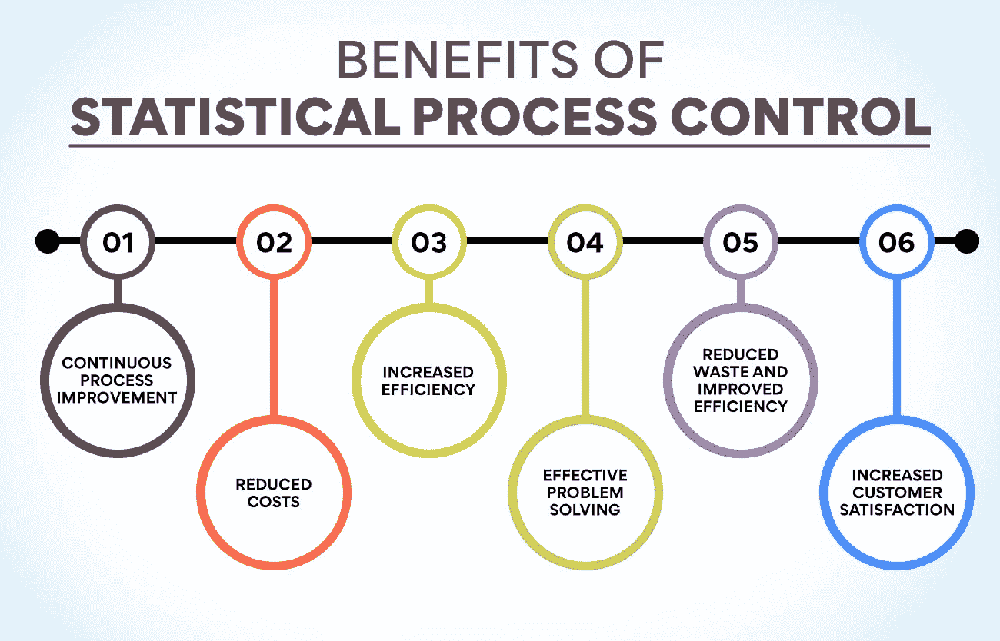
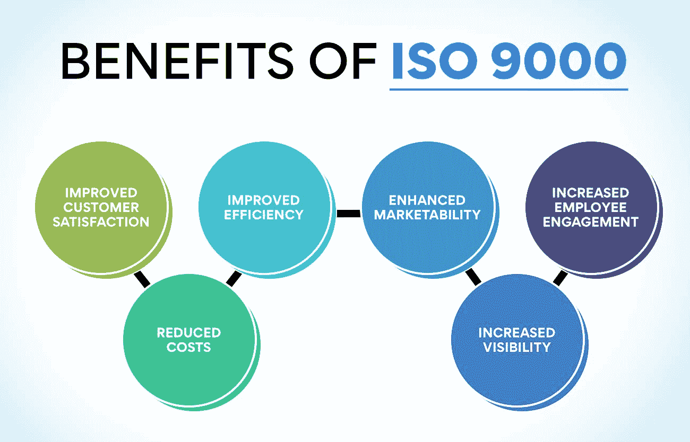
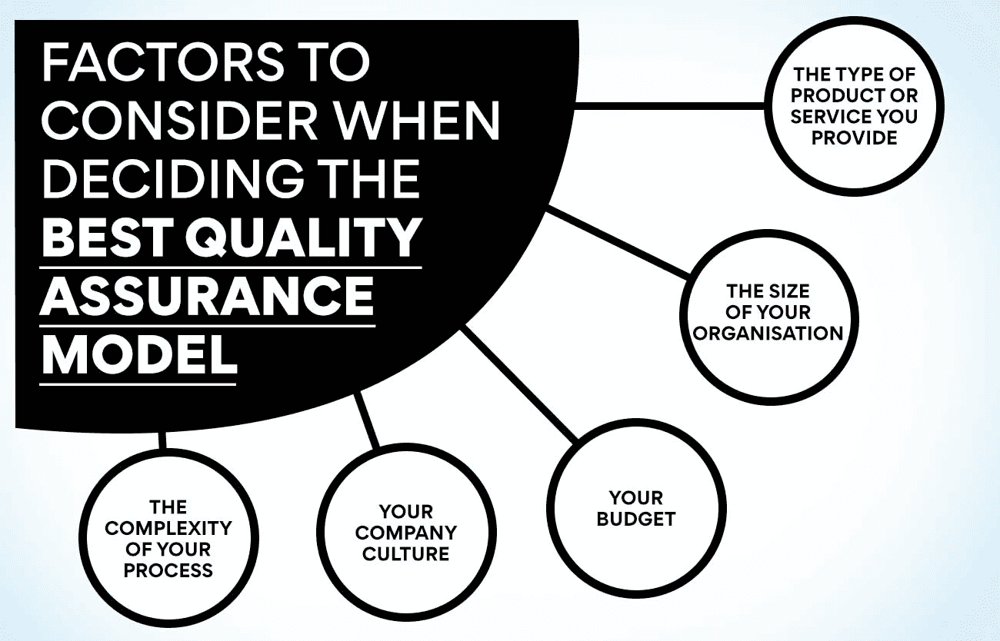

# 质量保证模式:定义、意义和框架

> 原文：<https://www.edureka.co/blog/models-of-quality-assurance/>

质量保证有许多不同的模式，但它们都有一个共同的目标:确保产品和服务符合特定的质量标准。质量保证是评估产品或服务是否符合这些标准的过程。

质量保证有许多不同的方法。一些公司可能有自己的内部质量保证计划，而其他公司可能将这一职能外包给第三方机构。还有各种国际标准可供公司选择遵循，如 ISO 9000 系列或六适马方法。

最重要的是找到一种适合贵公司和您特定需求的质量保证模式。没有放之四海而皆准的解决方案，因此根据您的产品和服务量身定制您的方法至关重要。

质量保证的重要性不可低估。在当今的全球经济中，客户比以往有更多的选择，如果他们对你的产品或服务质量不满意，他们会很快将业务转移到其他地方。

通过确保您的产品和服务达到尽可能高的标准，您可以获得竞争优势，并让您的客户回头率更高。

**也可阅读:[运营管理:教学大纲、课程和认证](https://www.edureka.co/blog/syllabus-for-operations-management/)**

## **有哪些不同类型的质量保证模式？**

质量保证模型是用来确保产品或服务达到一定质量标准的方法和技术。他们可以帮助组织确保在任何产品或服务投放市场之前符合所有标准。

有几种不同类型的质量保证模式，包括:

*   统计过程控制
*   六个适马
*   ISO 9000
*   全面质量管理

这些模型各有不同的优点和缺点，在为特定情况选择合适的模型时必须加以考虑。

**统计过程控制:** 过程控制通过测量和记录过程的性能来监控过程。它有助于确定问题的根本原因，并持续改进流程。它允许组织确定改进领域并跟踪进展，以确保流程在特定的质量规范内运行。

**统计过程控制的好处:**

*   **持续流程改进:** 流程可以根据需要进行监控和改进，以满足质量标准。
*   **降低成本:** 通过及早发现问题，组织可以通过预防未来的质量问题来降低返工和报废的成本。
*   提高效率: SPC 可以在问题变得过于庞大和昂贵之前发现问题，从而帮助组织提高产出。
*   **有效解决问题:** SPC 帮助组织及时发现问题并制定解决方案。
*   **减少浪费，提高效率:** 通过跟踪绩效，组织可以识别质量趋势，减少浪费。
*   **提高客户满意度:** 很明显，客户更喜欢高质量的产品和服务，这就是为什么在潜在问题发生之前发现它们是至关重要的。

**六适马:** 这是一种数据驱动的方法，用于提高流程绩效。它侧重于减少可变性、提高客户满意度和实现成本节约。这是许多不同行业中使用最广泛的质量改进计划，包括医疗保健、金融和制造业。

六适马可以帮助你快速发现问题，做出改进并跟踪进展。它还要求您衡量绩效，以确保正在进行改进。通过利用六项适马技术，企业可以在运营中变得更加高效和有效，从而改善客户服务并提高利润。

**六适马的好处:**

*   **提高质量和客户满意度:** 减少可变性可以提高质量和客户满意度。
*   **更快的流程:** 提高流程速度有助于提高生产率和效率。
*   **降低成本:** 你可以通过减少在流程改进上花费的时间和金钱来省钱。
*   **提高效率:** 通过改进流程和减少缺陷，企业可以变得更有效率。
*   **提高员工满意度:** 当员工看到自己的努力对产品和服务质量产生了影响时，他们会受到激励。
*   **改善的底线结果:** 这些因素导致企业的底线结果更好。

ISO 9000:ISO 9000 是质量管理的国际标准。它是一套原则、流程和指导方针，组织可以使用它们来帮助他们提供高质量的产品或服务。该模型为组织提供了一个框架，以确保一致的产品或服务交付和客户满意度。

ISO 9000 专注于四个关键部分:

*   以客户为中心
*   领导力
*   过程方法
*   持续改进

通过遵循 ISO 9000 的原则，组织可以创建一个强大的质量管理体系，并实现他们期望的质量目标。该系统还确保组织遵循特定的流程来持续交付产品或服务。

**ISO 9000 的好处:**

*   **提高客户满意度:** ISO 9000 倡导以客户为中心和持续改进，最终提高客户满意度。
*   **提高效率:** 通过建立标准流程，组织可以更高效地生产商品和服务。
*   **增强可销售性:** 实施 ISO 9000 的组织可以展示他们对质量保证模式的承诺，从而使他们对潜在客户更具吸引力。
*   **提高员工参与度:**ISO 9000 的原则培育了一种持续改进的文化，这可以提高员工的参与度和满意度。
*   **降低成本:** 通过建立定期审查和改进的流程，组织可以降低成本。
*   **提高可见性:** ISO 9000 提供了一种结构化的方法来记录和传达质量目标，从而提高组织的可见性。

**全面质量管理:** 这是一种利用持续改进技术和文化转变来改进业务流程和绩效指标的组织方法。它还强调员工参与决策、解决问题和持续改进活动。

质量保证是确保产品、服务和流程质量一致的做法。这是最好的质量保证模式，它强调客户满意度和持续的过程改进，同时确保产品或服务质量始终低于某一标准。质量保证与全面质量管理密切相关，并侧重于预防而不是检测。

**质量保证中 TQM 的好处:**

*   **消除或减少产品和服务中的缺陷:**TQM 的重点不是检测和纠正错误，而是预防。这有助于在产品和服务发布之前减少或消除它们的缺陷。
*   培养客户满意度: TQM 将客户置于运营的中心，更好地理解他们的需求和反馈。这使得组织能够快速响应客户需求，提高客户满意度和忠诚度。
*   **提高利润:** 通过减少或消除缺陷，组织可以降低与纠正错误相关的成本，提高整体盈利能力。
*   减少浪费: TQM 鼓励组织尽可能高效和有效地利用资源，减少浪费，提高效率。

## **质量保证计划的框架**

质量保证计划的框架规定了质量保证活动的组织结构和职责，以及所使用的资源、流程和技术。

质量保证计划应该适合组织的具体需求及其产品或服务。然而，所有的质量保证计划应该解决四个关键要素:质量目标、角色和责任、资源和过程。

质量目标是组织希望通过质量保证活动实现的目标。它们应该是具体的、可衡量的、可实现的、相关的和有时限的(SMART)。

角色和职责定义了谁负责质量保证模型流程的每个阶段。它包括谁将执行质量保证活动，谁将审查结果，以及谁将对纠正措施做出决定。

资源是执行质量保证活动所必需的人员、设备、设施、材料和其他资产。

过程是用于执行质量保证活动的具体方法或技术。这些设计应确保产品或服务满足适用的要求和顾客的期望。

**也读:[运营管理中的转型过程是怎样的？](https://www.edureka.co/blog/transformation-process-in-operations-management/)**

## **如何评价质保？**

有几种方法可以评估质量保证。一种方法是观察质量保证过程遵循得有多好。这可以通过仔细检查文档、观察员工和与客户交谈来实现。另一种评估质量保证的方法是看过程的结果。这可以通过查看客户满意度调查、产品缺陷和员工流动率来实现。

没有明确的答案，因为评估质量保证模式所需的步骤会因被评估的流程或系统而异。然而，在评估任何质量保证过程时，可以遵循一些一般步骤:

1.  定义评估的范围。这包括确定将评估质量保证过程的哪个方面，并为评估设定明确的目标。
2.  审查与质量保证流程相关的现有文件。这可能包括质量控制计划、标准操作程序和以前的审计或评估。
3.  与参与质量保证流程的关键人员进行面谈。这一步将有助于理解流程在实践中是如何工作的，并确定任何需要关注或改进的地方。
4.  观察运行中的质量保证流程。在可能的情况下，直接观察流程如何工作有助于更好地理解其有效性。
5.  收集与质量保证过程绩效相关的数据。这些数据可能包括缺陷率、客户反馈或报废/返工水平。这一步将有助于量化质量保证过程的表现。

6 分析收集的数据并准备一份记录评估结果的报告。该报告应包括必要的改进建议。

## **决定最佳质量保证模式时要考虑的因素**

在为您的组织确定最佳质量保证模式时，有几个因素需要考察。以下是几个最关键的因素:

1.  **您提供的产品或服务类型:** 不同的产品和服务需要不同的质量保证模式。例如，如果你提供一个软件即服务(SaaS)产品，你可能需要一个不同于生产实物的质量保证模型。
2.  组织的规模: 组织的规模也将决定哪种质量保证模式最适合你。一般来说，较大的组织需要更复杂的模型，而较小的组织可以使用简单的模型。
3.  **您的预算:** 显然，您的预算是决定哪种质量保证模式适合您的重要因素。更复杂的模型通常比简单的模型实现和维护成本更高。
4.  **你的公司文化:** 选择质保模式时，应考虑你的公司文化。例如，如果你的公司文化重视客户反馈和合作，那么你应该选择一个强调这些的模式。
5.  过程的复杂性: 如果你的过程非常复杂，你需要一个质量保证模型来处理这种复杂性。相反，如果您的流程相对简单，您可以使用更简单的模型。

## 不同的问答模式有什么帮助？

有许多不同的质量保证模式可以帮助组织提高服务和产品的质量。一些最受欢迎的模型包括六适马模型，马尔科姆波多里奇国家质量奖模型，和 ISO 9000 标准家族。

每种模式都有其独特的质量保证方法，而且每种方法都有不同的帮助。例如，六适马模型强调缺陷预防和持续改进，而马尔科姆·波多里奇国家质量奖模型则侧重于组织卓越。

适合您组织的模式将取决于您的具体需求和目标。然而，所有这些模式都有助于提高产品和服务的质量。

## **结论**

有几种不同的质量保证模式，每种模式都有其定义、含义和框架。最适合您组织的模式将取决于您的具体需求和目标。然而，所有的质量保证模式都有一个共同的目标，那就是提高产品或服务的质量。通过实施质量保证计划，您可以提高组织输出的整体质量，并更好地满足客户或委托人的需求。

如果你有兴趣了解更多关于质量保证模式和如何优化生产力的知识，我们的[运营、供应链和项目管理高级证书](https://www.edureka.co/highered/advanced-program-in-operations-supply-chain-project-management-iitg)是你的最佳课程。该证书将基于行业的知识与理论概念相结合，让学生和专业人士深入了解企业运营。

## **更多信息:**

[什么是运营管理&生产流程中的调度？](https://www.edureka.co/blog/scheduling-in-operations-management/)

[运营管理:性质、范围&基础](https://www.edureka.co/blog/nature-of-operations-management/)

[什么是运营管理&生产流程中的调度？](https://www.edureka.co/blog/scheduling-in-operations-management/)

[运营管理:战略&影响](https://www.edureka.co/blog/operations-management-strategy/)