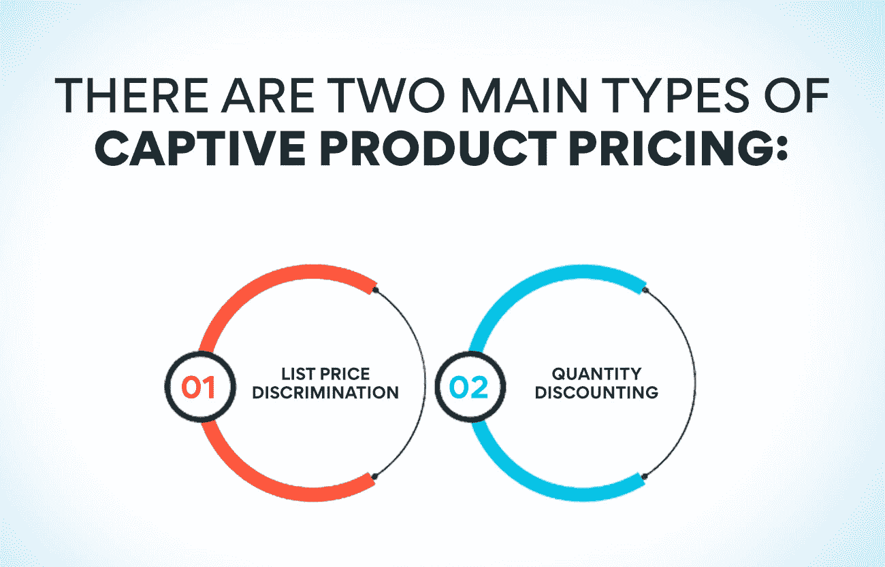

# 专属产品定价:它是什么？为什么要这样做？

> 原文：<https://www.edureka.co/blog/captive-product-pricing/>

专属产品定价是一种定价策略，公司以低于边际成本的价格出售商品或服务，以增加市场份额或获得其他竞争优势。这种做法也被称为“掠夺性定价”

受控产品的定价是有争议的，也是反垄断诉讼的主题。一些人认为这种做法是反竞争的，通过阻止消费者获得商品和服务的最佳价格来伤害消费者。其他人认为，垄断产品定价可以给消费者带来好处，为他们提供价格更低的产品来替代价格更高的产品。

对于 CPP 在反垄断法下是合法还是非法，目前还没有明确的共识。美国最高法院没有直接迎合这个问题，但已经发布了几项裁决，表明这种做法在某些情况下可能是允许的。

## **专属产品定价的优势**

1.  专属产品定价有助于增加互补产品的销售。
2.  它还能刺激对一种可能已经滞销的产品的需求。
3.  此外，专属产品定价可以鼓励客户从一家公司购买多种产品，从而增加整体利润。
4.  这种定价方式也有助于推广公司希望推出的新产品或产品线。
5.  专属产品定价的另一个优势是，它允许公司更好地管理库存水平和周转率。
6.  此外，这种定价策略有助于降低竞争企业之间爆发价格战的可能性。
7.  此外，专属产品定价可以让消费者更难转向竞争品牌或产品，从而提高他们的忠诚度。
8.  这种定价策略还可以帮助公司密切关注竞争对手，更好地了解他们对类似产品的定价。
9.  最后，专属产品定价策略可以洞察客户的购买习惯和趋势，从而帮助企业规划未来。

## **CPP 中需要考虑的因素**

为专属产品定价时，有几个因素需要考虑。最关键的因素是生产成本。这包括原材料、劳动力和管理费用的成本。你必须考虑市场对该产品的需求。如果需求高，可以收取更高的价格。但是如果需求很低，你就需要降低价格来吸引买家。其他因素包括运输和处理成本、税收和关税。你还需要确保你的价格与市场上的其他产品相比具有竞争力。

## **专属产品定价的真实例子**

1.  机票是 CPP 的一个典型例子。我们经常看到航空公司对同一航班收取不同的价格，这是基于机票的购买时间和类型(如经济舱、商务舱、头等舱)等因素。
2.  另一个专属产品定价的例子是手机计划。许多移动电话提供商根据包括多少分钟、短信和数据，提供不同价格的不同计划。
3.  酒店通常使用专属产品定价，根据季节或需求以不同的价格出售房间。例如，通常每晚 100 美元的酒店房间在旺季或镇上有特殊活动时可能会卖到 150 美元。
4.  租赁汽车是专属产品定价的另一个常见例子。汽车租赁公司通常在周末、工作日、节假日和其他需求较高的时候收取不同的费用。
5.  最后，许多游乐园使用 CPP 根据一天或一周的时间对游乐设施和景点收取不同的价格。例如，一些游乐园可能会在高峰时段或周末收取更高的费用。

**也可理解为:[创建成功上市战略的步骤](https://www.edureka.co/blog/go-to-market-strategy/)**

## **专属产品定价的流程是怎样的？**

专属产品定价过程中有许多步骤。首先是了解顾客的需求。这可以通过调查、访谈、焦点小组和其他研究方法来实现。一旦公司了解了顾客想要什么，他们就需要设定一个价格，这个价格既要涵盖生产成本，又要留有利润空间。

这个价格也必须与市场上的其他产品竞争。下一步是制定营销策略来推广产品，并说服客户购买。这可能涉及广告、折扣或其他促销策略。最后，公司必须监控销售并调整价格以确保盈利。

专属产品定价过程中有几个关键步骤:

1.  对公司的成本结构和期望的利润率建立清晰的理解。这通常是通过对公司财务状况的全面分析来完成的，包括销售成本(COGS)、间接成本和期望利润率。
2.  确定公司最能产生利润的核心产品或服务。这些通常被称为“专属”产品或服务，因为它们提供盈利能力，允许公司补贴其他利润较低的业务领域。
3.  在了解客户需求和支付意愿的基础上，为每种专属产品或服务制定定价策略。例如，如果客户对价格高度敏感，可能需要较低的价格来获取市场份额。另一方面，如果客户对价格不太敏感，就有可能通过提高价格来实现利润最大化。
4.  在销售专属产品或服务的所有渠道，如网上商店、零售店等，实施选定的定价策略。这确保了所有客户对相同的产品或服务支付相似的价格，而不管他们是如何购买的。

5.  定期监控销售和盈利水平，以确保所选择的定价策略能按预期发挥作用。这可能包括根据需要上调或下调价格，以保持期望的利润水平。

6.  持续评估竞争格局，以确保公司的定价策略保持有效。这可能包括定期改变定价策略，以密切关注市场变化。

## **专属产品定价的利弊**

这些公司参与专属产品定价背后有几个原因。有时这样做是为了让消费者买得起 T2 的产品，或者是为了抑制竞争。其他时候，这样做可能是为了帮助企业的其他方面融资。在实施定价策略之前，应该考虑它的利弊。

专属产品定价的一个优势是，它可以让消费者买得起产品。这有助于增加销售，并鼓励买家的忠诚度。这也有助于抑制竞争，因为如果价格已经很低，其他公司就不太可能进入市场。另一个好处是，它可以为公司创造额外的收入，这些收入可以用于资助其他业务或投资。

除了优势，使用专属产品定价也有一大堆缺点:

1.  与采用不同的定价策略相比，这可能会降低公司的利润。
2.  这可能会疏远一些觉得自己需要的东西被要价过高的顾客。
3.  如果监管者认为价格被人为操纵，它可能会招致政府的审查。

## **不同行业专属产品定价的重要性**

不同的行业有不同的理由使用专属产品定价。例如，原始设备制造商经常在汽车行业使用垄断产品定价来阻止经销商销售竞争产品。保险公司在保险行业使用专属产品定价来防止客户货比三家。在医疗保健行业，供应商利用专属产品定价来阻止患者去找其他供应商。

专属产品定价可能会引起争议，但同时也是防止客户转向竞争对手的非常有效的方法。如果你处在一个垄断产品定价很普遍的行业，理解它是如何运作的以及它会如何影响你的业务是至关重要的。

**SaaS 工业**

在为 SaaS 行业设定专属产品定价时，有几件事需要考虑。首先是你的产品或服务对顾客的价值。这可能很难确定，但考虑这一点很重要，因为你需要确保你提供的价值与你的价格相符。如果你的价格太高，你会发现吸引和留住顾客很有挑战性。

另一个需要考虑的重要事情是竞争。你所在领域的其他公司对类似产品或服务的收费是多少？你必须确保你的价格有竞争力，让客户看到选择你的公司的价值。

最后，考虑你希望如何构建你的定价模式。有各种方法可以做到这一点；正确的方法将取决于您的具体业务和目标。例如，一些公司按月收取固定费用，而其他公司则根据使用情况收费。考虑什么最适合你的业务，然后据此制定定价策略。

通过牢记一切，你可以为你的 SaaS 公司制定一个满足客户需求并有助于确保你的企业长期成功的定价策略。

**医疗保健行业**

医疗保健行业尤其依赖专属产品定价。这是因为供应商通常对他们的服务有垄断，允许他们在没有竞争的情况下设定价格。

医疗保健行业专属产品定价面临的挑战之一是，它可能会导致更高的患者成本。这是因为提供者可以根据他们的意愿对他们的服务收费，而患者除了支付价格之外别无选择。这对于预算有限或有高额免赔额健康计划的病人来说可能是个问题。

医疗保健行业专属产品定价的另一个挑战是，它可能会刺激提供商过度使用某些服务。例如，如果提供者知道他们可以收取 100 美元的服务费，他们可能会更愿意向患者推荐，即使这是不必要的。这会抬高成本，给患者造成不必要的经济负担。

尽管面临这些挑战，专属产品定价仍是医疗保健行业的标准。提供商使用它是因为它允许他们最大化收入并保持盈利能力。如果您是患者，了解您的医疗服务提供者如何定价以对您的护理做出明智的决定是至关重要的。

**食品&饮料行业**

食品和饮料行业有多种产品定价方法，但专属产品定价是最受欢迎的方法之一。这包括根据生产成本为产品定价，再加上利润加成。根据具体的行业和产品，价格会有所不同，但通常在 30%左右。

食品和饮料公司可以通过几种不同的方式为垄断市场的产品定价。一种常见的方法是使用成本加成定价策略，即公司简单地在生产产品的成本上增加一个加成。这种加价将包括管理费用、营销费用和利润等。

另一种选择是根据竞争对手的收费来定价。这可以通过匹配或降低价格来实现。这种策略可以有效地让顾客转向你的品牌，但会导致价格和利润的急剧下降。

最后，一些公司选择根据顾客感知的价值来给产品定价。这意味着看看人们愿意为类似的产品支付多少，然后相应地设定一个价格。然而，如果没有广泛的市场调查，这种方法可能很难执行。

**也读:[什么是产品策划，是怎么做的？](https://www.edureka.co/blog/product-planning/)**

**服装行业**

服装行业有多种产品定价方式。一种常见的方法是专属产品定价，它涉及到考虑制造、运输和其他相关成本的产品定价。这种方法可以用来给成品和原材料定价。

CPP 的主要优势在于它允许公司更好地控制利润。通过考虑与生产和运输产品相关的所有成本，公司可以设定价格，确保他们从每笔销售中获利。这种定价方法还为消费者提供了更大的透明度，因为他们可以看到生产他们感兴趣的商品的确切成本。

然而，使用专属产品定价也有一些缺点。一个挑战是，这种方法并不总是考虑市场条件或消费者需求的变化。例如，如果原材料成本下降，但成品的销售价格保持不变，那么公司的利润就会减少。此外，如果消费者需求减少或竞争加剧，公司可能会发现很难在不牺牲盈利能力的情况下维持现有价格。

总的来说，CPP 是服装行业许多企业的普遍选择。它提供了对利润的控制，并允许公司更好地跟踪他们的成本。然而，理解这种定价方法可能带来的潜在挑战是至关重要的。

## **什么是不同类型的专属产品定价？**

CPP 是一种定价策略，根据该策略，公司根据销售地点对相同的产品收取不同的价格。例如，一家公司在店内销售的产品可能要价 100 美元，但在竞争对手的商店销售的同一产品却要价 120 美元。

这种定价方式可以阻止顾客货比三家，或者鼓励他们从特定的零售商那里购买。它还可以用来阻止经销商销售竞争产品。

有两种主要的专属产品定价:

**列出价格歧视**

由于标价歧视，一家公司根据购买者的不同而收取不同的价格。例如，一家公司可能向零售客户收取 100 美元的产品费用，但向批发客户收取 80 美元的相同产品费用。这种定价通常用于汽车行业，以阻止经销商销售竞争产品。

**数量折扣**

有了数量折扣，一家公司根据购买的数量收取不同的价格。例如，一家公司可能对一个单位的产品收费 100 美元，但对两个单位收费 90 美元。这种定价通常用于保险行业，以防止客户货比三家。

## **如何理解 CPP？**

关于专属产品定价，需要了解几个关键事项:

1.  它为只能通过单一零售商销售的产品定价。
2.  目标是在为顾客提供合理价格的同时，为零售商创造更高的利润。
3.  为了做到这一点，零售商仔细考虑生产和销售产品的成本及其需求。

专属产品定价可能会引起争议，因为一些人认为它利用了没有其他选择只能从相关零售商处购买产品的消费者。然而，如果操作得当，对零售商和消费者来说，这是一个双赢的局面。

## **结论**

公司可以通过提高一种产品的价格来增加他们的总利润，而这种价格对另一种产品的运作是必不可少的。专属产品定价是公司用来增加利润的标准定价策略。虽然专属产品定价可以使公司受益，但必须记住，它会导致消费者价格上涨。

[产品经理](https://www.edureka.co/blog/product-manager)总是在寻找改进产品定价策略的方法。一个有效的方法是参加我们[的](https://www.edureka.co/highered/advanced-executive-program-in-product-management-iitg)产品管理高级主管证书课程。在本课程中，您将了解受控产品的定价以及如何利用它为自己谋利。你还将学习其他重要的主题，如[产品开发](https://www.edureka.co/blog/product-development/)，市场营销和销售。这门课程是让你的职业生涯飞向更高水平并成为[产品管理专家的绝佳途径。](https://www.edureka.co/blog/product-management/)

**更多信息:**

[品牌管理 v/s 产品管理:了解关键差异](https://www.edureka.co/blog/brand-and-product-management/)

[什么是产品流程矩阵？](https://www.edureka.co/blog/what-is-the-product-process-matrix/)

[什么是运营管理中的流程设计？](https://www.edureka.co/blog/process-design-in-operations-management/)

[每个 PM 都必须知道的产品管理框架](https://www.edureka.co/blog/product-management-frameworks)