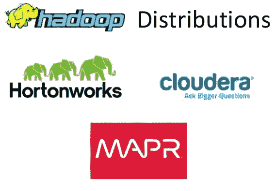

# Hadoop 管理员的一天

> 原文：<https://www.edureka.co/blog/a-day-in-the-life-of-a-hadoop-administrator>

Hadoop 管理员的生活围绕着创建、管理和监控 Hadoop 集群。然而，集群管理并不是全球各地的管理员一直在进行的活动。这种情况下的主要变量是“Hadoop 的分布”,或者简单地说，是基于“集群”的，您可以在其中选择集群监控工具。Hadoop 的不同发行版有 Cloudera、Hortonworks、Apache 和 MapR。Apache 发行版当然是开源的 Hadoop 发行版。成为 Hadoop 管理员的最佳方式是参加 [Hadoop 管理培训](https://www.edureka.co/hadoop-administration-training-certification)。

作为一名管理员，如果我想在 Hortonworks/Cloudera 发行版上设置一个 Hadoop 集群，我的工作会很简单，因为所有的配置文件在启动时都会存在。然而，在 Hadoop 的开源 Apache 发行版的情况下，我们必须手动设置所有的配置，如核心站点、HDFS 站点、YARN 站点和 MapRed 站点。

创建群集后，我们必须确保群集始终处于活动状态并且可用。为此，必须设置集群中的所有节点。它们是 NameNode、DataNode、活动和备用 NameNode、资源管理器和节点管理器。

NameNode 是集群的核心。它由元数据组成，帮助集群识别数据并协调所有活动。由于很多都依赖于 NameNode，我们必须确保 100%的可靠性，为此，我们有一个称为备用 NameNode 的东西，它充当活动 NameNode 的备份。NameNode 存储元数据，而实际数据以块的形式存储在 DataNode 中。资源管理器始终为所有作业管理集群的 CPU 和内存资源，而应用程序主机管理实际的作业。

如果以上所有服务都在运行并且一直处于活动状态，那么您的 Hadoop 集群就可以使用了。

在设置 Hadoop 集群时，管理员还需要根据要存储在 HDFS 中的数据量来决定集群的大小。由于 HDFS 的复制系数为 3，因此在 Hadoop 集群中需要 15 TB 的可用空间来存储 5 TB 的数据。为了增加冗余和可靠性，复制因子被设置为 3。基于存储容量的集群增长是在集群中实施的一种非常有效的技术。我们可以向现有集群添加新系统，从而成倍增加存储空间。

作为 Hadoop 管理员，我们必须执行的另一项重要活动是定期监控集群。我们监控集群，以确保它始终正常运行，并跟踪性能。你可以从海得拉巴的 [Hadoop 管理课程中学到更多关于集群的知识。](https://www.edureka.co/hadoop-administration-training-certification-hyderabad)

可以使用各种集群监视工具来监视集群。我们根据您正在使用的 Hadoop 版本选择合适的集群监控工具。适合 Hadoop 发布的监控工具有:

**开源 Hadoop/Apache Hadoop**àNagios/Ganglia/Ambari/Shell 脚本/Python 脚本

**cloud era Hadoop**àcloud era Manager+开源 Hadoop 工具

**Horton works**àApache Ambari+开源 Hadoop 工具

Ganglia 用于监控计算网格，即一组服务器在同一任务上工作以实现共同的目标。就像一簇簇。Ganglia 还用于监控集群的各种统计数据。Nagios 用于通过 SNMP 等监控不同的服务器、服务器中运行的不同服务、交换机和网络带宽。

请记住，Nagios 和 Ganglia 都是开源的，这就是为什么与 Ambari 和 Cloudera Manager 相比，这两者都有点难以管理的原因。前者是 Hortonworks 发行版使用的监控工具，而 Cloudera 使用的是后者。Apache Ambari 和 Cloudera Manager 是更受欢迎的工具，因为它们与 Hadoop 发行版一起提供了大约 10，000 个要监控的统计数据。但缺点是它们不是开源的。

有问题要问我们吗？请在评论区提到它，我们会给你回复。

**相关帖子:**

[Hadoop 管理入门](https://www.edureka.co/hadoop-admin "Get Started with Hadoop Administration")

[Hadoop 管理面试问答](https://www.edureka.co/blog/interview-questions/hadoop-administration-interview-questions-and-answers/ "Hadoop Administration Interview Questions and Answers")

[Top 5 Hadoop 管理任务](https://www.edureka.co/blog/top-5-hadoop-admin-tasks "Top 5 Hadoop Admin Tasks")