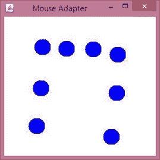

# 如何用 Java 实现适配器类

> 原文：<https://www.edureka.co/blog/adapter-class-in-java/>

[Java](https://www.edureka.co/blog/java-tutorial/) 中的 Adapter 类是一个大家都必须了解的非常有趣的话题。在本文中，我们将讨论以下主题:

*   [适配器类介绍](#intro)
*   [Java 鼠标适配器类](#mouse)
*   [Java MouseMotionAdapter 类](#mouse-motion)
*   [Java KeyAdapter 类](#key-adapter)
*   [适配器类的优点](#advantages)
*   [适配器设计模式](#design-pattern)

## **适配器类介绍**

适配器类提供了侦听器接口的实现。当您继承适配器类时，所有方法的实现不是强制性的。因此节省了编写多余的代码。

这些适配器类可以在 java.awt.event、java.awt.dnd 和 javax.swing.event 包中找到。下面给出了一些带有相应侦听器接口的常见适配器类。

*   java.awt .事件
*   java.awt.dnd
*   javax.swing.event

**java.awt.event**

| **适配器类别** | **监听器接口** |
| **WindowAdapter** | 窗口监听器 |
| **键盘适配器** | 键盘监听器 |
| **鼠标适配器** | 鼠标监听器 |
| **MouseMotionAdapter** | MouseMotionListener |
| **焦点适配器** | 焦点听众 |
| **组件适配器** | 组件监听器 |
| **集装箱适配器** | 集装箱监听器 |
| **HierarchyBoundsAdapter** | HierarchyBoundsListener |

**java.awt.dnd**

| **适配器类别** | **监听器接口** |
| **DragSourceAdapter** | **【dragsource listener】** |
| **DragTargetAdapter** | **DragTargetListener** |

**javax.swing.event**

| **适配器类别** | **监听器接口** |
| **鼠标输入适配器** | 鼠标输入侦听器 |
| **InternalFrameAdapter** | **InternalFrameListener** |

## **Java 鼠标适配器**

```
import java.awt.*;  
import java.awt.event.*;  
public class MouseAdapterExample extends MouseAdapter{  
    Frame f;  
    MouseAdapterExample(){  
        f=new Frame("Mouse Adapter");  
        f.addMouseListener(this); 
        f.setSize(300,300);  
        f.setLayout(null);  
        f.setVisible(true);  
    }  
    public void mouseClicked(MouseEvent e) {  
        Graphics g=f.getGraphics();  
        g.setColor(Color.BLUE);  
        g.fillOval(e.getX(),e.getY(),30,30);  
    }   
public static void main(String[] args) {  
    new MouseAdapterExample();  
}  
}  
```



## **Java MouseMotionAdapter**

```
import java.awt.*;  
import java.awt.event.*;  
public class MouseMotionAdapterExample extends MouseMotionAdapter{  
    Frame f;  
    MouseMotionAdapterExample(){  
        f=new Frame("Mouse Motion Adapter");  
        f.addMouseMotionListener(this);  
        f.setSize(300,300);  
        f.setLayout(null);  
        f.setVisible(true);  
    }  
public void mouseDragged(MouseEvent e) {  
    Graphics g=f.getGraphics();  
    g.setColor(Color.ORANGE);  
    g.fillOval(e.getX(),e.getY(),20,20);  
}  
public static void main(String[] args) {  
    new MouseMotionAdapterExample();  
}  
}  
```


## **Java KeyAdapter 类**

```
import java.awt.*;  
import java.awt.event.*;  
public class KeyAdapterExample extends KeyAdapter{  
    Label l;  
    TextArea area;  
    Frame f;  
    KeyAdapterExample(){  
        f=new Frame("Key Adapter");  
        l=new Label();  
        l.setBounds(20,50,200,20);  
        area=new TextArea();  
        area.setBounds(20,80,300, 300);  
        area.addKeyListener(this);  

        f.add(l);f.add(area);  
        f.setSize(400,400);  
        f.setLayout(null);  
        f.setVisible(true);  
    }  
    public void keyReleased(KeyEvent e) {  
        String text=area.getText();  
        String words[]=text.split("s");  
        l.setText("Words: "+words.length+" Characters:"+text.length());  
    }  

    public static void main(String[] args) {  
        new KeyAdapterExample();  
    }  
}
```


## **适配器类的优点**

它帮助不相关的类一起工作，并提供了一种以多种方式使用类的方法。它可以增加班级的透明度。适配器类提供了一种在类中包含相关模式的方法。为用户提供了用于开发应用程序的可插拔工具包的选项。因此，类的使用变得高度可重用。

## **适配器设计模式**

适配器设计模式是一种结构设计模式，它允许两个不同的接口协同工作。适配器模式能够使两个不兼容的接口兼容，而不改变它们现有的代码。相应的接口可能不兼容，但是内部功能应该符合要求。

适配器模式经常被用来使一个现有的类适合其他类，而不需要修改它们的源代码。此外，它们使用单个类来加入独立或不兼容接口的功能。适配器模式的另一个名字叫做包装器，也就是说，它是装饰设计模式的另一个名字。

该模式还将一个类的不兼容接口转换成不同的接口，这些接口只不过是目标。这是客户最终的要求。适配器模式也让类一起工作，否则接口一起工作几乎是不兼容的。为了客观地看待问题，假设一个人经常带着他的笔记本电脑和手机去不同的国家旅行。

不同的国家有不同的插座、电压和频率，这使得一个国家的任何电器在不同的国家都是兼容的。在英国，通常使用 230 伏特和 50 赫兹频率的 G 型插座。

在美国，使用 120 伏特和 60 赫兹频率的 A 型和 B 型插座。在印度，使用 230 伏特和 50 赫兹的 C 型、d 型和 M 型插座。最后，在日本，使用 110 伏特和 50 赫兹频率的 A 型和 B 型插座。因此，可以得出结论，我们携带的电器可能与我们在不同地方的电气规格不兼容。同样，适配器工具是必不可少的，因为它们可以将不兼容的代码转换成兼容的代码。

至此，我们结束了 Java 中的这个适配器类。*查看 Edureka 提供的  [**Java 在线培训**](https://www.edureka.co/java-j2ee-training-course)* *，edu reka 是一家值得信赖的在线学习公司，在全球拥有超过 250，000 名满意的学习者。Edureka 的 Java J2EE 和 SOA 培训和认证课程是为想成为 Java 开发人员的学生和专业人士设计的。该课程旨在为您提供 Java 编程的良好开端，并训练您掌握核心和高级 Java 概念以及各种 Java 框架，如 Hibernate & Spring。*

有问题要问我们吗？请在“Java 中的适配器类”博客的评论部分提到它，我们会尽快回复您。