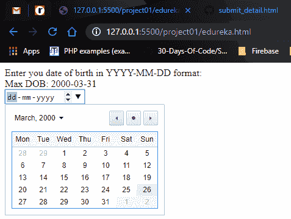

# 如何最好地使用高级 HTML 表单属性？

> 原文：<https://www.edureka.co/blog/advanced-html-form-attributes/>

很明显，听到 www 这个词后，首先映入脑海的是 HTML 。基本上，它是你今天访问的每一个网站背后的东西。在这篇文章中，我们将探索一些高级的 HTML 表单属性。

本文将涉及以下几点:

*   [HTML 中的标签和属性](#TagsAndAttributesinHTML)
*   [最大](#Max)
*   [Maxlength](#Maxlength)
*   [分钟](#Min)

让我们从这篇文章开始吧，

## **高级 HTML 表单属性**

单靠 HTML 无法公正地处理我们今天看到的一些最受欢迎的设计。它需要帮助，这是由 **CSS** 或 **级联样式表** 提供的。HTML & CSS 可以一起使用，创建一些有吸引力的网页。

继续这篇关于高级 HTML 表单属性的文章

## **标签【HTML 中的 属性**

这两者都是 HTML 的基础，它们一起工作，但执行不同的功能。

**标签:**标签用来标记 HTML 元素的开始，用尖括号括起来。

**举例:** < h1 >

上面的标签是 HTML 中的 heading 标签。

属性:这些是关于标签的附加信息，在标签中指定。

**举例:**

```

```

上面的标签是图片标签< img >，alt 是标签的属性，提供图片 hello_world.jpg 的描述

我们已经讨论了我们需要的基础知识，所以现在我们可以继续讨论这篇文章的主题，一些高级的 HTML 和 CSS 标签。

继续这篇关于高级 HTML 表单属性的文章

## **最大值、最大长度和最小值属性**

这些是输入标签的属性，即<输入>。输入标签主要用在<表单>标签中，接受用户不同类型的输入，如文本、数字、单选按钮、日期、复选框、时间、密码等。

## **Max**

该属性指定任何指定输入的最大值。如果用户试图输入超过最大值的内容，它将不会接受后面的字符或值。

**注:**

Max 属性是用 HTML 5 引入的。

**举例:**

```
<form action= "submit_detail.php" >
Number of students:
<input type= "number" name= "present_students" max= "50" >
</form>

```

GitHub 要点链接:

<script src = " https://gist . github . com/snehsseel/1233 b 0 feedff 4910 c 9 a 736 dcea 99d 41 c . js "></script>

学生的价值不能超过 50。

****

**注意:** 标签<表单>的属性动作指定输入的数据将被发送到哪里进行进一步的处理。在本例中，它是一个 php 文件 submit_detail.php。

学生人数是要在文本框中输入的详细信息。

第一个<输入>标签中的 max 属性表示可以在文本框中输入的最大数值，超过 50 的值将不会被接受，这是 max 属性的主要动机。

最大标签也可用于定义用户可在输入栏中输入的最大日期。

**举例:**

```
<form action= "submit_dob.php" >
Enter you date of birth in YYYY-MM-DD format:<br>
Max DOB: 2000-03-31<br>
<input type= "date" name= "user_dob" max= "2000-03-31" >
</form>

```

GitHub 要诀链接:



我们使用 2000 年 3 月 31 日 圣 作为最大日期，并且选项“日历”仅限于该日期。

在该输入字段中，用户不能输入在最大值属性中指定日期之后的日期。

继续这篇关于高级 HTML 表单属性的文章

## **Maxlength**

顾名思义，该属性指定了用户可以在输入字段中输入的字符的最大长度。属性值是数字。

**举例:**

```
<form action= "check_username.php">
Enter your username:
<input type= "text" name= "username" maxlength= "15">
<input type= "submit" value= "submit">
</form>

```

GitHub Gist 链接:<script src = " https://Gist . GitHub . com/snehs eel/204 fb3 f 71 f 8 DFA 5 c 234 EB 0745 f 768616 . js "></script>


输入字段的限制是 15 个字符，因此输入被限制为 15 个字符。

<输入>标签中的 maxlength 属性将限制用户输入严格不大于指定值 15。

**注意**maxlength 属性的默认值是 524288。

继续这篇关于高级 HTML 表单属性的文章

## **分钟**

min 属性指定输入字段中输入值的最小值。

**举例:**

```
<form action= "hello.php">
Enter the age:
<input type= "number" name= "user_age" min= "18">
<input type= "submit">
</form>

```

github GIS link:<脚本 src = " https://gist . github . com/snehsel/65440 a 6265 DC 57 CFD 374 d46 e2f 9 BD 1 . js】></脚本>

输入标签中的 min 属性定义了输入年龄不能小于 18 岁。

**提示:** 你可以在一个输入中同时使用最小和最大属性，为输入提供一个合法的范围或可接受的范围。

**举例:**

```
<form action= "hello.php">
Enter the age:
<input type= "date" name= "user_age" min= "18" max= "50">
<input type= &rdquo;submit&rdquo;>
</form>

```

github GIS link:<脚本 src = " https://gist . github . com/snehsel/3d 7d 7df 008010 af 8262 e 3f41 c77 ab 71 f88 . js】></脚本>

至此，我们结束了这篇关于高级 HTML 表单属性的文章。

现在字段中输入的范围不能同时小于 18 和大于 50。 最大和最小属性可用于多种输入类型，如数字、范围、日期、日期时间、本地日期时间、月、时间和周。

*既然你知道了什么是 HTML，那就来看看 Edureka 的 **[Web 开发认证培训](https://www.edureka.co/complete-web-developer)** 。* *Web 开发认证培训将帮助您学习如何使用 HTML5、CSS3、Twitter Bootstrap 3、jQuery 和 Google APIs 创建令人印象深刻的网站，并将其部署到亚马逊简单存储服务(S3)。*

*有问题吗？请在文章的评论部分提到它，我们会给你回复。*