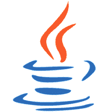
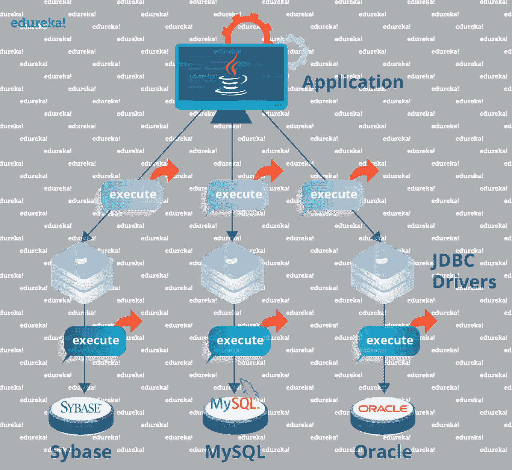
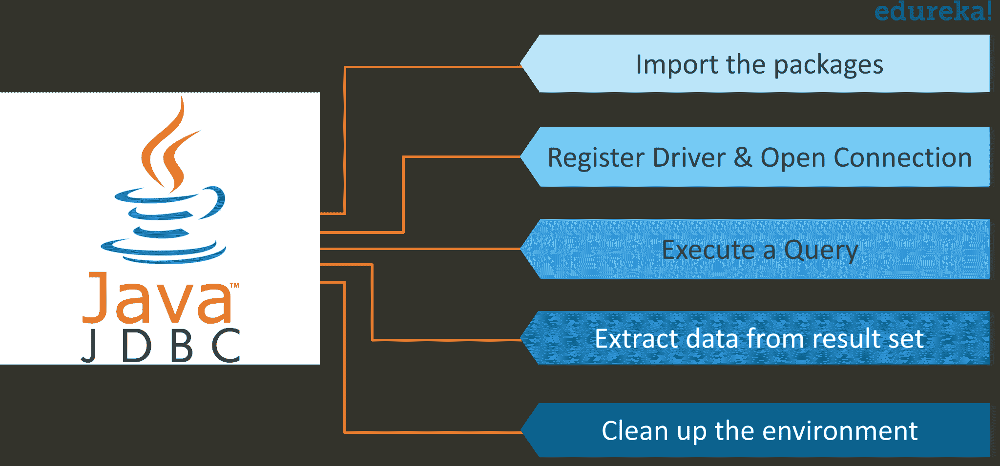
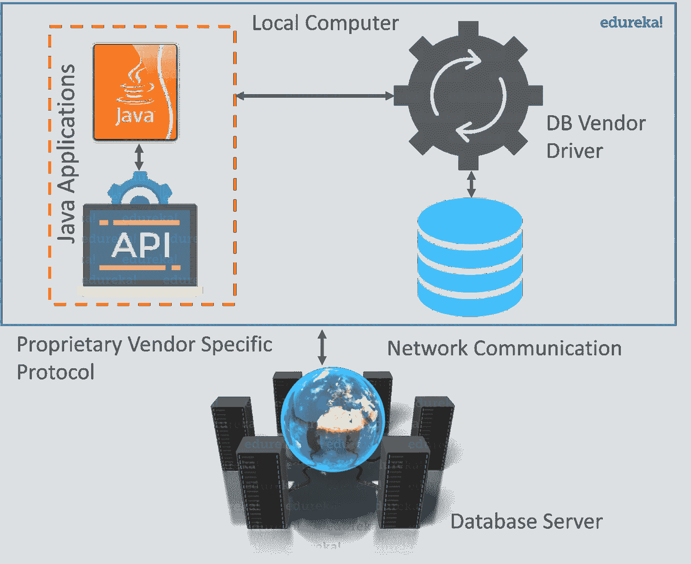
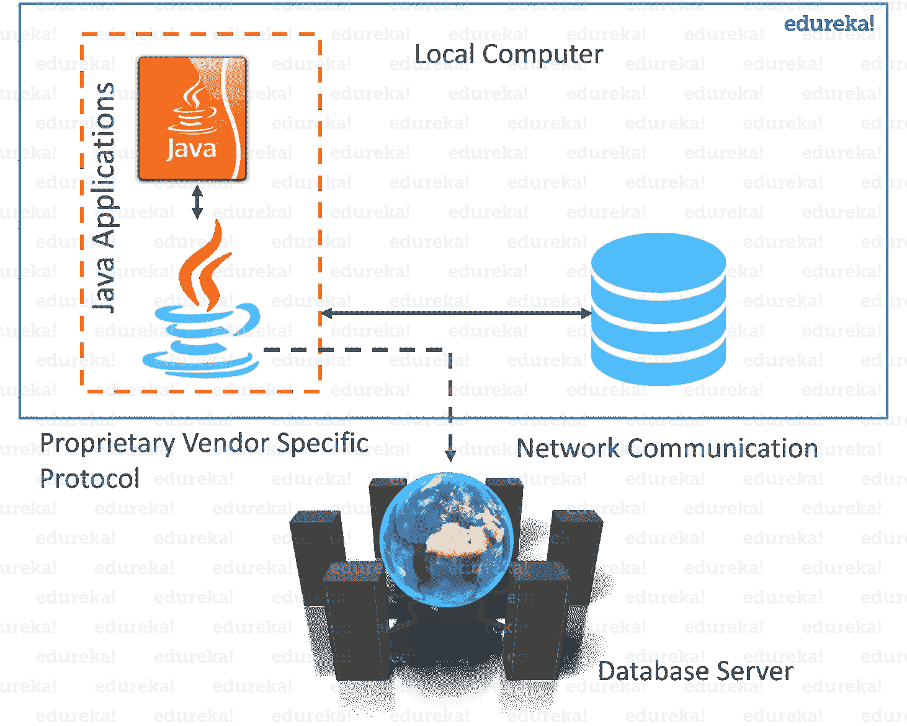

# 高级 Java 教程——高级 Java 完全指南

> 原文：<https://www.edureka.co/blog/advanced-java-tutorial>

我们大多数人都已经知道，使用核心 Java 概念可以轻松构建普通的应用程序。但是，当涉及到开发 web 应用程序时，高级 Java 基础，如 JSP、Servlets、JDBC 等。，可以增加应用程序的功能和特性，因此对开发人员来说是必不可少的。通过这篇关于高级 Java 教程的博客，我将让你对高级 Java 的基本概念有一个完整的了解。

你也可以浏览这个高级 Java 教程的录音，在那里你可以通过例子以一种详细的方式理解主题。

## 高级 Java 教程| J2EE、Java Servlets、JSP、JDBC | Java 认证培训| Edureka


[https://www.youtube.com/embed/vJ-Zn4fo0MQ?rel=0&showinfo=0](https://www.youtube.com/embed/vJ-Zn4fo0MQ?rel=0&showinfo=0)This Edureka tutorial on “Advanced Java” will talk about 3 main concepts i.e. JAVA Database Connectivity, Servlets, and Java Server Pages.

**高级 Java 教程:高级 Java 入门**

****

**高级 Java** 是超越 [**核心 Java**](https://www.edureka.co/blog/java-tutorial/) 的一切——最重要的是 Java 企业版中定义的 API，包括 Servlet 编程、Web 服务、持久性 API 等。它是一个 Web &企业应用开发平台，基本遵循客户端&服务器架构。

## **高级 Java 教程:** **需要高级 Java**

下面我列出了高级 Java 的几个主要优点:

1.  *进阶 Java* 即 *JEE (Java 企业版)*给你的库了解核心 Java 不支持的 Web 应用开发的 ***客户端-服务器架构*** 。
2.  J2EE 是独立于平台的， ***以 Java 为中心的*** 环境，用于开发、构建&在线部署基于 Web 的应用程序。它还包含一组服务、API 和协议，为开发多层的、基于 web 的应用程序提供了必要的功能。
3.  您将能够使用  ***Web 和应用服务器*** 如 Apache Tomcat、Glassfish 等，并且  理解 HTTP 协议上的通信。但是，在核心 Java 中，这是不可能的。
4.  还有很多  Advance **Java 框架**像 *[Spring](https://www.edureka.co/blog/spring-tutorial/) 、JSF、Struts* 等等。  使您能够为电子商务、银行、法律、金融、医疗保健、库存等领域开发基于  安全交易的 web 应用。
5.  为了工作和理解**热门技术**如 *[Hadoop](https://www.edureka.co/blog/hadoop-tutorial/)* *和云服务* ***，*** 你应该准备好核心和高级的 Java 概念。

我希望你明白为什么高级 Java 是必不可少的。为了让你更好的理解，我把这篇文章分成了三个部分。每一节都涉及高级 Java 的一个最重要的概念:

1.  [JDBC](https://www.edureka.co/blog/interview-questions/java-interview-questions/#JDBC) ( Java 数据库连接)
2.  java servlet
3.  [JSP](https://www.edureka.co/blog/interview-questions/java-interview-questions/#jsp) (Java Servlet 页面)

那么，现在让我们开始讨论并理解 Java 数据库连接的概念，这是一个与数据库交互的有用工具。

## ****高级 Java 教程:**JDBC 入门**

JDBC 是一个标准的 Java API，用于 Java 编程语言和各种数据库之间的独立于数据库的连接。这个应用程序接口允许你用结构化查询语言( SQL )对访问请求语句进行编码。然后，它们被传递给管理数据库的程序。它主要包括打开一个连接，创建一个 SQL 数据库，执行 SQL 查询，然后到达输出。

我们可以使用 JDBC API 来访问存储在任何关系数据库中的表格数据。借助 JDBC API，我们可以保存、更新、删除和读取数据库中的数据。它类似于微软提供的开放式数据库连接(ODBC)。

为了更好地理解 JDBC 的工作方式，让我们更深入地研究这个主题，理解 Java 数据库连接背后的架构。

## ****高级 Java 教程:** JDBC 架构**

JDBC API 支持数据库访问的两层和三层处理模型，但一般来说，JDBC 体系结构由两层组成

*   ***JDBC API:*** 这提供了应用程序到 JDBC 管理器的连接。
*   ***JDBC 驱动 API:*** 支持 JDBC 管理器到驱动的连接。



JDBC API 使用驱动程序管理器和特定于数据库的驱动程序来提供到异构数据库的透明连接。JDBC 驱动程序管理器确保使用正确的驱动程序来访问每个数据源。驱动程序管理器能够支持连接到多个异构数据库的多个并发驱动程序。

#### ****高级 Java 教程:** 常见 JDBC 组件**

JDBC API 提供了以下接口和类

*   ***驱动管理器*** 用于管理数据库驱动列表。识别 JDBC 下某个子协议的第一个驱动程序将用于建立数据库连接。
*   ***驱动*** 是 处理与数据库服务器通信的接口。它还抽象了与使用驱动程序对象相关的细节。
*   ***连接*** 是一个接口，包含了连接数据库所需的所有方法。连接对象表示通信上下文，即所有与数据库的通信都只通过连接对象进行。

现在让我们进入下一个主题，看看创建 JDBC 应用程序所需的步骤。

## ****高级 Java 教程:S**teps 创建 JDBC 应用**

为了创建 JDBC 应用程序，我们需要遵循几个步骤。让我们看看它们是什么。



1.  **导入包:**您需要包含包含数据库编程所需的 JDBC 类的包。大多数情况下，使用*导入 java.sql.** 就足够了。
2.  **注册 JDBC 驱动:**这里你要初始化一个驱动，这样你就可以打开与数据库的通信通道。
3.  **打开一个连接:**这里可以使用 *getConnection()* 方法创建一个连接对象，表示与数据库的物理连接。
4.  **执行查询:**需要使用语句类型的对象来构建 SQL 语句并提交给数据库。
5.  **从结果集中提取数据:**要求您使用适当的 *getXXX()* 方法从结果集中检索数据。
6.  **清理环境:**需要明确关闭所有数据库资源，而不是依赖 JVM 的垃圾收集。

现在，您已经看到了创建 JDBC 应用程序的各个步骤，让我们看看创建数据库和建立连接的示例代码。

```
package Edureka;
import java.sql.*;
import java.sql.DriverManager;
public class Example {
// JDBC driver name and database URL
static final String JDBC_DRIVER = "com.mysql.jdbc.Driver";
static final String DB_URL = "jdbc:mysql://localhost/emp";
//&nbsp; Database credentials
static final String USER = "root";
static final String PASS = "";
public static void main(String[] args) {
Connection conn = null;
Statement stmt = null;
try{
//STEP 2: Register JDBC driver
Class.forName("com.mysql.cj.jdbc.Driver");
//STEP 3: Open a connection
System.out.println("Connecting to database...");
conn = DriverManager.getConnection(DB_URL,"root","");
//STEP 4: Execute a query
System.out.println("Creating statement...");
stmt = conn.createStatement();
String sql;
sql = "SELECT id, first, last, age FROM Employees";
ResultSet rs = stmt.executeQuery(sql);
//STEP 5: Extract data from result set
while(rs.next()){
//Retrieve by column name
int id&nbsp; = rs.getInt("id");
int age = rs.getInt("age");
String first = rs.getString("first");
String last = rs.getString("last");
//Display values
System.out.print("ID: " + id);
System.out.print(", Age: " + age);
System.out.print(", First: " + first);
System.out.println(", Last: " + last);
}
//STEP 6: Clean-up environment
rs.close();
stmt.close();
conn.close();
}catch(SQLException se){
//Handle errors for JDBC
se.printStackTrace();
}catch(Exception e){
//Handle errors for Class.forName
e.printStackTrace();
}finally{
//finally block used to close resources
try{
if(stmt!=null)
stmt.close()
}catch(SQLException se2){
}// nothing can be done
try{
if(conn!=null)
conn.close();
}catch(SQLException se){
se.printStackTrace();
}//end finally try
}//end try
System.out.println("Goodbye!");
}//end main
} // end Example

```

上面的代码在本地主机数据库中创建了一个表。要在创建的数据库中插入值，可以参考下面的代码。我将只为第 4 步编写代码。代码的其余部分与上面相同。

```
//STEP 4: Execute a query
System.out.println("Creating table in given database...");
stmt = conn.createStatement();
String sql = "CREATE TABLE EMPLOYEES " +
"(id INTEGER not NULL, " +
" first VARCHAR(255), " +
" last VARCHAR(255), " +
" age INTEGER, " +
" PRIMARY KEY ( id ))";
stmt.executeUpdate(sql);
System.out.println("Created table in given database...");
System.out.println("Inserting records into the table...");
stmt =conn.createStatement();
String sql ="INSERT INTO Employees VALUES (100, 'Kriss', 'Kurian', 18)";
stmt.executeUpdate(sql);
sql = "INSERT INTO Employees VALUES (101, 'Enrique', 'John', 25)";
stmt.executeUpdate(sql);
sql= "INSERT INTO Employees  (102, 'Taylor', 'Swift', 30)";
stmt.executeUpdate(sql);
sql= "INSERT INTO&nbsp; Employees&nbsp;VALUES(103, 'Linkin', 'Park', 28)";
stmt.executeUpdate(sql);
System.out.println("Inserted records into the table...");

```

这就是你如何建立到数据库的连接并在表中插入值。现在，让我们进一步了解各种 JDBC 驱动程序类型

Get Certified With Industry Level Projects & Fast Track Your Career [<button>Take A Look!</button>](https://www.edureka.co/java-j2ee-soa-training)

## **高级 Java 教程:JDBC 驱动类型**

JDBC 驱动程序实现了 JDBC API 中定义的接口，用于与数据库服务器交互。本质上，一个**JDBC**使得 **做** 三件事成为可能: 1。建立与数据源的连接。 2。向数据源发送查询和更新语句。 3。处理结果。 例如，使用 JDBC 驱动程序使你能够打开一个数据库连接，通过发送 SQL 或数据库命令与之交互。

有 4 种类型的驱动程序，即:

### **1 型:JDBC-ODBC 大桥潜水员**

在类型 1 驱动程序中，JDBC 桥访问安装在每台客户机上的 ODBC 驱动程序。此外，ODBC 配置代表目标数据库的数据源名称(DSN)。

当 Java 第一次出现时，这是一个有用的驱动程序，因为大多数数据库只支持 ODBC 访问，但现在这种类型的驱动程序只被推荐用于实验或没有其他替代方案时。

### **类型 2:JDBC-原生 API**

在 Type 2 驱动程序中，JDBC API 调用被转换为本地 C/C++ API 调用，这对于数据库是唯一的。这些驱动程序通常由数据库供应商提供，使用方式与 JDBC-ODBC 桥相同。供应商特定的驱动程序必须安装在每台客户机上。



Oracle 调用接口(OCI)驱动程序是类型 2 驱动程序的一个示例。

### **类型三:JDBC-网纯 Java**

在 Type 3 驱动程序中，使用三层方法来访问数据库。JDBC 客户端使用标准网络套接字与中间件应用服务器通信。然后，中间件应用服务器将套接字信息翻译成 DBMS 所需的调用格式，并转发给数据库服务器。

这种驱动程序非常灵活，因为它不需要在客户端安装任何代码，而且单个驱动程序实际上可以提供对多个数据库的访问。您可以将应用服务器视为 JDBC“代理”，这意味着它调用客户端应用程序。因此，您需要了解应用服务器的配置，以便有效地使用这种驱动程序类型。您的应用服务器可能使用类型 1、2 或 4 驱动程序与数据库通信。

### **类型 4: 100%纯 Java**

在 Type 4 驱动程序中，纯 Java 驱动程序通过套接字连接直接与供应商的数据库通信。这是数据库可用的最高性能驱动程序，通常由供应商自己提供。

这种驱动极其灵活，你不必在客户端或服务器上安装特殊的软件。此外，这些驱动程序可以动态下载。

*MySQL 的 Connector/J* 驱动是 4 类驱动。由于网络协议的专有性质，数据库供应商通常提供 type 4 驱动程序。

 #### 订阅我们的 youtube 频道以获取新的更新..！