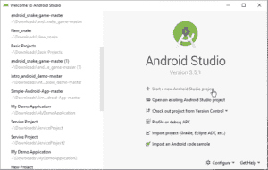
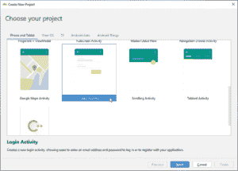
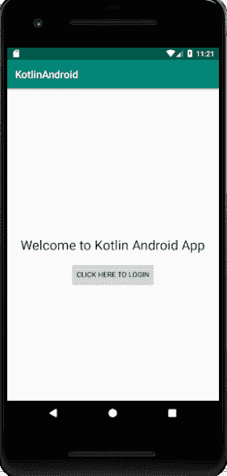
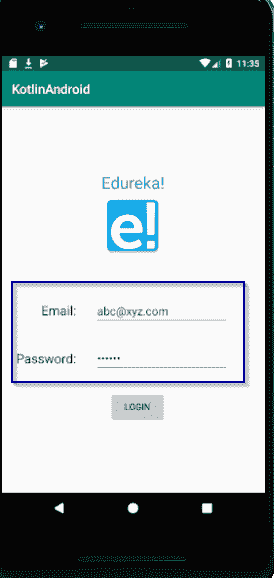
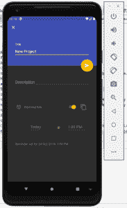

# 2023 年你必须尝试的顶级安卓项目

> 原文：<https://www.edureka.co/blog/android-projects-ideas/>

[*移动应用开发*](https://www.edureka.co/mobile-development-certification-courses) 从一开始就有大量的需求。比如说，在面试中，面试官会问你做过的 Android 项目。你会有很多事情要谈。所以，我写这篇关于 Android 项目的博客，如果你是初学者、中级或高级专业人士，它会有所帮助。

让我们来看看本文涉及的主题:

*   [安卓简介](#Introduction_to_Android)
*   [如何着手学习 Android 项目？](#How_to_go_about_learning_Android_Projects?)
*   [初级项目-简单演示项目](#Beginner_level_project-_Simple_demo_project)
*   [中级项目-ToDoTask](#Intermediate_level_project-_ToDoTask)
*   [高级项目-游戏项目](#Advanced_level_project_-_Gaming_project)
*   [结论](#Conclusion)

我们开始吧！

## **安卓简介**

从黑白手机到最近的智能手机或迷你电脑，操作系统在过去 15 年里有了很大的发展。 Android 是由 Google 开发的基于 Linux 的功能强大的操作系统，主要是为智能手机、平板电脑等触摸屏移动设备而设计的。

它也是一个开源的操作系统。Android 基本上有助于理解你的品味，它提供了各种功能，如壁纸、主题和启动器，这些功能完全改变了你的设备界面的外观。

***不为人知的事实:*** Android 是由谷歌领导的开放手机联盟(OHA)开发的。这个 OHA 是由多家公司组成的联盟，如三星、索尼、英特尔和许多其他公司，提供服务并部署使用 Android 平台的手机。

## **如何着手学习 Android 项目？**

这个问题的答案相当简单明了。这一切都是从学习 Android 的基础和所有的基本原理开始的。这基本上是一个衡量指标，以了解您对 Android 开发的适应程度。

你需要知道的下一件事是你可以在 Android 上工作的方式。一旦你学习了创建应用程序的不同方法，你将会精通任何种类的应用程序的开发。

此外，如果你有一些关于 Android 的同行知识，你现在可以用 [*Edureka*](https://www.edureka.co/mobile-development-certification-courses) 来提升你的学习技能，以便理解这个过程。

项目基本上是用来解决手头的一个问题。如果为各种简单和复杂的问题提供解决方案是你的事情，那么你肯定应该考虑从事 Android 项目。

一旦你学会了如何做到这一点，你会发现理解如何掌握应用程序开发是很容易的。在你职业生涯的任何时候，你都必须从事与特定领域相关的项目。所以，利用这个机会学习一下 [*Android 应用开发*](https://www.edureka.co/android-development-certification-course) *。*

## **初级项目-简单演示项目**

Android 开发的最佳初学者项目是开发一个帮助登录的应用程序。

这非常简单容易。你需要一个 IDE 来工作，那就是 *[Android Studio](https://www.edureka.co/blog/android-studio-tutorial/)* 。这个 IDE 有助于开发 Android 应用程序。

**第一步:**新建一个项目。



接下来，选择一个项目。有很多选项，因此，对于这个项目，我将选择登录项目。



之后，给你的项目起一个名字，并选择编程语言。在这种情况下，我打算考虑与 *[科特林](https://www.edureka.co/blog/what-is-kotlin/)* 合作。

**第二步:**选择一个虚拟设备。要做到这一点，进入 AVD 管理器，点击创建一个虚拟设备，你会得到一个你可以使用的设备列表。你可以使用普通电话工作。


***注意:**启用 BIOS 选择您选择的设备。*

**第三步:**在 Java 文件夹下，你会找到相应的类。只需编辑它们，你就可以开始了。

在这里，我将创建一个 *登录 android 应用程序。* 在这里，第一个屏幕是如下图所示的欢迎页面。



为了创建和设计这个屏幕，您需要配置您的布局。为此，您需要打开布局文件夹，双击*activity _ main . XML*，如下图所示。


打开 XML 文件后，您需要根据您希望屏幕显示的结构创建元素。在创建元素之前，我将打开 design 选项卡，将按钮拖放到我的屏幕上，如下所示。


之后，我将返回并配置*activity _ main . XML*文件，并创建所有元素。您的代码看起来像:

```
<?xml version="1.0" encoding="utf-8"?> <androidx.constraintlayout.widget.ConstraintLayout xmlns:android="<a href="http://schemas.android.com/apk/res/android">http://schemas.android.com/apk/res/android</a>" xmlns:tools="<a href="http://schemas.android.com/tools">http://schemas.android.com/tools</a>" xmlns:app="<a href="http://schemas.android.com/apk/res-auto">http://schemas.android.com/apk/res-auto</a>" android:layout_width="match_parent" android:layout_height="match_parent" tools:context=".MainActivity"

<TextView android:layout_width="wrap_content" android:layout_height="wrap_content" android:text="Welcome to Kotlin Android App" android:textSize="26sp" android:textColor="#000000" app:layout_constraintBottom_toBottomOf="parent" app:layout_constraintLeft_toLeftOf="parent" app:layout_constraintRight_toRightOf="parent" app:layout_constraintTop_toTopOf="parent" android:id="@+id/textView"/>
<Button android:text="Click here to Login" android:layout_width="wrap_content" android:layout_height="wrap_content" android:id="@+id/click" android:layout_marginTop="16dp" app:layout_constraintTop_toBottomOf="@+id/textView" android:layout_marginEnd="96dp" android:layout_marginRight="96dp" app:layout_constraintEnd_toEndOf="@+id/textView"/>
</androidx.constraintlayout.widget.ConstraintLayout>
```

**注意:**如果第一次打开项目时 Gradle 项目同步失败，请在“消息”窗口中点击链接“安装缺少的平台并同步项目”。Android Studio 会下载并安装缺少的组件。

在此之后，您需要创建一个 Kotlin 类文件来添加侦听器，以便从 XML 文件中调用操作。所以在这里，我将添加侦听器来调用我在 XML 文件中创建的按钮和文本视图的操作。package com . example . kotlinandroid

```
import android.content.Intent

import androidx.appcompat.app.AppCompatActivity

import android.os.Bundle

import android.widget.Button

import android.widget.Toast

class MainActivity : AppCompatActivity() {

override fun onCreate(savedInstanceState: Bundle?) {

super.onCreate(savedInstanceState)

setContentView(R.layout.activity_main)

val but_click=findViewById<Button>(R.id.click)

but_click.setOnClickListener{

val intent = Intent(this, login::class.java)

startActivity(intent)

}

}

}
```

这样，您的第一个欢迎页面屏幕就完全创建好了。接下来，您将看到一个登录屏幕，您需要输入电子邮件地址和密码，然后点击登录按钮，如下图所示。



现在我将根据上面的图片在我的第二个活动的设计页签即*activity _ log in . XML*文件中创建 *[设计布局](https://www.edureka.co/blog/android-ui-design/)* ，如下图所示。


之后，我将配置我的 XML 文件，如上图所示。

```
<?xml version="1.0" encoding="utf-8"?> <androidx.constraintlayout.widget.ConstraintLayout
xmlns:android="<a href="http://schemas.android.com/apk/res/android">http://schemas.android.com/apk/res/android</a>"
xmlns:tools="<a href="http://schemas.android.com/tools">http://schemas.android.com/tools</a>"
xmlns:app="<a href="http://schemas.android.com/apk/res-auto">http://schemas.android.com/apk/res-auto</a>"
android:layout_width="match_parent"
android:layout_height="match_parent"
tools:context=".login">

<TextView android:text="Password: "
android:textSize="20sp"
android:textColor="#000000"
android:layout_width="wrap_content"
android:layout_height="wrap_content"
app:layout_constraintStart_toStartOf="parent"
android:layout_marginTop="144dp"
android:layout_marginLeft="6dp"
android:layout_marginStart="6dp"
app:layout_constraintTop_toBottomOf="@+id/imageView"
android:id="@+id/textView6"
app:layout_constraintHorizontal_chainStyle="packed"
app:layout_constraintEnd_toStartOf="@+id/pass"
android:layout_marginEnd="24dp"
android:layout_marginRight="24dp"
app:layout_constraintHorizontal_bias="1.0"/>

<EditText android:layout_width="wrap_content"
android:layout_height="wrap_content"
android:inputType="textEmailAddress"
android:ems="10"
android:id="@+id/email"
app:layout_constraintBaseline_toBaselineOf="@+id/textView5"
app:layout_constraintStart_toEndOf="@+id/textView5"
app:layout_constraintEnd_toEndOf="parent"/>

<EditText android:layout_width="wrap_content"
android:layout_height="wrap_content"
android:inputType="textPassword"
android:ems="10"
android:id="@+id/pass"
app:layout_constraintStart_toStartOf="@+id/email"
android:layout_marginTop="29dp"
app:layout_constraintTop_toBottomOf="@+id/email"/>

<Button android:text="Login"
android:layout_width="wrap_content"
android:layout_height="wrap_content"
android:id="@+id/login"
app:layout_constraintStart_toStartOf="@+id/pass"
android:layout_marginTop="29dp"
android:layout_marginLeft="23dp"
android:layout_marginStart="23dp"
app:layout_constraintTop_toBottomOf="@+id/pass"/>

</androidx.constraintlayout.widget.ConstraintLayout>
```

现在，您可以登录到应用程序。


之后，您需要创建一个 Kotlin 类文件来添加监听器，以便从 XML 文件中调用操作。配置完所有 3 个屏幕后，您必须检查 Gradle build，然后运行项目。当你这样做时，它会要求你选择虚拟设备，你需要选择一个你喜欢的，并运行代码。您的第一个移动应用程序将会启动。

这是初学者的基础项目。

接下来，让我们继续进行中间项目。

## **Android 项目:中级项目-ToDoTask**

此项目将帮助您创建任务列表并向任务添加提醒。这个项目主要用 *[Java](https://www.edureka.co/blog/what-is-java/)* 编写。

在这种情况下，我将只编写主类，因为这个项目中包含的程序数量超过了 5 个。

因此，给你一个关于整个项目的要点，我会总结为创建一个任务，并为它添加一个警报。

```
package </span>com.example.avjindersinghsekhon.minimaltodo.Main;

<span>import </span>android.content.Intent;
<span>import </span>android.os.Bundle;
<span>import </span>android.support.annotation.<span>NonNull</span>;
<span>import </span>android.support.v4.app.Fragment;
<span>import </span>android.support.v7.app.ActionBar;
<span>import </span>android.view.Menu;
<span>import </span>android.view.MenuItem;

<span>import </span>com.example.avjindersinghsekhon.minimaltodo.About.AboutActivity;
<span>import </span>com.example.avjindersinghsekhon.minimaltodo.AppDefault.AppDefaultActivity;
<span>import </span>com.example.avjindersinghsekhon.minimaltodo.R;
<span>import </span>com.example.avjindersinghsekhon.minimaltodo.Settings.SettingsActivity;

<span>public class </span>MainActivity <span>extends </span>AppDefaultActivity {

<span>protected void </span>onCreate(Bundle savedInstanceState) {
<span>super</span>.onCreate(savedInstanceState);
<span>final </span>android.support.v7.widget.Toolbar toolbar = (android.support.v7.widget.Toolbar) findViewById(R.id.<span>toolbar</span>);
setSupportActionBar(toolbar);
ActionBar actionBar = getSupportActionBar();
<span>if </span>(actionBar != <span>null</span>) {
actionBar.setDisplayHomeAsUpEnabled(<span>false</span>);
}
}

<span>@Override
</span><span> </span><span>protected int </span>contentViewLayoutRes() {
<span>return </span>R.layout.<span>activity_main</span>;
}

<span>@NonNull
</span><span> @Override
</span><span> </span><span>protected </span>Fragment createInitialFragment() {
<span>return </span>MainFragment.<span>newInstance</span>();
}

<span>@Override
</span><span> </span><span>public boolean </span>onCreateOptionsMenu(Menu menu) {
getMenuInflater().inflate(R.menu.<span>menu_main</span>, menu);
<span>return true</span>;
}

<span>@Override
</span><span> </span><span>public boolean </span>onOptionsItemSelected(MenuItem item) {
<span>switch </span>(item.getItemId()) {
<span>case </span>R.id.<span>aboutMeMenuItem</span>:
Intent i = <span>new </span>Intent(<span>this</span>, AboutActivity.<span>class</span>);
startActivity(i);
<span>return true</span>;
<span>// case R.id.switch_themes:
</span><span>// if(mTheme == R.style.CustomStyle_DarkTheme){
</span><span>// addThemeToSharedPreferences(LIGHTTHEME);
</span><span>// }
</span><span>// else{
</span><span>// addThemeToSharedPreferences(DARKTHEME);
</span><span>// }
</span><span>//
</span><span>//// if(mTheme == R.style.CustomStyle_DarkTheme){
</span><span>//// mTheme = R.style.CustomStyle_LightTheme;
</span><span>//// }
</span><span>//// else{
</span><span>//// mTheme = R.style.CustomStyle_DarkTheme;
</span><span>//// }
</span><span>// this.recreate();
</span><span>// return true;
</span><span> </span><span>case </span>R.id.<span>preferences</span>:
Intent intent = <span>new </span>Intent(<span>this</span>, SettingsActivity.<span>class</span>);
startActivity(intent);
<span>return true</span>;

<span>default</span>:
<span>return super</span>.onOptionsItemSelected(item);
}
}
}
```

这样的输出将是:


您可以添加标题并设置提醒。



有关编码部分的端到端指导，请参考视频。

接下来，我们有先进的 Android 项目。在这种情况下，我要做一个游戏。Android 提供了许多游戏应用程序，其中一个是 Android 中的贪吃蛇游戏。

## **高级项目-游戏项目**

这里，我将解释如何创建一个游戏应用程序。

这个项目将帮助你创建一个贪吃蛇游戏应用程序。

*   你需要首先创建一个可以运行应用程序的开发板。
*   创建一个指向开始位置的节点。
*   添加指示蛇可以穿越的路径的方向。

即使在这种情况下，我将只添加主程序供您参考。

```
package </span>com.felipe.snake.game;

<span>import </span>java.util.LinkedList;

<span>import </span>com.felipe.snake.Direction;
<span>import </span>com.felipe.snake.Node;

<span>public class </span>Snake {

<span>private </span>LinkedList<Node> <span>body</span>;
<span>private int </span><span>endRow</span>;
<span>private int </span><span>endColumn</span>;
<span>private </span>Direction <span>direction</span>;

<span>public </span>Snake(<span>int </span>maxRows, <span>int </span>maxColumns) {
<span>this</span>.<span>endRow </span>= maxRows;
<span>this</span>.<span>endColumn </span>= maxColumns;
<span>this</span>.setBody(<span>new </span>LinkedList<Node>());
<span>this</span>.<span>direction </span>= Direction.<span>RIGHT</span>;

}

<span>public void </span>move(Direction direction) {

<span>if </span>(!validadeDirection(direction)) {
<span>return</span>;
}

Node head = getBody().getLast();

<span>for </span>(<span>int </span>i = <span>0</span>; i < <span>body</span>.size() - <span>1</span>; i++) {
Node nexNode = <span>body</span>.get(i + <span>1</span>);
Node node = <span>body</span>.get(i);
node.setRow(nexNode.getRow());
node.setColumn(nexNode.getColumn());
}

moveHead(direction, head);

<span>this</span>.<span>direction </span>= direction;
}

<span>public boolean </span>verify(<span>int </span>row, <span>int </span>column) {
<span>for </span>(Node node : <span>this</span>.getBody()) {
<span>if </span>(node.getRow() == row && node.getColumn() == column) {
<span>return true</span>;
}
}
<span>return false</span>;
}

<span>private void </span>moveHead(Direction direction, Node node) {
<span>if </span>(direction.equals(Direction.<span>LEFT</span>)) {

<span>if </span>(node.getColumn() == <span>0</span>) {
node.setColumn(<span>endColumn</span>);
} <span>else </span>{
node.setColumn(node.getColumn() - <span>1</span>);
}

} <span>else if </span>(direction.equals(Direction.<span>RIGHT</span>)) {

<span>if </span>(node.getColumn() == <span>endColumn</span>) {
node.setColumn(<span>0</span>);
} <span>else </span>{
node.setColumn(node.getColumn() + <span>1</span>);
}

} <span>else if </span>(direction.equals(Direction.<span>UP</span>)) {

<span>if </span>(node.getRow() == <span>0</span>) {
node.setRow(<span>endRow </span>- <span>1</span>);
} <span>else </span>{
node.setRow(node.getRow() - <span>1</span>);
}

} <span>else if </span>(direction.equals(Direction.<span>DOWN</span>)) {

<span>if </span>(node.getRow() == <span>endRow</span>) {
node.setRow(<span>0</span>);
} <span>else </span>{
node.setRow(node.getRow() + <span>1</span>);
}

}
}

<span>private boolean </span>validadeDirection(Direction direction) {
<span>if </span>(direction.equals(Direction.<span>LEFT</span>)
<span>this</span>.<span>direction</span>.equals(Direction.<span>RIGHT</span>)) {
<span>return false</span>;
}
<span>if </span>(direction.equals(Direction.<span>RIGHT</span>)
<span>this</span>.<span>direction</span>.equals(Direction.<span>LEFT</span>)) {
<span>return false</span>;
}
<span>if </span>(direction.equals(Direction.<span>UP</span>)
<span>this</span>.<span>direction</span>.equals(Direction.<span>DOWN</span>)) {
<span>return false</span>;
}
<span>if </span>(direction.equals(Direction.<span>DOWN</span>)
&& <span>this</span>.<span>direction</span>.equals(Direction.<span>LEFT</span>)) {
<span>return false</span>;
}
<span>return true</span>;
}

<span>public </span>LinkedList<Node> getBody() {
<span>return </span><span>body</span>;
}

<span>public void </span>setBody(LinkedList<Node> body) {
<span>this</span>.<span>body </span>= body;
}

}
```

在这个项目中，您将在整个布局中移动蛇。输出如下所示:

## ****

这正是在 Android 上创建 snake 应用程序的方法。要获得所执行的不同操作的全部细节，请参考视频。

## **Android 项目:结论**

这些只是广阔的 Android 世界的一部分。有很多项目需要亲自动手，比如 Arduino、传感器等等。

当你谈论移动开发时，Android 就像氧气一样。所以，实践这些项目，探索新事物，开发自己的应用程序。

有了这些，我们来结束这篇关于 Android 项目的文章。我希望你们已经理解了如何自己创建一个 Android 应用程序，并了解了挑战和如何解决它们。

立即使用 Edureka 开始学习，继续探索更多关于 Android 的知识。

*现在您已经浏览了我们的 Android Projects 博客，您可以查看 Edureka 的  [Android App 开发认证培训](https://www.edureka.co/android-development-certification-course) 了解更多精彩内容* 。

*有什么疑问吗？不要忘记在这个“Android 项目”博客的评论中提到它们。我们会回复你的。*