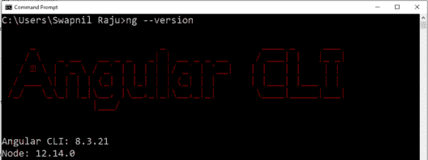
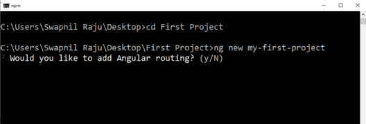
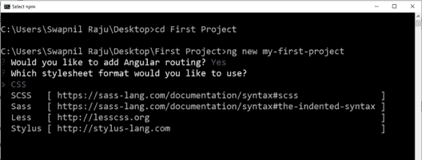
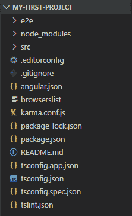
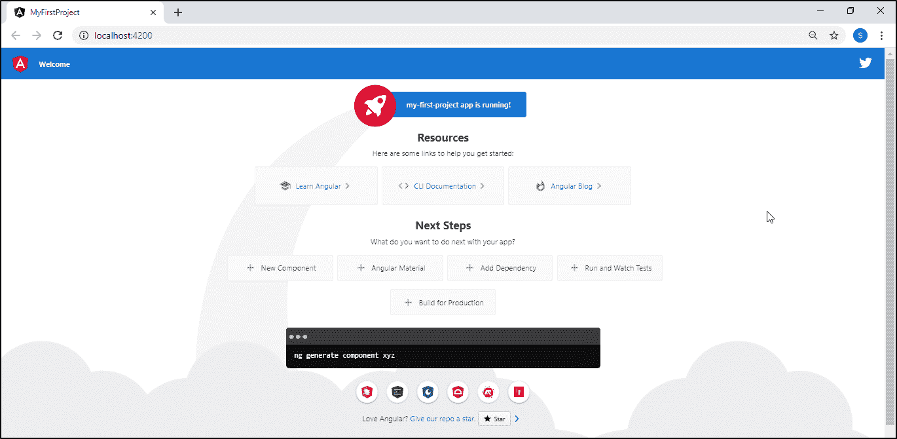
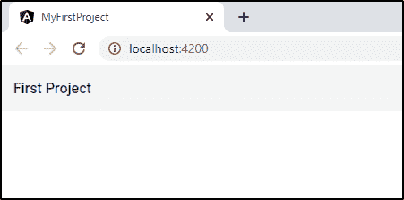
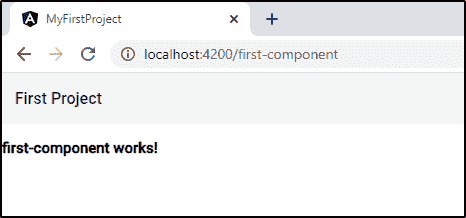
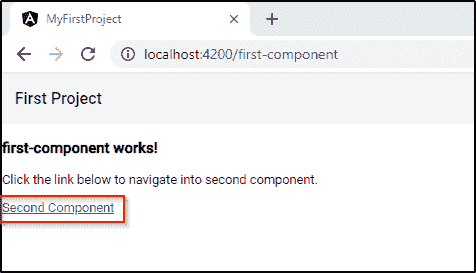
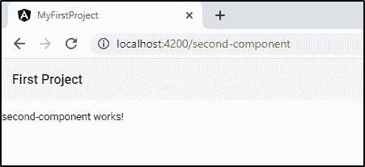

# 什么是 Angular CLI，如何实现？

> 原文：<https://www.edureka.co/blog/angular-cli/>

CLI 或**命令行界面**已经被引入，以提供更加**高效的开发体验**，并提高应用的**性能**。CLI 已被标记为 Angular，称为 **Angular CLI** ，以提高效率使角度应用**更快**，并产生应用的最佳结果。

想要深入了解 Angular CLI 或者 Angular，可以考虑报读 Edureka 的 [***Angular 课程***](https://www.edureka.co/angular-training) 。

在本文中，您将了解 Angular CLI，并了解以下主题:

*   [Angular CLI简介](#introduction)
    *   [角度 CLI 的特点](#features)
*   [角度 CLI 安装](#angular)
    *   [角度项目创建](#project)
    *   [为您的项目服务](#serve)
*   [棱角分明的材料安装](#install)
*   [生成角度分量](#generate)
*   [](#route)[路由带角 CLI](#route)
    *   [App 和第一个组件之间的路由](#first)
    *   [组件间路由](#second)

## **角度 CLI 简介**

GUI 被认为是交互式的，但是受到性能问题的困扰。这导致那些喜欢性能胜于视觉的人使用命令行界面或 CLI。在使用 AngularJS 的早期，对于一个大型项目来说，组织代码、加载 JavaScript 文件、调试代码和涉及第三方库是一项相当繁重的任务。当 AngularJS 被完全重写并命名为 [Angular](https://www.edureka.co/blog/what-is-angular-getting-started-with-angular/) 以及 CLI 或命令行界面时，这一问题得到了解决，该界面使用[类型脚本](https://www.edureka.co/blog/what-is-typescript/)。


Angular CLI 是一个**命令行界面工具**，可用于开发和生成 Angular 项目，并帮助维护 Angular 应用程序。现在，让我们看看 Angular CLI 的一些特性。

### **角度 CLI 的特点**

1.  Angular CLI 有助于只使用**单行命令**来生成组件、服务和模块。
2.  它有助于**减少**Angular 的应用程序大小，这为**提供了增强的开发体验**。
3.  它还提供了 TypeScript 的**干净的编码特性**。

先来看一下如何安装 Angular CLI。

## **角度 CLI 安装**

Angular CLI 可使用节点包管理器安装，即 [*npm*](https://www.edureka.co/blog/learn-node-js/) 。确保在您的开发系统上使用正确的路径设置安装了 NodeJS。如果你不熟悉 NodeJS，可以参考我们的 [NodeJS 安装博客](https://www.edureka.co/blog/node-js-installation/#installation)。一旦你设置好了所有的东西，在你的 Windows 命令提示符下或者你正在使用的任何其他命令行界面上输入下面的命令:

```
npm install -g @angular/cli
```

该命令将在您的系统上全局安装最新版本的 Angular CLI(由于 *-g* 扩展)。您可以键入以下命令来验证是否安装了 Angular CLI。

```
ng --version
```

此命令将检查您系统上安装的 Angular CLI 的版本。比如可以参考下面我系统的 Angular CLI 版本。



如上图，可以参考我系统上安装的 Angular CLI 和 NodeJS 版本。

如果您在安装 Angular CLI 时遇到任何问题，请键入 t he 以下命令获得 Angular 团队的在线帮助，并添加您所面临问题的简短描述。

```
ng help serve
```

这里， *ng* 代表*Angular*并且 Angular CLI 的所有命令都以 *ng 开头。*

### **角度项目创建**

现在，假设您想要构建一个新的 Angular 项目。首先，创建一个您想要创建项目的目录，并在您的 CLI 上使用 *cd* 命令更改到该目录的路径。假设桌面上有一个名为“第一个项目”的目录，键入以下命令导航到该目录。

```
cd C:Users/System_Name/Desktop/First Project
```

稍后，键入以下命令创建新的角度项目。

```
ng new my-first-project
```

现在，它会询问您是否要将角度路由添加到您的项目中，大概是这样的:



我建议你在项目中添加路由，因为它有助于在应用程序中导航。于是，键入来添加路由。

现在，它会询问您希望使用哪种样式表格式，如下所示:



点击 [CSS](https://www.edureka.co/blog/what-is-css/) 在您的应用程序上安装默认的 CSS 样式表，其中包括所有其他的样式表。

现在，这会在您的目录中创建一个名为 *my-first-project* 的新项目，包含以下配置和代码文件。您可以使用以下命令导航到您的项目:

```
cd my-first-project
```



### **为您的项目服务**

每当您使用 Angular CLI 创建一个新项目时，您都会得到一个预制的项目作为开始。您可以通过键入以下命令在本地服务应用程序来查看该项目:

```
ng serve
```

这将在 Angular 提供的默认端口号(即 4200)上为项目服务。您可以在浏览器中访问*http://localhost:4200/*查看您的项目。你甚至可以使用 *-open* 标志命令 angular 为你打开浏览器。

```
ng serve --open
```

还有一种简写形式为*-开* 旗即 *-o* 旗。

```
ng serve -o
```

这将在系统的默认浏览器上打开您的项目。



继续前进，你将学习如何安装有棱角的材料。

## **角形材料安装**

Angular Materials 或 **User-Interface (UI)** 组件帮助您以一种**结构化**的方式设计您的应用程序，吸引用户并使**更容易访问**应用程序中的元素或组件。他们还可以用独特的**风格**和**形状**来帮助你设计漂亮的应用程序。因此，强烈建议使用 UI 组件来吸引用户，并在用户和网站之间建立沟通。

你可以使用以下命令添加角形材料:

```
ng add @angular/material
```

现在，它要求你选择一个预建的主题名称或一个自定义主题。


选择预设的“靛蓝/粉色”主题来设计你的应用程序。您还可以选择“自定义”主题，这样您就可以自定义您的主题文件，其中包括多个组件使用的所有常见样式。

现在，它要求你设置 **HammerJS** 。HammerJS 是一个流行的 Angular material 库，增加了对滑动、平移、挤压、旋转等触摸手势的支持。


你可以选择“是”或“否”。但是，我建议你选择“是”,因为在你的应用中使用手势看起来很时髦。

现在，它要求你为有角度的素材设置**浏览器动画**。


选择“是”,这样您就可以在应用程序中使用动画。**角度动画**让你的应用更有趣，更容易使用。这可以改善你的应用和用户体验，吸引用户的注意力。

随后，这将在你的应用中安装有角度的材料。

## **生成角度分量**

一旦你的项目创建完成，让我们开始生成角度组件。这些组件有助于使用基于组件的架构**和**以结构化的方式制作您的应用程序。

```
ng generate component first-component
```

您也可以通过 Angular CLI 使用简短形式。例如，您可以使用以下命令创建相同的组件:

```
ng g c first-component
```

这将在您的 *src/app* 目录中创建名为‘first-component’的组件。这包括以下子组件:

****

这些组件是构建 Angular 应用的用户界面(UI)。它们有助于构建动态的**单页应用(SPAs)** ，这是Angular 的重要特性，使开发人员更容易浏览不同的组件，并使应用程序更高效。

## **使用角度 CLI 进行布线**

路由是现代网络开发中一个非常重要的特性，它需要**从页面到页面或组件到组件的**导航。感谢 Angular 团队，现在您可以在创建新项目的同时直接将路由添加到您的应用程序中，如 Angular CLI 安装部分所述。如果您还没有将路由添加到项目中，您只需在命令提示符下键入以下命令。

```
ng generate module app-routing --flat --module=app
```

这将为您的项目添加路由，并在您的*src/app*目录中生成*app-routing . module . ts*文件。生成的文件如下所示:

```
import { NgModule } from '@angular/core';
import { Routes, RouterModule } from '@angular/router';

const routes: Routes = [
],

@NgModule({
   imports: [RouterModule.forRoot(routes)],
   exports: [RouterModule]
})

export class AppRoutingModule { }
```

### **App 和第一个组件之间的路由**

现在，假设您想要将路由从*app . component*添加到您的 *第一个组件* 。首先，在你的应用程序上进入*【app.component.html】*，清除所有现有代码。现在，编写如下新代码:

```
<mat-toolbar>
   <span>First Project&lt;</span>
</mat-toolbar>

<router-outlet></router-outlet>
```

*<mat-toolbar>*是一个由棱角分明的材料制成的容器，用于页眉和标题。要使用该工具栏，首先需要使用以下命令将其从 Angular materials 的*app . module . ts*文件中导入:

```
import { MatToolbarModule } from '@angular/material';
```

*<router-outlet>*是路由器库中的一个路由器指令，用于指示路由器在哪里显示路由视图。要使用该指令，您需要使用下面的命令来遵循与 Mat Toolbar 相同的过程:

```
import { Routes, RouterModule } from '@angular/router';
```

之后，你还需要在 *中添加这些模块，导入: *节中的*文件。*

```
imports: [
   BrowserModule,
   AppRoutingModule,
   BrowserAnimationsModule,
   RouterModule.forRoot(routes),
   MatToolbarModule
],
```

对于路线，需要添加“*【routermodule . forroot(路线)* ”。 对于 Mat 工具栏，需要添加“*MatToolbarModule*”。

现在，让我们使用*ng serve–open*命令为您的项目服务。



比方说，现在你要为你的 *创建一个根首组件* 。首先，让我们编写一个代码来显示第一个组件页面的内容，在*第一个组件*中。*component.html*文件。

```
<h3>first-component works!</h3>

```

现在，让我们进入*app . module . ts*文件，在*Routes =[]*部分为 *第一个组件* 创建一个路径。

```
const routes: Routes = [
   { path: 'first-component', component: FirstComponentComponent }
];
```

这将为 *第一个组件* 创建一个路由，您可以在浏览器上使用以下 URL 查看该组件:

```
http://localhost:4200/first-component
```

这将显示 *第一元件* 文件的内容如下:



### **组件间路由**

假设你想从一个组件导航到另一个组件。首先，您需要在应用程序中生成另一个组件。稍后，将您的文件上的路由器链接添加到您的*second-component.component.html*文件中，如下:

```
<h3>first-component works!</h3>
<p>Click the link below to navigate into second component</p>
<nav>
   <a routerLink = "/second-component">Second Component</a>
</nav>

```

现在，您需要按照相同的步骤为 *第二组件* 创建一条路线，就像您为 *第一组件* 所做的一样。一旦您的 *第二组件* 路径被创建，您可以在您的浏览器上查看它。



点击“二次元件”链接，导航至 *二次元件* 页面并显示其内容。



还有一个特殊的字符串' ** '可以添加到路径中。如果请求的 URL 与您定义的任何路径或路由都不匹配，此字符串用于重定向到您定义的路径。这个字符串可以添加到您的*Routes =[]*节中，该节位于*app . module . ts*文件中。

```
const routes: Routes = [
   { path: 'first-component', component: FirstComponentComponent },
   { path: 'second-component', component: SecondComponentComponent },
   { path: '**', redirectTo: '', pathMatch: 'full' }
];
```

例如，您可以在您的应用程序中看到定义的路径。在您的浏览器 URL 部分，键入以下地址:

```
http://localhost:4200/third-component
```

由于第三方组件不存在，它将重定向到您的第一页 URL 即*http://localhost:4200*并显示其中的内容。

至此，我想结束我的博客。我希望你清楚 Angular CLI 的基本原理。如果你对这篇文章有任何疑问，请在下面的评论区留言。

*如果你想学习你刚刚从这个博客中学到的所有知识，以及更多关于 Angular 的知识，并把你的职业生涯定位于精通 [Angular](https://angular.io/) 的开发者，那么考虑报名参加我们的 [**Angular 认证课程**](https://www.edureka.co/angular-training?qId=39f968589d8ac35242a3b66e9059322e&index_name=prod_courses&objId=885&objPos=1) 。*

*有问题吗？请在这个“Angular CLI”博客的评论部分提到它，我们会尽快回复您。*